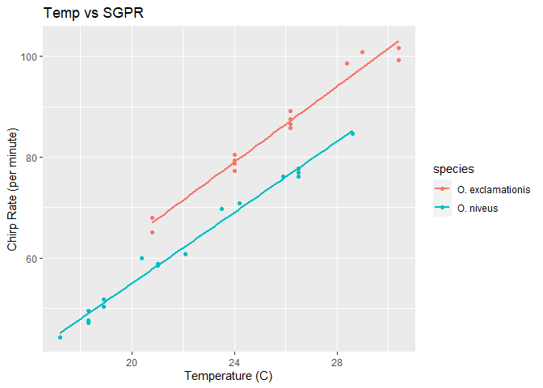
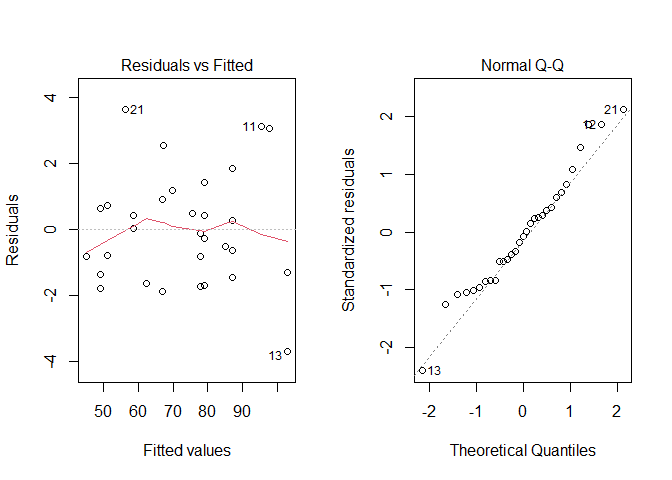

Fundamentos de modelamiento en R
================

## 1. Un ejemplo para mostrar los fundamentos

Utilizaremos la base de datos “crickets” (grillos) perteneciente al
paquete “modeldata”, la base de datos expone la relacipin entre la
temperatura ambiental y la tasa de chirridos realizado por 2 diferentes
especies de grillos.

``` r
library(modeldata)
library(tidyverse)
```

    ## -- Attaching packages --------------------------------------- tidyverse 1.3.0 --

    ## v ggplot2 3.3.5     v purrr   0.3.4
    ## v tibble  3.1.2     v dplyr   1.0.7
    ## v tidyr   1.1.3     v stringr 1.4.0
    ## v readr   1.3.1     v forcats 0.5.0

    ## -- Conflicts ------------------------------------------ tidyverse_conflicts() --
    ## x dplyr::filter() masks stats::filter()
    ## x dplyr::lag()    masks stats::lag()

``` r
data("crickets")
```

Podemos comenzar la exploración de los datos, mediante un gráfico de los
datos:

``` r
ggplot(crickets, aes(x = temp, y = rate, col = species)) + 
  geom_point() + 
  geom_smooth(method = lm, se = FALSE) + 
  labs(x = "Temperature (C)", y = "Chirp Rate (per minute)")
```

    ## `geom_smooth()` using formula 'y ~ x'

<!-- -->

Generalmente “plotearemos” en este tipo de analisis (el modelo que más
se asemeja a esta relación es la regresión lineal simple) a la variable
dependiente (denotada generalmente por la letra y )en el eje “y” y las
independientes (denotadas por la letra x) al eje “x”. Este tipo de
relación se denota mediante la simbología en R: y\~x.

En los resultados se pueden ver tendencias marcadas, la especie *O.
exclamationis* tiene una tasa de chirridos por minuto mayor que la
especie *O.niveus* (analisis descriptivo). Desde una perspectiva de un
modelo inferencial, los investigadores pueden hipotetiza los siguientes
enunciados:

-   La temperatura no tiene un efecto en la tasa de chirrido

-   No existen diferencias entre las tasas de chirrido entre las
    especies

Para modelar una regresión lineal en R, la función lm() es comunmente
utilizada. En la mayoria de los modelos que trabajaremos en codigo, la
relación entre variables se establece mediante el simbolo **“\~”**.
Tomando en consideración los nombres de la base de datos “crickets”,
relacionariamos la tasa de chirridos (rate) y la temperatura (temp), de
la siguiente manera:

    ## rate ~ temp

Imaginemos que también contamos con la variable tiempo (momento del día
en que se realizo la medición) en la base de datos. Podremos añadir esta
a la relación (lo que normalmente se realiza a una regresión lineal
múltiple):

    ## rate ~ temp + time

Esta representación simbolica refleja que la temperatura y el tiempo
representan un independientemente un efecto al modelo creado.

Si regresamos a la base de datos original, también podriamos seguir la
siguiente logica:

    ## rate ~ temp + species

Sin embargo, las especies no son una variable cuantitativa (es una
variable cualitativa con dos niveles). La mayoria de modelos no pueden
operar con data no-númerica. La forma mas común de trabajar con este
tipo de variables es el de usarlos como variables indicadoras
(comunmente conocido como el proceso de “dummy variables”) en lugar de
los valores cualitativos iniciales. En el caso de “species” al tener dos
posibles valores, es usual darle el valor de ceros (0) y unos (1), es
decir, utilizamos un codigo binario.

Adicionalmente a lo explicado, existen relaciones mas complejas que
podemos ejecutar con diferentes simbologias. Por ejemplo:

-   Evaluar el efecto de la posible interacción de variables
    independiente en el modelo:

        ## rate ~ temp * species

-   Podemos añadir una función logarítmica natural a la temperatura,
    creando la siguiente formula:

        ## rate ~ log(temp)

-   Si queremos elevar la complejidad, podemos utilizar la función I()
    dentro de la formula, lo cual tomará todo lo que ocurra dentro de la
    función como el valor de la variable final. Por ejemplo, si
    cambiamos los grados iniciales de unidades Fahrenheit, a Celsius,
    utilizariamos la siguiente formula:

        ## rate ~ I((temp * 9/5) + 32)

-   Podemo también utilizar la función poly(x,3), la cual crearia una
    ecuación lineal, cuadratica y cubica en función a “x” con efectos
    principales al modelo. El paquete “splines” tiene varias funciones
    para crear ecuaciones no lineales.

-   Para bases de datos como muchos predictores (variables
    independientes), podemos utilizar la siguiente simbología (sino
    queremos escribir cada una de las variables):

        ## rate ~ .

Estas simbologias serán muy usadas en la creación de los modelos. Sin
embargo, tener claro que R no adivinará de donde vienen estas variables,
por lo que es sumanmente importante que en cualquier creación de un
modelo, se tiene que definir claramente la base de datos que se esta
utilizando. Por ejemplo, realicemos un primer modelo:

``` r
Modelo_interaccion <- lm(rate~(temp+species)^2, data = crickets)
```

Observese que se detalla de donde proviene la base de datos con el
argumento “data =”. Esta es una forma de realizarlo, pero no la unica.

Una forma básica de mostrar los resultados del modelo son simplemente
llamarlo por su nombre:

``` r
Modelo_interaccion
```

    ## 
    ## Call:
    ## lm(formula = rate ~ (temp + species)^2, data = crickets)
    ## 
    ## Coefficients:
    ##           (Intercept)                   temp       speciesO. niveus  
    ##               -11.041                  3.751                 -4.348  
    ## temp:speciesO. niveus  
    ##                -0.234

El resultado del modelo es dificil de entender del todo, poco a poco
entenderemos mas de que significan. Desde el punto de vista de usar el
modelo con objetivos inferenciales, el flujo de trabajo formal
implicaria el de evaluar los supuestos. No todos los tipos de modelos
tienen los mismos supuestos que cumplir, sin embargo muchas veces son
muy similares. Principalmente este tipo de analisis se centra en el
analisis de los residuos de un modelo y una de las formas rapidas de
realizar este analisis es utilizar plots.

Utilizando comandos básicos de R, podemos dibujar los siguientes plots
del modelo recien creado:

``` r
par(mfrow = c(1,2))
plot(Modelo_interaccion, which = 1)
plot(Modelo_interaccion, which = 2)
```

<!-- -->

Los resultados ofrecen la suficiente información para pensar que los
supuestos del modelo se cumplen, por lo que podemos proceder a realizar
un analisis inferencial del mismo. Esto lo podemos realizar de
diferentes maneras, una de las funciones amigables que nos permiten
saber en detalle los resultados del modelo, es summary():

``` r
summary(Modelo_interaccion)
```

    ## 
    ## Call:
    ## lm(formula = rate ~ (temp + species)^2, data = crickets)
    ## 
    ## Residuals:
    ##     Min      1Q  Median      3Q     Max 
    ## -3.7031 -1.3417 -0.1235  0.8100  3.6330 
    ## 
    ## Coefficients:
    ##                       Estimate Std. Error t value Pr(>|t|)    
    ## (Intercept)           -11.0408     4.1515  -2.659    0.013 *  
    ## temp                    3.7514     0.1601  23.429   <2e-16 ***
    ## speciesO. niveus       -4.3484     4.9617  -0.876    0.389    
    ## temp:speciesO. niveus  -0.2340     0.2009  -1.165    0.254    
    ## ---
    ## Signif. codes:  0 '***' 0.001 '**' 0.01 '*' 0.05 '.' 0.1 ' ' 1
    ## 
    ## Residual standard error: 1.775 on 27 degrees of freedom
    ## Multiple R-squared:  0.9901, Adjusted R-squared:  0.989 
    ## F-statistic: 898.9 on 3 and 27 DF,  p-value: < 2.2e-16

### 1.1 Evaluación básica de modelos

Una forma básica de comparar modelos es usar la función anova(). Para
ponerla en práctica, crearemos el siguiente modelo:

``` r
Modelo_independientes <- lm(rate ~ temp + species, data = crickets) 
```

Es un modelo donde no se evalua la interacción ¿Cómo podriamos comparar
este modelo con el primer modelo que creamos? Utilizando la función
anova(), de la siguiente manera:

``` r
anova(Modelo_independientes, Modelo_interaccion)
```

    ## Analysis of Variance Table
    ## 
    ## Model 1: rate ~ temp + species
    ## Model 2: rate ~ (temp + species)^2
    ##   Res.Df    RSS Df Sum of Sq     F Pr(>F)
    ## 1     28 89.350                          
    ## 2     27 85.074  1    4.2758 1.357 0.2542

El resultado genera un p-valor de 0.2542, lo cual implica que no existe
suficiente evidencia para aceptar la hipotesis alterna (la interacción
es necesaria en el modelo). De este resultado, podemos continuar el
analisis con el modelo sin interacción (un modelo mas simple, es siempre
mejor, sobretodo cuando un modelo mas complejo no refleja mayor
entendimiento del modelo).

Para continuar, podemos utilizar diferentes maneras, una de las
funciones amigables comunmente usadas para evaluar los resultados de un
modelo, es summary():

``` r
summary(Modelo_independientes)
```

    ## 
    ## Call:
    ## lm(formula = rate ~ temp + species, data = crickets)
    ## 
    ## Residuals:
    ##     Min      1Q  Median      3Q     Max 
    ## -3.0128 -1.1296 -0.3912  0.9650  3.7800 
    ## 
    ## Coefficients:
    ##                   Estimate Std. Error t value Pr(>|t|)    
    ## (Intercept)       -7.21091    2.55094  -2.827  0.00858 ** 
    ## temp               3.60275    0.09729  37.032  < 2e-16 ***
    ## speciesO. niveus -10.06529    0.73526 -13.689 6.27e-14 ***
    ## ---
    ## Signif. codes:  0 '***' 0.001 '**' 0.01 '*' 0.05 '.' 0.1 ' ' 1
    ## 
    ## Residual standard error: 1.786 on 28 degrees of freedom
    ## Multiple R-squared:  0.9896, Adjusted R-squared:  0.9888 
    ## F-statistic:  1331 on 2 and 28 DF,  p-value: < 2.2e-16

Podemos visualizar claramente los coeficientes, el 3.6 indica el aumento
de la tasa de chirridos por cada unidad incrementada de temperatura
(teniendo una alta significancia estadística evidenciada con el
p-valor). Por su parte, la especie tiene un valor de coeficiente de
-10.7, esto indica que a lo largo de toda la relación entre las dos
especies, la tasa de chirridos es aproximadamente 10 veces menor o mayor
que la otra especie (también se le asocia un p-valor significativo).

Por su parte, el valor del intercepto, es de -7.21, cuando la
temperatura es igual a 0. Esto no tiene logica, puesto que no puede
existir una tasa negativa de chirridos. Esta clase de modelos tiene
limites, y es parte del ejercicio del investigador delimitarlos (ver
hasta donde su modelo tiene sentido en relación con el objetivo
analizado). Podriamos delimitar entonces la temperatura minima donde
nuestro analisis de la tasa de chirrido tome sentido, el valor de 17.2°C
funcionaria para dicho caso. El modelo se ajusta bien en el rango de
temperaturas propuesto por el investigador, las conclusiones deben
limitarse a este rango de temperaturas (**ejercicio**: imaginense que
pasaria si seguimos elevando la temperatura, desde un punto de vista
biologico).

Por ultimo, si nosotros quisieramos utilizar el modelo para predecir, en
R podemos utilizar la función predict(). Tener en consideración que para
cualquier predicción debemos tener en cuenta el rango de valores
previamente limitado por el investigador. Cuando predecimos con un
modelo, le brindamos nuevos datos de las variables independientes y con
ellas el modelo calcula cual seria el valor de la variable dependiente
resultante. En el siguiente ejemplo, defeniremos los nuevos valores y
luego predeciremos con ellos en el modelo:

``` r
new_values <- data.frame(species = "O. exclamationis", temp = 15:20)
predict(Modelo_independientes, new_values)
```

    ##        1        2        3        4        5        6 
    ## 46.83039 50.43314 54.03589 57.63865 61.24140 64.84415

La sintaxis que acabamos de ver ahorita, es usada aún en la mayoria de
tutoriales y enseñanza. Y es globalmente aplicada, sin embargo fue
publicada en 1992. En la actualidad, el uso de R, se esta complementando
con el tidyverse, como veremos en el siguiente capítulo.

## 2. Tidyverse para modelos

Las funciones del lenguaje básico de R pueden utilizarse en conjunto con
el flujo de trabajo propuesto por tidyverse (especialmente con dplyr,
ggplot2, purrr y tidyr).

Existen diversas formas en como R puede resolver un mismo problema (y es
una característica principal de este lenguaje de programación). Esa
diversidad puede volvernos locos a veces, peor también abrir el conjunto
de posibilidades de como resolver un problema mediante diferentes
metodologías y encontrar en ese juego quizá nuevos enfoques o
resultados. Sin embargo, no todo es maravilla, aveces la inconsistencia
entre los paquetes creados nos pueden jugar una mala pasada.

Existe una variedad de modelos estadísticos y de “machine learning”
(aprendizaje automatizado) de los que uno puede elegir. Como hemos
visto, para producir un estimado para cada una de las muestras, es
comunmente utilizada la función predict(). Sin embargo, existe una
heterogeneidad significativa en los argumentos que utilizamos para cada
uno de los modelos, cuando usamos la función predict(). Estas
diferencias pueden ser incluso dificiles de manejar para usuarios
experimentados en R. Por ejemplo, tenemos:

| **Function** | **Package**    | **Code**                                      |
|--------------|----------------|-----------------------------------------------|
| `lda`        | **MASS**       | `predict(object)`                             |
| `glm`        | **stats**      | `predict(object, type = "response")`          |
| `gbm`        | **gbm**        | `predict(object, type = "response", n.trees)` |
| `mda`        | **mda**        | `predict(object, type = "posterior")`         |
| `rpart`      | **rpart**      | `predict(object, type = "prob")`              |
| various      | **RWeka**      | `predict(object, type = "probability")`       |
| `logitboost` | **LogitBoost** | `predict(object, type = "raw", nIter)`        |
| `pamr.train` | **pamr**       | `pamr.predict(object, type = "posterior")`    |

¿Los “missing data” o datos faltantes? Algo de lo que debemos tener
cuidado también al momento de generar un modelo es tener en cuenta
(sobretodo en modelos con varias variables independientes) es si faltan
datos en nuestra base de datos. Cuando generamos modelos, aquellas filas
en donde falten datos no serán tomadas en cuenta (perdiendo alimento
para nuestro modelo).

### 2.1 ¿Cómo integramos los modelos con tidyverse?

Siguiendo con la base de datos de “grillos”, utilizaremos la función
group\_nest() del paquete dplyr:

``` r
Separar_por_especie <- 
  crickets %>% 
  group_nest(species) 
```

Lo que realizó esta función es de “nestear” o nidados la base de datos
inicial en dos bases de datos (data frame) a razón de las especies.
Dentro de cada una de estas nuevas bases de datos mantenmos las dos
variables temperatura y tasa de chirrido. A partir de aqui podemos
utilizar la función map() del paquete purrr(paquete del mundo del
tidyverse), el cual creará modelos individuales para cada una de las
especies:

``` r
Modelos_por_especie <- 
  Separar_por_especie %>% 
  mutate(model = map(data, ~ lm(rate ~ temp, data = .x)))
```

La función map() transforma o aplica una función a cada elemento de una
lista o un vector atómico y brinda como resultado un objeto de la misma
longitud como resultado. Para recolectar los coeficientes de cada uno de
estos modelos podemos utilizar la función tidy() (del paquete broom)
para convertir los coeficientes a un dataframe consistente para ser
“desanidados” (unnested) con la función unnest().

``` r
library(broom)
Modelos_por_especie %>% 
  mutate(coef = map(model, tidy)) %>% 
  select(species, coef) %>% 
  unnest(cols = c(coef))
```

    ## # A tibble: 4 x 6
    ##   species          term        estimate std.error statistic  p.value
    ##   <fct>            <chr>          <dbl>     <dbl>     <dbl>    <dbl>
    ## 1 O. exclamationis (Intercept)   -11.0      4.77      -2.32 3.90e- 2
    ## 2 O. exclamationis temp            3.75     0.184     20.4  1.10e-10
    ## 3 O. niveus        (Intercept)   -15.4      2.35      -6.56 9.07e- 6
    ## 4 O. niveus        temp            3.52     0.105     33.6  1.57e-15

Usar columnas con listas puede ser muy beneficioso para modelar
proyectos. Estas proveen “containers” para cualquier tipo de objetos en
R

## Referencias:

-   <https://www.tmwr.org/base-r.html>

-   De Cock, D. 2011. “Ames, Iowa: Alternative to the Boston Housing
    Data as an End of Semester Regression Project.” *Journal of
    Statistics Education* 19 (3)
