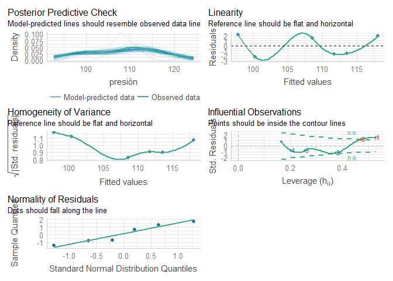
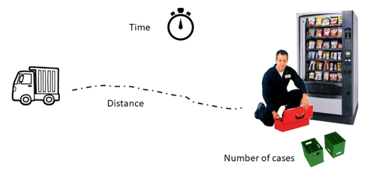
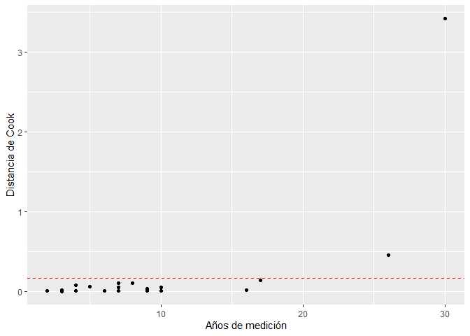
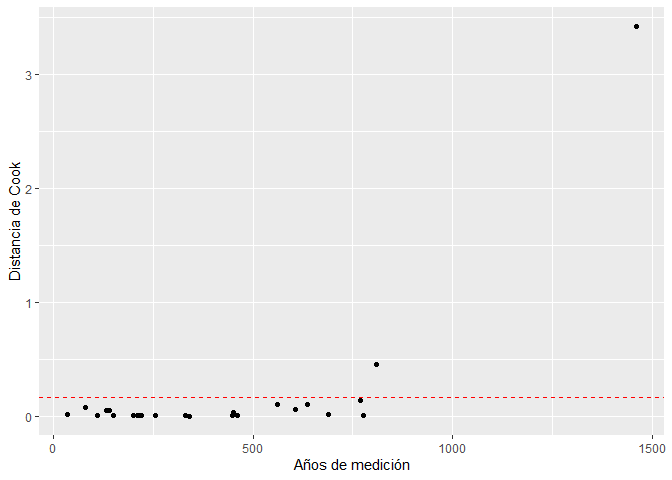
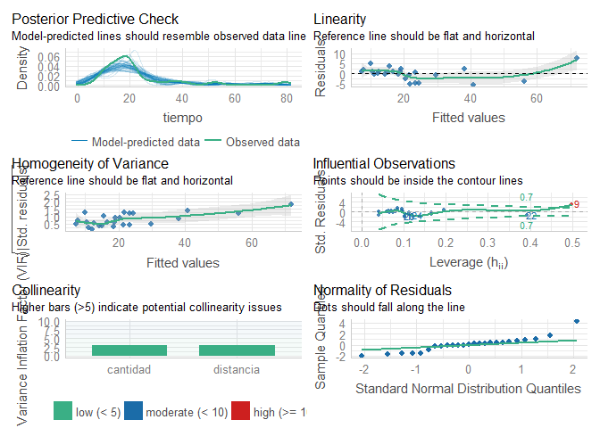

Modelos de regresión Lineal - Simple y múltiple
================

# 1. Modelo de regresión lineal simple

## A. Creando el modelo de regresión lineal

En un experimento donde se quería estudiar la asociación entre consumo
de sal y presión arterial, se asignó aleatoriamente a algunos individuos
una cantidad diaria constante de sal en su dieta, y al cabo de un mes se
les midio la presión arterial media. Los resultados fueron:

``` r
library(tidyverse)

Presión.Arterial <- tibble( sal = c(1.8, 2.2, 3.5, 4.0, 4.3, 5.0),
                            presión = c(100,98,110, 110, 112, 120))
```

Como clases previas, para la creación de modelos, tenemos funciones
especializadas, las cuales generalmente estan ya dentro de nuetro
paquete básico de “stats”. Como es el caso de la función lm(), para
crear modelos de regresión lineal. Para utilizar **lm()** en nuestro
problema:

``` r
lm(Presión.Arterial$presión ~ Presión.Arterial$sal)
```

    ## 
    ## Call:
    ## lm(formula = Presión.Arterial$presión ~ Presión.Arterial$sal)
    ## 
    ## Coefficients:
    ##          (Intercept)  Presión.Arterial$sal  
    ##               86.371                 6.335

En los resultados, veremos que hemos hayado el intercepto (valor de
alfa).

Para visualizar los detalles del modelo, podemos optar por la función
**summary()**, pero antes, asignemosle un nombre a nuestro modelo.

``` r
Modelo.Lineal.Simple <- lm(data=Presión.Arterial, formula = presión ~ sal )
```

### A.1 Contraste de hipótesis sobre la pendiente de la recta Beta

Para analizar el contraste de hipotesis, podemos evaluar los intervalos
de confianza o podemos evaluar los resultados de p-valor en el resumen
de nuestro modelo:

``` r
summary(Modelo.Lineal.Simple)
```

    ## 
    ## Call:
    ## lm(formula = presión ~ sal, data = Presión.Arterial)
    ## 
    ## Residuals:
    ##      1      2      3      4      5      6 
    ##  2.226 -2.309  1.455 -1.712 -1.613  1.952 
    ## 
    ## Coefficients:
    ##             Estimate Std. Error t value Pr(>|t|)    
    ## (Intercept)  86.3708     3.0621  28.206  9.4e-06 ***
    ## sal           6.3354     0.8395   7.546  0.00165 ** 
    ## ---
    ## Signif. codes:  0 '***' 0.001 '**' 0.01 '*' 0.05 '.' 0.1 ' ' 1
    ## 
    ## Residual standard error: 2.332 on 4 degrees of freedom
    ## Multiple R-squared:  0.9344, Adjusted R-squared:  0.918 
    ## F-statistic: 56.95 on 1 and 4 DF,  p-value: 0.001652

Los valores Pr(\>\|t\|), son los p-value, y nos indican en ambos casos
(aunque solo en B1 tiene sentido) que se rechaza Ho (es decir, que B1 es
diferente de 0).

De esta manera podemos ver de manera general alguno de los detalles de
nuestro modelo. Por el momento, observemos que el coeficiente de
determinación se puede observar en la parte inferior y tiene un valor de
0.9344.

EXTRA: Introduciendo función get_regression_table() del PAQUETE
moderndive. Esta función nos permite obtener una tabla ordenada de los
valores del modelo:

``` r
library(moderndive)
p <- get_regression_table(Modelo.Lineal.Simple)
p
```

    ## # A tibble: 2 x 7
    ##   term      estimate std_error statistic p_value lower_ci upper_ci
    ##   <chr>        <dbl>     <dbl>     <dbl>   <dbl>    <dbl>    <dbl>
    ## 1 intercept    86.4       3.06     28.2    0        77.9     94.9 
    ## 2 sal           6.34      0.84      7.55   0.002     4.00     8.67

Ello lo podemos combinar con el paquete knitr y la función kable(), para
obtener tablas directas en nuestro documento Word o html trabajado con
rmarkdown:

``` r
library(knitr)
kable(p)
```

| term      | estimate | std_error | statistic | p_value | lower_ci | upper_ci |
|:----------|---------:|----------:|----------:|--------:|---------:|---------:|
| intercept |   86.371 |     3.062 |    28.206 |   0.000 |   77.869 |   94.873 |
| sal       |    6.335 |     0.840 |     7.546 |   0.002 |    4.004 |    8.666 |

EXTRA 2: Probar que nos brindaria la función “get_regression_points()”
del interesante paquete moderndive. Hay un libro en la parte de
referencias a cerca de este paquete y otros temas muy recomendable.

## B. Intervalos de confianza y uso del modelo (“predicciones”)

Para hallar los intervalos de confianza de los estimadores de una
regresion lineal en R, utilizaremos la siguiente función **confint()**
de la siguiente manera:

``` r
confint(Modelo.Lineal.Simple, level = 0.95)
```

    ##                 2.5 %    97.5 %
    ## (Intercept) 77.869064 94.872509
    ## sal          4.004434  8.666266

Para hallar el intervalo de confianza de un determinado valor de X (sal
= 4.5):

``` r
predict(object = Modelo.Lineal.Simple, newdata = data.frame(sal = c(4.5)),
        interval = "confidence", level = 0.95)
```

    ##        fit      lwr      upr
    ## 1 114.8799 111.3041 118.4556

## C. Representación gráfica del modelo lineal simple:

La creación de un modelo de regresión lineal simple suele acompañarse de
una representación gráfica superponiendo las observaciones con el
modelo. Además de ayudar a la interpretación, es el primer paso para
identificar posibles violaciones de las condiciones de la regresión
lineal.

Una manera simple de realizarlo con el paquete ggplot2, seria:

``` r
Presión.Arterial %>% ggplot(aes(x=sal, y=presión))+
  geom_point()+
  geom_smooth(method="lm")
```

    ## `geom_smooth()` using formula 'y ~ x'

<!-- -->

## D. Analisis de los residuos y supuestos:

Sin embargo, no solo el gráfico de la recta nos ayuda a interpretar
nuestro modelo. Tambien podemos visualizar la distribución de los
errores o residuos del modelo, entre otros supuestos estudiados. Los
valores de los residuales se almacenan como *residuals* en nuestro
modelo. Para esta parte utilizaremos el nuevo paquete performance

``` r
#Instalamos con dependencias: install.packages("performance", dependencies = TRUE)
#Activamos paquete
library(performance)
```

Una vez activado el paquete, realizamos la siguiente operación:

``` r
check_model(Modelo.Lineal.Simple)
```

<!-- -->

El analisis de los residuos confirman que los datos se distribuyen de
forma lineal (aunque son muy pocos datos y faltaria realizar una prueba
de por ejemplo shapiro wilk para confirmar lo que muestra el gráfico).
La varianza de los residuos no es constante (como se esperaria si
cumpliese los supuestos).

Adicionalmente también podemos ver los valores atípicos (Infuential
observations), el cual nos brinda dos números potencialemente atípicos y
influyentes en el resultado. Lo que se deberia de hacer en este punto es
eliminar uno a uno los valores atípicos (si hay argumentos suficientes)
y luego evaluar como varia el rendimiento del modelo (hacer el analisis
desde cero).

## E. Ejercicios de regresión lineal simple:

##### 1. Para este ejercicio, trabajaremos con la base de datos “Boston” del paquete MASS. Aqui la descripción de las variables:

-   crim: ratio de criminalidad per cápita de cada ciudad.
-   zn: Proporción de zonas residenciales con edificaciones de más de
    25.000 pies cuadrados.
-   indus: proporción de zona industrializada.
-   chas: Si hay río en la ciudad (= 1 si hay río; 0 no hay).
-   nox: Concentración de óxidos de nitrógeno (partes per 10 millón).
-   rm: promedio de habitaciones por vivienda.
-   age: Proporción de viviendas ocupadas por el propietario construidas
    antes de 1940.
-   dis: Media ponderada de la distancias a cinco centros de empleo de
    Boston.
-   rad: Índice de accesibilidad a las autopistas radiales.
-   tax: Tasa de impuesto a la propiedad en unidades de $10,000.
-   ptratio: ratio de alumnos/profesor por ciudad.
-   black: 1000(Bk - 0.63)^2 donde Bk es la proporción de gente de color
    por ciudad.
-   lstat: porcentaje de población en condición de pobreza.
-   medv: Valor mediano de las casas ocupadas por el dueño en unidades
    de $1000s.

Realice lo siguiente:

a\. Analice la base y luego realice un modelo de regresión para predecir
el valor de la vivienda en función del porcentaje de la población.
Empleando la funcion **lm()** se generará un modelo por minimos
cuadrados donde la variable respuesta sera *medv* y el predictor
*lstat*.

b\. Evalue el modelo creado con las funciones: **names()** y
**summary()**. ¿Qué valores de importancia encuentra y como los
interpreta?

c\. Calcule usted el los intervalos de confianza para los estimadores
con la función **confint()** a un nivel de confianza del 95%.

d\. Prediga el valor de la vivienda sabiendo el estatus de la población
en la que se encuetra. Toda predicción tiene asociado un error y por lo
tanto un intervalo. Analice e interprete los resultados.

e\. Gráficar la relacion de las variables mediante una regresión lineal.
Adicionalmente analizar los residuos del modelo.

# 2. Analisis de Regresión Lineal Múltiple

Para el analisis de la regresión lineal múltiple, utilizaremos la base
de datos “softdrink” del paquete “MPV”

``` r
library(MPV)
```

    ## Loading required package: lattice

    ## Loading required package: KernSmooth

    ## KernSmooth 2.23 loaded
    ## Copyright M. P. Wand 1997-2009

``` r
softdrink <- softdrink
```

En el ejemplo los autores ajustaron un modelo de regresión lineal
múltiple para explicar el Tiempo necesario para que un trabajador haga
el mantenimiento y surta una máquina dispensadora de refrescos en
función de las variables Número de Cajas y Distancia.



Antes de trabajar con la data, vamos a modificar su nombre, para tener
un mejor manejo:

``` r
library(tidyverse)
softdrink <- softdrink %>% rename(tiempo = y, cantidad = x1, distancia = x2)
```

## A. Creamos el mejor modelo lineal multiple con el metodo de los minimos cuadrados

``` r
mod <- lm(tiempo ~ cantidad + distancia, data=softdrink)
```

### A.1 Contraste de hipotesis

Como hemos observado, la prueba de ANOVA del modelo, nos permite
determinar si es que el modelo en si, tiene significancia o no (evalúa a
todas las variables independientes). Por otro lado, podemos ver
específicamente el efecto de cada una de las variables independientes en
el modelo creado.Ambas evaluaciones se pueden observar mediante el
resumen ofrecido por la función **summary()**

``` r
summary(mod)
```

    ## 
    ## Call:
    ## lm(formula = tiempo ~ cantidad + distancia, data = softdrink)
    ## 
    ## Residuals:
    ##     Min      1Q  Median      3Q     Max 
    ## -5.7880 -0.6629  0.4364  1.1566  7.4197 
    ## 
    ## Coefficients:
    ##             Estimate Std. Error t value Pr(>|t|)    
    ## (Intercept) 2.341231   1.096730   2.135 0.044170 *  
    ## cantidad    1.615907   0.170735   9.464 3.25e-09 ***
    ## distancia   0.014385   0.003613   3.981 0.000631 ***
    ## ---
    ## Signif. codes:  0 '***' 0.001 '**' 0.01 '*' 0.05 '.' 0.1 ' ' 1
    ## 
    ## Residual standard error: 3.259 on 22 degrees of freedom
    ## Multiple R-squared:  0.9596, Adjusted R-squared:  0.9559 
    ## F-statistic: 261.2 on 2 and 22 DF,  p-value: 4.687e-16

## B. Comparacion de modelos: AIC y BIC

Para calcular el AIC y BIC de un modelos, utilizamos las funciones
**AIC()** o **BIC()**

``` r
AIC(mod)
```

    ## [1] 134.8294

``` r
BIC(mod)
```

    ## [1] 139.7049

Sin embargo, no nos brindan mucha información si es que solo tenemos un
modelo. Tenemos que comparar diferentes modelos (que difieran en el
numero de variables independientes).

## C. Intervalos de confianza de los estimadores

Al igual que en la regresión lineal simple, podemos hallar los
intervalos de confianza de los estimadores del modelo.

``` r
confint(mod, level = 0.95)
```

    ##                   2.5 %     97.5 %
    ## (Intercept) 0.066751987 4.61571030
    ## cantidad    1.261824662 1.96998976
    ## distancia   0.006891745 0.02187791

Y también los intervalos de confianza de los valores medios :

``` r
predict(mod, data= softdrink, interval = "confidence", level = 0.95)
```

    ##          fit       lwr       upr
    ## 1  21.708084 19.551297 23.864872
    ## 2  10.353615  8.556216 12.151013
    ## 3  12.079794  9.955744 14.203843
    ## 4   9.955646  7.980522 11.930770
    ## 5  14.194398 12.343039 16.045757
    ## 6  18.399574 17.000017 19.799132
    ## 7   7.155376  5.222061  9.088692
    ## 8  16.673395 14.966973 18.379818
    ## 9  71.820294 67.048610 76.591977
    ## 10 19.123587 16.128667 22.118507
    ## 11 38.092507 36.108636 40.076378
    ## 12 21.593041 19.314141 23.871941
    ## 13 12.472991 10.801755 14.144227
    ## 14 18.682464 16.791631 20.573297
    ## 15 23.328798 21.958209 24.699388
    ## 16 29.662928 26.909298 32.416559
    ## 17 14.913640 13.265705 16.561574
    ## 18 15.551379 13.454112 17.648645
    ## 19  7.706807  5.607492  9.806121
    ## 20 40.887970 38.732422 43.043518
    ## 21 20.514179 17.766059 23.262299
    ## 22 56.006528 51.776559 60.236497
    ## 23 23.357568 21.984492 24.730644
    ## 24 24.402854 22.055286 26.750421
    ## 25 10.962584  9.217532 12.707636

## D. Diagnostico de los residuos

#### D.1. Diagnostico de homocedasticidad de residuos: Test de Breusch-Pagan

En el caso de nuestro ejemplo, no es necesario realizar este Test, ya
que el los supuestos se cumplen para el Test de White, sin embargo, a
manera de ejemplo se presenta a continuación. Realizamos este test con
la funcion **bptest()**, pero sin especificar la formula (como sí lo
hicimos en el test de White).

``` r
library(lmtest)
bptest(mod)
```

    ## 
    ##  studentized Breusch-Pagan test
    ## 
    ## data:  mod
    ## BP = 11.988, df = 2, p-value = 0.002493

Teniendo como hipotesis:

-   
    *H*<sub>0</sub>
    : Las varianzas de los residuos son iguales (homocedasticidad)
-   
    *H*<sub>1</sub>
    : Las varianzas de los residuos no son iguales (heterocedasticidad)

#### D.2. Diagnostico de normalidad de residuos: Test de Shapiro Wilk + Q-Qplot

Para ellos, aplicamos el test de Shapiro-Wilk a los residuos de nuestro
modelo:

``` r
shapiro.test(mod$residuals)
```

    ## 
    ##  Shapiro-Wilk normality test
    ## 
    ## data:  mod$residuals
    ## W = 0.95151, p-value = 0.2711

En este caso particular, podemos observar que los residuos del modelo se
distribuyen normalmente, ya que el p-valor es mayor al nivel de
significancia y se acepta la Ho.

#### D.3. Multicolinealidad - Variance inflation factor (VIF)

``` r
#Instalaremos y activaremos el paquete car
library(car)
```

Utilizaremos la función vif() del paquete “car” directamente al modelo:

``` r
car::vif(mod)
```

    ##  cantidad distancia 
    ##  3.118474  3.118474

De acuerdo a la teoria si es que una de nuestras variables
independientes excede un valor de 10 (conservador) o un valor de 4
(umbral más exigente), indica un valor alto de multipcolinealidad. En
nuestro caso las dos variables se han mantenido por debajo de los dos
umbrales teoricos por lo que podemos concluir que no hay
multicolienalidad para nuestro analisis.

### E. Analisis de valores atípicos o “outliers” en la regresión lineal

#### E.1. Cálculo de outliers

Teniendo como hipotesis (tomar la decisión en base a el p-valor ajustado
de Bonferroni):

-   
    *H*<sub>0</sub>
    : No hay outliers
-   
    *H*<sub>1</sub>
    : Hay outliers

``` r
library(car)
outlierTest(mod)
```

    ##   rstudent unadjusted p-value Bonferroni p
    ## 9  4.31078         0.00030902    0.0077256

En este test, observamos el p-valor, si es menor a nuestro alfa (0.05)
podemos concluir que existen outliers. Adicionalmente, el test nos
identifica el número de fila en donde se encuentra el o los valores
atípicos encontrados.

#### E.2. Cálculo de observaciones influyentes: Distancia de Cook

Según Pinho et al (2015), un umbral de la distancia de Cook para hallar
posibles valores atípicos influyentes se calcula dividiendo el número 4
entre el número total de datos analizados. En nuestro caso, el valor de
datos sera igual a 11 (años). De lo dicho, el umbral sera:

``` r
D.C <- cooks.distance(mod)
Umbral.Distancia.Cook <- 4/25
which(D.C > Umbral.Distancia.Cook)
```

    ##  9 22 
    ##  9 22

Podemos generar la base de datos nueva en donde añadimos las distancias
de Cook:

``` r
Nueva_base_de_datos <- cbind(softdrink, D.C)
```

Esto para luego gráficar la distancia de Cook en función de alguna de
las variables independientes:

``` r
ggplot(data=Nueva_base_de_datos, aes(x=cantidad, y = D.C))+
  geom_point()+
  geom_hline(yintercept = Umbral.Distancia.Cook, linetype = "dashed", color = "red")+
  labs(y = "Distancia de Cook", x = "Años de medición")
```

<!-- -->

O en función a distancia:

``` r
ggplot(data=Nueva_base_de_datos, aes(x=distancia, y = D.C))+
  geom_point()+
  geom_hline(yintercept = Umbral.Distancia.Cook, linetype = "dashed", color = "red")+
  labs(y = "Distancia de Cook", x = "Años de medición")
```

<!-- -->

## F. Graficando el analisis de residuos y supuestos con el paquete performance

``` r
performance::check_model(mod)
```

<!-- -->

# Referencias

-   Cook, R.D.(1977). Detection of influential observation in linear
    regression. Technometrics, 19, 15-18.
-   Pinho, L. G. B., Nobre, J. S., & Singer, J. M. (2015). Cook’s
    distance for generalized linear mixed models. Computational
    Statistics & Data Analysis, 82, 126–136.

# Información de interes

### Video prácticos de regresión en R :

-   Comprobando los supuestos de una regresión lineal:
    <https://www.youtube.com/watch?v=jtaZ9J3iiDM>

### Libro

-   Análisis de regresión con R (Hernández y Mazo) - bookdown:
    <https://fhernanb.github.io/libro_regresion/>
-   Paquete Moderndive y más: <https://moderndive.com/>

### Videos - Teóricos

-   Supuestos de una regresión lineal (teorico 1 - en Ingles):
    <https://www.youtube.com/watch?v=sDrAoR17pNM>

-   Supuestos de una regresión lineal (teorico 2 - en Ingles):
    <https://www.youtube.com/watch?v=hVe2F9krrWk>

-   Supuestos de una regresión lineal (teorico 2 - en Ingles):
    <https://www.youtube.com/watch?v=iMdtTCX2Q70>
