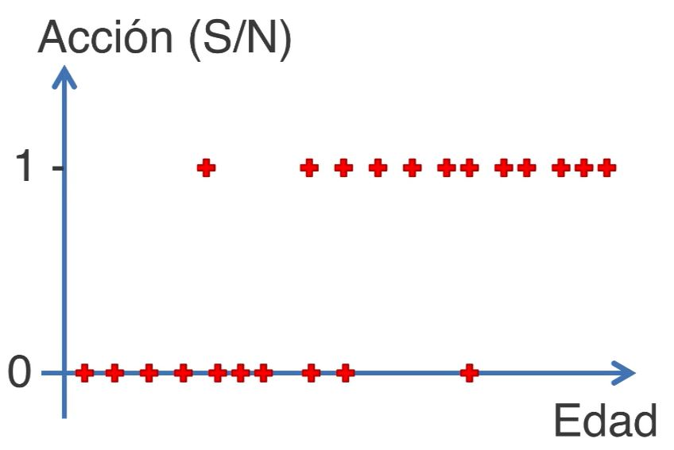
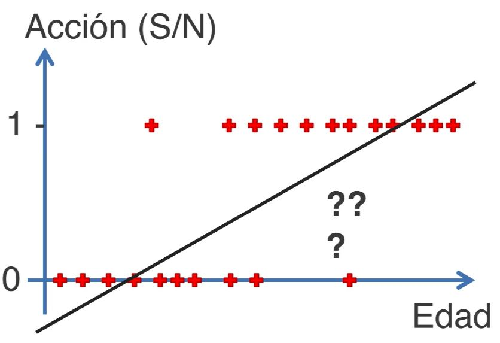

Explicativo vs Predictivo, Regresiones No Lineales
================

Paquetes que se utilizarán

``` r
library(tidyverse)
library(MuMIn) #Facilita la inferencias de modelos múltiples
library(caret) #Entrenamiento para regresiones y clasificaciones
library(broom) #La usaremos para ver resúmenes de información acerca de un modelo
library(knitr)
```

## A. Poder predictivo y explicativo de un modelo

Es necesario entender que mientras podemos calcular el R2 de un modelo
en su estado básico (su poder explicativo), también debemos de
calcularlo (R2) independientemente para su poder predictivo. Es decir,
obtendremos 2 coeficientes de determinación para cada uno de los
objetivos.

El R2, que vimos en la primera parte, nos brinda el poder explicativo
del modelo analizado, para calcular el poder predictivo, tenemos que
partir nuestra base de datos en 2. Generalmente esta partición se da en
una proporción de 70% (entrenamiento o creación del modelo) y 30%
(testeo del modelo una vez entrenado y creado), aunque también se pueden
manejar otros porcentajes como 50/50. Para evidenciar esto, dividiremos
en dos la base de datos **mtcars** (del paquete datasets). Cargamos la
base de datos y luego continuamos con los pasos.

``` r
data("mtcars")
```

### A.1. Separamos las bases de datos de entrenamiento y de testeo

Primer crearemos un indice en donde seleccionaremos los valores que se
tomarán para entrenar el modelo (en el ejemplo, sera el 50% de los
datos, es decir, 16 valores). Luego de crear este indice, se utilizará
para crear las bases de datos de entrenamiento y testeo:

``` r
set.seed(10)

Indice <- sample(1:nrow(mtcars), size = round(nrow(mtcars)/2)) # Separa posiciones, no valores de la base de datos original. 

Entrenamiento <- mtcars[Indice,]

Testeo <- mtcars[-Indice, ]
```

### A.2. Visualizamos los datos

Para intentar crear el mejor modelo, es recomendable visualizar los
datos en un diagrama de dispersión. Este nos puede ayudar a acercarnos
al mejor modelo que se ajuste a los datos observados. Vamos a estudiar
la relación entre la eficiencia de combustible (mpg) y si tiene alguna
relación con los caballos de fuerza (hp) de un vehículo.

``` r
mtcars %>% 
  ggplot()+
  geom_point(aes(x=hp, y=mpg))+
  theme_bw()
```

<!-- -->

### A.3. Creamos el modelo

Asumiremos que el modelo seria mejor explicado por una ecuación
cuadrática (sin embargo, también podría ser cubica o también
exponencial, etc. El tip esta en ir probando las hipótesis que vayamos
teniendo). Creamos el modelo cuadrático:

``` r
Modelo_Entrenamiento <- lm(data=Entrenamiento, mpg ~ hp + I(hp^2))
```

Podemos observar los resultados con la función **summary()**. Sin
embargo, en esta ocasión, utilizaremos la función **glance()** del
paquete **broom**

``` r
glance(Modelo_Entrenamiento)
```

    ## # A tibble: 1 × 12
    ##   r.squared adj.r.squared sigma statistic   p.value    df logLik   AIC   BIC
    ##       <dbl>         <dbl> <dbl>     <dbl>     <dbl> <dbl>  <dbl> <dbl> <dbl>
    ## 1     0.807         0.778  3.07      27.3 0.0000223     2  -39.0  86.0  89.1
    ## # ℹ 3 more variables: deviance <dbl>, df.residual <int>, nobs <int>

Podemos observar que nos brinda varios valores de interés, entre ellos
el R2, el R2-ajustado, el p-valor del modelo, los valores AIC y BIC del
modelo. Por el momento solo nos concentraremos en la evaluación del R2,
el cual representaría el poder explicativo del modelo. A continuación
realizaremos la predicción y calcularemos el R2 con la data de testeo.

### A.4. Predecimos los valores con la data de testeo

Para predecir los valores en cualquier modelo, podemos usar la función
**predict()**. Generaremos una nueva columna con los valores de
predicción tanto para la base de datos de entrenamiento y testeo.
Precisamente, para evaluar el poder predictivo de un modelo es necesario
probarlo con una base de datos que no ha sido utilizada en su
entrenamiento (es decir, data que no necesariamente se ajustará al
modelo)

``` r
Entrenamiento_F <- 
  Entrenamiento %>% 
  select(hp, mpg) %>% 
  mutate(pred = predict(Modelo_Entrenamiento, Entrenamiento),
         resid = pred - mpg)

Testeo_F <- 
  Testeo %>% 
  select(hp, mpg) %>% 
  mutate(pred = predict(Modelo_Entrenamiento, Testeo),
         resid = pred -mpg)
```

Para medir el poder predictivo usaremos la función **postResample()**
del paquete **caret**, usando dos argumentos, pred = y obs =. En el
primer argumento colocaremos los valore predichos con la base de datos
de testeo y en el segundo argumento utilizamos los valores observados de
la base de datos de testeo.

``` r
postResample(pred = Testeo_F$pred, obs = Testeo_F$mpg)
```

    ##      RMSE  Rsquared       MAE 
    ## 3.2350930 0.6671718 2.2832848

De aquí obtenemos varios valores, pero nos interesa solo el R2. Este
valor de R2, nos da a entender que tan bien los datos de la base de
datos de testeo se ajustan al modelo generado con la base de datos de
entrenamiento.

Podemos hacer una comparación entre la tendencia de los puntos predichos
por la base de datos entrenamiento vs testeo:

``` r
ggplot()+
  geom_point(data = mtcars, aes(x=hp, y=mpg))+
  geom_point(data = Entrenamiento_F, aes(x=hp, y=pred), color ="red")+
  geom_point(data = Testeo_F, aes(x=hp, y=pred), color = "blue")+
  geom_line(data = Entrenamiento_F, aes(x= hp, y=pred), color ="red")+
  geom_line(data = Testeo_F, aes(x= hp, y=pred), color ="blue")
```

<!-- -->

Gráficamente podemos darnos cuenta que tanto el color rojo como el azul,
son dos corridas de predicción diferentes. Precisamente, buscamos que
los R2 de ambos sean lo mas cercanos posibles. Es esperado que el R2 con
la base de datos original sea mas alto que el realizado con la base de
datos de testeo.

### A.5 Sobreajuste

La dinámica que acabamos de ver en el ejemplo puntual nos permitirá a
entender el problema de sobre ajuste que podemos evidenciar cuando
intentemos buscar el mejor modelo para nuestros datos (donde buscamos
siempre encontrar el mejor R2, lo cual no siempre es lo mejor)

Vamos a evidenciar que si queremos complejizar el modelo que hemos
creado en un inicio, convirtiéndolo cubico o de mayor grado, los R2 del
modelo explicativo aumentará, ajustándose casi perfectamente a los datos
de la base de datos de entrenamiento. Ver:
<https://derek-corcoran-barrios.github.io/CursoMulti/_book/CriteriosInfo.html>

Sin embargo, vamos a evidenciar que conforme aumentamos el R2 del
modelos (explicativo), la capacidad para predecir, es decir el R2 del
modelo predictivo, tocara un punto máximo y luego disminuirá.

Tal como indica Derek Corcoran (2020), lo que nos conviene es encontrar
un balance entre el modelo explicativo y predictivo. Precisamente uno de
los métodos utilizados para hacer el balance entre estos modelos, es
utilizando los indicadores AIC y BIC, rápidamente vistos en la regresión
lineal.

### A.6. Calculo de AIC

Siendo AIC traducido como el Criterio de Información de Akaike y BIC, el
Criterio de Información Bayesiano. Para calcularlos, podemos utilizas
las funciones **AIC()** o **BIC()** del paquete básico de **stats**. Sin
embargo, también podemos utilizar funciones mas especializadas, como
**AICc()** del paquete especializado para inferencia con modelos
**MuMIm**. Este ultimo usaremos:

``` r
AICc(Modelo_Entrenamiento)
```

    ## [1] 89.64181

El comportamiento de AIC vs el comportamiento de R2 es precisamente
donde el calculo del primer valor cobra relevancia.

### A.7. Inferencia Multimodelo

El paquete **MuMIN** nos permitirá analizar apropiadamente un conjunto
de modelos que nosotros hallamos creado. Por ejemplo, de los siguientes
modelos:

``` r
fit1 <- lm(mpg ~ carb + cyl, data = mtcars)
fit2 <- lm(mpg ~ cyl + wt, data = mtcars)
fit3 <- lm(mpg ~ am + qsec + wt, data = mtcars)
fit4 <- lm(mpg ~ carb + cyl + wt, data = mtcars)
fit5 <- lm(mpg ~ am + carb + cyl + qsec + wt, data = mtcars)
fit6 <- lm(mpg ~ am + carb + cyl + hp + qsec, data = mtcars)
```

Todos ellos, los suministraremos a una sola lista de datos, llamada
models:

``` r
models <- list(fit1, fit2, fit3, fit4, fit5, fit6)
```

A partir de ello, generamos una tabla de selección con la función
**model.sel()** de MuMIn:

``` r
Seleccion <- model.sel(models)
kable(Seleccion)
```

|     | (Intercept) |       carb |       cyl |        wt |       am |       qsec |         hp |  df |    logLik |     AICc |     delta |       weight |
|:----|------------:|-----------:|----------:|----------:|---------:|-----------:|-----------:|----:|----------:|---------:|----------:|-------------:|
| 3   |    9.617781 |         NA |        NA | -3.916504 | 2.935837 |  1.2258860 |         NA |   5 | -72.05969 | 156.4271 |  0.000000 | 0.4587701172 |
| 2   |   39.686262 |         NA | -1.507795 | -3.190972 |       NA |         NA |         NA |   4 | -74.00503 | 157.4915 |  1.064483 | 0.2694297161 |
| 4   |   39.602140 | -0.4857629 | -1.289788 | -3.159452 |       NA |         NA |         NA |   5 | -72.80873 | 157.9252 |  1.498091 | 0.2169145862 |
| 5   |   20.037880 | -0.5221880 | -0.461198 | -3.046227 | 2.941727 |  0.7272474 |         NA |   7 | -71.03086 | 160.7284 |  4.301328 | 0.0534039806 |
| 6   |   33.966671 | -0.7975317 | -1.274007 |        NA | 4.186544 | -0.1288322 | -0.0214835 |   7 | -74.84548 | 168.3576 | 11.930556 | 0.0011773562 |
| 1   |   37.812739 | -0.5261460 | -2.625023 |        NA |       NA |         NA |         NA |   4 | -80.79127 | 171.0640 | 14.636951 | 0.0003042437 |

El resultado nos permite elegir bastante rápido entre diversos modelos,
con el mejor AICc. En esta tabla, veremos también la variable **weight**
que interpretamos como la proporción relativa de confianza que tenemos
nosotros en ese modelo vs los demás (a mayor peso, mejor modelo). Sin
embargo, el valor de **weight** depende del número de modelos que
estemos analizando particularmente. Para evitar este sesgo, se
interpreta también el valor de **delta**. Como regla general, tomaremos
aquellos valore de **delta** que sean valores menores del 2.

Una vez tengamos los mejores modelos, podemos evaluarlos
individualmente.

## B. Modelo logístico para la clasificación

Supongamos que tenemos la venta de un nuevo producto y realizamos un
estudio de mercado para ver si las personas comprar o no (naturaleza
binaria de nuestra variable de respuesta) el producto en relación a su
edad. Imaginemos que preguntamos a un conjunto de personas y tenemos
como resultado la siguiente figura (siendo 1, equivalente a las personas
que si comprarían y 0 a las que no comprarían):



Como relacionamos ahora estas dos variables, podemos ver que no
corresponde a lo que seria una regresión lineal simple ni múltiple, ni
cercano a una polinómico, etc. Sí por ejemplo, trazamos una recta,
veremos que no será el mejor método, como se visualiza en la siguiente
figura:



En estos casos, vamos a estar interesados en determinar la probabilidad
de que una persona elija comprar el producto o no. Y es precisamente lo
que hacemos con una regresión logística, calcular dicha probabilidad
dependiendo de la edad (o otras variables independientes del modelo).
Básicamente tomamos una recta de regresión lineal y la transformamos
(logarítmicamente) para que pueda brindarnos aquella probabilidad que
estamos buscando. La formula de relación entre las dos variables estaría
representada por:

$$ ln(\\frac{p}{1-p}) = B_0 + B_1x $$

Donde *p* es la probabilidad de que compre el producto o no, *x* es la
edad del consumidores.

Básicamente lo que estamos realizando es el cambio visualizado en la
figura siguiente:


Lo que intentamos es estimar la probabilidad de que el consumidor compre
o no el nuevo producto en relación con su edad.


Al momento de interpretar los resultados de la regresión logística, se
establece el punto medio de 0.5 (50%) para separar a aquellos individuos
que tienen la probabilidad alta y bajo de comprar el producto en
cuestión. Esto se refleja en la siguiente figura:


Tener en cuenta que el nivel para determinar si compra o no compra, no
tiene que ser siempre de 0.5, se puede determinar un valor mas bajo para
estar seguros del mismo, el cual se determinará dependiendo de los
objetivos del estudio o investigación.

### B.1. Ejemplo: Base de datos de marketing en redes sociales

Cargamos la base de datos, la cual consiste en diferentes usuarios que
compraron o no el producto que se vende luego de una campaña en redes
sociales. Se han tomando variables dependientes como la edad, salario
promedio y sexo para ver si estas impactan al momento que el usuario que
ha visto la propaganda, compra o no el producto.

``` r
Redes.Sociales <- read.csv("https://raw.githubusercontent.com/luiqs/machinelearning-az/master/datasets/Part%203%20-%20Classification/Section%2014%20-%20Logistic%20Regression/Social_Network_Ads.csv") 
```

Vamos a seleccionar solo las variables independientes para el modelo,
edad y promedio salarial.

``` r
Redes.Sociales <- 
  Redes.Sociales %>% 
  select(Purchased, 
         Age, 
         EstimatedSalary)
```

Tal como aprendimos en la primera parte, separaremos la base de datos en
un set de entrenamiento y de testeo.

``` r
set.seed(123)
Indice <- sample(1:nrow(Redes.Sociales), size = round(nrow(Redes.Sociales)*0.75)) 
Set_entrenamiento_redes <- Redes.Sociales[Indice,]
Set_testeo_redes <- Redes.Sociales[-Indice, ]
```

Siendo las medidas de edad versus salario promedio diferentes en
unidades y magnitudes, siempre es recomendable escalar los números para
no darle ventaja a variables con rangos de valores numéricos mas granes.
Escalamos ambos valores (solo escalamos las variables independientes):

``` r
Set_entrenamiento_redes[, 2:3] <- scale(Set_entrenamiento_redes[, 2:3])
Set_testeo_redes[,2:3] <- scale(Set_testeo_redes[,2:3])
```

La base de datos esta lista para correr el modelo.

### B.2. Corriendo en modelo logístico en el Ejemplo de Redes

Vamos a ajustar el modelo de regresión logística con el conjunto de
entrenamiento. Para realizar el modelo, en R, utilizaremos la función
**glm()** el cual se utiliza para una familia específica de modelos,
entre ellos el logísticos que no siguen el comportamiento de una
regresión lineal (función **lm()**).

``` r
Modelo_clasificador <-glm(formula = Purchased ~ ., 
                          data = Set_entrenamiento_redes,
                          family = binomial)
```

Ya tenemos entonces nuestro modelo logístico creado.

#### B.2.1 EXTRA, crear modelos con una sola variable independiente:

``` r
Modelo_clasificador_1.1 <-glm(formula = Purchased ~ EstimatedSalary, 
                          data = Set_entrenamiento_redes,
                          family = binomial)

Modelo_clasificador_1.2 <-glm(formula = Purchased ~ Age, 
                          data = Set_entrenamiento_redes,
                          family = binomial)
```

### B.3. Evaluación del modelo

Tal como lo hemos hecho en anteriores modelos, podemos evaluar de manera
general el rendimiento de nuestro modelo con la función **summary()**:

``` r
summary(Modelo_clasificador)
```

    ## 
    ## Call:
    ## glm(formula = Purchased ~ ., family = binomial, data = Set_entrenamiento_redes)
    ## 
    ## Deviance Residuals: 
    ##     Min       1Q   Median       3Q      Max  
    ## -3.0635  -0.5191  -0.1055   0.3700   1.9078  
    ## 
    ## Coefficients:
    ##                 Estimate Std. Error z value Pr(>|z|)    
    ## (Intercept)      -1.1323     0.2031  -5.576 2.46e-08 ***
    ## Age               2.6533     0.3430   7.735 1.03e-14 ***
    ## EstimatedSalary   1.3362     0.2260   5.911 3.39e-09 ***
    ## ---
    ## Signif. codes:  0 '***' 0.001 '**' 0.01 '*' 0.05 '.' 0.1 ' ' 1
    ## 
    ## (Dispersion parameter for binomial family taken to be 1)
    ## 
    ##     Null deviance: 395.37  on 299  degrees of freedom
    ## Residual deviance: 200.04  on 297  degrees of freedom
    ## AIC: 206.04
    ## 
    ## Number of Fisher Scoring iterations: 6

Podemos interpretar que las variables independientes tomadas en
consideración en el modelo son significativas para explicar el
comportamiento de compra del consumidor. **Null deviance** y **residual
deviance** son las desviaciones de la media y el modelo respectivamente.
Su interpretación es similar a la que realizamos de la suma de cuadrados
de una regresión lineal, básicamente queremos que sea la menor posible.
El indicador AIC, lo hemos visto en anteriores modelos y lo
interpretamos de la misma manera.

### B.4. Evaluación de la predicción con nuestra base de datos de testeo

Vamos a predecir la probabilidad (basada en las variable independientes)
de que el producto sea comprado o no, con la base de datos de testeo
(para predecir, utilizamos la función predict()):

``` r
Prediccion <- predict(Modelo_clasificador,
                      type = "response", # de esta manera obtenemos automáticamente las probabilidades y no los odds
                      newdata = Set_testeo_redes[,2:3])
```

El argumento **type=** nos asegura el tipo de datos que queremos nos
devuelva las probabilidades de predicción, en este caso al querer un
vector, le colocamos **response**. A partir de aquí, podemos nosotros
transformarlo a venta o no venta (o compra y no compra). Para ello,
podemos crear un nuevo vector el cual no nos indique la probabilidad,
sino la respuesta final (si compra o no compra), para ellos creamos una
regla condicional. Por ejemplo, esto se puede lograr de la siguiente
manera, vamos a crear el vector respuesta de la variable dependiente,
bajo el supuesto que si la probabilidad es menor a 0.5, no compra (0) y
si es mayor, compra (1):

**Nota**: si se quiere realizar para los modelos individuales:

``` r
#Para salario estimado
newdata <- data.frame(EstimatedSalary = Set_testeo_redes[,3])

Prediccion.1 <- predict(Modelo_clasificador_1.1,
                      type = "response", # de esta manera obtenemos automáticamente las probabilidades y no los odds
                      newdata = newdata)

#Para salario Edad
newdata <- data.frame(Age = Set_testeo_redes[,2])

Prediccion.2 <- predict(Modelo_clasificador_1.2,
                      type = "response", # de esta manera obtenemos automáticamente las probabilidades y no los odds
                      newdata = newdata)
```

``` r
Compra <- ifelse(Prediccion >0.5, 1, 0)
Compra.1 <- ifelse(Prediccion.1 >0.5, 1, 0)
Compra.2 <- ifelse(Prediccion.2 >0.5, 1, 0)
```

### B.5. Creamos la matriz de confusión

La matriz de confusión nos permitirá detectar cuantos resultados han
sido bien predichos por nuestro modelo y cuantos se ha equivocado para
un lado y para el otro. Para dicho objetivo crearemos una matriz con la
función **table()**. La matriz tendrá 4 valores posibles. Tendremos el
número en donde el conjunto de testeo tenga un **0** y el modelo haga la
predicción correcta (0 - 0); que el consumidor no haya hecho la compra,
pero mi modelo diga que si lo hizo (0 - 1), seria un falso positivo; que
el consumidor compre y mi modelo diga que compro (1 - 1); y por último
que el usuario compre y mi modelo diga que no compro, falso negativo
(1-0).

``` r
Matriz.confusion <- table(Set_testeo_redes[,1], Compra)
Matriz.confusion
```

    ##    Compra
    ##      0  1
    ##   0 61  7
    ##   1 10 22

En este caso, tomamos en cuenta los aciertos, los cuales son los casos
(0 - 0) y (1 - 1). Si los sumamos, nos darían un total de 83, lo que
corresponde a 83/100 o el 83%. Este es el porcentaje de predicción
correcta del modelo para la base de datos de testeo. Y tenemos un total
de 17% de los datos predichos incorrectamente.

#### B.5.1 Accuracy

El valor de 83 que acabamos de calcular es conocido con el “accuracy”,
la cual se define como el número de predicciones correctas entre el
número de todas las predicciones. Sin embargo, esta medida no es
totalmente confiable para todos los casos (imaginemos una base de datos
donde la precencia de una de los valores binarios es muy poco frecuente,
tumores malignos, en esos casos siempre habrá ventaja de que nuestro
modelo no detecte los tumores, se asemeja a la distribución de Poisson),
por lo cual utilizamos otras medidas para evaluar el rendimiento de
nuestro modelo. Entre estas medidas encontramos a la “Precision” y
“Recall”.

#### B.5.2 Precision y Recall

En el contexto de la regresión logística y la evaluación de modelos de
clasificación, Precision (precisión) y Recall (recuperación) son dos
métricas importantes para medir el rendimiento del modelo en función de
los resultados de la clasificación

Para entenderlos, previamente hay que reconocer los siguiente terminos:

- **Verdadero positivo** (VP): predice correctamente casos positivos (1)
- **Falso positivo** (FP): predice como negativo (0) , casos positivos
  (1)
- **Verdadero negativo** (VN): predice correctamente casos negativos (0)
- **Falso negativo** (FN): Predico como positivo (1), casos negativos
  (0)

**Precision** se refiere a la proporción de casos positivos
correctamente identificados sobre el total de casos identificados como
positivos. - Precision = TP / (TP + FP) - La precision mide que tan
bueno es nuestro modelo para realizar una predición positiva - Una alta
precisión indica que hay pocos falsos positivos (importante en casos
donde los falsos positivos pueden tener consecuencias significativas.)

**Recall** o tambien llamado **sensibilidad** (en una regresión
logística binaria) se refiere a la proporción de casos positivos
correctamente identificados respecto al total de casos positivos reales:

- Recall = TP / (TP + FN)
- Recall se refiere a la capacidad del modelo para “recordar” o detectar
  correctamente los casos positivos
- Una alta tasa de recall indica que el modelo es capaz de detectar la
  mayoría de los casos positivos, lo cual es importante en situaciones
  donde los falsos negativos (casos positivos clasificados
  incorrectamente como negativos) pueden tener implicaciones graves.

De acuerdo a los valores obtenidos mediante estas dos metricas se puede
entender mejor los posibles diferentes escenario: i) Clasificación
balanceada, ii)Desequilibrio de clases y iii)Contextos sensibles a
falsos positivos o falsos negativos.

La utilidad de la precisión y el recall radica en proporcionar una
visión más completa del rendimiento del modelo en diferentes
situaciones.

#### B.5.3 Specificity

Junto con recall, es usado en la generación de curvas ROC y evaluaciones
AUC. Se definen matemáticamente de la siguiente manera:

- Specificity: Verdadero negativo / (Verdadero Negativo + Falso
  positivo)

- La especificidad representa la proporción de casos negativos reales
  que fueron correctamente identificados por el modelo.

-   Una alta especificidad indica que el modelo tiene una alta capacidad para distinguir correctamente los casos negativos.

#### B.5.4 Calculo en R

``` r
library(caret)
confusion <- confusionMatrix(as.factor(Compra), as.factor(Set_testeo_redes$Purchased))

recall <- confusion$byClass["Sensitivity"]
precision <- confusion$byClass["Precision"]
specificity <- confusion$byClass["Specificity"]
```

#### B.5.5 Curva ROC

Una curva ROC (Receiver Operating Characteristic) es una representación
gráfica que ilustra el rendimiento de un modelo de clasificación binaria
en diferentes umbrales de probabilidad. Se construye trazando la tasa de
verdaderos positivos (sensibilidad) en el eje y frente a la tasa de
falsos positivos (1 - especificidad) en el eje x, a medida que el umbral
de probabilidad de clasificación se mueve.

La curva ROC muestra cómo varía el equilibrio entre la sensibilidad y la
especificidad a medida que se ajusta el umbral de clasificación. Cada
punto en la curva representa una configuración de umbral diferente. Un
modelo con un mejor rendimiento se caracteriza por una curva ROC que se
acerca lo más posible al rincón superior izquierdo del gráfico, lo que
indica una alta sensibilidad y una baja tasa de falsos positivos.

Cargamos la libreria ROCR y utilizaremos las funciones “prediction()” y
“performance()” de este paquete para ordenar la data y crear el objeto
“perf”:

``` r
library(ROCR)
```

    ## Warning: package 'ROCR' was built under R version 4.2.3

``` r
library(pROC)
```

    ## Warning: package 'pROC' was built under R version 4.2.3

    ## Type 'citation("pROC")' for a citation.

    ## 
    ## Attaching package: 'pROC'

    ## The following objects are masked from 'package:stats':
    ## 
    ##     cov, smooth, var

``` r
pred <- prediction(Prediccion, Set_testeo_redes[,1])
perf <- ROCR::performance(pred, "tpr", "fpr")
```

Luego graficamos:

``` r
plot(perf)
```

<!-- -->

La curva ROC también se utiliza para calcular otra métrica llamada
AUC-ROC (Area Under the ROC Curve), que representa el área debajo de la
curva ROC. El AUC-ROC proporciona una medida numérica del rendimiento
global del modelo y es una métrica comúnmente utilizada para comparar
diferentes modelos de clasificación.

### B.6. Formas de visualizar los resultados del modelo logístico

``` r
Modelo_clasificador
```

    ## 
    ## Call:  glm(formula = Purchased ~ ., family = binomial, data = Set_entrenamiento_redes)
    ## 
    ## Coefficients:
    ##     (Intercept)              Age  EstimatedSalary  
    ##          -1.132            2.653            1.336  
    ## 
    ## Degrees of Freedom: 299 Total (i.e. Null);  297 Residual
    ## Null Deviance:       395.4 
    ## Residual Deviance: 200   AIC: 206

``` r
library(ggiraphExtra)
```

    ## Warning: package 'ggiraphExtra' was built under R version 4.2.3

``` r
ggPredict(Modelo_clasificador, se = T)
```

<!-- -->

#### B.6.1 Modelos con una sola variable independiente:

``` r
ggPredict(Modelo_clasificador_1.1)
```

<!-- -->

y

``` r
ggPredict(Modelo_clasificador_1.2)
```

<!-- -->

## REFERENCIAS

#### Para predicciones de regresión lineal:

- Derek Corcoran, youtube <https://www.youtube.com/watch?v=SLbgiN5HVyg>
- Derek Corcoran, Rbook
  <https://derek-corcoran-barrios.github.io/CursoMulti/_book/CriteriosInfo.html>
- Bradley B. & Brandon G. Hands on Machine learning with R
  <https://bradleyboehmke.github.io/HOML/mars.html>
- Chupitos de R, regresión lineal:
  <https://www.youtube.com/watch?v=LdHzzgR5ako>
- Averiguar sobre el paquete **performance**, funcion:
  compare_performance()

#### Para regresión logística

- Como evaluar el modelo de regresión logística con R:
  <https://www.youtube.com/watch?v=C4N3_XJJ-jU>
- Paquete ggiraphExtra:
  <https://cran.r-project.org/web/packages/ggiraphExtra/vignettes/ggPredict.html>
- Supuestos de regresión logística:
  <http://www.sthda.com/english/articles/36-classification-methods-essentials/148-logistic-regression-assumptions-and-diagnostics-in-r/>
- Evaluación de regresión logística en R:
  <https://www.youtube.com/watch?v=D1xVEi8PU-A&t=3509s>
- Curvas ROC y AUC explicadas:
  <https://www.youtube.com/watch?v=4jRBRDbJemM>

#### Libro general en donde encontrar información y ejemplos:

- Libro: <http://idaejin.github.io/courses/R/2019/euskaltel/index.html>
