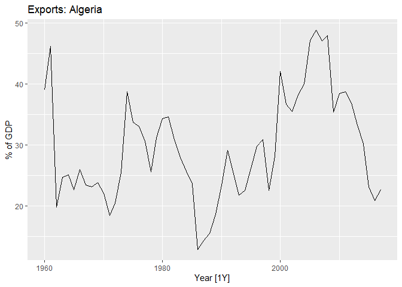
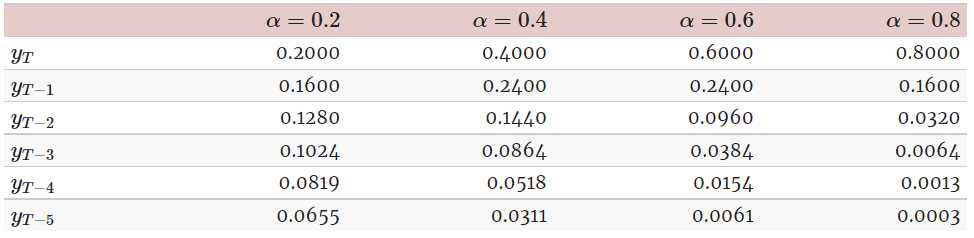

Series Temporales
================

Paquetes que se utilizarán

# A. Introducción

La librería fpp3 es una especie de tidyverse que cargará varios
paquetes, entre ellos algunos del mundo de tidyverse y otros que nos
ayudarán a manejar series de tiempo y pronósticos con el enfoque “tidy”.

Vamos a enfocarnos en pronósticos cuantitativos, y para ello debemos
cumplir 2 condiciones:

-   Datos numéricos tienen que estar disponibles de los eventos
    ocurridos en el pasado

-   Es razonable asumir que algunas (o mayoría) de condiciones que
    ocurrieron en el pasado, seguirán ocurriendo en el futuro

Hay una gran variedad de metodologías cuantitativas, desarrolladas casi
siempre bajo disciplinas y propósitos específicos. La mayoría de estos
métodos utilizan series de tiempo (colecciones de datos en intervalos de
tiempo) o datos transversales (colectados en un tiempo determinado).

Cualquier situación que es observada en un intervalo de tiempo, es una
serie de tiempo. Nos enfocaremos en series de tiempo ocurridas en
intervalos de tiempo regulares, como por ejemplo horas, días, semanas,
meses, semestres, años, otros.).

Los métodos de series de tiempo simples solo buscan información acerca
de la variable que se quiere predecir y no buscan descubrir los factores
que afectan su comportamiento. Lo que se obtiene entonces son los
patrones y tendencias, pero se ignoran todas las otras formas de
información (cambios en las condiciones, contexto, impulsores del
cambio, etc.).

Para estudiar correctamente una serie de tiempo hay que estudiar tanto
su tendencia y estacionalidad. Para ello hay que realizar la
descomposición de una serie de tiempo. Dentro de los modelos más
conocidos para realizar pronósticos de series de tiempo encontramos el
modelo ARIMA, que es el modelo con el que finalizaremos este modulo.

Una ecuación general de una serie de tiempo es la siguiente:

-   X”t+1” = f(X”t”, X”t-1”, X”t-2”, X”t-3”, …. , error).

Donde t puede estar representado por años, t+1 el siguiente año, t-1 el
año anterior, etc. La predicción se basa en los valores pasados de la
variable, pero no en variables externas que también afectan al sistema.
El error mide precisamente aquellos cambios o variaciones aleatorias que
no están incluidas en el modelo.

También existen otro tipo de modelos, los cuales combinan series de
tiempo con modelos explicativos (como los vistos en regresión lineal).
Estos siguen la siguiente estructura:

-   X”t+1” = f(X”t”, temperatura, presión, otras variables, …. , error).

Estos modelos son modelos mixtos que tienen diferentes nombres en
diferentes disciplinas. Se les conoce como modelos dinámicos de
regresión, modelos, “panel data models”, modelos longitudinales, modelos
de transferencia de funciones, modelos de sistemas lineales. Estos
modelos no serán profundizados en la guía actual.

## A. 1 Pasos básicos para realizar un pronostico

#### Paso 1: Definir el problema

Requiere el entendimiento de quien o que necesita el pronostico y el
propósito del mismo. Se tiene que tener un manejo experto del problema a
analizar para elegir las variables adecuadas.

#### Paso 2: Juntar información

Dos tipos de información son siempre necesaria, la data estadísticas y
la experiencia acumulada de las personas que colectan y usan la data.
Muchas veces será difícil obtener data histórica.

#### Paso 3: Análisis (exploratorio) preliminar

Siempre es recomendable comenzar gráficando nuestros datos. ¿Existe
patrones consistentes?¿Es la estacionalidad importante?¿Se evidencian
ciclos?¿Existen valores atípicos?¿Existe alguna relación obvia entre las
variables analizadas?

#### Paso 4: Elegir y ajustar los modelos

El mejor modelo depende de la data que se tiene disponible, la fuerza de
la relación entre la variable a predecir y cualquier otra variable y de
que manera se utilizará el pronostico. Es común utilizar entre 2 a 3
potenciales modelos en búsqueda del mejor de ellos (modelos
exponenciales suavizados, modelo ARIMA, regresiones dinámicas,
pronostico jerárquico, redes neuronales, vectores de auto regresión,
entre otros).

#### Paso 5: Usar y evaluar los modelos de predicción

Una vez elegido el modelo y estimado los parámetros, el modelo esta
listo para pronosticar. El rendimiento del modelo solo puede ser
correctamente evaluado luego de que los datos para el periodo de
pronostico se encuentren disponibles (hay que esperar). Diferentes
métodos se han desarrollado para ayudar en la evaluación de determinar
la precisión del pronostico. En la construcción de modelos, los
problemas relacionados con “datos perdidos” (“missing values”) o valore
atípicos siempre están presentes.

## A.2. Análisis de series de tiempo

Los datos pueden ser entendidos como observaciones, y estas pueden ser
comprendidas como la suma de una **señal** más **ruido**. Podríamos
decir que la señal es aquello que nos interesa medir y que el sonido es
aquello que contamina de manera aleatoria a la señal. Cuando utilizamos
observaciones para generar un modelo, buscamos estimar la señal
verdadera y los errores del modelo se convierten en el ruido estimado.
El ruido estimado o conocido también como los errores del modelo son la
base para entender la incertidumbre de nuestro modelo.

En modelos de regresión lineal nos hemos concentrado en el ruido blanco,
es decir, si las variables son o no independientes, si los errores
siguen una distribución normal, homogeneidad de varianzas, etc. Sin
embargo en el contexto de series temporales, el ruido tiene una
estructura más compleja basada en la **temporalidad** y **espacio**.
Esta compleja estructura es algo en lo que debemos tomar mayor atención
al momento de realizar un análisis de series temporales (a diferencia de
una regresión “normal”). Una vez identificada esta estructura se puede
proceder a realizar una análisis de regresión como se ha aprendido
(selección del modelo, predicción, intervalos de confianza, etc.).

La variable que pretendemos pronosticar es desconocida, por lo que
podemos pensar en ella como una variable aleatoria. Contra más cercano
este el futuro (horas vs años), tendremos una mejor idea de como esa
variable se comportara. Esto ocurre en un modelo de serie de tiempo,
conforme nos alejemos del tiempo final que dispongamos como dato, mayor
será nuestra incertidumbre.

Cuando pronosticamos, estimamos el valor medio de un rango de posibles
valores que la variable aleatoria puede tomar. Regularmente, el
pronostico está acompañado de un intervalo de confianza, el cual brinda
los rangos que la variable aleatoria, con una alta probabilidad, podría
tomar. Por ejemplo, un intervalo de confianza al 95% contiene un rango
de valores, los cuales deben incluir el valor futuro con una
probabilidad del 95%.

# B. Objetos tsiblle

Lo primero que hacemos (luego de definir que queremos hacer y ya tenemos
la data) es graficar (Paso 3). Las características visualizadas deben
ser incorporadas, lo máximo posible, en los métodos a utilizar
(modelos). Antes de realizar un gráfico y una serie temporal,
necesitamos crear nuestra serie de tiempo en el R.

Una serie de tiempo no es simplemente una lista de números (las medidas)
a lo largo de una línea de tiempo (el indice). Esta información puede
ser albergada de diferentes maneras en el R, una de ellas en en el tipo
de objetivo específico “**tsibble**”.

## **B.1 La variable INDICE (index)**

Supongamos que tenemos observaciones anuales de los ultimos 5 años,
desde el 2017 hasta el 2022, crearemos un objeto tsibble desde cero:

``` r
y <- tsibble(
  Year = 2017:2021,
  Observation = c(123, 39, 78, 52, 110),
  index = Year
)
```

Visualizamos el objeto:

``` r
y
```

    ## # A tsibble: 5 x 2 [1Y]
    ##    Year Observation
    ##   <int>       <dbl>
    ## 1  2017         123
    ## 2  2018          39
    ## 3  2019          78
    ## 4  2020          52
    ## 5  2021         110

Los objetos tsibble extienden los objetos tibble (del mundo del
tidyverse), introduciendo en ellos datos de tipo temporal. En el ejemplo
la variable indice son los años (definido en el último argumento), el
cual asocia las medidas (Observation) con el año reportado (Year).
Cualquier base de datos “normal” puede ser cambiada a un objeto tsibble,
utilizando la función mutate (paquete dplyr) y el siguiente argumento
(para identificar años).

``` r
x <- tibble(Year = 2017:2021,
  Observation = c(123, 39, 78, 52, 110))
```

Siendo z, un objeto normal, lo cambiaremos a objeto tsibble:

``` r
x %>%  
  as_tsibble(index = Year)
```

    ## # A tsibble: 5 x 2 [1Y]
    ##    Year Observation
    ##   <int>       <dbl>
    ## 1  2017         123
    ## 2  2018          39
    ## 3  2019          78
    ## 4  2020          52
    ## 5  2021         110

## **B.2 Las Variables “clave” (key)**

Un objeto tsibble permite albergar multiples series temporales en un
simple objeto. Suponga que está interesando en contener los atletas más
veloces (entre mujeres y hombres) en las olimpiadas, para las categorías
100, 200,…, hasta 10000 metros planos.

``` r
olympic_running
```

    ## # A tsibble: 312 x 4 [4Y]
    ## # Key:       Length, Sex [14]
    ##     Year Length Sex    Time
    ##    <int>  <int> <chr> <dbl>
    ##  1  1896    100 men    12  
    ##  2  1900    100 men    11  
    ##  3  1904    100 men    11  
    ##  4  1908    100 men    10.8
    ##  5  1912    100 men    10.8
    ##  6  1916    100 men    NA  
    ##  7  1920    100 men    10.8
    ##  8  1924    100 men    10.6
    ##  9  1928    100 men    10.8
    ## 10  1932    100 men    10.3
    ## # ... with 302 more rows

En la descripción de la base de datos podemos ver \[4Y\] al costado del
número de columnas, ello indica que los datos se han tomado cada 4 años.
Al costado de sex, podemos ver \[14\] , que informa que hay 14 series
temporales separadas en el objeto tsibble. Las 14 series de tiempo en el
objeto se identifican a través de las variables “clave”: el sexo
(masculino y femenino) y la categoría donde corren (100, 10000 metros
planos). La función distinct() puede utilizarse para mostrar estas
categorías:

``` r
olympic_running %>% distinct(Sex)
```

    ## # A tibble: 2 x 1
    ##   Sex  
    ##   <chr>
    ## 1 men  
    ## 2 women

``` r
olympic_running %>% distinct(Length)
```

    ## # A tibble: 7 x 1
    ##   Length
    ##    <int>
    ## 1    100
    ## 2    200
    ## 3    400
    ## 4    800
    ## 5   1500
    ## 6   5000
    ## 7  10000

## **B.3 Trabajando con objetos tsibble**

Una de las ventajas de trabajar con el formato tsibble es que podemos
utilizar las funciones aprendidas del paquete dplyr para la manipulación
de datos (mutate, filter, select, summarise, etc.). Para ejemplificar
ellos, utilizaremos la base de datos PBS. Esta base de datos contiene
data mensual de prescripciones de “Medicare Australia” desde Julio 1991
hasta Junio 2008. Estos datos están clasificados de acuerdo a varias
variables categóricas como tipos de concesiones, indices terapéuticos,
entre otros.

Podemos utilizar filter() para extraer la solo algunos tipos de
concesiones:

``` r
PBS %>% filter(Concession == "General")
```

    ## # A tsibble: 33,576 x 9 [1M]
    ## # Key:       Concession, Type, ATC1, ATC2 [168]
    ##        Month Concession Type       ATC1  ATC1_desc ATC2  ATC2_desc Scripts  Cost
    ##        <mth> <chr>      <chr>      <chr> <chr>     <chr> <chr>       <dbl> <dbl>
    ##  1 1991 Jul. General    Co-paymen~ A     Alimenta~ A01   STOMATOL~      61   254
    ##  2 1991 Ago. General    Co-paymen~ A     Alimenta~ A01   STOMATOL~      27   135
    ##  3 1991 Set. General    Co-paymen~ A     Alimenta~ A01   STOMATOL~      21    81
    ##  4 1991 Oct. General    Co-paymen~ A     Alimenta~ A01   STOMATOL~      29   127
    ##  5 1991 Nov. General    Co-paymen~ A     Alimenta~ A01   STOMATOL~      29    50
    ##  6 1991 Dic. General    Co-paymen~ A     Alimenta~ A01   STOMATOL~      28   147
    ##  7 1992 Ene. General    Co-paymen~ A     Alimenta~ A01   STOMATOL~      19    76
    ##  8 1992 Feb. General    Co-paymen~ A     Alimenta~ A01   STOMATOL~      28   104
    ##  9 1992 Mar. General    Co-paymen~ A     Alimenta~ A01   STOMATOL~      26   113
    ## 10 1992 Abr. General    Co-paymen~ A     Alimenta~ A01   STOMATOL~      29    67
    ## # ... with 33,566 more rows

Podriamos llegar a situaciones más complejas, como (ello se puede
guardar en un nuevo objeto):

``` r
PBS %>%
  filter(ATC2 == "A10") %>%
  select(Month, Concession, Type, Cost) %>%
  summarise(TotalC = sum(Cost)) %>%
  mutate(Cost = TotalC/1e6)
```

    ## # A tsibble: 204 x 3 [1M]
    ##        Month  TotalC  Cost
    ##        <mth>   <dbl> <dbl>
    ##  1 1991 Jul. 3526591  3.53
    ##  2 1991 Ago. 3180891  3.18
    ##  3 1991 Set. 3252221  3.25
    ##  4 1991 Oct. 3611003  3.61
    ##  5 1991 Nov. 3565869  3.57
    ##  6 1991 Dic. 4306371  4.31
    ##  7 1992 Ene. 5088335  5.09
    ##  8 1992 Feb. 2814520  2.81
    ##  9 1992 Mar. 2985811  2.99
    ## 10 1992 Abr. 3204780  3.20
    ## # ... with 194 more rows

## **B.4 Leer archivos csv y convertirlos a objetivos tsibble**

Cargamos una base de datos desde la web:

``` r
prison <- readr::read_csv("https://OTexts.com/fpp3/extrafiles/prison_population.csv")
```

    ## Rows: 3072 Columns: 6
    ## -- Column specification --------------------------------------------------------
    ## Delimiter: ","
    ## chr  (4): State, Gender, Legal, Indigenous
    ## dbl  (1): Count
    ## date (1): Date
    ## 
    ## i Use `spec()` to retrieve the full column specification for this data.
    ## i Specify the column types or set `show_col_types = FALSE` to quiet this message.

Tener en consideración que la base de datos tiene la variable fecha, que
es nuestra variable de tiempo y es un tipo de variable en el R, “date”.

Para transformarlo a formato tsibble, podemos utilizar el siguiente
código:

``` r
prison <- prison %>%
  mutate(Quarter = yearquarter(Date)) %>%
  select(-Date) %>%
  as_tsibble(key = c(State, Gender, Legal, Indigenous),
             index = Quarter)
```

Para las transformaciones de mutate, existen la siguientes funciones:

| Frenquency | Function                 |
|:-----------|:-------------------------|
| Annual     | start:end                |
| Quaterly   | yearquarter()            |
| Monthly    | yearmonth()              |
| Weekly     | yearweek()               |
| Daily      | as_date(), ymd()         |
| Sub-daily  | as_datetime(), ymd_hms() |

Para que un objeto tsibble sea valido, requiere un único indice (index)
para cada combinación de llaves (keys). Si no se cumple ello, las
funciones de transformación o creación de objetivos tsibble votarán
error.

## B.5 El periodo estacional

Algunos gráficos y modelos utilizarán el periodo estacional de los
datos. Este periodo es el número de observaciones antes que comience el
próximo patrón estacional. Adelante aquellos que ya conocemos:

| Data     | Minute | Hour | Day   | Week   | Year     |
|:---------|:-------|:-----|:------|:-------|:---------|
| Quarters |        |      |       |        | 4        |
| Months   |        |      |       |        | 12       |
| Weeks    |        |      |       |        | 52       |
| Days     |        |      |       | 7      | 365.25   |
| Hours    |        |      | 24    | 168    | 8766     |
| Minutes  |        | 60   | 1440  | 10080  | 525960   |
| Seconds  | 60     | 3600 | 86400 | 604800 | 31557600 |

# C. Gráficos de series de tiempo

Comenzamos con el grafico de tiempo (time plot). En este se plotean las
observaciones versus el tiempo, unidas con una línea continua. Primero
traemos la base de datos ansett y manipulamos en función a algunos de
sus parametros:

``` r
melsyd_economy <- ansett %>%
  filter(Airports == "MEL-SYD", Class == "Economy") %>%
  mutate(Passengers = Passengers/1000)
```

Podemos utilizar la función autoplot() para graficar de manera directa
una serie de tiempo (tiempo en función de la variable pasajeros):

``` r
autoplot(melsyd_economy, Passengers) +
  labs(title = "Ansett airlines economy class",
       subtitle = "Melbourne-Sydney",
       y = "Passengers ('000)",
       x = "")
```

<!-- -->

De la gráfica podemos sacar varias interpretaciones e incluso dar
potenciales explicaciones a los picos altos y bajos en relación a los
eventos ocurridos durante el tiempo evaluado. Cualquier modelos
necesitará tomar en consideración las características para realizar un
pronostico efectivo. Otro ejemplo, utilizando la base de datos de
farmacéuticos de Australia:

``` r
a10 <- PBS %>%
  filter(ATC2 == "A10") %>%
  select(Month, Concession, Type, Cost) %>%
  summarise(TotalC = sum(Cost)) %>%
  mutate(Cost = TotalC / 1e6)
```

Graficamos:

``` r
autoplot(a10, Cost) +
  labs(y = "$ (millions)",
       title = "Australian antidiabetic drug sales")
```

<!-- -->

A diferencia del ejemplo anterior, en este gráfico podemos ver una clara
tendencia de incremento. También se observa un claro patrón estacional.
La caída de precios al inicio de cada año es causada por el subsidio del
gobierno. Cualquier pronostico de esta serie de tiempo necesitará
capturar el patrón estacional y el hecho de que la tendencia cambia
lentamente (incrementa).

## C.1 Patrones de series de tiempo

Describiendo las series de tiempo, tenemos que usar las palabras
tendencia (trends) y estacionalidad (seasonal) con cuidado, motivo por
el cual las definimos:

### C.1.1 Tendencia (trend)

La tendencia existe cuando hay un incremento o disminución en un plazo
largo. No tiene que ser lineal. Aveces se referirá a la tendencia como
el “cambio de dirección”, sobretodo cuando va la tendencia sube, sube y
sube y derrepente comienza a disminuir, disminuir, etc.

### C.1.2 Estacionalidad (Seasonal)

Un patrón estacional sucede cuando una serie de tiempo es afectada por
factores estacionales como por ejemplo los cambios cíclicos en un año
(estaciones del año) o durante un día de la semana (día y noche). La
estacionalidad esta siempre fijada y se conoce su periodo.

### C.1.3 Cíclico

Un ciclo ocurre cuando la data muestra un incremento y/o caídas que no
están ajustadas a una frecuencia fija. Estas fluctuaciones responden
usualmente a condiciones económicas, y se encuentran relacionadas con
ciclos económicos (usualmente duran al menos 2 años, no es fijo). Muchas
veces se confunden el termino cíclico con el estacional, pero son
diferentes. Si las fluctuaciones no están ajustadas a una frecuencia
específica, entonces son cíclicas. En general, el promedio de longitud
de los ciclos es mayor que la longitud de los patrones estacionales.

## C.2 Gráficos estacionales

A diferencia de un grafico de tiempo normal, estos gráficos colocan la
data versus estaciones indivuduales en las cuales la data es observada.
Utilizaremos la función “**gg_season()**” para ello:

``` r
a10 %>%
  gg_season(Cost, labels = "both") +
  labs(y = "$ (millions)",
       title = "Seasonal plot: Antidiabetic drug sales")
```

<!-- -->

Es la misma data mostrada anteriormente, pero ahora se muestran las
estaciones superpuestas. En este caso, es especialmente útil identifica
los años para identificar los patrones de los cambios.

### C.2.1 Periodos estacionales múltiples

En casos que se tenga más de un patrón estacional, el argumento “period”
puede utilizarse para seleccionar que estaciones serán requeridas en el
gráfico. La siguiente base de datos contiene demandas de electricidad
por media hora en el estado de Victoria, Australia. Podemos graficar el
patrón diario, semanal o anual, específicando el “period”.

Diariamente:

``` r
vic_elec %>% gg_season(Demand, period = "day") +
  theme(legend.position = "none") +
  labs(y="MWh", title="Electricity demand: Victoria")
```

<!-- -->

Semanalmente:

``` r
vic_elec %>% gg_season(Demand, period = "week") +
  theme(legend.position = "none") +
  labs(y="MWh", title="Electricity demand: Victoria")
```

<!-- -->

Anualmente:

``` r
vic_elec %>% gg_season(Demand, period = "year") +
  labs(y="MWh", title="Electricity demand: Victoria")
```

<!-- -->

### C.2.2 Gráficos estacionales en subseries

Alternativa para enfatizar los patrones estacionales, función
“gg_subseries()”:

``` r
a10 %>%
  gg_subseries(Cost) +
  labs(
    y = "$ (millions)",
    title = "Australian antidiabetic drug sales"
  )
```

<!-- -->

Las líneas azules indican el promedio para cada mes. En el ejemplo en
particular, lo revelado no es “muy” útil, pero en otros casos si podría
serlo (eutrofización de lagos en diferentes estaciones del año).

### C.2.3 Gráficos de dispersión (scatterplots)

Los gráficos vistos hasta el momento son utilizados visualizar series de
tiempo. Sin embargo, es también útil explorar las relaciones entre las
series de tiempo. En el siguiente ejemplo tenemos para un mismo
intervalo de tiempo, el análisis de 2 variables, la temperatura y el
consumo de energía en la ciudad de Merbourne.

Consumo de energía eléctrica por cada media hora:

``` r
vic_elec %>%
  filter(year(Time) == 2014) %>%
  autoplot(Demand) +
  labs(y = "GW",
       title = "Half-hourly electricity demand: Victoria")
```

<!-- -->

y temperatura registradas por cada media hora:

``` r
vic_elec %>%
  filter(year(Time) == 2014) %>%
  autoplot(Temperature) +
  labs(
    y = "Degrees Celsius",
    title = "Half-hourly temperatures: Melbourne, Australia"
  )
```

<!-- -->

Podemos estudiar cual es la relación entre la demanda de energía y la
temperatura, graficando una serie versus la otra (tener en cuenta que el
siguiente gráfico se filtra solo los datos del año 2014):

``` r
vic_elec %>%
  filter(year(Time) == 2014) %>%
  ggplot(aes(x = Temperature, y = Demand)) +
  geom_point() +
  labs(x = "Temperature (degrees Celsius)",
       y = "Electricity demand (GW)")
```

<!-- -->

El gráfico de dispersión nos ayuda a visualizar la potencial relación
entre las variables. Se ve claramente que la mayor demanda ocurre cuando
las temperaturas son altas. Pero también hay un efecto más pequeño
cuando las temperaturas son bajas.

#### C.2.3.1 Correlación

Es común calcular los coeficientes de correlación para medir tanto la
fuerza, como la dirección de la relación lineal entre dos variables
cuantitativas. La correlación nos puede dar valores altos en datos que
no tienen una relación lineal, por ello es super importante graficarlos
de manera complementaria.

### C.2.4 Gráficos Plot

Realizaremos gráficos de dispersión en donde el eje horizontal mostrará
valores “lag” de la serie de tiempo. Cada gráfico muestra un punto Yt en
contra de un punto Yt-k para diferentes valores de k.

``` r
aus_production %>%
  filter(year(Quarter) >= 2000) %>% 
  gg_lag(Beer, geom = "point") +
  labs(x = "lag(Beer, k)")
```

<!-- -->

Los colores indican los trimestres de las variables. Las relaciones son
fuertemente positivas en los lags 4 y 8, reflejando una fuerte
estacionalidad en la data. Las relaciones negativas se pueden ver en los
lags 2 y 6 debido a los picos del trimestre 4 versus los bajones del
trimestres 2.

### C.2.5 Autocorrelación

La autocorrelación mide la relación lineal entre los valores “lag” de
las series de tiempo. Los coeficientes de autocorrelación juntos forman
la función de autocorrelación o ACF (Autocorrelation function). Esta
función en R puede computarse como ACF(), aplicado al ejemplo anterior:

``` r
aus_production %>%
  filter(year(Quarter) >= 2000) %>% ACF(Beer, lag_max = 9)
```

    ## # A tsibble: 9 x 2 [1Q]
    ##     lag      acf
    ##   <lag>    <dbl>
    ## 1    1Q -0.0530 
    ## 2    2Q -0.758  
    ## 3    3Q -0.0262 
    ## 4    4Q  0.802  
    ## 5    5Q -0.0775 
    ## 6    6Q -0.657  
    ## 7    7Q  0.00119
    ## 8    8Q  0.707  
    ## 9    9Q -0.0888

Los valores acf encontrados son los coeficientes, r1, … , r9,
corresponden a los 9 coeficientes de la figura anterior. Usualmente
graficamos los resultados de ACF, y este gráfico normalmente es llamado
correlograma:

``` r
aus_production %>%
  filter(year(Quarter) >= 2000) %>% ACF(Beer) %>%
  autoplot() + labs(title="Australian beer production")
```

<!-- -->

#### C.2.5.1 Tendencia y estacionalidad mediante gráficos ACF

Los gráficos ACF pueden ayudar mucho a identificar tendencias y
estacionalidades de nuestra serie de tiempo. El ACF de una serie con
tendencia tienden a ser valores positivos con un decaimiento ligero de
los lags. Cuando la data es estacional, la autocorrelación será alta al
inicion, bajará un poco y subirá nuevamente al acercarse el fin de la
estación. Estos dos casos se puede ver en la siguiente figura:

``` r
a10 %>%
  ACF(Cost, lag_max = 48) %>%
  autoplot() +
  labs(title="Australian antidiabetic drug sales")
```

<!-- -->

### C.2.6 Ruido Blanco

Las series de tiempo que no tienen autocorrelación son llamadas ruido
blanco. El siguiente gráfico es un ejemplo de ello:

``` r
set.seed(30)
y <- tsibble(sample = 1:50, wn = rnorm(50), index = sample)
y %>% autoplot(wn) + labs(title = "White noise", y = "")
```

<!-- -->

Con su ACF:

``` r
y %>%
  ACF(wn) %>%
  autoplot() + labs(title = "White noise")
```

<!-- -->

Para las series de tiempo, podemos esperar que cada autocorrelación
estará cercana a 0. Es común tener dentro de los gráficos de ACF lineas
punteadas azules, si es que una o más de los coeficientes del ACF
(lineas verticales) supera estos límites (mas del 5%) es probable que no
nos encontremos con un ruido blanco. Lo límites se calculan con la
formula +-2/sqrt(T), donde T es la longitud de la serie de tiempo.

# D. Descomposición de las series de tiempo

Las series de tiempo exhiben una variedad de patrones, por lo cual es
positivo separarla entre diferentes componentes, cada uno de ellos
representando el patrón de una categoría. Tenemos reconocidos 3 tipos de
patrones de series de tiempo: tendencia, estacionalidad y ciclos.
También podemos reconocer reconocer un 4to tipo, el cual agruparía
aquello que no podemos medir, que en oportunidades anteriores hemos
conocido como el residuo. En este capítulo, se consideran algunos de los
métodos para extraer los componentes de una serie de tiempo. Ello se
realiza con el objetivo de profundizar en el entendimiento de la serie
de tiempo y mejorar en el proceso la precisión de la predicción.

## D.1 Transformaciones y ajustes

-   Ajustes de calendario (utilizar valores promedio de salario).

-   Ajustes de la población (las poblaciones van creciendo con el
    tiempo, si estamos midiendo algo de ellas, es mejor usarlas como
    denominador, camas USI en 2000 versus 2022).

-   Ajustes de inflación (más en investigaciones de economía,
    inflación).

-   Transformaciones matemáticas (transformaciones logarítmicas,
    exponenciales, box-cox, etc.).

## D.2 Componentes de una serie temporal

Si asumimos una descomposición aditiva, entonces:

-   Yt = St + Tt + Rt,

Donde Yt es la data, St el componente de estacionalidad, Tt el
componente de tendencia-ciclo y Rt es el residual, todas en un periodo
t.

Alternativamente, tenemos también una descomposición multiplicativa,
escrita como:

-   Yt = St x Tt x Rt

La descomposición aditiva es más apropiada si es que la magnitud de las
fluctuaciones estacionales o variaciones de tendencia-ciclo, no varían
en función al tiempo. Cuando la variación en el patrón estacional o la
variación cerca de la tendencia-ciclo parece ser proporcional al tiempo,
entonces la descomposición multiplicativa es más apropiada (comunes en
economía).

En el siguiente ejemplo descompondremos el número de personas
contratadas en el comercio minorista, los datos muestran el total de
números de personas (en miles) empleados por mes en el sector minorista
de USA en 1990:

``` r
us_retail_employment <- us_employment %>%
  filter(year(Month) >= 1990, Title == "Retail Trade") %>%
  select(-Series_ID)
```

Graficando:

``` r
autoplot(us_retail_employment, Employed) +
  labs(y = "Persons (thousands)",
       title = "Total employment in US retail")
```

<!-- -->

Utilizaremos el métofo STL de descomposición (como ejemplo):

``` r
dcmp <- us_retail_employment %>%
  model(stl = STL(Employed))
```

Visualizamos el resultado:

``` r
components(dcmp)
```

    ## # A dable: 357 x 7 [1M]
    ## # Key:     .model [1]
    ## # :        Employed = trend + season_year + remainder
    ##    .model     Month Employed  trend season_year remainder season_adjust
    ##    <chr>      <mth>    <dbl>  <dbl>       <dbl>     <dbl>         <dbl>
    ##  1 stl    1990 Ene.   13256. 13288.      -33.0      0.836        13289.
    ##  2 stl    1990 Feb.   12966. 13269.     -258.     -44.6          13224.
    ##  3 stl    1990 Mar.   12938. 13250.     -290.     -22.1          13228.
    ##  4 stl    1990 Abr.   13012. 13231.     -220.       1.05         13232.
    ##  5 stl    1990 May.   13108. 13211.     -114.      11.3          13223.
    ##  6 stl    1990 Jun.   13183. 13192.      -24.3     15.5          13207.
    ##  7 stl    1990 Jul.   13170. 13172.      -23.2     21.6          13193.
    ##  8 stl    1990 Ago.   13160. 13151.       -9.52    17.8          13169.
    ##  9 stl    1990 Set.   13113. 13131.      -39.5     22.0          13153.
    ## 10 stl    1990 Oct.   13185. 13110.       61.6     13.2          13124.
    ## # ... with 347 more rows

En los resultados Employed ahora está descompuesto en sus componentes de
manera aditiva. La columna de tendencia (trend) sigue el movimiento
general de la serie, ignorando cualquier estacionalidad y fluctuaciones
aleatorias. Ello se puede ser a continuación:

``` r
components(dcmp) %>%
  as_tsibble() %>%
  autoplot(Employed, colour="gray") +
  geom_line(aes(y=trend), colour = "#D55E00") +
  labs(
    y = "Persons (thousands)",
    title = "Total employment in US retail"
  )
```

<!-- -->

Podemos graficar todos los componentes en una figura simple utilizando
autoplot():

``` r
components(dcmp) %>% autoplot()
```

<!-- -->

Los 3 componentes se visualizan separadamente en los 3 últimos gráficos.
Estos 3 en conjunto forman el grafico de la parte superior. Las barras
grises de la izquierda representan la misma distancia, pero como los
gráficos tienen diferentes escalas, estas barras difieren en longitud.
La barra más grande en el componente “remainder” evidencia que es el
componente con la mínima variación comparado con la variación de la
data.

### D.2.1 Datos ajustados estacionalmente

Si los datos estacionales son removidos de la data original, ello
resulta en lo que llamamos datos “ajustados estacionalmente” (valor que
ya se encuentra calculado dentro de la descomposición realizada). Para
una descomposición aditiva, la estacionalidad ajustadas esta dada por:

-   Yt - St

Y en una descomposición multiplicativa, la estacionalidad ajustada es
obtenida:

-   Yt/St

En la siguiente figura se muestra el ajuste estacional:

``` r
components(dcmp) %>%
  as_tsibble() %>%
  autoplot(Employed, colour = "gray") +
  geom_line(aes(y=season_adjust), colour = "#0072B2") +
  labs(y = "Persons (thousands)",
       title = "Total employment in US retail")
```

<!-- -->

Si la variación debido a la estacionalidad no es el principal interés,
el ajuste estacional puede ser útil. Por ejemplo, los datos de desempleo
mensual generalmente se “ajustan estacionalmente” (se elimina la
estacionalidad) para resaltar la variación debida al estado subyacente
de la economía en lugar de la variación estacional. Un aumento en el
desempleo debido una nueva promoción de estudiante termina la escuela y
buscan trabajo es una variación estacional, mientras que un aumento en
el desempleo debido a una recesión económica no es estacional (en
economía por ejemplo, se está más interesado en datos sin estacionalidad
dentro de su análisis, como en otras materias).

Cuando aplicamos un ajuste estacional, nos quedan los componente de
tendencia-ciclo y el “remainder”. Estos por lo general no son líneas
“suaves” y los picos y bajadas puede ser malas guías. Si el propósito es
interpretar los cambios de dirección en la serie, entonces es mejor
utilizar el componente de tendencia-ciclo.

## D.3 Métodos de descomposición

Para esta sección utilizaremos el paquete “seasonal” en R. Se han
desarrollado estos procedimientos particularmente útiles para el ajuste
estacional. Los métodos están diseñados específicamente para trabajar
con datos de tipo trimestral o mensual, los cuales son los casos más
típicos. No tratarán estacionalidad de otro tipo (como diaria, horaria o
semanal). Utilizaremos las ultimas implementaciones conocidas como “X-13
ARIMA-SEATS”.

``` r
library(seasonal)
```

### D.3.1 Método X-11

Se basa en la descomposición clásica, pero con mejoras significativas.
El método se puede aplicar tanto a series aditivas como multiplicativas.
El proceso es automatico y tiende a ser robusto frente a los valores
atípicos y cambios de tendencia en la serie de tiempo. Aplicandolo:

``` r
x11_dcmp <- us_retail_employment %>%
  model(x11 = X_13ARIMA_SEATS(Employed ~ x11())) %>%
  components()
```

Si queremos graficarlo de manera general, utilizaremos autoplot()
nuevamente:

``` r
autoplot(x11_dcmp) +
  labs(title =
    "Decomposition of total US retail employment using X-11.")
```

<!-- -->

Como se puede observar, la descomposición por defecto de este método es
multiplicativa, mientras que el método STL o clásicos son por defecto
aditivas. Del gráfico podemos ver que la descomposición X11 ha capturado
la caída de la crisis económica entre los años 2007-2008 mejor que el
método STL (realizado capítulo atrás). ”

Es a veces útil realizar series de gráficos del componente estacional
para ayudar a la visualización de la variación estacional en el tiempo:

``` r
x11_dcmp %>%
  gg_subseries(seasonal)
```

<!-- -->

### D.3.2 Método SEATS

SEATS proviene de “Seasonal Extraction in ARIMA Time Series”. Este
procedimiento fue desarrollado por el banco de España y es actualmente
ampliamente usado en el mundo. Para utilizarlo:

``` r
seats_dcmp <- us_retail_employment %>%
  model(seats = X_13ARIMA_SEATS(Employed ~ seats())) %>%
  components()
```

Graficandolo:

``` r
autoplot(seats_dcmp) +
  labs(title =
    "Decomposition of total US retail employment using SEATS")
```

<!-- -->

El resultado es muy similar al obtenido con X-11. Para ver mayor
detalles del paquete seasonal (de donde provienen estas dos
descomposiciones), se deja su página web y documentación:
<http://www.seasonal.website/seasonal.html>

## D.4 Descomposición STL

STL es un método robusto y versatil usado en la desomposición de las
series de tiempo. Es el acronimo de “Seasonal and Trend decompositin
using Loess”. Loess es un método para estimar relaciones no lineales. El
método STL fue desarrollado por R.B Cleveland et al (1990).

Algunas ventajas frente a métodos clasicos, SEATS y X-11, son:

-   A diferencia de SEATS y X-11, STL manejará cualquier tipo de
    estacionalidad, no solo datos mensuales y trimestrales.

-   Se permite que el componente estacional cambie con el tiempo, y el
    usuario puede controlar la tasa de cambio.

-   La suavidad de la tendencia puede ser controlada por el usuario.

-   Resistente a los valores atípicos (es decir, el usuario puede
    especificar una descomposición robusta), de modo que las
    observaciones inusuales ocasionales no afecten las estimaciones de
    los componentes estacionales y de tendencia-ciclo. Sin embargo,
    afectarán al componente restante.

Sin embargo, también presenta una desventaja:

-   STL no puede ser utilizado para evaluar la variación del día
    automáticamente

-   Solo proporciona facilidades para descomposiciones aditivas.

Una descomposición multiplicativa puede ser obtenida, pero antes se
tiene que realizar una transformación logarítmica. Viendo el siguiente
ejemplo:

``` r
us_retail_employment %>%
  model(
    STL(Employed ~ trend(window = 7) +
                   season(window = "periodic"),
    robust = TRUE)) %>%
  components() %>%
  autoplot()
```

<!-- -->

Los dos principales parámetros a elegir en la función STL() son
trend(window = ?) y season(window = ?). El argumento window es el lapso
(en retrasos) de la ventada que debe ser impar. Cuando toma el valor de
“periodic” o Inf, el patrón de estacionalidad tomará el valor infinito.

# E. Características de una serie de tiempo

El paquete “feasts” incluye funciones para obtener las características y
estadística de una serie de tiempo. La autocorrelación puede verse como
una de ellas (previamente estudiada).

## E.1 Estadísticos simples

Aplicaremos la función features():

``` r
tourism %>%
  features(Trips, list(mean = mean)) %>%
  arrange(mean)
```

    ## # A tibble: 304 x 4
    ##    Region          State              Purpose   mean
    ##    <chr>           <chr>              <chr>    <dbl>
    ##  1 Kangaroo Island South Australia    Other    0.340
    ##  2 MacDonnell      Northern Territory Other    0.449
    ##  3 Wilderness West Tasmania           Other    0.478
    ##  4 Barkly          Northern Territory Other    0.632
    ##  5 Clare Valley    South Australia    Other    0.898
    ##  6 Barossa         South Australia    Other    1.02 
    ##  7 Kakadu Arnhem   Northern Territory Other    1.04 
    ##  8 Lasseter        Northern Territory Other    1.14 
    ##  9 Wimmera         Victoria           Other    1.15 
    ## 10 MacDonnell      Northern Territory Visiting 1.18 
    ## # ... with 294 more rows

Algunos valores estadísticos importantes pueden resumirse rapidamente
(hablamos de el valor mínimo, Q1, mediana, Q3 y valor máximo):

``` r
tourism %>% features(Trips, quantile)
```

    ## # A tibble: 304 x 8
    ##    Region         State             Purpose    `0%`  `25%`   `50%`  `75%` `100%`
    ##    <chr>          <chr>             <chr>     <dbl>  <dbl>   <dbl>  <dbl>  <dbl>
    ##  1 Adelaide       South Australia   Busine~  68.7   134.   153.    177.   242.  
    ##  2 Adelaide       South Australia   Holiday 108.    135.   154.    172.   224.  
    ##  3 Adelaide       South Australia   Other    25.9    43.9   53.8    62.5  107.  
    ##  4 Adelaide       South Australia   Visiti~ 137.    179.   206.    229.   270.  
    ##  5 Adelaide Hills South Australia   Busine~   0       0      1.26    3.92  28.6 
    ##  6 Adelaide Hills South Australia   Holiday   0       5.77   8.52   14.1   35.8 
    ##  7 Adelaide Hills South Australia   Other     0       0      0.908   2.09   8.95
    ##  8 Adelaide Hills South Australia   Visiti~   0.778   8.91  12.2    16.8   81.1 
    ##  9 Alice Springs  Northern Territo~ Busine~   1.01    9.13  13.3    18.5   34.1 
    ## 10 Alice Springs  Northern Territo~ Holiday   2.81   16.9   31.5    44.8   76.5 
    ## # ... with 294 more rows

## E.2 Características de la ACF

Además del análisis que realizamos previamente, podemos resumir
información de las autocorrelaciones. La función feat_acf() regresará
diferentes características:

-   El primer coeficiente de la autocorrelación de los datos originales
    (acf1).

-   La suma de los cuadrados de los diez primeros coeficientes de
    autocorrelación (acf10).

-   El primer coeficiente de autocorrelación de los datos diferenciados
    (diff1_acf1).

-   La suma de los cuadrados de los 10 primeros coeficientes
    (diff1_acf10).

-   El primer coeficiente de la autocorrelación doblemente diferenciados
    (diff2_acf1).

-   La suma de los cuadrados de los primeros diez coeficientes de
    autocorrelación de los datos doblemente diferenciados (diff2_acf10).

-   También devuelve el coeficiente de autocorrelación en el primer
    retraso estacional.

``` r
tourism %>% features(Trips, feat_acf)
```

    ## # A tibble: 304 x 10
    ##    Region         State Purpose     acf1 acf10 diff1_acf1 diff1_acf10 diff2_acf1
    ##    <chr>          <chr> <chr>      <dbl> <dbl>      <dbl>       <dbl>      <dbl>
    ##  1 Adelaide       Sout~ Busine~  0.0333  0.131     -0.520       0.463     -0.676
    ##  2 Adelaide       Sout~ Holiday  0.0456  0.372     -0.343       0.614     -0.487
    ##  3 Adelaide       Sout~ Other    0.517   1.15      -0.409       0.383     -0.675
    ##  4 Adelaide       Sout~ Visiti~  0.0684  0.294     -0.394       0.452     -0.518
    ##  5 Adelaide Hills Sout~ Busine~  0.0709  0.134     -0.580       0.415     -0.750
    ##  6 Adelaide Hills Sout~ Holiday  0.131   0.313     -0.536       0.500     -0.716
    ##  7 Adelaide Hills Sout~ Other    0.261   0.330     -0.253       0.317     -0.457
    ##  8 Adelaide Hills Sout~ Visiti~  0.139   0.117     -0.472       0.239     -0.626
    ##  9 Alice Springs  Nort~ Busine~  0.217   0.367     -0.500       0.381     -0.658
    ## 10 Alice Springs  Nort~ Holiday -0.00660 2.11      -0.153       2.11      -0.274
    ## # ... with 294 more rows, and 2 more variables: diff2_acf10 <dbl>,
    ## #   season_acf1 <dbl>

## E.3 Características de la STL

Para tendencias fuertemente relacionadas con la data, la estacionalidad
ajustada debe tener mayor variación que el componente “remainder”.

El valor Ft medirá la fuerza de la tendencia con valores entre 0 y 1. Ya
que la varianza del “remaider” puede ocasionalmente ser grande que la
varianza estacional, establecemos un valor de Ft igual a 0.

Por su parte, la fortaleza de la estacionalidad es medida por Fs, pero
es hallada a partir de datos des-tendecionales (detrended) y no con
estacionalidad ajustada. Un valor Fs igual a 0 exhibe casi no
estacionalidad, mientras que una serie con alta estacionalidad tendrá un
valor de 1.

Estas medidas pueden ser útiles cuando se tiene una gran colección de
series de tiempo, y se necesitará encontrar la serie con la mayor
tendencia o mayor estacionalidad. Esto podemos encontrarlo con la
función feat_stl(), ver los resultados de trend_strength y
seasonal_strenght_year:

``` r
tourism %>%
  features(Trips, feat_stl)
```

    ## # A tibble: 304 x 12
    ##    Region         State Purpose trend_strength seasonal_streng~ seasonal_peak_y~
    ##    <chr>          <chr> <chr>            <dbl>            <dbl>            <dbl>
    ##  1 Adelaide       Sout~ Busine~          0.464            0.407                3
    ##  2 Adelaide       Sout~ Holiday          0.554            0.619                1
    ##  3 Adelaide       Sout~ Other            0.746            0.202                2
    ##  4 Adelaide       Sout~ Visiti~          0.435            0.452                1
    ##  5 Adelaide Hills Sout~ Busine~          0.464            0.179                3
    ##  6 Adelaide Hills Sout~ Holiday          0.528            0.296                2
    ##  7 Adelaide Hills Sout~ Other            0.593            0.404                2
    ##  8 Adelaide Hills Sout~ Visiti~          0.488            0.254                0
    ##  9 Alice Springs  Nort~ Busine~          0.534            0.251                0
    ## 10 Alice Springs  Nort~ Holiday          0.381            0.832                3
    ## # ... with 294 more rows, and 6 more variables: seasonal_trough_year <dbl>,
    ## #   spikiness <dbl>, linearity <dbl>, curvature <dbl>, stl_e_acf1 <dbl>,
    ## #   stl_e_acf10 <dbl>

Podemos utilizar estas características en gráficos para identificar que
tipo de serie tienen una tendencia fuerte y cual es la más estacional.

``` r
tourism %>%
  features(Trips, feat_stl) %>%
  ggplot(aes(x = trend_strength, y = seasonal_strength_year,
             col = Purpose)) +
  geom_point() +
  facet_wrap(vars(State))
```

<!-- -->

# F. Modelos de regresión de series de tiempo

## F.1 Regresión lineal simple

Trabajaremos con un ejemplo directamente al conocer la teoría de una
regresión lineal. Mostraremos el gasto en consumo de USA. La siguiente
figura muestra series temporales de las tasas de crecimiento por persona
(y) y la relta disponible de cada uno de ellos (x) para USA desde el
primer trimestre de 1970 hasta el segundo trimestres de 2019.

``` r
us_change %>%
  pivot_longer(c(Consumption, Income), names_to="Series") %>%
  autoplot(value) + #value es la nueva variable que aparece y que representa los valores de consumption e income, pero ahora estas dos variables aparecen como niveles categoricos dentro de la nueva variable Series
  labs(y = "% change")
```

<!-- -->

Un gráfico de dispersión nos puede ayudar a entender mejor que estamos
tratando de relacionar:

``` r
us_change %>%
  ggplot(aes(x = Income, y = Consumption)) +
  labs(y = "Consumption (quarterly % change)",
       x = "Income (quarterly % change)") +
  geom_point() +
  geom_smooth(method = "lm", se = FALSE)
```

    ## `geom_smooth()` using formula 'y ~ x'

<!-- -->

Podemos ver el resumen del modelo:

``` r
us_change %>%
  model(TSLM(Consumption ~ Income)) %>%
  report()
```

    ## Series: Consumption 
    ## Model: TSLM 
    ## 
    ## Residuals:
    ##      Min       1Q   Median       3Q      Max 
    ## -2.58236 -0.27777  0.01862  0.32330  1.42229 
    ## 
    ## Coefficients:
    ##             Estimate Std. Error t value Pr(>|t|)    
    ## (Intercept)  0.54454    0.05403  10.079  < 2e-16 ***
    ## Income       0.27183    0.04673   5.817  2.4e-08 ***
    ## ---
    ## Signif. codes:  0 '***' 0.001 '**' 0.01 '*' 0.05 '.' 0.1 ' ' 1
    ## 
    ## Residual standard error: 0.5905 on 196 degrees of freedom
    ## Multiple R-squared: 0.1472,  Adjusted R-squared: 0.1429
    ## F-statistic: 33.84 on 1 and 196 DF, p-value: 2.4022e-08

Adicionalmente, se puede realizar todo el análisis realizado en el
capítulo previo de regresión lineal.

## F.2 Pronosticando con una regresión

### F.2.1 Pronósticos Ex-ante versus ex-post

Los pronósticos ex-ante son aquellos que se usan solo información que
esta disponible de antemano. Por ejemplo, el porcentaje de cambios en el
consumo de USA trimestre. Son pronósticos “verdaderos” que utilizan
datos disponibles del pasado.

Los pronósticos ex-post son aquellos que utilizan información posterior
sobre los predictores. Por ejemplo, el consumo puede utilizar las
observaciones reales de los predictores, una vez observadas. Son utiles
para estudiar el comportamiento de los modelos de pronóstico (se conocen
los datos de las variables predictoras, pero no de que se va a
predecir).

### F.2.2 Ejemplo: Producción trimestral de cerveza en Australia

``` r
recent_production <- aus_production %>%
  filter(year(Quarter) >= 1992)

fit_beer <- recent_production %>%
  model(TSLM(Beer ~ trend() + season()))

fc_beer <- forecast(fit_beer) # forecast permite producir predicciones futuras de series de tiempo a partir de modelos ajustados. Por defecto el argumento "h = " tiene valor igual a 8 (pero se pueden dar otros valores). El pronóstico en este caso es en función a las variables elejidas trend() y season().

fc_beer %>%
  autoplot(recent_production) +
  labs(
    title = "Forecasts of beer production using regression",
    y = "megalitres"
  )
```

<!-- -->

### F.2.3 Pronóstico basado en escenarios

El pronosticador asume escenarios posibles para las variables
predictoras que son de interés. Por ejemplo, un formulador de políticas
de EE. UU. puede estar interesado en comparar el cambio pronosticado en
el consumo cuando hay un crecimiento constante del 1 % y el 0,5 %
respectivamente para el ingreso y el ahorro sin cambios en la tasa de
empleo, versus una disminución respectiva del 1 % y 0,5 %
respectivamente (0,5%, para cada uno de los cuatro trimestres siguientes
al final de la muestra). Los pronósticos resultantes se calculan a
continuación:

``` r
fit_consBest <- us_change %>%
  model(lm = TSLM(Consumption ~ Income + Savings + Unemployment))

future_scenarios <- 
  scenarios(Increase = new_data(us_change, 4) %>%
              mutate(Income=1, Savings=0.5, Unemployment=0),
            Decrease = new_data(us_change, 4) %>%
              mutate(Income=-1, Savings=-0.5, Unemployment=0),
            names_to = "Scenario")

fc <- forecast(fit_consBest, new_data = future_scenarios)
```

y se muestran en la Figura:

``` r
us_change %>%
  autoplot(Consumption) +
  autolayer(fc) +
  labs(title = "US consumption", y = "% change")
```

<!-- -->

# G. Modelo “suavización exponencial”

Es uno de los métodos de pronóstico más exitosos, usa los promedios
ponderados de observaciones pasadas, los cuales van decayendo
exponencialmente a medida que las observaciones envejecen. En otras
palabras, cuanto más reciente sea la observación, mayor será el peso
asociado.

La selección del método generalmente se basa en reconocer los
componentes clave de la serie temporal (tendencia y estacionalidad) y la
forma en que estos ingresan al método de suavizado (por ejemplo, de
manera aditiva, amortiguada o multiplicativa). Es segundo paso luego de
generar el modelo, seria evaluar la parte estadística para validar el
pronostico y modelo. Sin embargo, no daremos mayor detalle en este
modulo.

## G.1 Suavizado exponencial simple (SES)

El método es adecuado para pronosticar datos:

-   Sin una tendencia clara

-   Sin un patrón estacional

Por ejemplo:

``` r
algeria_economy <- global_economy %>%
  filter(Country == "Algeria")
```

Graficando:

``` r
algeria_economy %>%
  autoplot(Exports) +
  labs(y = "% of GDP", title = "Exports: Algeria")
```

<!-- -->

El concepto detrás de método radica en darle mayor peso a los datos que
más se acercan a ultima fecha. De esta manera, el pronostico se calcula
utilizando promedios ponderados, donde los pesos disminuyen
exponencialmente a medida que las observaciones provienen.


La siguiente tabla muestra los pesos asignados a las observaciones para
cuatro valores diferentes de “alfa” cuando se pronostica usando
suavización exponencial simple. Tenga en cuenta que la suma de los pesos
será aproximadamente uno para cualquier tamaño de muestra razonable:



Para cada valor entre 0 y 1, los pesos brindados a las observaciones
disminuyen exponencialmente conforme vamos atrás en el tiempo. Si “alfa”
es pequeño (cercano a 0), mayor peso es brindado a las observaciones
atrás en el tiempo. Sí el valor de “alfa” es grande (cercano a 1), mayor
peso es brindado a las observaciones más recientes.

### G.1.1 Ejemplo: Exportaciones de Argelia

En el siguiente ejemplo aplicamos el pronóstico para exportar los bienes
y servicios desde Argelia. Primero, realizamos el modelo con la función
ETS() en función a la tendencia, estación y error:

``` r
# Estimate parameters
fit <- algeria_economy %>%
  model(ETS(Exports ~ error("A") + trend("N") + season("N")))
```

Al colocar dentro trend() y season(), el argumento “N”, estamos
estableciendo que no se tomarán en consideración para el modelo (solo
tomamos el ruido blanco).

Con el modelo construido, pronosticamos los siguientes 5 datos,
almacenados en un nuevo objeto “fc”:

``` r
fc <- fit %>%
  forecast(h = 5)
```

Para ver el valor del alfa, entre otros parámetros, podemos usar la
función report():

``` r
report(fit)
```

    ## Series: Exports 
    ## Model: ETS(A,N,N) 
    ##   Smoothing parameters:
    ##     alpha = 0.8399875 
    ## 
    ##   Initial states:
    ##    l[0]
    ##  39.539
    ## 
    ##   sigma^2:  35.6301
    ## 
    ##      AIC     AICc      BIC 
    ## 446.7154 447.1599 452.8968

El parámetro alfa = 0.84 y “l(cuando t = 0) = 39.54”, donde l(t) es el
nivel (o el valor de suavizado) de la serie de tiempo en el tiempo “t”.
El resultado lo podemos ver en la siguiente tabla (desde t=0 hasta t=58)
y también el valor de los pronósticos (desde h=1 hasta h=5):


Visualizando nuestro resultado:

``` r
fc %>%
  autoplot(algeria_economy) +
  geom_line(aes(y = .fitted), col="#D55E00",
            data = augment(fit)) +
  labs(y="% of GDP", title="Exports: Argelia") 
```

<!-- -->

La gráfica representa el pronóstico para el período 2018–2022. La línea
naranja, traza valores ajustados de un paso adelante junto con los datos
durante el período 1960-2017. El alto valor de “alfa” en este ejemplo se
refleja en el gran ajuste que se produce en el nivel estimado “l(t)” en
cada tiempo. Un valor más pequeño de “alfa” conduciría a cambios
diferentes a lo largo del tiempo y seria más suave (no una línea recta).
Los intervalos de predicción muestran que existe una incertidumbre
considerable en las exportaciones futuras durante el período de
pronóstico de cinco años, ello puede ser muy engañoso.

## G.2 Métodos con tendencia - Método lineal para tendencias de Holt y método de tendencia de Damped

Holt extiende el método simple de suavizado exponencial permitiendo
pronósticos de datos con tendencia. Los pronósticos generados por el
método lineal de Holt muestran una tendencia constante (creciente o
decreciente) indefinidamente hacia el futuro. La evidencia empírica
indica que estos métodos tienden a sobrepronosticar, especialmente para
horizontes de pronóstico largos. Motivados por esta observación, Gardner
& McKenzie (1985) introdujeron un parámetro que “Damped (amortigua)” la
tendencia a una línea plana en algún momento futuro (ello se ha
demostrado ser muy exitosos y populares cuando se requieren pronósticos
automáticamente para muchas series. El método Damped tiene un parámetro
“phi”, que si es igual a 1, es idéntico al método lineal Holt. En la
práctica el valor de “phi” es raramente menor que 0.8, por lo que
usualmente lo restringimos entre 0.8 a 0.98.

### G.2.1 Ejemplo: población Australiana

De la misma base de datos trabajada, sacamos los datos de Australia:

``` r
aus_economy <- global_economy %>%
  filter(Code == "AUS") %>%
  mutate(Pop = Population / 1e6)
```

Graficamos lo obtenido con autoplot:

``` r
autoplot(aus_economy, Pop) +
  labs(y = "Millions", title = "Australian population")
```

<!-- -->

Al momento de construir el modelo de Holt, ahora si tomaremos en
consideración la tendencia (brindamos argumento “A” dentro de la función
trend()):

``` r
fit <- aus_economy %>%
  model(AAN = ETS(Pop ~ error("A") + trend("A") + season("N")))
#Luego almacenamos el pronostrico para los siguientes 10 puntos.
fc <- fit %>% forecast(h = 10)
```

Esto lo podemos graficar, pero antes de ello, lo repetiremos y
añadiremos el método “damped” para comparar los dos pronósticos al mismo
tiempo. Vamos ahora a graficar, utilizando los dos modelos descritos:

``` r
aus_economy %>%
  model(
    `Holt's method` = ETS(Pop ~ error("A") +
                       trend("A") + season("N")),
    `Damped Holt's method` = ETS(Pop ~ error("A") +
                       trend("Ad", phi = 0.9) + season("N"))
  ) %>%
  forecast(h = 15) %>%
  autoplot(aus_economy, level = NULL) +
  labs(title = "Australian population",
       y = "Millions") +
  guides(colour = guide_legend(title = "Forecast"))
```

<!-- -->

Se ha brindado un valor de phi = 0.90 para exagerar el “amortiguamiento”
para la comparación.

## G.3 Métodos con estacionalidad

El método Holt y Winters extiende el método de Holt y captura la
estacionalidad. Utilizamos la metra “m” para denotar el periodo de la
estacionalidad, es decir, el número de estaciones al año. Por ejemplo,
para datos trimestrales, m=4 y para mensuales, m = 12.

Has dos variaciones de este método que difieren en la naturaleza de su
componente estacional. El método aditivo es preferible cuando las
variaciones estacionales son aprox. constantes a los largo de la serie
de tiempo (se representa en valores absolutos en relación a la escala
observada). Por otro lado, el método multiplicativo es preferido cuando
la variación estacional cambian proporcionalmente al nivel de la serie
(se representa en porcentajes).

### G.3.1 Ejemplo de método aditivo Holt-Winter y método multiplicativo Holt-Winter: Viajes domésticos nocturnos en Australia

Preparamos los datos:

``` r
aus_holidays <- tourism %>%
  filter(Purpose == "Holiday") %>%
  summarise(Trips = sum(Trips)/1e3)
```

Creamos los modelos, aditivo y multiplicativo (ya entendemos ahora que
“A” viene de aditivo y “M” de multiplicativo):

``` r
fit <- aus_holidays %>%
  model(additive = ETS(Trips ~ error("A") + trend("A") + season("A")),
    multiplicative = ETS(Trips ~ error("M") + trend("A") + season("M")))
```

Realizamos el pronóstico

``` r
fc <- fit %>% forecast(h = "3 years")
```

Graficamos:

``` r
fc %>%
  autoplot(aus_holidays, level = NULL) +
  labs(title="Australian domestic tourism",
       y="Overnight trips (millions)") +
  guides(colour = guide_legend(title = "Forecast"))
```

<!-- -->

Una manera de reflejar las diferencias entre los dos métodos:


### G.3.2 Método Damped de Holt Winter

El amortiguamiento (Damped) también es posible en ambos casos (aditivo o
multiplicativo) para el método de Holt Winter.

#### G.3.2.1 Ejemplo: datos diarios de trafico de peatones en la estación de trenes de Merbourne

``` r
sth_cross_ped <- pedestrian %>%
  filter(Date >= "2016-07-01",
         Sensor == "Southern Cross Station") %>%
  index_by(Date) %>%
  summarise(Count = sum(Count)/1000)
sth_cross_ped %>%
  filter(Date <= "2016-07-31") %>%
  model(
    hw = ETS(Count ~ error("M") + trend("Ad") + season("M"))
  ) %>%
  forecast(h = "2 weeks") %>%
  autoplot(sth_cross_ped %>% filter(Date <= "2016-08-14")) +
  labs(title = "Daily traffic: Southern Cross",
       y="Pedestrians ('000)")
```

<!-- -->

## G.4 Resumen


# H. Modelos ARIMA

Mientras que los modelos de suavizado utilizan la tendencia y
estacionalidad, los modelos ARIMA tiene como objetivo utilizar la
autocorrelación de los datos para pronosticar.

El uso de este modelo no se realizará por el momento como parte de este
modulo, pero si se hace hincapié de su importancia en pronósticos de
serie de tiempo. Estos modelos, juntos a los de suavizado son los dos
enfoques mayormente utilizados en pronósticos de serie de tiempo.

## REFERENCIAS

-   Libro: Forecasting: Principles and Practice
    <https://otexts.com/fpp3>
