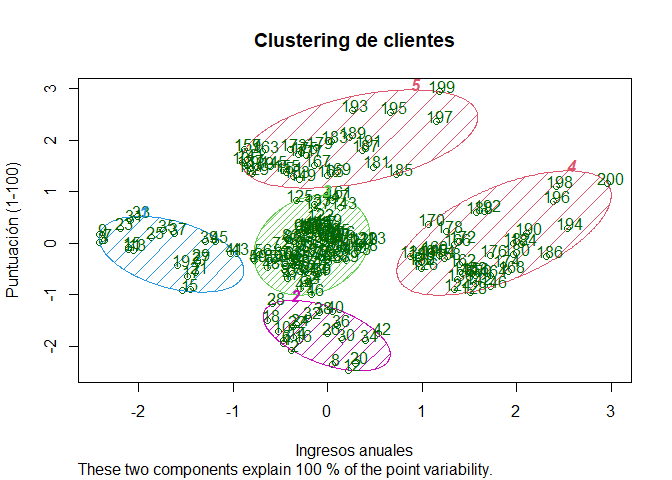
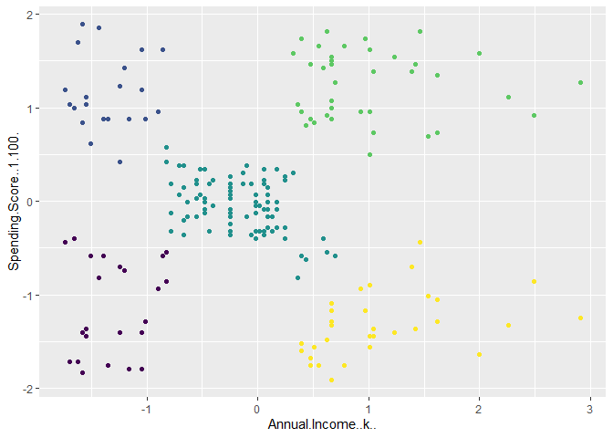
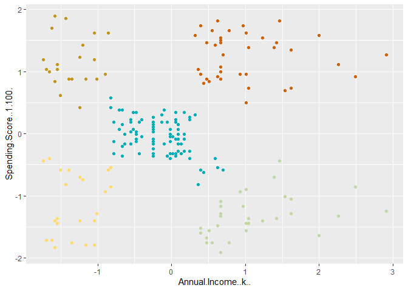
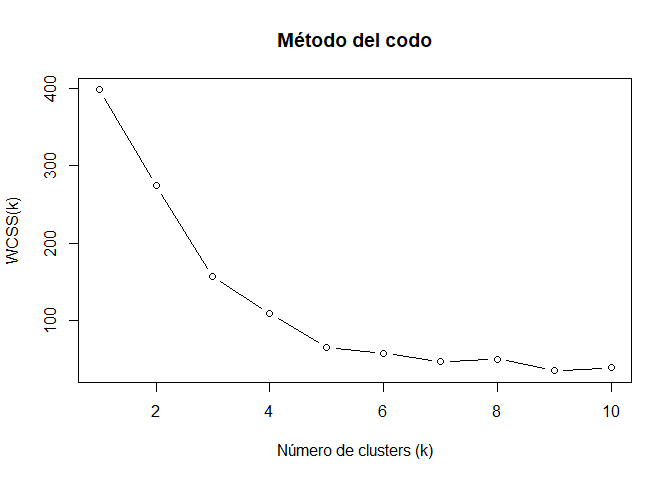
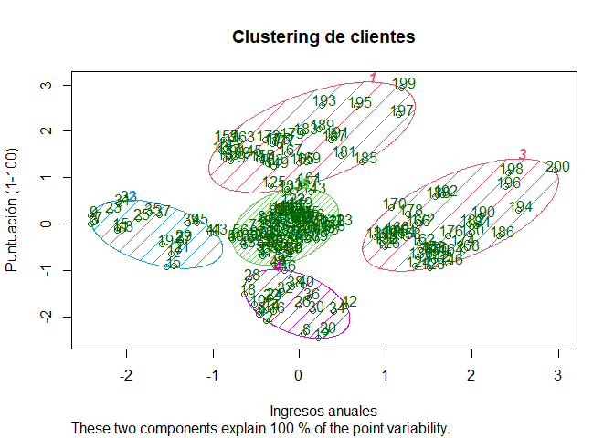
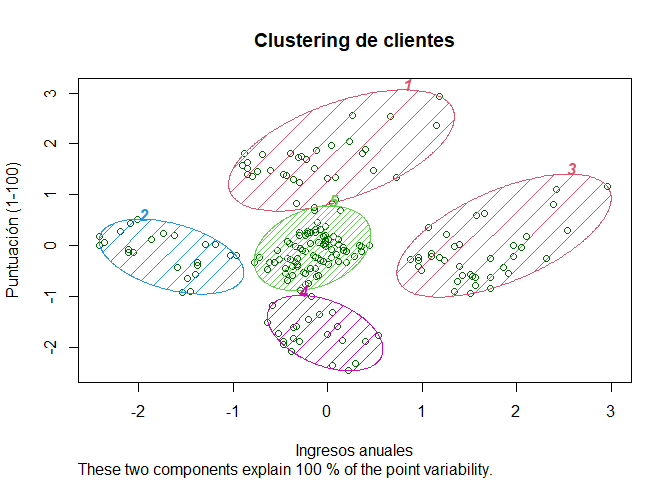
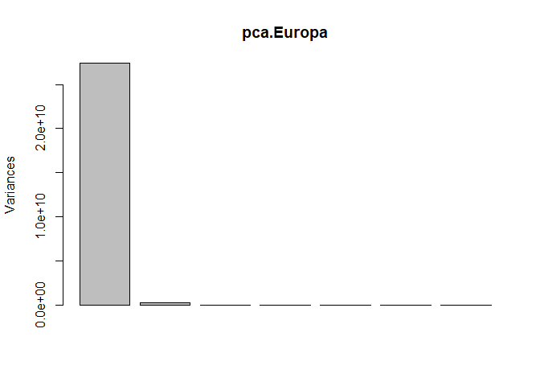
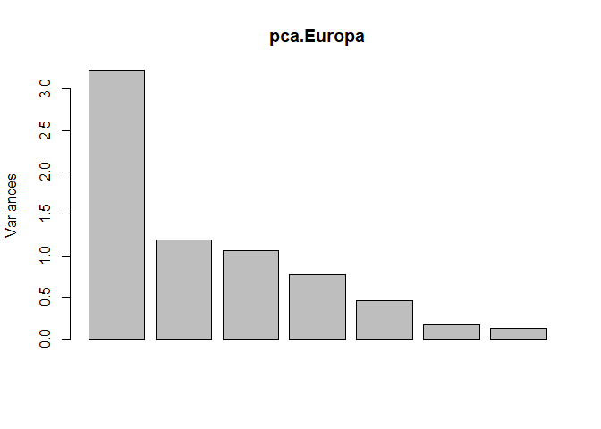
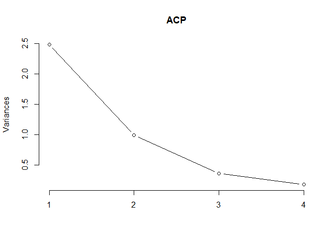

Analisis multivariado
================

# 1. Análisis de agrupamiento o cluster analysis

## A. Metodos Jerárquicos:

Para este ejemplo, descargaremos la siguiente base de datos:

``` r
Clientes <- read.csv("https://raw.githubusercontent.com/luiqs/machinelearning-az/master/datasets/Part%204%20-%20Clustering/Section%2025%20-%20Hierarchical%20Clustering/Mall_Customers.csv")
```

Es una base de datos simples, en donde tenemos:

-   CustomerID: Un código de identificación de cada cliente
-   Genre: Genero del cliente
-   Age: Edad del cliente
-   Annual.Income..k..: Ingresos económicos del cliente (miles de soles
    al año)
-   Spending.Score..1.100.: Indice que evalúa que tan buen consumidor de
    la tienda es el cliente. Tiene un rango de 1 a 100, donde mas
    cercano al 100, lo hace un mejor cliente de la tienda.

Para este ejercicio, solo vamos a utilizar las dos ultimas variables,
las seleccionamos. De igual manera, y no menos importante, tenemos que
estandarizar nuestros datos, esto lo lograremos con la funcion scale(),
que tambien puede ser aplicada directamente con dplyr y los pipe
**%&gt;%**:

``` r
library(tidyverse)
```

    ## -- Attaching packages --------------------------------------- tidyverse 1.3.0 --

    ## v ggplot2 3.3.5     v purrr   0.3.4
    ## v tibble  3.1.2     v dplyr   1.0.7
    ## v tidyr   1.1.3     v stringr 1.4.0
    ## v readr   1.3.1     v forcats 0.5.0

    ## -- Conflicts ------------------------------------------ tidyverse_conflicts() --
    ## x dplyr::filter() masks stats::filter()
    ## x dplyr::lag()    masks stats::lag()

``` r
Clientes.Agrupamiento <- Clientes %>% select(Annual.Income..k.., Spending.Score..1.100.) %>% scale() %>% as.data.frame() 
```

Como alternativa, tambien podria utilizar la función normalize() del
paquete **BBmisc** para normalizar los datos (estandarizarlos).

Vamos ahora a utilizar un dendograma, para encontrar el número óptimo de
clusters. Para crear un agrupamiento con el método jerárquico de
agrupamiento, utilizamos la función **hclust()** del paquete básico de
estadística de R. Así creamos nuestro modelo (donde tenemos que definir
también que distancia usaremos y la base de datos a evaluar):

``` r
dendrogram <- hclust(dist(Clientes.Agrupamiento, method = "euclidean"), 
                    method = "ward.D")
```

Para saber

Para visualizarlo con la gramática ggplot2, necesitaremos instalar un
paquete especial:

``` r
library(ggdendro)
```

Visualizamos el dendograma, utilizando la función **ggdendrogram()**:

``` r
ggdendrogram(dendrogram)
```

<!-- -->
De la figura podemos analizar que podemos quizá obtener 3 grupos o 5
grupos dependiendo donde queramos cortar las ramas. Vamos por 5. Para
cortar el árbol, utilizaremos la función **cutree()**

``` r
Corte.Arbol.Clientes <- cutree(dendrogram, k=5)
```

Observemos en que consiste este corte:

``` r
Corte.Arbol.Clientes
```

    ##   [1] 1 2 1 2 1 2 1 2 1 2 1 2 1 2 1 2 1 2 1 2 1 2 1 2 1 2 1 2 1 2 1 2 1 2 1 2 1
    ##  [38] 2 1 2 1 2 1 3 1 3 3 3 3 3 3 3 3 3 3 3 3 3 3 3 3 3 3 3 3 3 3 3 3 3 3 3 3 3
    ##  [75] 3 3 3 3 3 3 3 3 3 3 3 3 3 3 3 3 3 3 3 3 3 3 3 3 3 3 3 3 3 3 3 3 3 3 3 3 3
    ## [112] 3 3 3 3 3 3 3 3 3 3 3 3 4 3 4 3 4 5 4 5 4 3 4 5 4 5 4 5 4 5 4 3 4 5 4 3 4
    ## [149] 5 4 5 4 5 4 5 4 5 4 5 4 3 4 5 4 5 4 5 4 5 4 5 4 5 4 5 4 5 4 5 4 5 4 5 4 5
    ## [186] 4 5 4 5 4 5 4 5 4 5 4 5 4 5 4

Ahora vamos a visualizar los agrupamientos. Para ello, utilizaremos otro
paquete **“cluster”** y específicamente la función **clusplot()**.

``` r
library(cluster)

clusplot(Clientes.Agrupamiento, 
         Corte.Arbol.Clientes,
         lines = 0,
         shade = TRUE,
         color = TRUE,
         labels = 2,
         plotchar = FALSE,
         span = TRUE,
         main = "Clustering de clientes",
         xlab = "Ingresos anuales",
         ylab = "Puntuación (1-100)"
)
```

<!-- -->

``` r
Corte <- as.factor(Corte.Arbol.Clientes)

Clientes.Agrupamiento %>% ggplot(aes(x=Annual.Income..k.., y= Spending.Score..1.100.))+
  geom_point(aes(color=Corte))+
  scale_color_viridis_d()+
  theme(legend.position = "none")
```

<!-- -->

También puede colocar los colore de manera manual:

``` r
Clientes.Agrupamiento %>% ggplot(aes(x=Annual.Income..k.., y= Spending.Score..1.100.))+
  geom_point(aes(color=Corte))+
  scale_color_manual(values = c("#FFDB6D", "#C4961A", "#00AFBB", 
                       "#D16103", "#C3D7A4"))+
  theme(legend.position = "none")
```

<!-- -->

## B. Metodos NO Jerárquicos: *K*-medias o *k*-means

Vamos a utilizar la misma base de datos “Clientes.Agrupamiento”.

Para utilizar el método “k-means”, necesitamos establecer el numero de
“clusters” iniciales. En el caso de los métodos jerárquicos, utilizamos
el dendograma como punto de ayuda, en este caso utilizaremos el método
del codo, el cual nos permitirá determinar el valor de K:

``` r
set.seed(1)
wcss = vector()
for (i in 1:10){
  wcss[i] <- sum(kmeans(Clientes.Agrupamiento, i)$withinss)
}
plot(1:10, wcss, type = 'b', main = "Método del codo",
     xlab = "Número de clusters (k)", ylab = "WCSS(k)")
```

<!-- -->

En el gráfico generado, tenemos que concentrarnos en determinar el valor
de K donde se visualiza el cambio de tendencia. Este se encuentra entre
5 y 6. Escogeremos 5, ya que el cambio de tendencia no es tan abrupto de
5 a 6 (como en los casos anteriores).

Una vez tenemos el valor de **k**, podemos realizar la prueba de
**k-means**. El algoritmo de k-means empieza con la selección aleatoria
de los baricentros. Para estandarizar nuestros resultados, utilizaremos
un **set.seed(29)**. De esta manera, utilizaremos la función
**kmeans()** para crear nuestro modelo:

``` r
set.seed(29)
kmeans <- kmeans(Clientes.Agrupamiento, 5, iter.max = 300, nstart = 10)
```

Una vez creado nuestro modelo, podemos visualizarlo con la ayuda del
paquete cluster y la función **clustplot()**:

``` r
library(cluster)
clusplot(Clientes.Agrupamiento, 
         kmeans$cluster,
         lines = 0,
         shade = TRUE,
         color = TRUE,
         labels = 2,
         plotchar = FALSE,
         span = TRUE,
         main = "Clustering de clientes",
         xlab = "Ingresos anuales",
         ylab = "Puntuación (1-100)"
         )
```

<!-- -->

Si queremos eliminar los nombres de los clusters:

``` r
clusplot(Clientes.Agrupamiento, 
         kmeans$cluster,
         lines = 0,
         shade = TRUE,
         color = TRUE,
         labels = 4,
         plotchar = FALSE,
         span = TRUE,
         main = "Clustering de clientes",
         xlab = "Ingresos anuales",
         ylab = "Puntuación (1-100)"
         )
```

<!-- -->

# 2. Análisis de componente principales o principal component analysis (PCA)

Una pagina muy interesantes para visualizar el poder de esta técnica la
pueden encontrar en el siguiente link:
<https://setosa.io/ev/principal-component-analysis/>.

## Ejemplo 1: PCA datos económicos de Europa, el efecto de estandarización.

``` r
Europa=read.csv("http://www.instantr.com/wp-content/uploads/2013/01/europe.csv", header=TRUE)
```

Eliminaremos la variable de tipo cualitativa, ya que no podemos
utilizarla en PCA:

``` r
Europa <- Europa %>% select(-Country)
```

A continuación utilizaremos la función **prcomp()** para obtener los
componentes principales:

``` r
pca.Europa <- prcomp(Europa,scale=FALSE)
summary(pca.Europa)
```

    ## Importance of components:
    ##                              PC1       PC2   PC3   PC4    PC5    PC6    PC7
    ## Standard deviation     1.656e+05 1.436e+04 4.017 2.317 0.8816 0.7474 0.2411
    ## Proportion of Variance 9.925e-01 7.470e-03 0.000 0.000 0.0000 0.0000 0.0000
    ## Cumulative Proportion  9.925e-01 1.000e+00 1.000 1.000 1.0000 1.0000 1.0000

Si dibujamos rápidamente las varianzas para una mejor visualización, con
la función **plot()**:

``` r
plot(pca.Europa)
```

<!-- -->

Observaremos que la variabilidad es capturada casi en su totalidad por
una sola de las variables. Esto debido a que no estandarizamos los datos
y se encuentran en diferentes unidades métricas (metros cuadrados y
porcentajes). Hay entones, siempre observar los datos y si ocurre esto,
estandarizarlos. Esto lo haremos solo con colocar TRUE en el argumento
de scale= :

``` r
pca.Europa <- prcomp(Europa,scale=TRUE)
summary(pca.Europa)
```

    ## Importance of components:
    ##                          PC1    PC2    PC3    PC4     PC5    PC6     PC7
    ## Standard deviation     1.796 1.0896 1.0311 0.8777 0.67665 0.4107 0.35446
    ## Proportion of Variance 0.461 0.1696 0.1519 0.1100 0.06541 0.0241 0.01795
    ## Cumulative Proportion  0.461 0.6306 0.7825 0.8925 0.95795 0.9820 1.00000

``` r
plot(pca.Europa)
```

<!-- -->

## Ejemplo 2: Arrestos USA

``` r
Arrestos <- read.csv("https://raw.githubusercontent.com/luiqs/r-course/master/data/tema3/USArrests.csv")
```

Vamos a trabajar con una base de datos de criminalidad de los 50 estados
de estados unidos. Debemos eliminar la primera variable, ya que se trata
de una variable de tipo cualitativo. Sin embargo esta vez, para no
perder el dato del estados, podemos eliminar la variable y colocar el
nombre de los estados en los nombres de las filas. Esto de la siguiente
manera:

``` r
rownames(Arrestos) <- Arrestos$X
```

Siendo la variable X, el estado que se esta analizando. Si visualizamos
ahora la base de datos “Arrestos” veremos que el nombre de las filas ha
cambiado de números a los nombres. Ahora eliminaremos de la base de
datos de análisis a la variable X (los estados):

``` r
Arrestos.Cuanti <- Arrestos %>% select(-X)
```

Podemos hacer una evaluación de la variabilidad de los datos:

``` r
Arrestos.Cuanti %>% summarise(SD.Asesinatos = sd(Murder),
                               SD.Asaltaos = sd(Assault),
                               SD.Poblacion = sd(UrbanPop),
                               SD.Violacion = sd(Rape))
```

    ##   SD.Asesinatos SD.Asaltaos SD.Poblacion SD.Violacion
    ## 1       4.35551    83.33766     14.47476     9.366385

Podemos observar que la variable que contiene la mayor variabilidad, es
el numero de asaltos (es decir que el número de asaltos es la variable
que mas varia entre estados).

Si evaluamos los datos, podemos ver que si bien se encuentran dentro de
una misma unidad de medidas (numero de …), las diferencias son grandes
entre las variables. Siendo el número de asaltos muy diferente a las
otras variables. En dicho sentido, esto puede influir mucho en el
resultado final del PCA. Si bien, no son medidas diferentes, es
preferible estandarizar todas las medidas. Con eso en mente, creamos
nuestro modelos PCA o ACP (análisis de componentes principales)

``` r
ACP <- prcomp(Arrestos.Cuanti, center = T, scale = T)
```

En este caso, estamos centrando todas las variables (center=T) y
estandarizandolas (scale=T). Podemos ver el resultado del modelo,
llamándolo:

``` r
ACP
```

    ## Standard deviations (1, .., p=4):
    ## [1] 1.5748783 0.9948694 0.5971291 0.4164494
    ## 
    ## Rotation (n x k) = (4 x 4):
    ##                 PC1        PC2        PC3         PC4
    ## Murder   -0.5358995  0.4181809 -0.3412327  0.64922780
    ## Assault  -0.5831836  0.1879856 -0.2681484 -0.74340748
    ## UrbanPop -0.2781909 -0.8728062 -0.3780158  0.13387773
    ## Rape     -0.5434321 -0.1673186  0.8177779  0.08902432

Para tratar de entender un poco mejor estos resultados, podemos gráficar
los resultados de la siguiente manera:

``` r
plot(ACP, type = "l")
```

<!-- -->

Vemos las varianzas de los 4 componentes principales. Aquí podemos
decidir que componentes principales son significativas (en relación a la
variabilidad). No hay una regla para elegir, pero podemos utilizar la
técnica del codo (utilizada anteriormente para los métodos de
agrupamiento). En este sentido, nos quedaríamos solo con PC1 y PC2.

Si queremos visualizar los resultados del modelo ACP de otra manera,
también podemos usar:

``` r
summary(ACP)
```

    ## Importance of components:
    ##                           PC1    PC2     PC3     PC4
    ## Standard deviation     1.5749 0.9949 0.59713 0.41645
    ## Proportion of Variance 0.6201 0.2474 0.08914 0.04336
    ## Cumulative Proportion  0.6201 0.8675 0.95664 1.00000

Si lo queremos ver de la manera mas “sencilla” posible, es preciso
realizar el típico diagrama de PCA. Para ello, vamos a usar la función
**biplot()**

``` r
biplot(ACP, scale = 0)
```

<!-- -->
