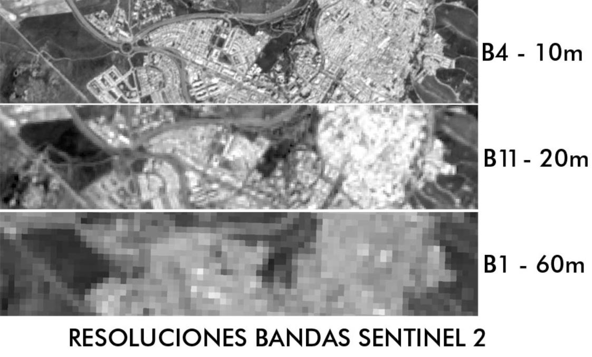

GIS 1 Fundamentos de la Teledetección
================

# Introducción

La tele detección es una técnica que permite obtener datos sobre un
objeto sin un contacto directo. Tiene como objetivos la captura,
tratamiento y análisis (visual y digital) de imágenes digitales tomadas
desde satélites. Para generar estas imagines, nos basamos en sensores.
Estos, son instrumentos sensibles en la detección de señal
electromagnética (principalmente aquella proveniente del sol y reflejada
por los cuerpos en la tierra, como por ejemplo la radiación emitida) que
llega a la Tierra y lo convierte en imagen física (Fotos aéreas -&gt;
Landsat 1 a 8 -&gt; Spot 1 a 7 -&gt; Pleiades -&gt; Sentinel 1,2 y 3.

Gracias al avance de la ciencia y tecnología obtenemos lo que serian
sistemas de tele detección espacial, es cual se un conjunto de elementos
interactivos con la finalidad de generar datos (información).

# Los datos

El espectro electromagnético tiene diferentes longitudes de onda. En el
tramo donde la energía va desde la superficie terrestre hacia el sensor
es la información que se toma para producir la imagen. En el campo
electromagnético, la luz visible es aquella utilizada principalmente
para generar los datos, aunque también existen sensores infrarrojos.

Es complejo medir la reflectancia, es decir la energía reflejada con
respecto a la energía incidente, ya que la radiación no es uniforme. Lo
que se hace es medir la reflectancia mediante una proporción la cual es
expresada por la energía reflejada entre la energía incidente.

### Firmas espectrales

Adicionalmente, es importante conocer sobre las **firmas espectrales.**
Estas son una forma particular de emitir energía de un determinado
objeto o cobertura. Las firmas son afectadas por el tipo de objeto y sus
caracteristicas físicas o quimicas, las cuales interactuan con la
energía electromagnetica de forma variada (segun las longitudes de
onda).

Para la vegetación (el espectro verde) se ve casi un 50% de reflejo por
longitudes de onda cercanas al infrarojo cercano. Las firmas espectrales
van a variar dependiendo la situación geográfica de la vegetación. La
vegetación por ejemplo, puede ser afectado tanto por la altura solar,
condiciones atmosfericas, sombra, pendiente, fenologia (enfermedad) y
sustrato (ambiente).

# La imagen

Las imagenes se contruyen a partir de los impulsos electricos generados
en el sensor cuando el flujo de energia llegan a el mismo. Los sensores
optico electronicos miden la reflectividad y emisión de la cubierta
terrestre. Esto produce datos continuos los cuales son traducidos en
dominios visible y no visible.

### La Matriz de datos: noción de pixel

La imagen se compone de puntos de intensidad luminosa. Cada punto
descrito por 2 coordenadas, relacionadas con la ubicación de un punto.
Los valores que adoptan los pixeles se denominan niveles digitales
(digital numbre (ND), pixel value, brigthness value, grey leve, digital
count), los cuales corresponden al flujo emitido o reflejado de la
superficie observada.

### La Matriz de datos: el concepto de Imágen

Los niveles digitales corresponden a valores radiometricos
(reflectancia). Un mismo pixel puede ser tomado por diferentes sensores
a diferentes longitudes de onda, tal como muestra la figura.

### Resolución Espacial

Es concepto nos indica que cada pixel debe tener un tamaño. Los
distintos sensores tendran tamaños distintos de pixeles, es decir
distinta resolución. A los pixeles de menor tamaño se les conoce como
pixeles de alta resolución espacial, caso contrario tienen una baja
resolución.

### Resolución y escala

Cuanto menor sea la resolución espacial de las imagenes satelitales, mas
macroscopica se reflejará el contenido espacial y menor será la escala
de mapeo correspondiente; cuanto mayor sea la resolución espacial, más
reflexivo será el contenido espacial (Li Li et al., 2011).

**La resolución espacial** es la medida de la mas pequeña separación
angular o lineal entre dos objetos que puede captar el sensor. La
superficie de la tierra representa un pixel. **La resolución temporal**
da a entender cada cuanto tiempo un sensor obtiene una imagen de una
area particular. **La resolución espectral** el tamaño y número de
intervalos de longitud de onda especifico del espectro EM que un sensor
puede deterctar. Por utlimo, **la resolución radiométrica** define la
sensibilidad de un deterctor a las diferencias de fuerza de la señal
registrada.

# Las plataformas

### Landsat

Desde la decada de los 70s. Nacio como un programa conjunto de la NASA
con la USGS en el año 1972 hasta la actualidad. Hoy toman imagenes de
toda la superficie de la Tierra con una resolución de 30 metros
aproximadamente una vez cada dos semanas (datos multiespectrales y
termicos).

### Sentinel

Es una concentración de satelites de la unión europea. El programa
copérnico es una iniciativa por la Comisión Europea en asociación con la
Agencia Espacial Europea (ESA). Los Sentinel incluyen imagenes de radar
para todo clima de Sentinel-1A y 1B, imagenes opticas de alta resolución
de Sentinel 2A y 2B, asi como datos oceanicos y terrestres adecuados
para el monitoreo ambiental y climático de Sentinel.

### Spot

Son satelites franceses y han sido utilizados por el Perú en la
construcción del mosaico de 680 imagenes satelitales SPOT de alta
resolución y PERUSAT, asi como las capacidades de procesamiento de la
supercomputadora con la que cuenta el Instituto de Investigaciones de la
Amazonia peruana (IIAP).

En el Perú, se ha facilitado el mosaico (SPOT 6) en tiempo corto y con
alta calidad, pues han sido captadas con una resolución espacial de
hasta 1.5 metros. Las personas podrán acceder a la información de manera
libre a través del GeoServidor del MINAM y permitirá trabajar en
plataformas interoperables (MINAM, Agencia espacial del Perú CONIDA,
IIAP).

### Rapideye

Estos satelites y sensores son alemanes. Las imagenes del satelite
RapidEye y Ortho Nivel 3A, de los años 2011 y 2012, han sido donadas por
el Japón al gobierno peruano para ser utilizadas en el reordenamiento
del territorio. Es una caracteristica de estas imagenes que pertenecen a
una resolución espacial de 5 metros, estan corregidas radiométricamente
a nivel de sensor, asi como geometricamente, referenciadas al sistema de
WGS 84 y compuestas por 5 bandas.

### PERUSAT-1

El 24 de Abril del 2014 se suscribio un contrato con la empresa francesa
Airbus Defence and Space para la adquisición del primer Satelite de
Observación Peruano denominado PeruSAT-1. Sin embargo, este satelite no
cuenta con mucha resolución espectral, solo cuenta con 4 bandas del
espectro electromagnetico. Se utilizan para la gestión de riesgos y para
la gestión de mapas tematicos de vegetación forestal y de ecosistemas.

### Modis

Administrada por la NASA pero son sensores de baja resolución. Utiles
para estudios a nivel regional, nacional o global cuenta con una buena
cantidad y calidad del imagenes. La ventaja de estas imagenes es el
calculo de indices de vegetación y de la cubierta terrestre, asi como un
buen monitoreo de las aguas continentales.

# Tipos de sensores

### Pasivos

Son la mayoria y solo reciben la luz solar reflejada para generar datos
de imagenes. Estos satelites dependen de una fuente de energía propia.

-   Aqua (MODIS)

-   Landsat - 8

-   PlanetScope (Dove)

-   Worldview - 4

-   Pleiades

-   Sentinel - 2

### Activos

-   Utilizan la captura activa de imagenes al transmitir su propia
    señal.

-   Sentinel - 1

-   RADARSAT - 2

-   ICEYE - X1

-   TanDEM - X

-   ALOS - 2

# Analisis

### Visualización

Basicamente responde al como podemos usar a la matriz de datos que han
sido tomados por los sensores y como se pueden representar. Existen dos
formas:

#### Expresión analógica

Es la imagen propiamente dicha. Para ello podemos aplicar dos tecnicas,
la interpretación visual y los tratamientos asistidos.

#### Expresión numérica

Son valores númericos integrados a cada uno de los pixeles. Podemos
utilizar analisis estadistico o trataimentos automaticos.

#### Metodo Mixto

Interpretración visual + analisis estadístico

### Visualización monocanal

Se pueden distinguir 4 metodos de visualización

1.  Niveles digitales medidos por el sensor

2.  Escala de grises

3.  Escala de colores

4.  Tabla de correspondencia

### Visualización multicanal

Los programas aplican en este caso la sintesis aditiva. Cada una de las
imagenes representa el espectro electromagnetico. Los programas inyectan
en cada una de las bandas un color del sistema RGB (red, green, blue).
Se inyecta a la escala de colores por cada uno de los colores y luego se
unen.

### Alternativa de usos de los datos

En la práctica existen muchos elementos y objetos a visualizar. Hay que
hacer un reconocimiento y capturarlos, almacenados, procesados y
comunicados.

Una de las tecnicas de procesamiento se conoce como la clasificación de
imagenes de satelite. Esta aplica, a partir de una imagen original
espectral, distintos algoritmos para obtener una imagen clasificada. A
partir de la imagen clasificada se pueden obtener mapas tematicos y
datos estadisticos. Cuando se habla de una imagen espectral original,
podemos decir que los valores que toma son continuos, mientras que una
imagne de clasificación son datos de tipo discreto (clases en rangos).

Introducción al QGIS

Quantum GIS o mas conocido como QGIS, es un programa libre de sistemas
de información geografica. Es un proyecto auspiciado por Open Source
Geospatial Foundation (OSGeo), institución sin fines de lucro que
fomenta la adopción global de la tecnología geoespacial abierta e
inclusiva con la participación de la comunidad. El software correo tanto
el Linux, Unix, Windows, Mac OSC y Android y soporta formatos y
funcionalidades de datos vector, raster, shape files, entre otros.

Al ser un proyecto abierto y impulsado por la comunidad voluntaria,
propociona una amplia gama de capacidades a través de funciones básicas
y complementeo (plug-in). Asi mismo, da soporte tecnico a aquellas
personas que trabajan con el programa. Tiene una base de datos de
documentación en Ingles y manuales de usuario en español.

Herramientas de teledetección

Calculo de estadisticas e histogramas

Filtros Correción de imagenes satelitales

Calculo de indices de vegetación y monitoreo de incendios

Detección de cambios Clasificación de imagenes de satélite

Segmentación de imágenes de satélite

Cambios en los usos del suelo de la cobertura terrestre

Simulación de cambios en la cobertura terrestres

Semi-Automatic Classification Plugin (SCP)

Es un plug-in (complemento) que corre en el programa QGIS y tiene como
objetivo el de proporcionar herramientas para la descarga de imagenes
satelitales que esten disponibles sin costo alguno y libre en la web
(realizar pre-procesamiento como procesamiento y la detección de
cambios).

Para la descarga de QGIS:
<https://qgis.org/es/site/forusers/download.html>

Google Earth Engine (GEE)

Es una plataforma en linea que junta en catalogos distintos tipos de
imagenes dispobibles de forma libre en la web (conjunto de datos
geoespaciales). En este motor podemos realizar multiples analisis, la
mayoria basados en procesos de teledetección debido a su poder de
procesamiento y analisis esta herramienta es muy conocida y utilizada a
nivel cientifico para detectar cambios, mapear tendencias y cuantificar
diferencias en la superficie de la tierra.

Se revisaran 3 modulos:

Modulo Collections

Modulo Explorer

Modulo Code

El modulo Explorer es una interfaz web en la cual se encuentran
catalogados datos publicos y permite a cualquier persona visualizarlo.
Para ellos, debemos crear una cuenta activa en google earth engine
(cuena de correo en gmail). Una vez registrados, podemos acceder,
importar datos, realizar analisis simples, guardar y exportar
resutlados.

En el modulo Code (basado en API de JavaScript, pero también podemos
utilizar Python) también se necesita una cuenta activa. Si tenemos
problemas con los codigos, podemos utilizar algunos ya publicados en la
web y adaptarlos a nuestras necesidades.

SentiNel Application Plataform (SNAP)

Es un desarrollo de la agencia espacial europea, desarrolada para el
procesamiento de Copernico. Consiste en 3 paquetes de herramienta para
el procesamiento de los 3 tipos de sentinel (1, 2 y 3). El sentinel-1 es
el primero de todos, son imagenes de rada; el sentinel-2, son imagenes
opticas y sentinel-3 que brindan imagenes que ayudan a la gestión del
clima y la polución. La configuración del programa es sencilla y
amigable.
