Recopilación de datos Satélitales
================

# 1. Parte Teórica

## 1.1 Descargando imágenes Landsat

-   Landsat 1 - 3: 1972 - 1999

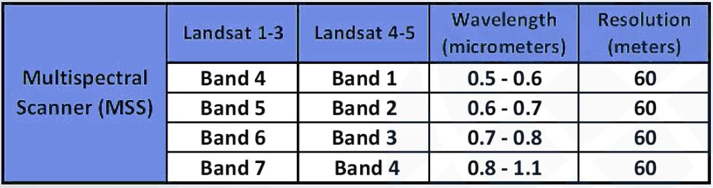

-   Landsat 4: 1982 - 1993

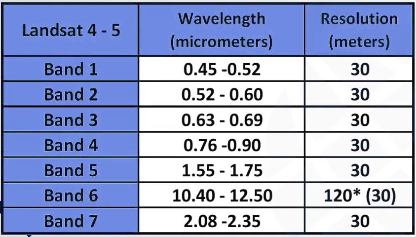

-   Landsat 5: 1984 - 2002

-   Landsat 7: 1999 - presente (con errores el 2001)

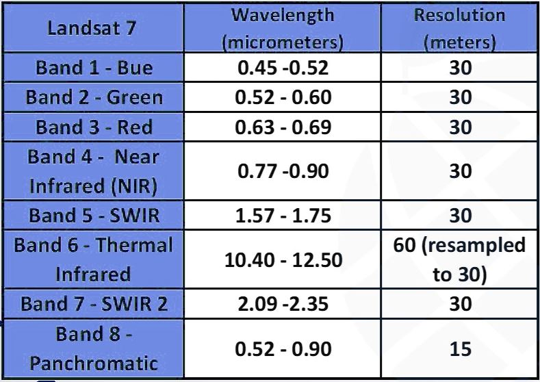

-   Landsat 8: 2013 - presente

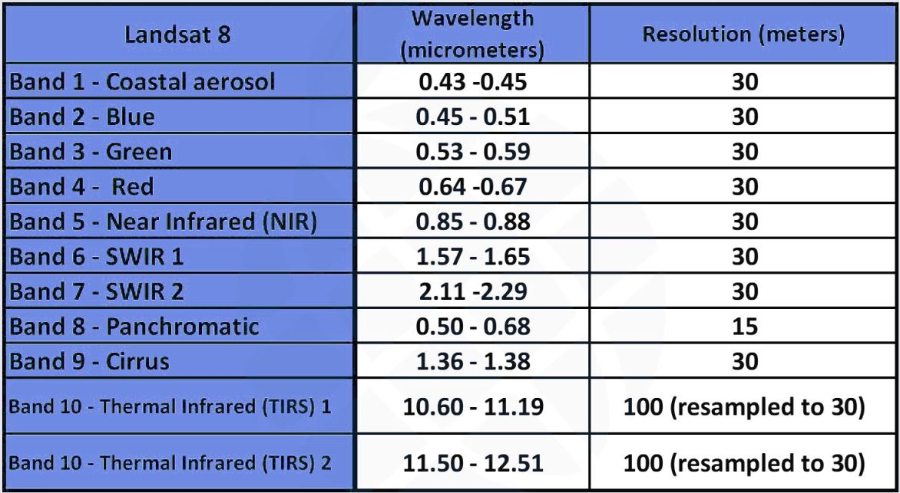

En la actualidad, **Earth Explorer** (EE) proporciona búsqueda en linea,
visualización de exploración de metadatos y descarga de datos de
ciencias de la tierra de los archivos del Servicio Geológico de EE.UU
(USGS).

En la actualidad Earth Explorer ofrece una tecnología mejorada como por
ejemplo para conectarse con GEE y optimizar el uso de las imágenes. Esto
se logra evitando la descarga de las imágenes y la saturación de los
discos de las computadoras (optimiza el procesamiento de las imágenes a
realizarse por código en la nube).

La recopilación de imágenes Landsat por el plug-in de QGIS, SCP, permite
buscar y descargar todo archivo de imágenes del satélite Landsat (desde
1MSS a 8 OLI), adquiridas desde los 80s hasta el presente. Las búsqueda
se realiza mediante el CMR Search API desarrollada por la NASA.

Como se indico, los datos Landsat también se encuentran en el motor de
GEE en su forma **cruda**, tales como reflectancia de superficie,
reflectancia corregida por TOA y en varios productos computadas listos
para usar como indices de vegetación NDVI y EVI. Muchos de los otros
datos tienen que extraerse por código (Java o Python), sin embargo, ya
existen códigos estandarizados para ello (no partimos de 0).

<https://landsat.gsfc.nasa.gov/data>

<https://landsatlook.usgs.gov/explore>

## 1.2 Descargando imágenes Sentinel

Tiene 4 misiones:

-   Sentinel - 1 SAR GRD: Radar de apertura sintética de banda C

-   Sentinel - 2 MSI: Instrumento multiespectral

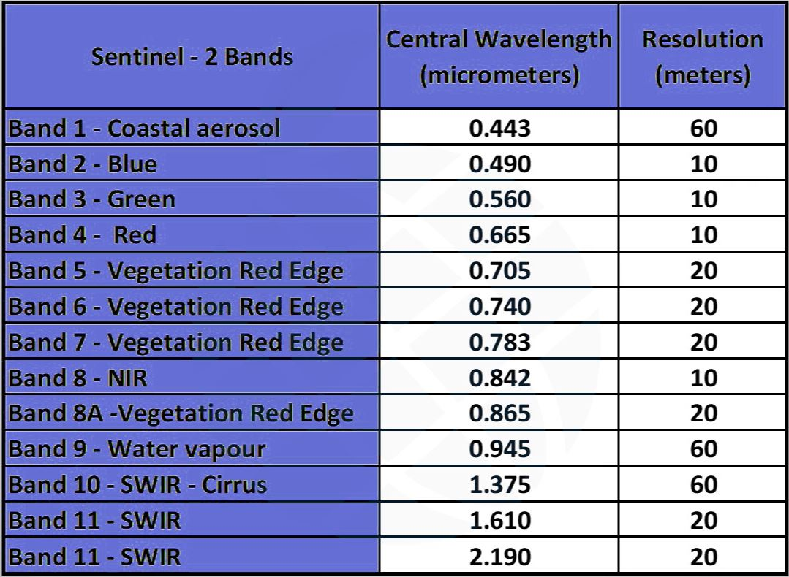

-   Sentinel - 3 OLCI EFR: Instrumento de color de océano y tierra

-   Sentinel - 5P TROPOMI: Instrumento de Monitoreo Troposférico

Sentinel tiene su plataforma **Copernicus Open Access Hub**
(anteriormente conocido como Sentinels Scientific Data Hub), la cual
proporciona acceso completo y gratuito a los productos Sentinel - 1,
Sentinel - 2, Sentinel - 3 y Sentinel - 5P a partir de la Revisión de
puesta en servicio en órbita (IOCR).

<https://creodias.eu/data-offer>

<https://scihub.copernicus.eu/dhus/#/home>

Desde el QGIS, podemos utilizar nuevamente el complemento SCP para
acceder a las imágenes de Sentinel - 2 (nivel 1C) desde Sentinels
Scientific Data Hub (usando el Data Hub API). Las imágenes son
descargadas principalmente de Amazon S3 AWS si están disponibles.

También podemos hacer uso de el motor GEE para descargar imágenes
Sentinel disponibles. El satélite Sentinel - 2 tiene un ancho de barrido
de 290 km. Las imágenes Sentinel - 2 Level 1C son distribuidas en
mosaicos de 100Km de lado en la proyección UTM/WGS84.

-   Sentinel 2 - Nivel 2A: Nos brinda imágenes corregidas a reflectancia
    en la superficie terrestre.

-   Sentinel 2 - Nivel 1C: Nos brinda imágenes corregidas a reflectancia
    a nivel del techo de la atmósfera.

## 1.3 SAS Planet

Es un programa gratuito el cual nos permite descargar imágenes de
satélite de alta resolución y mapas convencionales proporcionados por
servicios como Google Earth, Google Maps, Bing, Maps, DigitalGlobe,
Yahoo! Mapas, VirtualEarth, Gurtam, OpenstreetMap, entre otros.

La ventaja de este software es que permite descargar las imágenes ya
georeferenciadas. Ademas, las imágenes descargadas permanecen en
nuestras computadoras. Una desventaja es que las imágenes descargadas
**no contienen** datos espectrales. Solo proveen fotografías del planeta
tierra a una alta y muy alta resolución (mas no resolución radiometrica
o espectral).

Link:
<https://mappinggis.com/2014/09/como-descargar-imagenes-de-google-bing-etc/>

# 2. Parte Práctica

## 2.1 Recopilación de datos Landsat Earth Explorer

Para esta práctica iremos al la pagina web de la USGS:
<https://earthexplorer.usgs.gov/>. En la parte de arriba derecha,
daremos a login para luego crear una nueva cuenta (a menos que ya la
tengan creada previamente). Una vez terminado el proceso de registro,
entraremos nuevamente a la pagina inicial (ahora si logeados) para
explorar su interfaz.

Por ejemplo, en el menú de capas (encerrado en circulo rojo) podremos
cambiar el tipo de capa a visualizar:

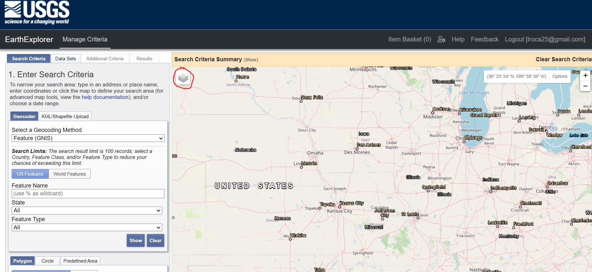

En la segunda pestaña de la parte izquierda, podemos ver **Data Sets**
los cuales son datos ya disponibles trabajados con diferentes
características y diferentes fuentes satélitales y procesamientos.

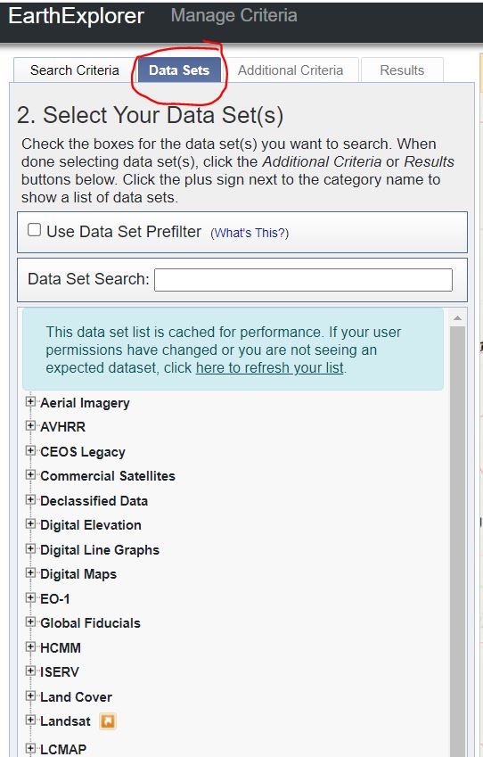

En este caso particular, si es que vamos a trabajar con imágenes
Landsat, podríamos descargar específicamente la base de datos que se
visualiza en la siguiente imagen:

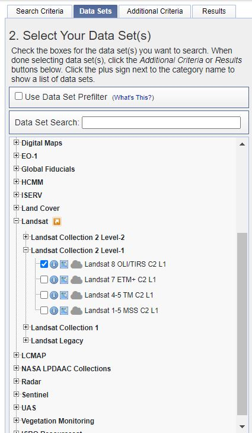

Una vez seleccionado, la pestaña **Additional Criteria** se activará, en
donde podremos seleccionar el detalle de la información que queramos
descargar de acuerdo a la disponibilidad y características de los
seleccionado.

Regresamos ahora a la primera pestaña. En esta pestaña podemos ubicar
específicamente la sección y área que queramos descargar. Con la
herramienta de polígono podemos definir un área especifica. En la figura
se observa que hemos delimitado la zona aproximada al valle del río
Rimac. Luego de especificar, le damos click a resultados (Results).

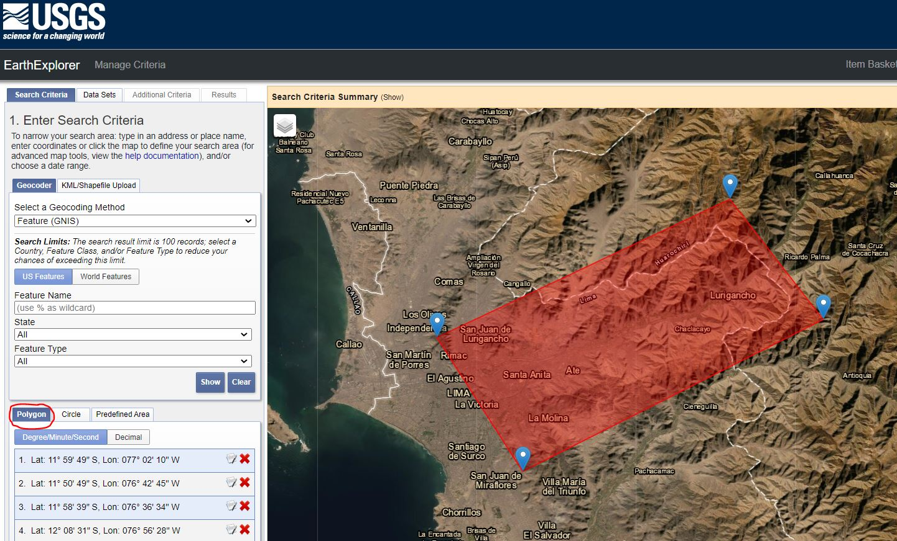

Luego del procesamiento y búsqueda, nos brinda los resultados:

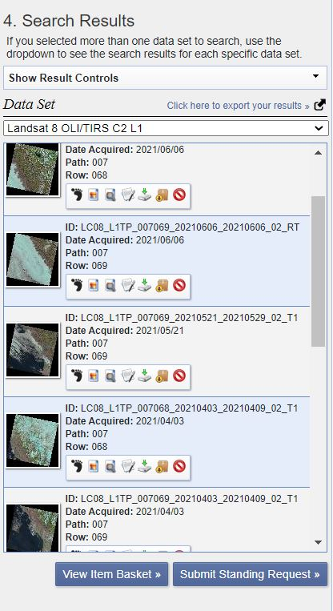

Si le damos click a cualquier de ellas, podemos ver una vista preliminar
y algunos datos técnicos de la imagen. Una vez identificada la mejor
imagen, podemos iniciar su descarga. Cuando demos click al botón de
descarga se nos brindaran diferentes opciones en relación a las
diferentes bandas disponibles como se observa en la siguiente figura:

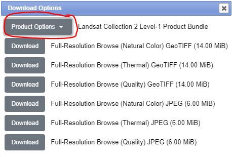

Generalmente se descargan todas las bandas, aunque normalmente tienen un
peso muy grande.

## 2.2 Recopilación de datos Landsat a través del complemento SCP de QGIS

Obtendremos imágenes Landsat desde QGIS utilizando el complemento SCP
(Semi-Automatic Classification) previamente instalado. Vamos a darle
click al icono principal de SCP y nos aparecerá la ventana principal.

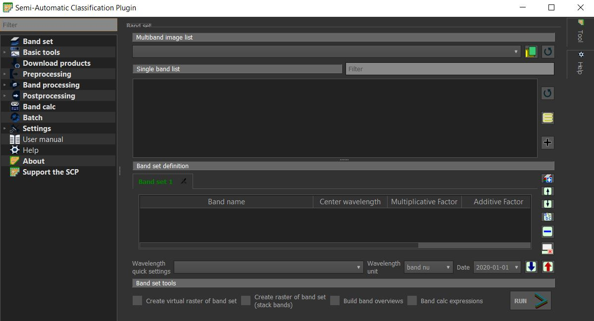

En la opción de descargar imágenes, podremos colocar tanto las
coordenadas (si no las conocemos, podemos usar el mismo OpenStreetMap de
QGIS para definir el área), así las fechas, porcentaje de nubosidad
mínima y máxima, el tipo de producto, entre otras características. Una
vez definida las características darle click al botón de buscar para
desplegar los resultados. Obtendremos algo parecido a la siguiente
imagen:

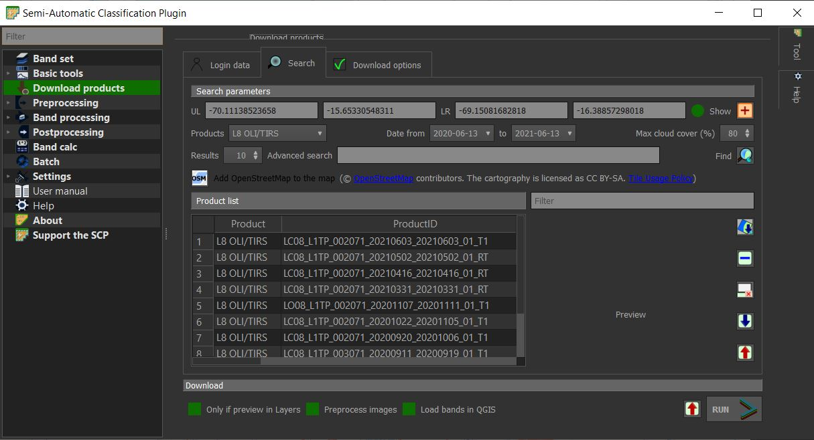

Una vez nos decidimos por alguna de las imágenes, la seleccionamos y
vamos a la pestaña de descarga. En esta ventana (tal cual muestra la
siguiente figura) se muestra la lista de bandas a descargar y los
satélites disponibles.

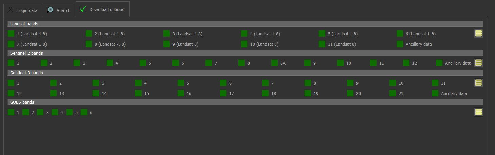

**Nota**: Debemos de desactivar la opción **“Only if preview in Layer”**

## 2.3 Recopilación de datos Landsat usando GEE

Ya que hemos previamente creado o ligado nuestro correo gmail, entramos
y nos logeamos al servidor de GEE. Link:
<https://explorer.earthengine.google.com/#workspace>.

Si queremos, podemos ingresar a los datos de catalogo (bases de datos ya
procesadas) mediante la opción DataCatalog. Podemos seleccionar
cualquiera de las opciones disponibles.

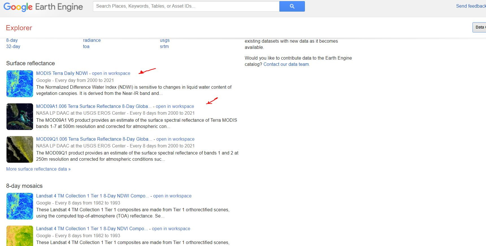

Vamos a buscar Landsat8 y le damos click a **“open in workspace”**, lo
cual nos llevara a la pagina principal y cargará los datos
automáticamente. A partir de allí, podemos modificar ciertos atributos
para luego descargar las imágenes buscadas (hay que elegir el área
previamente).

## 2.4 Recopilación de datos mediante GEE - Code / Sentinel

Para esta parte vamos a copiar códigos ya dentro del repositorio de GEE
y los vamos luego a modificar. La ventaja es que estos código ya se
encuentran creados para un fin especifico (buscamos las imágenes o
objetivos que tengan similitud con lo que queramos buscar en las
imágenes satélitales).

En la pagina oficial: <https://earthengine.google.com/> Podemos
encontrar varios módulos, abrimos por un lado el modulo **“Convenient
Tools”** y en otra pestaña el modulo **“Ready to use Datasets”**. En
esta ultima opción podemos buscar aquella opción referente a los
satélites Sentinel
(<https://developers.google.com/earth-engine/datasets/catalog/sentinel>).
Dentro de esta pagina, ingresamos Sentinel-2
(<https://developers.google.com/earth-engine/datasets/catalog/sentinel-2>).
En esta pagina se nos ofrece 2 productos distintos, elegimos el primero
(Surface Reflectance). Esta ultima pagina abierta nos brinda información
especifica acerca de este producto y la parte final el código Python
para reproducirlo. Es precisamente este código el que vamos a copiar y
pegar en el primer modulo GEE - Code que abrimos.

Una vez copiado el código, vamos a poder modificar parámetros como las
coordenadas, fechas, etc. Sin embargo la ventaja es que las imágenes ya
se encontrarían procesadas con el mismo objetivo de la pagina donde
copiamos el código. Para la descarga de estos datos, se necesitan código
adicional.

## 2.5 Recopilación de datos mediante la plataforma Copernicus Open Access Hub

Esta plataforma se ingresa a través del siguiente link:
<https://scihub.copernicus.eu/>. Para el uso de la plataforma, también
tendremos que crear un usuario y luego logearnos.

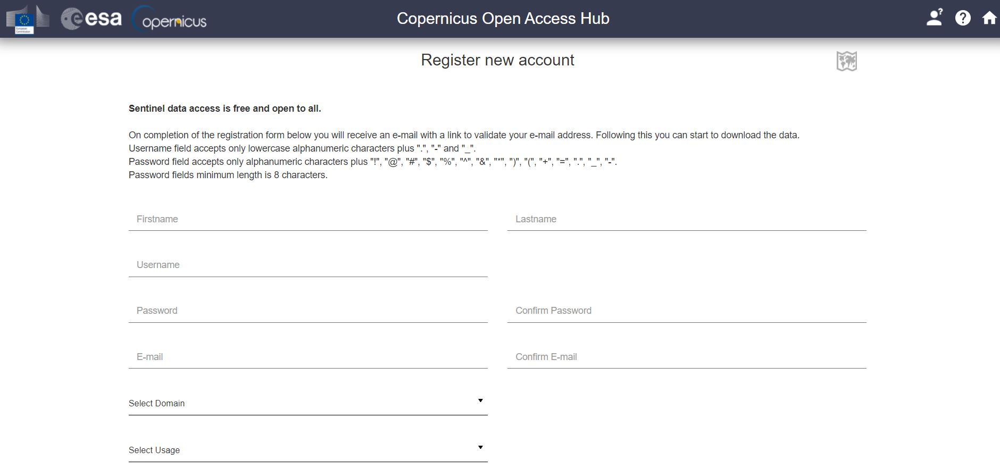

Luego de crear nuestra cuenta exitosamente y confirmarla podremos
ingresar al interfaz de la plataforma:

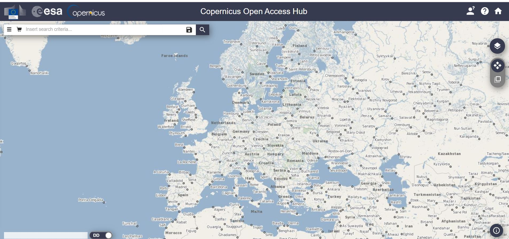

Las opciones y menú son intuitivos y el flujograma es muy parecido a las
anteriores plataformas. Delimitemos la zona y luego establezcamos
características antes de la descarga.
