Preprocesamiento de imágenes Satelitales 1
================

# 1. Introducción

Las imagenes satélitales son suceptibles a interferencias que hacen que
los datos buscados se vean perjudicados. Tenemos principalmente 3 tipos
de correcciones de imagenes:

-   La corrección radiométrica (CR),

-   La correción geométrica (CG) y

-   La corrección atmosférica (CA).

## 1.1 Correción radiométrica

La CR tiene como objetivo de restaurar lineas o píxeles perdidos y la
correción de bandeo de la imagen. Estos valores se estiman a partir de
la estadística de los valores del mismo pixel en las lineas anterior y
posterior. Se puede entender el proceso y problema mediante la siguiente
imagen:

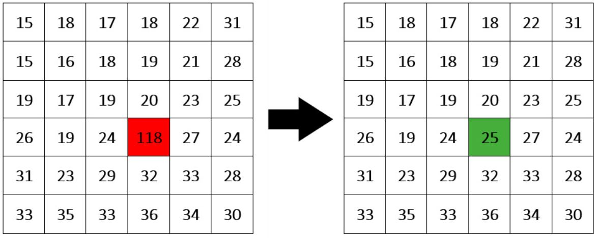

Esta correción puede mejorar la nitidez de las imagenes, como se puede
observar en el siguiente ejemplo:

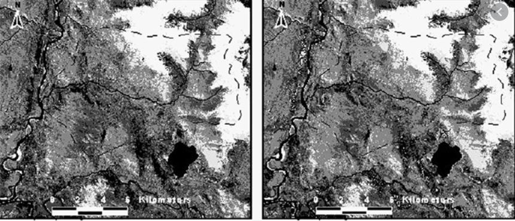

## 1.2 Correción geometrica o bandeado

Causado principalmente por la mala calibración de los sensores,
especialmente en zonas de baja radiancia. Aparecen bandas mas claras u
oscuras. Para su correción se asume que, en caso de no haber error, se
utiliza el analisis de series temporales. Otro metodo utilizado es el
basado sobre la posición de los pixeles con respecto a un sistema de
referencia espacial o cartografico. Esto se puede realizar entonces por
georreferenciación (brindar a cad pixel su localización en un SCR) para
combinar la imagen de satélite con otra capa. Un segundo metodo seria el
basado en elevacione mediante el Modelo Digital de Elevaciones (MDE). En
las zonas planas este tipo de error es poco frecuente o ya viene
rectificado en la imagen descargada. Este tipode correciones
generalmente es aplicado a imagenes de altisima resolución como drones
por ejemplo.

## 1.3 Correción atmosferica

Es aquella relacionada a eliminar los efectos de las condiciones
atmosfericas en los valores de radiancia de la imagen final. Se basan en
modelos físicos (simulan un comportamiento atmosferico) más complejos
que los modelos estadísticos.

Los sensores satelitales miden la radiancia, que es igual a la energía
enviada hacia el sensor en una dirección específica. Por su parte, la
reflactancia es igual a la relación entre la energía reflejada versus la
energía incidente. Es fundamental tener en cuenta también los conceptos
de firma espectral para este tipo de correción (es la reflectancia en
función a la longitud de onda). A continuación un ejemplo de este tipo
de correción:

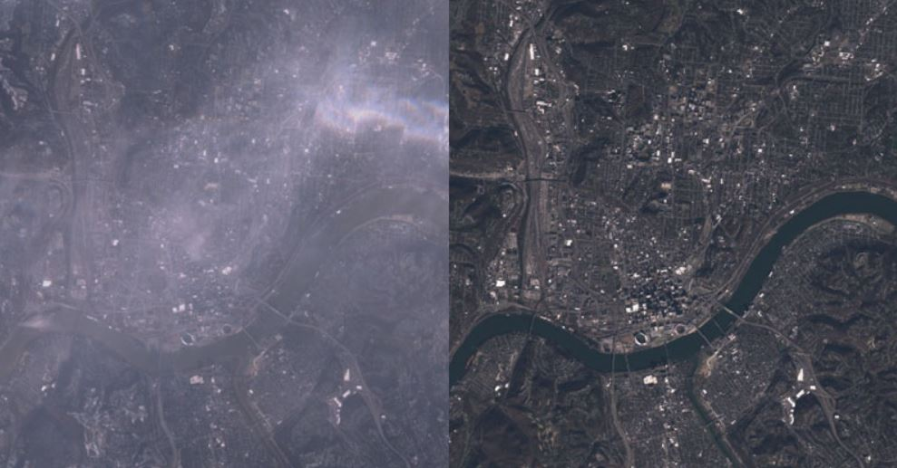

# 2. Correción atmosférica con SCP - QGIS

## 2.1 Conversión de niveles digitales a temperatura brillo

Realizaremos una conversión de niveles digitales a lo que corresponde
una corrección a los techos de la altura de la atmosfera o llamada
también temperatura brillo. Para ellos abrimos un nuevo proyecto en QGIS
y abrimos el complemente SCP. Iremos esta vez a la opción de
preprocesamiento, como se visualiza en la siguiente figura:

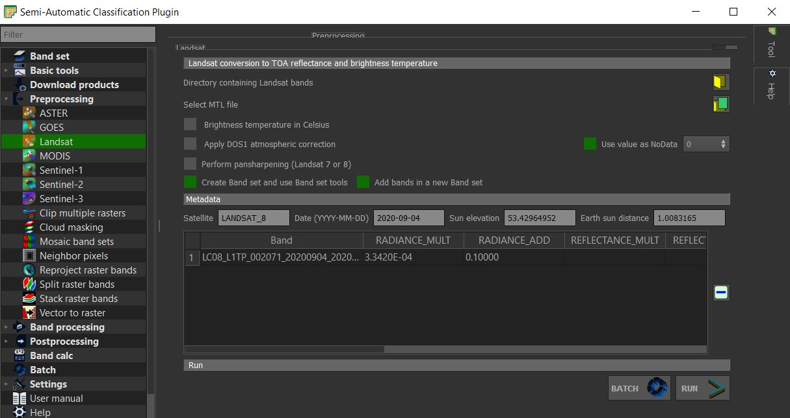

## 2.2 Temperatura del brillo en el satélite

La banda 10, es la banda termica. Para las bandas termales, la
conversión de valores digitales DN a tempertatura de brillo en el
satelite es dado por la expresión
*T**B* = *K*2/*l**n*\[*K*1/*L**x*) + 1\]
. Donde k1 y k2 son la constante de conversión termica específica de la
banda (en vatios/metro cuadrado x ster x um) y la constante de
conversión termica específica de la banda (en grados kelvin)
respectivamente (las constantes son proporcionadas para los satelites
Landsat utilizados, incorporados en los complementos o herramientas de
un software).

## 2.3 Estimación de la temperatura en la superficie del suelo

Esta estimación también responde a un calculo matemático
$$T = T\_B/ \[1 + (lambda \\\* T\_B/c\_2) \\\* l\_n(e)\]$$
. Se puede visualizar que el valor de la temperatura de brillo
previamente calculada juega un rol importante en esta formula (Weng, et
al. 2004). En la formula tambien tenemos la longitud de onda como
contantes fisicas conocidas como la de Planck, Boltzmann y la velocidad
de la luz. L

**Nota**: La herramienta de preprocesamiento del complemento SCP no solo
se limita a la correción atmosférica.

# 3. Correciones con SNAP

## 3.1 Correción atmosférica con Sen2cor de SNAP

Primero debemos de descargar el complemento Sen2cor, esto se puede
realizar a través de la pagina web
(<http://step.esa.int/main/snap-supported-plugins/sen2cor/sen2cor_v2-8/>)
o utilizando el interfaz del programa SNAP. Se puede utilizar el
complemento Sen2cor sin SNAP, pero requiere conocimientos mas avanzados
de programación. El complemento sen2cor realiza la correción atmosferica
de solo aquella imagenes proveniente de SENTINEL-2, level 1C.

En SNAP, vamos a la opción de herramientas (Tools) y luego le damos
click a complementos (Plugins). Nos aparecera una ventana en donde
iremos a la segunda pestaña para buscar e instalar el complemento
Sen2cor, como se muestra en la figura:

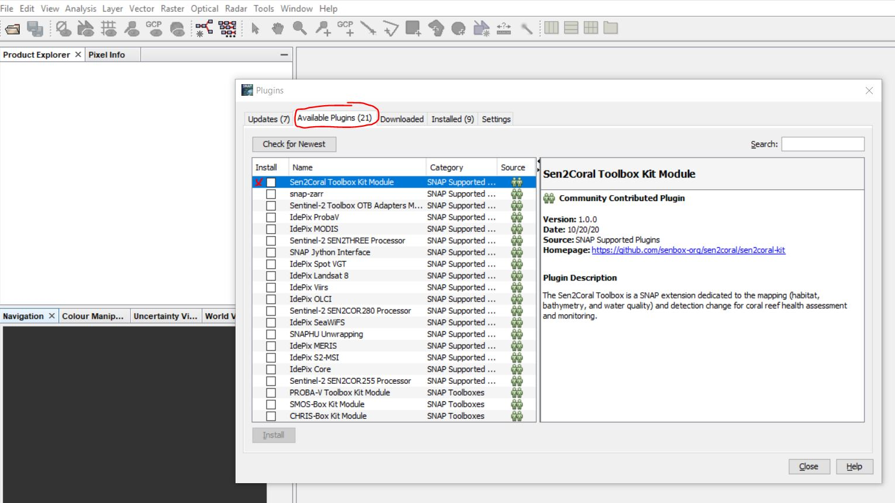

Para utilizar el complemento vamos a Optical &gt; Thematic Land
Processing &gt; Sen2cor Processor &gt; Sen2Cor280. Esto activará la
siguiente ventana:

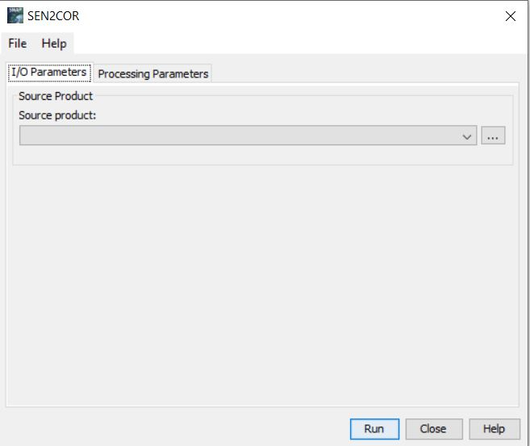

En la primera ventana, vamos a suministrar la información de nuestros
metadatos obtenidos en la descarga de la imagen. Para ello se recomienda
que tanto esta información como las imagenes no se encuentre muy
anidadas en nuestras carpetas.

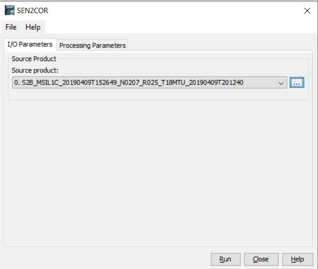

Luego vamos a pasar a la siguiente pestaña de la ventana a configurar
las opciones y solo cambiaremos aquella donde dice resolución a “ALL”.
Es posible que cuando demos correr, nos pida intalar complementos, se
instalaran y se volverá a ingresar al software.

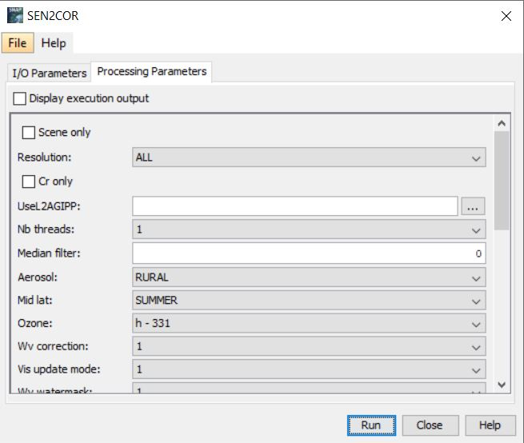

Una vez terminado el proceso, obtendremos las imagenes como un output en
el panel de productos. En la siguiente figura, se cargo las imagenes
originales para ver la diferencia (con y sin capa atmosferica).

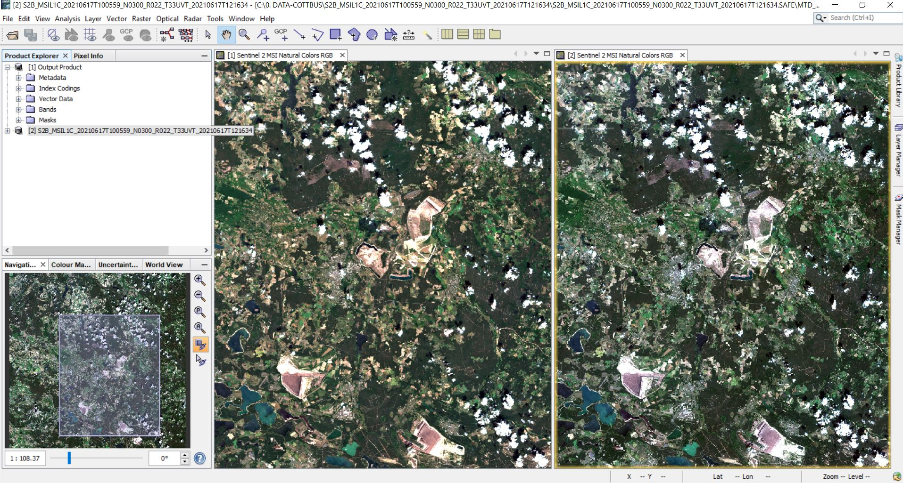

Para abrir los archivos originales podemos simplemente seleccionar el
archivo de metadatos cuando damos abrir a un archivo.

**Importante:** Si tienen problemas con el uso del complemento sen2cor,
el siguiente enlace puede resolverlo:
<https://forum.step.esa.int/t/sen2cor-detailled-instructions/8659/2>.

## 3.2 Filtros en SNAP

Vamos a trabajar con las imagenes limpias de capa atmosferica trabajadas
en la primera parte. Los filtros son operaciones que se aplican a las
imagenes para modificar los valores de los datos o valores de los
niveles de los pixeles.

Vamos a aprender como hacer un resampling en SNAP. Para ello seguimos la
siguiente ruta Raster &gt; Geometric Operations &gt; Resampling. En la
ventana que nos aparece, suministramos con el resultado que tenemos al
proceso, luego en la segunda pestaña definimos los parametros de
remuestreo como se ven en la imagen (vamos a elegir hacer un remuestreo
utilizando como referencia una de las bandas):

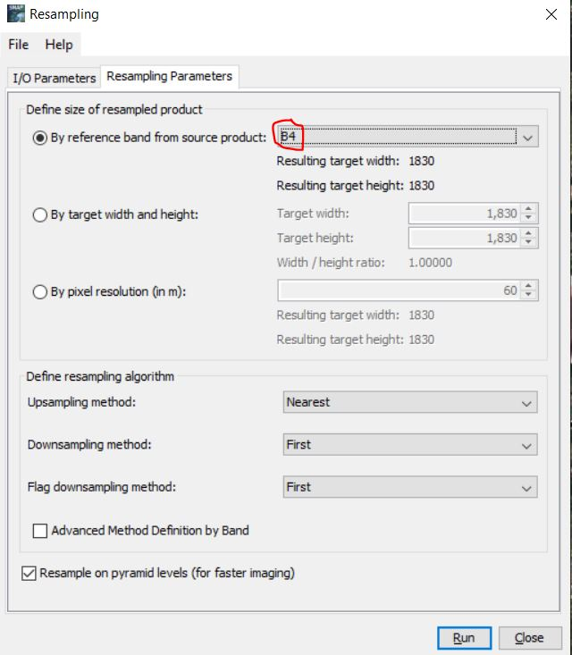

Luego le damos a Ok (pueden ver que tenemos diferentes maneras y
parametros que nos ayudaran a tener diferentes resultados de la tecnica
de resampling). El resultado y todos los resultados de las operaciones
que realicemos en SNAP saldra en el panel de productos:

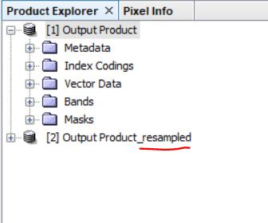

Cuando la resolución de nuestra imagen o un metodo de remuestreo
disminuye la resolución de nuestra imagen, podemos utilizar tecnicas de
suavizado de lineas. Esta técnica favorece un posterior proceso de
clasificación de la imagen (tambien llamado proceso de digitalización),
siendo util y muchas veces indispensable realizarlo previamente para
correr modelos posteriores.

Previo a la realización de un suavizado, vamos a realizar un “subset” de
la imagen inicial, es decir, vamos a seleccionar una sección especifica
de toda nuestra imagen. Para ellos seguimos la siguiente ruta Raster
&gt; Suset. Nos aparecerá la siguiente ventana en donde nosotros podemos
delimitar la zona que queremos cortar (una vez establecida podemos
realizar el proceso y no brindará un nuevo
producto)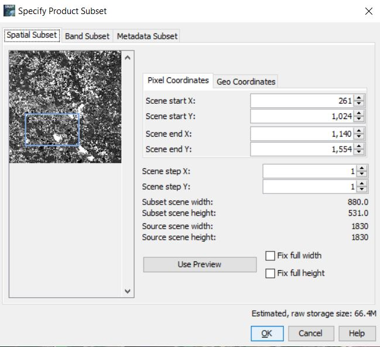:

Vamos a utilizar ahora la herramienta de filtro para hacer el suavizado
de pixeles (si nos acercamos a la imagen, veremos poco a poco cada pixel
en su tamaño real, siendo la diferencia entre pixel y pixel muy brusca,
vamos precisament intentar suaviazar este cambio). Para suavizar vamos a
Raster &gt; Filtered Band… (el filtrado lo vamos a realizar capa por
capa y luego elegiremos esas capas para ver el resultado final en una
composición RGB). Dentro de la ventana buscaremos aquellos tipos de
filtro de suavizado (Smooth and Blurr), hay diferentes tipos, probaremos
con el **“Low-Pass 5x5”**

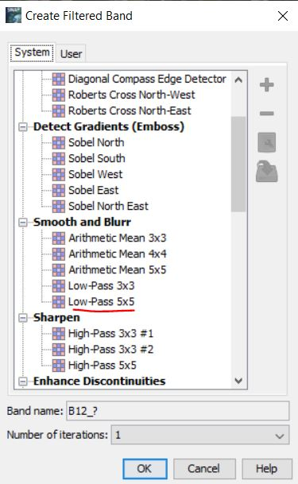

Podemos comparar los resultados como lo hicimos en la primera sección de
correción con SNAP. Tener consideración que en estos filtrado, los
resultados se ubicarán en el mismo producto que estamos trabajando.

## 3.3 Estiramiento de contraste en SNAP

En esta practica realizaremos una mejora en la visualización de la
imagen en nuestro computador para tener una mejor interpretación de los
objetos en la imagen, vamos a modificar los valores en los pixeles para
obtener estos cambios.

Vamos a trabajar en este caso con la B4, de rojo cercano. Vamos a abrir
nuestra banda B4 y también activar la pestaña de color, como se indica
en la siguiete figura:

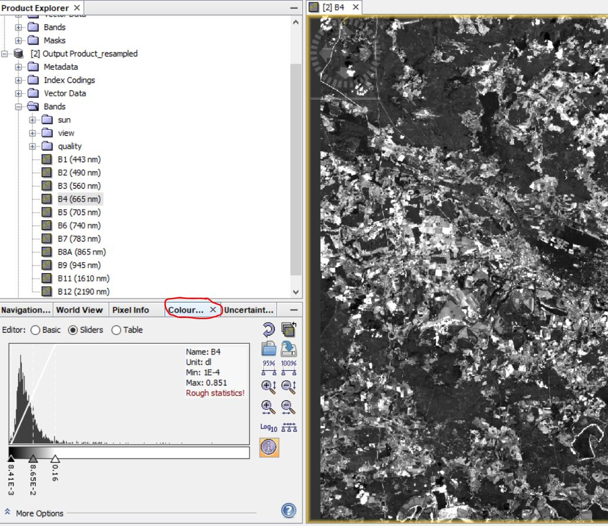

Este es un grafico de frecuencias (o comunmente conocido como un
histograma de frecuencias) de la cantidad de pixeles que se encuentran
en una cierta longitus de onda. Tenemos de manera general una zona
oscura (la mas pegada hacia la izquierda) y la zona blanca (hacia la
derecha). Modificando los valores (con las flechitas) podemos ajustar la
cantidad de brillo o oscuridad de nuestra imagen.

Podemos realizar tambein un corte (subset) para modificar los valores de
contraste. Sim embargo no es recomentable ajustar el constraste en el
mismo corte o subset, ya que perdemos mucha información. Es preferiblel
buscarlo primero en la imagen original y luego hacer el corte o subset.
