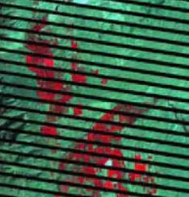

Preprocesamiento de imágenes Satelitales 1
================

# 1. Introducción

Las imagenes satélitales son suceptibles a interferencias que hacen que
los datos buscados se vean perjudicados. Tenemos principalmente 3 tipos
de correcciones de imagenes:

-   La corrección radiométrica (CR),

-   La correción geométrica (CG) y

-   La corrección atmosférica (CA).

## 1.1 Correción radiométrica

La CR tiene como objetivo de restaurar lineas o píxeles perdidos y la
correción de bandeo de la imagen. Estos valores se estiman a partir de
la estadística de los valores del mismo pixel en las lineas anterior y
posterior. Se puede entender el proceso y problema mediante la siguiente
imagen:

Esta correción puede mejorar la nitidez de las imagenes, como se puede
observar en el siguiente ejemplo:

## 1.2 Correción geometrica o bandeado

Causado principalmente por la mala calibración de los sensores,
especialmente en zonas de baja radiancia. Aparecen bandas mas claras u
oscuras. Para su correción se asume que, en caso de no haber error, se
utiliza el analisis de series temporales. Otro metodo utilizado es el
basado sobre la posición de los pixeles con respecto a un sistema de
referencia espacial o cartografico. Esto se puede realizar entonces por
georreferenciación (brindar a cad pixel su localización en un SCR) para
combinar la imagen de satélite con otra capa. Un segundo metodo seria el
basado en elevacione mediante el Modelo Digital de Elevaciones (MDE). En
las zonas planas este tipo de error es poco frecuente o ya viene
rectificado en la imagen descargada. Este tipode correciones
generalmente es aplicado a imagenes de altisima resolución como drones
por ejemplo.

## 1.3 Correción atmosferica

Es aquella relacionada a eliminar los efectos de las condiciones
atmosfericas en los valores de radiancia de la imagen final. Se basan en
modelos físicos (simulan un comportamiento atmosferico) más complejos
que los modelos estadísticos.

Los sensores satelitales miden la radiancia, que es igual a la energía
enviada hacia el sensor en una dirección específica. Por su parte, la
reflactancia es igual a la relación entre la energía reflejada versus la
energía incidente. Es fundamental tener en cuenta también los conceptos
de firma espectral para este tipo de correción (es la reflectancia en
función a la longitud de onda). A continuación un ejemplo de este tipo
de correción:

# 2. Correción atmosférica con SCP - QGIS

## 2.1 Conversión de niveles digitales a temperatura brillo

Realizaremos una conversión de niveles digitales a lo que corresponde
una corrección a los techos de la altura de la atmosfera o llamada
también temperatura brillo. Para ellos abrimos un nuevo proyecto en QGIS
y abrimos el complemente SCP. Iremos esta vez a la opción de
preprocesamiento, como se visualiza en la siguiente figura:

## 2.2 Temperatura del brillo en el satélite

La banda 10, es la banda termica. Para las bandas termales, la
conversión de valores digitales DN a tempertatura de brillo en el
satelite es dado por la expresión
*T**B* = *K*2/*l**n*\[*K*1/*L**x*) + 1\]
. Donde k1 y k2 son la constante de conversión termica específica de la
banda (en vatios/metro cuadrado x ster x um) y la constante de
conversión termica específica de la banda (en grados kelvin)
respectivamente (las constantes son proporcionadas para los satelites
Landsat utilizados, incorporados en los complementos o herramientas de
un software).

## 2.3 Estimación de la temperatura en la superficie del suelo

Esta estimación también responde a un calculo matemático
$$T = T\_B/ \[1 + (lambda \\\* T\_B/c\_2) \\\* l\_n(e)\]$$
. Se puede visualizar que el valor de la temperatura de brillo
previamente calculada juega un rol importante en esta formula (Weng, et
al. 2004). En la formula tambien tenemos la longitud de onda como
contantes fisicas conocidas como la de Planck, Boltzmann y la velocidad
de la luz. L

**Nota**: La herramienta de preprocesamiento del complemento SCP no solo
se limita a la correción atmosférica.

# 3. Correciones con SNAP

## 3.1 Correción atmosférica con Sen2cor de SNAP

Primero debemos de descargar el complemento Sen2cor, esto se puede
realizar a través de la pagina web
(<http://step.esa.int/main/snap-supported-plugins/sen2cor/sen2cor_v2-8/>)
o utilizando el interfaz del programa SNAP. Se puede utilizar el
complemento Sen2cor sin SNAP, pero requiere conocimientos mas avanzados
de programación.

En SNAP, vamos a la opción de herramientas (Tools) y luego le damos
click a complementos (Plugins). Nos aparecera una ventana en donde
iremos a la segunda pestaña para buscar e instalar el complemento
Sen2cor, como se muestra en la figura:

Para utilizar el complemento vamos a Optical &gt; Thematic Land
Processing &gt; Sen2cor Processor &gt; Sen2Cor280. Esto activará la
siguiente ventana:

En la primera ventana, vamos a suministrar la información de nuestros
metadatos obtenidos en la descarga de la imagen. Para ello se recomienda
que tanto esta información como las imagenes no se encuentre muy
anidadas en nuestras carpetas.

Luego vamos a pasar a la siguiente pestaña de la ventana a configurar
las opciones y solo cambiaremos aquella donde dice resolución a “ALL”.
Es posible que cuando demos correr, nos pida intalar complementos, se
instalaran y se volverá a ingresar al software.

## 3.2 Filtros en SNAP (pendiente\*)

## 3.3 Estiramiento de contraste en SNAP
