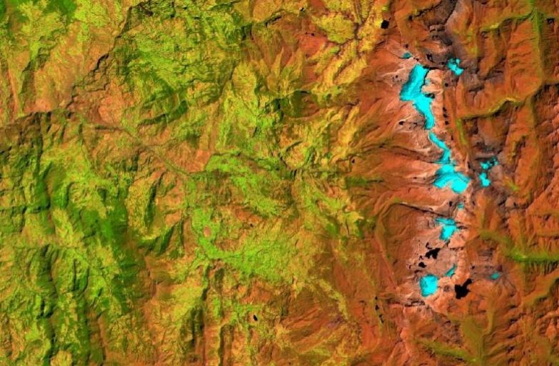
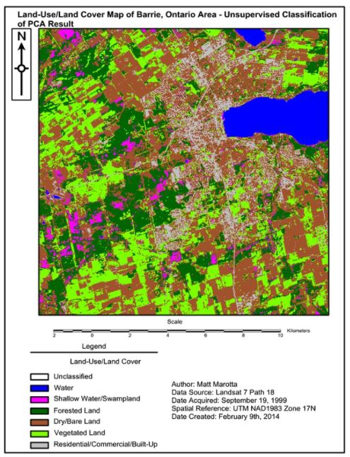
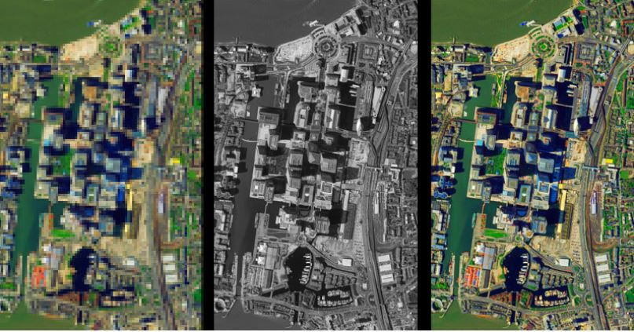
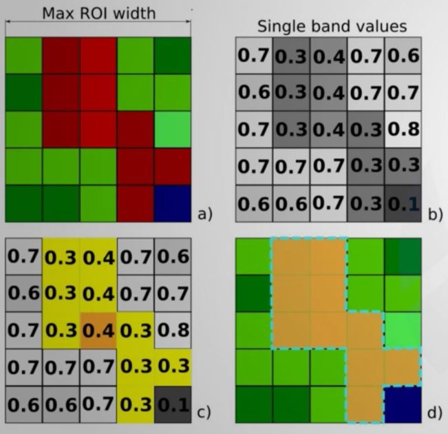
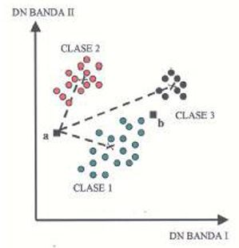
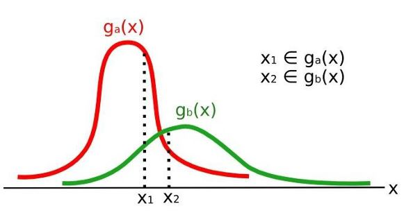
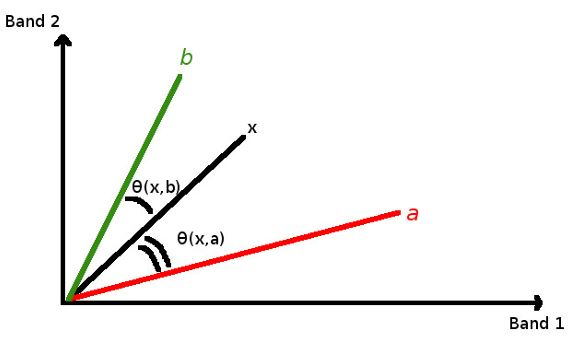
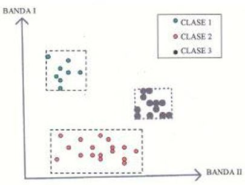
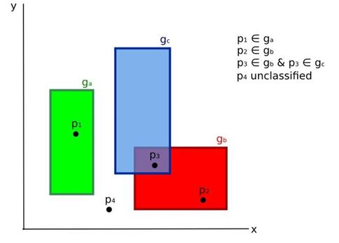
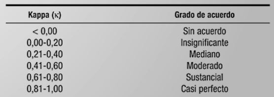

Procesamiento de imágenes Satelitales 1
================

# 1. Definiciones teóricas

Entendemos por procesamiento a las diferentes maneras para obtener
clasificación, indices y otra información derivada que pueda ser útil
para la caracterización de la cubierta terrestre.

## 1.1 Composición de imágenes de satélite en color

Una composicion en color es la combinación de las bandas o rangos de las
longitudes de onda que se le asigna un color utilizando normalmente el
modelo RGB (Red-Green-Blue).

## 1.2 Análisis de componentes principales

Metodo para reducir la dimensionalidad de un conjunto de variables en
componentes principales. En GIS, esto produce un nuevo conjunto de
bandas (componentes principales) con las catacteristicas conjuntas. Esta
tecnica se utiliza cuando tenemos muchos datos que no pueden ser
visualizados claramente y se simplifican ajustandolo a sus componentes
principales (imagenes con mayor contraste).

## 1.3 Mejoramiento de la resolución espacial / Pan-sharpening

Busca combinar la información de bandas multiespectrales de menor
resolución espacial (p.ej. 30 metros de resolución) con una resolución
de banda pancromática (p.ej. 15 m resolución). El resultado es una
imagen multiespectral con resolución espacial de la banda pancromática
(p.ej. 15m)

En QGIS, el complemento SCP aplica la transformación de Brovey, en la
cual los valores de cada banda multiespectral con la nueva banda.

## 1.4 Clasificación de imágenes de satélite

### 1.4.1 Clasificación supervisada

Es un proceso semi-automatico el cual procesa imagenes, identificando
objetivos en las imagenes a partir de sus firmas espectrales. Se usan
principalmente con el objetivo de producir un mapa temático de la
cobertura del suelo.

En este tipo de clasificación el investigador selecciona una o más
regiones de interes (ROIs o areas de entrenamiento) para cada tipo de
cobertura de suelo. Luego los algoritmos permiten seleccionar pixeles
similares al pixel inicial seleccionado (considerando la similitud
espectral).

En QGIS el complemento SCP tiene a disposición el algoritmo de región
incremental.

### 1.4.2 Método de la distancia minima

Esta tecnica tiene como objetivo calcular la media de las clases
seleccionadas y las reconoce como areas de interes. El algoritmo buscará
la clasificación de cada pixel no identificado en la clase cuya media se
encuentre mas cercana (generalmente utilizando la distancia euclidiana).

### 1.4.3 Algoritmo de máxima probabilidad

Este método calcula las distribuciones de probabilidad de cada una de
las clases (teorema de Bayes), estimando si un pixel pertenece a una
clase de cobertura. Una restriccion de este metodo es que necesita un
número alto de pixeles para cada area de entrenamiento.

### 1.4.4 Mapeo del Angulo Espectral

Este algoritmo calcula el angulo espectral entre las firmas espectrales
de cada uno de los pixeles en la imagen y las firmas espectrales de
entramiento.

### 1.4.5 Clasificación de Paralelepípedo

Es el algoritmo que considera el rango de valores de cada banda,
formando un paralelepípedo multidemensional que definen las clases de
cobertura. Cada uno de los pixeles es clasificado dentro de una clase
cuando estan dentro del paralelepípedo. Tiene como desventaja la
superposición de pixeles, en estos casos no se puede clasificar.

### 1.4.6 Clasificación por firmas de cobertura de suelo (Land Cover Signature Classification)

Este algoritmo esta disponible en el complemento SCP de QGIS. Permite
definir umbrales espectrales para cada firma de entrada (valor minimo y
maximo por cada banda), definiendo la región espectral de cada clase de
cobertura del suelo. Las firmas espectrales son comparados con las
firmas espectrales de entrenamiento y cumplen la siguiente regla:

-   Un pixel pertenece a la clase X si la firma espectral del pixel esta
    completamente contenida en la región definida por la clase X.

-   En caso de que coincidan pixeles dentro de dos regiones superpuestas
    o fuera de cualquier región espectral, se puede utilizar algoritmos
    de clasificación adicionales.

## 1.6 Validación de la clasificación

Como con cualquier modelo, se deben de realizar las comparaciones de los
datos de entramiento versus los datos de testeo (o de campo). Para ellos
podemos utilizar matrices de confusión o un estimador de regresión.

Para la evaluación de las matrices de confusión existen dos criterios de
evaluación, el estadístico y el cartográfico. Adicionalmente se puede
utilizar el promedio de estos dos indices. Es muy utilizado en estos
casos el indice de Kappa (K) para evaluar el grado de acuerdo y
reproducibilidad de instrumentos de medida cuyo resultado es categorico
(2 o más).

## 1.7 Índices espectrales

Son operaciones realizadas entre las bandas espectrales, utiles para
extraer información como cubierta vegetal. Uno de los mas conocidos es
el Índice de Vegetación de Diferencia Normalizada (NDVI). Los valores de
este indicie varian de -1 a 1, donde la vegetación densa y saludable
muestra valores altos (cercanos a 1) y las areas sin vegetación muestran
valores bajos (cercanos a -1).

Otro índice espectral es el Índice de Vegetación Mejorada (EVI), el cual
detecta los efectos atmosfericos, basado en la diferencia de bandas azul
y roja. Basicamente es muy parecido a el NDVI pero toma en consideración
los efectos atmosfericos y la perdida de energia radiante en el proceso.

Algunos otros indices utilizados:

# 2. Procesamiento de imágenes de satélite en QGIS

Vamos a introducir imagenes landsat multibanda a QGIS (de preferencia
desde la banda 1 hasta las banda 7). Luego de que esten las 7 bandas en
nuestro QGIS, vamos al menú Raster &gt; Miscelanea &gt; Combinar. Edn la
ventana de **Combinar** seleccionamos las capas, podemos activar la
opción de colocar cada archivo de entrada en una banda separada. El tipo
de datos de salida será **“Int32”** y se guardará en una carpeta
desesada. Luego ejecutamos.

Una vez creada, podemos modificar en propiedades la simbologia de la
nueva capa.
