Procesamiento de imágenes Satelitales 1
================

# 1. Definiciones teóricas

Entendemos por procesamiento a las diferentes maneras para obtener
clasificación, indices y otra información derivada que pueda ser útil
para la caracterización de la cubierta terrestre.

## 1.1 Composición de imágenes de satélite en color

Una composicion en color es la combinación de las bandas o rangos de las
longitudes de onda que se le asigna un color utilizando normalmente el
modelo RGB (Red-Green-Blue).

## 1.2 Análisis de componentes principales

Metodo para reducir la dimensionalidad de un conjunto de variables en
componentes principales. En GIS, esto produce un nuevo conjunto de
bandas (componentes principales) con las catacteristicas conjuntas. Esta
tecnica se utiliza cuando tenemos muchos datos que no pueden ser
visualizados claramente y se simplifican ajustandolo a sus componentes
principales (imagenes con mayor contraste).

## 1.3 Mejoramiento de la resolución espacial / Pan-sharpening

Busca combinar la información de bandas multiespectrales de menor
resolución espacial (p.ej. 30 metros de resolución) con una resolución
de banda pancromática (p.ej. 15 m resolución). El resultado es una
imagen multiespectral con resolución espacial de la banda pancromática
(p.ej. 15m)

En QGIS, el complemento SCP aplica la transformación de Brovey, en la
cual los valores de cada banda multiespectral con la nueva banda.

## 1.4 Clasificación de imágenes de satélite

### 1.4.1 Clasificación supervisada

Es un proceso semi-automatico el cual procesa imagenes, identificando
objetivos en las imagenes a partir de sus firmas espectrales. Se usan
principalmente con el objetivo de producir un mapa temático de la
cobertura del suelo.

En este tipo de clasificación el investigador selecciona una o más
regiones de interes (ROIs o areas de entrenamiento) para cada tipo de
cobertura de suelo. Luego los algoritmos permiten seleccionar pixeles
similares al pixel inicial seleccionado (considerando la similitud
espectral).

En QGIS el complemento SCP tiene a disposición el algoritmo de región
incremental.

### 1.4.2 Método de la distancia minima

Esta tecnica tiene como objetivo calcular la media de las clases
seleccionadas y las reconoce como areas de interes. El algoritmo buscará
la clasificación de cada pixel no identificado en la clase cuya media se
encuentre mas cercana (generalmente utilizando la distancia euclidiana).

### 1.4.3 Algoritmo de máxima probabilidad

Este método calcula las distribuciones de probabilidad de cada una de
las clases (teorema de Bayes), estimando si un pixel pertenece a una
clase de cobertura. Una restriccion de este metodo es que necesita un
número alto de pixeles para cada area de entrenamiento.

### 1.4.4 Mapeo del Angulo Espectral

Este algoritmo calcula el angulo espectral entre las firmas espectrales
de cada uno de los pixeles en la imagen y las firmas espectrales de
entramiento.

### 1.4.5 Clasificación de Paralelepípedo

Es el algoritmo que considera el rango de valores de cada banda,
formando un paralelepípedo multidemensional que definen las clases de
cobertura. Cada uno de los pixeles es clasificado dentro de una clase
cuando estan dentro del paralelepípedo. Tiene como desventaja la
superposición de pixeles, en estos casos no se puede clasificar.

### 1.4.6 Clasificación por firmas de cobertura de suelo (Land Cover Signature Classification)

Este algoritmo esta disponible en el complemento SCP de QGIS. Permite
definir umbrales espectrales para cada firma de entrada (valor minimo y
maximo por cada banda), definiendo la región espectral de cada clase de
cobertura del suelo. Las firmas espectrales son comparados con las
firmas espectrales de entrenamiento y cumplen la siguiente regla:

-   Un pixel pertenece a la clase X si la firma espectral del pixel esta
    completamente contenida en la región definida por la clase X.

-   En caso de que coincidan pixeles dentro de dos regiones superpuestas
    o fuera de cualquier región espectral, se puede utilizar algoritmos
    de clasificación adicionales.

## 1.6 Validación de la clasificación

Como con cualquier modelo, se deben de realizar las comparaciones de los
datos de entramiento versus los datos de testeo (o de campo). Para ellos
podemos utilizar matrices de confusión o un estimador de regresión.

Para la evaluación de las matrices de confusión existen dos criterios de
evaluación, el estadístico y el cartográfico. Adicionalmente se puede
utilizar el promedio de estos dos indices. Es muy utilizado en estos
casos el indice de Kappa (K) para evaluar el grado de acuerdo y
reproducibilidad de instrumentos de medida cuyo resultado es categorico
(2 o más).

## 1.7 Índices espectrales

Son operaciones realizadas entre las bandas espectrales, utiles para
extraer información como cubierta vegetal. Uno de los mas conocidos es
el Índice de Vegetación de Diferencia Normalizada (NDVI). Los valores de
este indicie varian de -1 a 1, donde la vegetación densa y saludable
muestra valores altos (cercanos a 1) y las areas sin vegetación muestran
valores bajos (cercanos a -1).

Otro índice espectral es el Índice de Vegetación Mejorada (EVI), el cual
detecta los efectos atmosfericos, basado en la diferencia de bandas azul
y roja. Basicamente es muy parecido a el NDVI pero toma en consideración
los efectos atmosfericos y la perdida de energia radiante en el proceso.

Algunos otros indices utilizados:

# 2. Procesamiento de imágenes de satélite en QGIS

## 2.1 Creación de imagenes compuestas

En esta sección crearemos una imagen compuesta, para ellos introducir
imagenes landsat multibanda a QGIS (de preferencia desde la banda 1
hasta las banda 7). Luego de que esten las 7 bandas en nuestro QGIS,
vamos al menú Raster &gt; Miscelanea &gt; Combinar. Edn la ventana de
**Combinar** seleccionamos las capas, podemos activar la opción de
colocar cada archivo de entrada en una banda separada. El tipo de datos
de salida será **“Int16”** y se guardará en una carpeta desesada o como
imagene temporl. Luego ejecutamos.

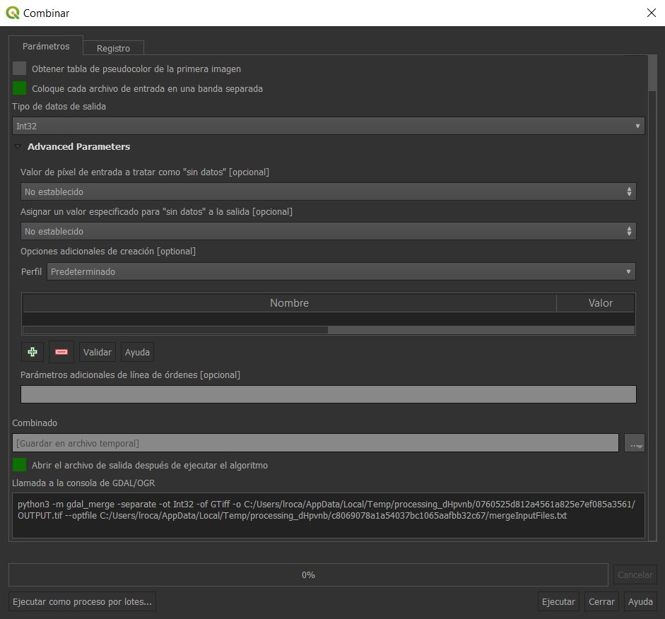

Una vez creada, podemos modificar en propiedades, por ejemplo la
simbologia de la nueva capa. Le podemos por ejemplo asignar a los
valores RBG las bandas que deseemos personalizar. Si no sabemos cuales
bandas seleccionarn, en la siguiente pagina se nos muestra las
composiciones mas comunes para satelites Landsat:
<https://www.usgs.gov/media/images/common-landsat-band-rgb-composites>.

Para satelites Sentinel, en el apendice A del artículo publicado por
Immitzer *et al*. (2016) nos brinda una idea de las potenciales
composiciónes, el enlace de la investigación:
<https://www.mdpi.com/2072-4292/8/3/166/htm>.

## 2.2 Composición de imágenes en SCP

Tenemos en consideración las bandas que utilizaremos y luego abrimos el
complementeo SCP. En la primera opción del complemento (Juego de bandas)
abriremos (folder verde) las bandas que trataremos.

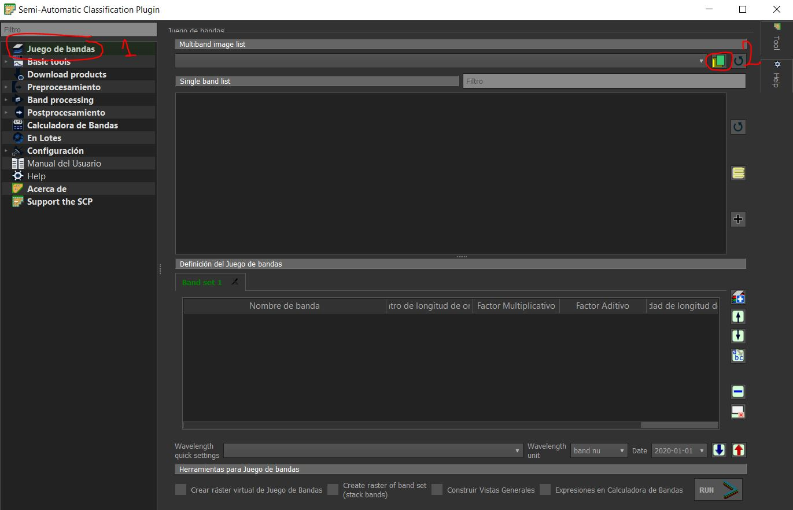

Elejimos las imagenes. Una vez seleccionadas, se cargan automaticamente
en el complemento. Es importante que al ingresar las imagenes, estas se
encuentren ordenadas. En la opción de configuración rapida de longitudes
de onda utilizaremos el “Landsat 8 OLI\[bands 2, 3, 4, 5, 6, 7\]” los
cuales ya se encuentran predeterminados.

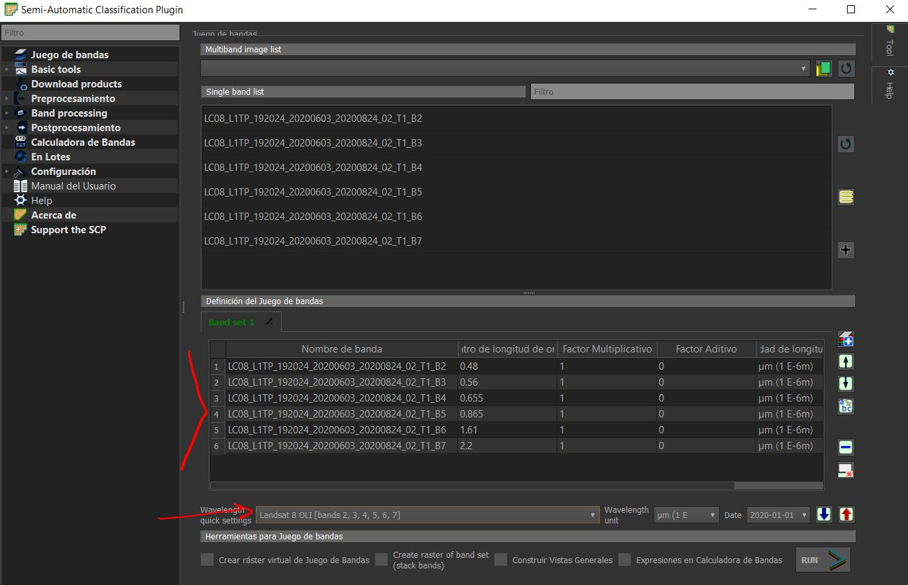

Podemos activar la opción **“Crear ráster virtual de Juego de Bandas”**.
Esto no generará precisamente un raster nuevo (que puede ocupar mucha
memoria). Si no que es una forma de organizar tus rasters existentes en
un catalogo, es decir, un archivo de fácil acceso.

## 2.3 Analisis de Componentes principales

Utilizamos este analisis cuando queremos obtener información de
distintas bandas, comprendidas en 1 o 2 bandas finales. Este analisis se
aplicaria a imagenes multiespectrales, es decir mosaicos ya creados
previamente. Podemos aplicarlo al mosaico previamente creado. Para
realizar un analisis de PCA, utilizaremos el complemento previamente
instalado PCA4CD (aunque alternativamente el complemento SCP también
tiene la opcion de PCA en procesamiento de bandas). Una vez identificado
nuestro mosaico, lo suministramos al complemento, como se muestra a
continuación:

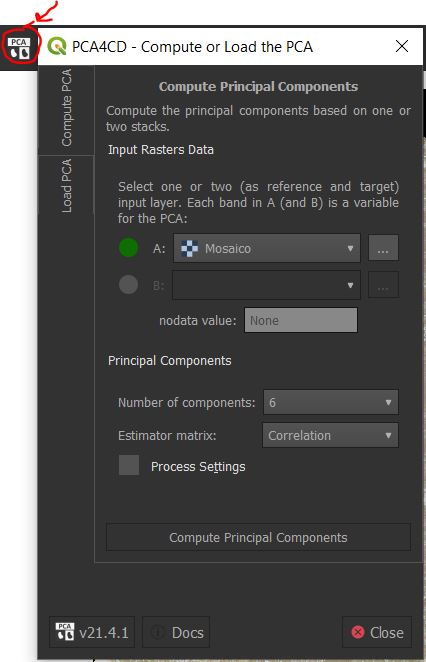

El complemento puede aceptar otra imagen de otra fecha para mejorar el
proceso, sin embargo con una es suficiente. Tendremos que elegir el
número total de componente que vamos a querer en nuestra imagen final y
el tipo de estimador (que dejaremos como correlación).

**IMPORTANTE: Dependiendo de las caracteristicas de su computador, este
proceso puede demandar demasiada memoria. Se recomienda tener una buena
computadora para procesar la imagen original, sino realice el analisis
en una imagen virtual o de bajo peso.**

## 2.4 Mejoramiento de la resolución espacial

El mejoramiento en QGIS se realizará con el complemento para mejorar la
resolución espacial utilizando una de las bandas del satelite Landsat.
Generalmente las bandas tienen una escala de 30 metros, pero tenemos una
banda pancromatrica de escala 15m. Lo que hace el algoritmo es mejorar o
aumentar la resolución espacial de una resolución a color a partir de la
banda a blanco y negro de 15m. La banda pancromatrica en LandSat es la
B8. Para este ejercicio podemos utilizar las bandas B4, B5, B7 y B8 (la
banda pancromatica tiene que estar dentro del analisis).

Jalamos las capas a nuestro canvas y luego realizamos una combinación de
las capas (mosaico). Recordando, esto seria siguiendo la ruta de Raster
&gt; Miscelanea &gt; Combinar. En este caso solo vamos a selecciónar las
capas B4, B5 y B7. Le damos la siguientes caracteristicas a este
mosaico:

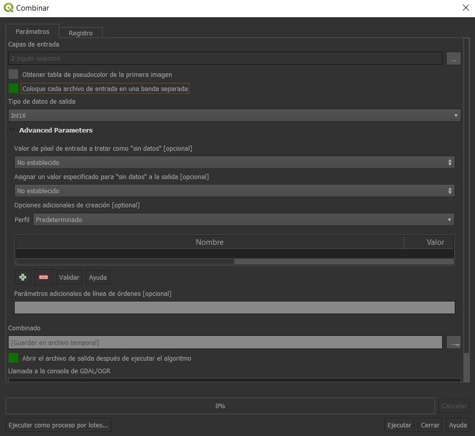

Una vez creada la capa mosaico, podemos compararla con la capa
pancromática para evidenciar la diferencia de resolución. En la caja de
procesos de herramientas vamos a buscar la función **“Pansharpening”**.

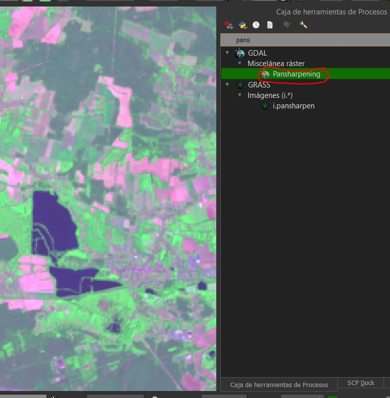

Dentro de la ventana de esta función vamos a seleccionar tanto la capa
espectral y la capa pancromática. Podemos obtener y comparar los
resultados.

# 3. Procesamiento de imagenes en SNAP

## 3.1 Composición de imágenes de satélite

Abrimos una imagen Sentinel en SNAP y probamos las diferentes
composiciones vista anteriormente el la publicación de Immitzer *et al*.
(2016): <https://www.mdpi.com/2072-4292/8/3/166/htm>.

## 3.2 Clasificación no supervisada

En esta clasificación realizaremos una mejora de resolución y para ello
cargamos una base de datos de satelite Sentinel 2 al interfaz de SNAP.

Podemos realizar una mejora de la resolución de la imagenen. Para ello
podemos utilizar Resampling, para ellos vamos a Raster &gt; Geometric
&gt; Resampling. Tomamos en consideración la B2 como referencia:

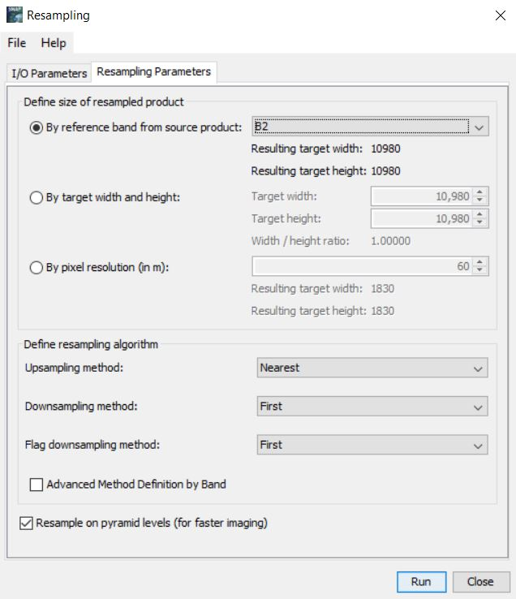

Seguido de ello podemos utilizar una distribución de RBG favorita y
realizar un subset de la imagen o tomar un corte pequeño.

En el corte realizado, vamos a realizar la clasificación no supervisada.
Para ello iremos a Raster &gt; Classification &gt; Unsupervised
Classification &gt; K-means Cluster Analysis.

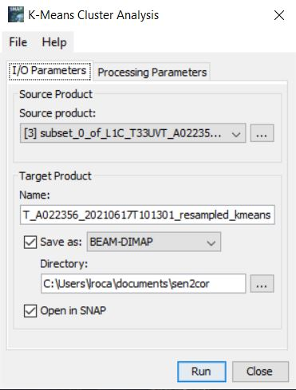

En los parametros elegimos el número de grupos, iteraciones y bandas a
seleccionar (seleccionamos todas):

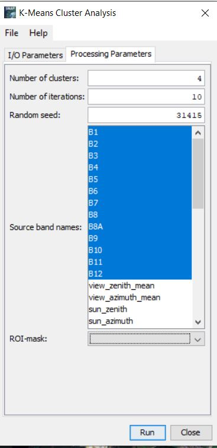

Como resultado, podemos ver la nueva imagen clasificada:

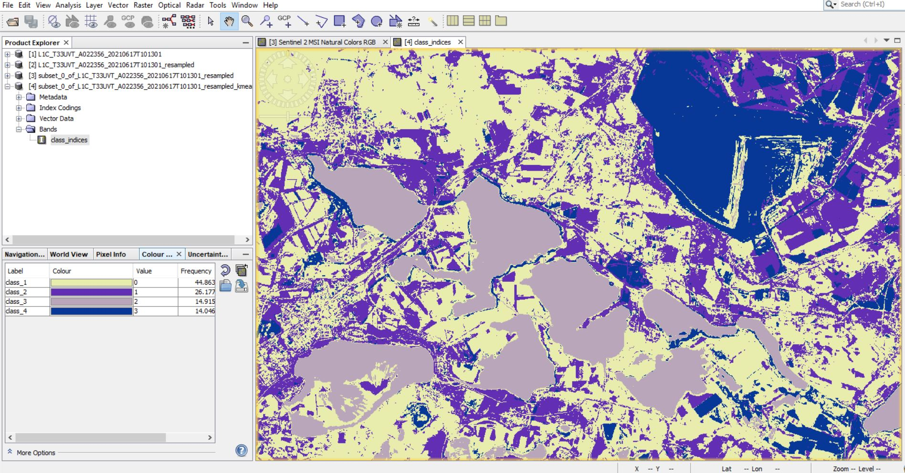

## 3.3 Clasificación supervisada

La principal diferencia entre este y el metodo anterior es que en este
suministraremos una imagen de entrenamiento.

En esta tecnica tenemos que identificar el tipo de suelo en la imagen
inicial y guardarlas en vectores, estos se iran añadiendo a la imagen
que estamos trabajando en el SNAP (vamos dibujando cuantos diferentes
tipos de suelo encontremos visualmente, nos podemos ayudar de diferentes
composiciones para identificarlas).

Una vez tengamos idenditificados todos los tipos, vamos a el menu Raster
&gt; Classification &gt; Supervised Classification &gt; Maximum
Likelihood Classifier. Añadimos la imagen que vamos a procesar el la
primera pestaña, en la pestaña del clasificador seleccionamos los
vectores de entrenamiento y las bandas que utilizariamos. En la ultima
pestaña podemos seleccionar donde guardaremos la nueva imagen.

# 4. Procesamiento de imagenes en GEE

## 4.1 Composición de imagenes satelitales

Vamos a google earth engine explorer:
<https://explorer.earthengine.google.com/#workspace>. Luego vamos al
Data Catalog. Vamos a buscar dentro de la colección de mosaicos de 32
dias del satelite Landsat. Ubicamos la colección **“Landsat 8 Collection
1 Tier 32 Day TOA Reflectance”** (le damos click a open in workspace).

Podemos elegir el rango de fechas y abajo las bandas y composición de
las mismas. El parametro **range** manejará las condiciones del
histrograma de frecuencias (contraste, brillo, etc.). En el parametro
rango tambien podemos ajustar la comprensión del histograma. Una vez
hemos encontrado lo que buscabamos podemos bajar la imagen con todas sus
bandas para su trabajo en QGIS u otro software.

## 4.2 Calculo de indices espectrales

Vamos a ingresar el primer lugar al editor de codigo de google Earth
Engine: <https://code.earthengine.google.com/>. En la pestaña de Scripts
creamos nuestra carpeta en Owner y luego nuestro primer script
(estaremos listos para ingresar nuestros codigos).

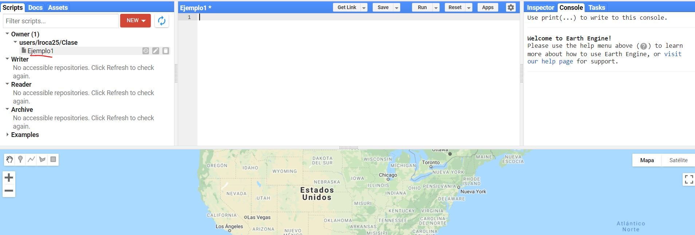

El codigo que vamos a utilizar nos permitira calcular un indice de
vegetación normalizada a partir de imagenes SENTINEL 2.

La primera parte del codigo va a corresponder a datos ya pre trabajados
en el mismo motor de GEE (ready to use datasets):
<https://developers.google.com/earth-engine/datasets/catalog/COPERNICUS_S2_SR>.

Utilizamos especificamente esta fuente porque necesitamos una imagen
limpia de techo atmosferico para calcular el indice de vegetación. El
script que utilizaremos es el siguiente:

**// Cargamos la colleción de imagenes de S2**

**var S2 = ee.ImageCollection(‘COPERNICUS/S2\_SR’)**

**// Filtramos las fechas de inicio y fin**

**.filterDate(“2019-08-05”, “2019-08-07”)**

**// Filtramos de acuerdo al tipo de limites**

**.filterBounds(geometry);**

**// Para generar la geometria le damos click a la geometria en la
ventana inferior y creamos la geometria**

**// Luego vamos a introducir una mascara de calidad - utilizamos la
imagen de calidada a 60 metros**

**var maskcloud1 = function(image){**

**var QA60 = image.select(\[“QA60”\]);**

**return image.updateMask(QA60.lt(1));**

**};**

**// Vamos a utilizar la función para calcular y añadir la banda de
indice vegetal (NDVI)**

**var addNDVI = function(image){**

**return image.addBands(image.normalizedDifference(\[“B8”, “B4”\]));**

**};**

**// Añadimos la banda NDVI a la coleccion de imagenes**

**var S2 = S2.map(addNDVI);**

**// Extraemos la banda NDVI y creamos la composición de la imagen
media**

**var NDVI = S2.select(\[“nd”\]);**

**var NDVImed = NDVI.median(); // Aqui solo se cambia el nombre de la
variable**

**// Creamos una paleta de colores pa visualizar el NDVI**

**var ndvi\_pal =
\[“\#d73027”,“\#f46d43”,“\#fdae61”,“\#fee08b”,“\#d9ef8b”,“\#a6d96a”\];**

**// Luego mostramos los resultados del NDVI en el mapa**

**Map.addLayer(NDVImed.clip(geometry),{**

**min: -0.5, max: 0.9, palette:ndvi\_pal},**

**“NDVI”);**

**// El script esta listo para trabajarlo.**

Una vez hallamos encontrado la imagen que queremos, podemos descargarla.
Para ello tenemos que utilizar codigo. Colocar el siguiente:

**Export.image.toDrive({**

**image:NDVImed,**

**description: “ImageToDriveExample”,**

**scale:10,**

**region:geometry**

**});**

Al correr nuevamente el script, veremos la opción de descarga. El GEE
trabaja directamente con nuestro Drive de google, lo descarga
directamente alli y si nosotros queremos lo podemos descargar luego
desde alli. Lo podemos luego trabajar en QGIS. Importante tener en
cuenta que descargará cuantas imagenes satélite encuentre en la
geometria definida.
