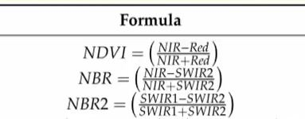
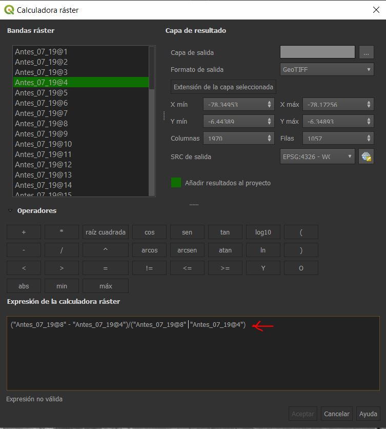
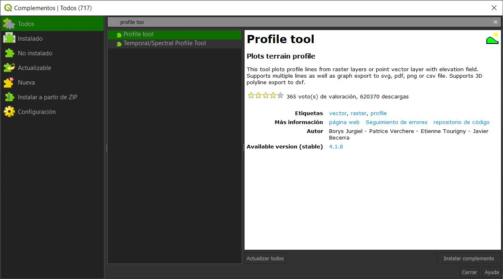
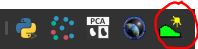
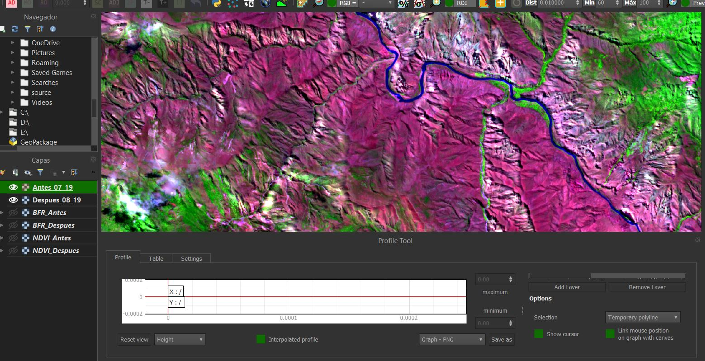
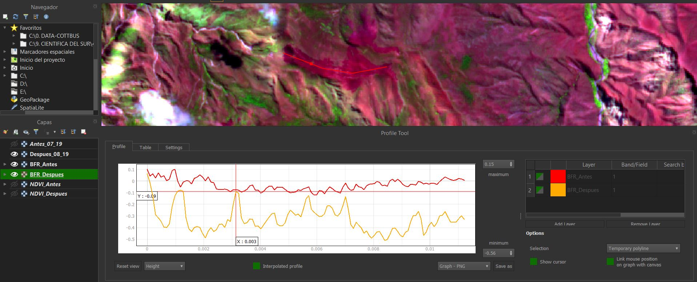
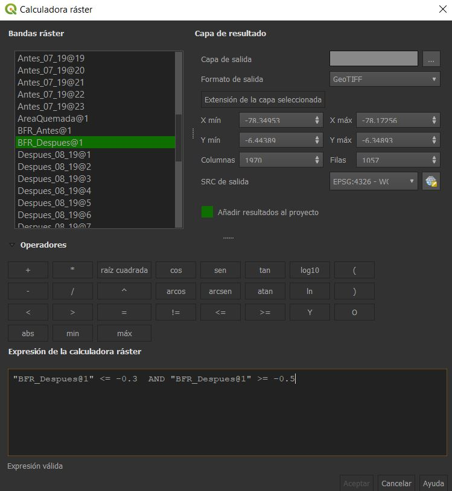
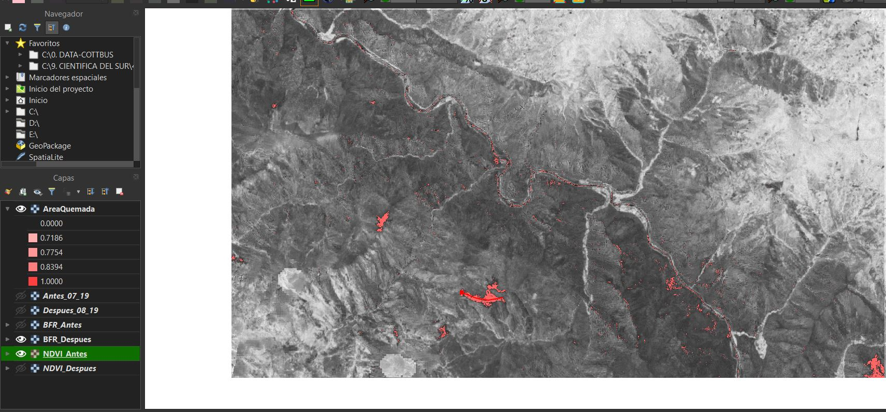

Incendios Forestales
================

# 1. El problema y objetivos

Los incendios son un problema grave y común en los ultimos años. Estos
pueden ser causados por fuentes de ignición humanas o naturales y su
interracción con factores climáticos que fomentan la combustión y
propagación.

Los incendios en zonas vegetales producen impactos negativos en biomas
globales, como pastizales/sabanas (tropicales y subtropicales), bosques
(mediterraneos, templados, boreales y amazonicos) y campos agrícolas.

Los incendios pueden desencadenar efectos negativos, disminyendo la
biodiversidad, la estructura de los ecosistemas y la capacidad de
respuesta y adaptación al cambio climático. Uno de los principales
problemas asociados con los incedios forestales es el cambio de
cobertura y uso de la tierra.

La teledetección es una alternativa viable para el monitoreo de areas
quemadas. Las imagines ofrecen una cobertura sistematica que nos pueden
ayudar a detectar los cambio en el suelo. El uso de esta tecnica tambien
resulta ser rapido y rentable.

Se tendra como objetivo de práctica el de cuantificar áreas de cambio de
cobertura vegetal debido a incendios forestales utilizando imágenes de
satélite ópticas.

Se tiene que buscar un area de estudio donde se haya registrado el
incremento o extensiones amplias de areas quemadas por incendios
forestales. Para dicho analisis, se utilizarán imagenes de Sentinel 2
MSI

# 2. Práctica

## 2.1 Buscar y descargar información satélital antes y despues del incendio + Aplicación de mascaras de nubes Filtro por fecha de captura de colección de datos

Antes de comenzar con este paso debemos de tener claro en que zonas
ocurrio un incendio, sea por conocimiento previo (investigaciones,
noticias, reportes, etc.) o hipotesis o sospecha acerca de incendios en
una area (la cual aun no se ha publicado o no se tiene información al
respecto).

Una vez tengamos la zona geografica y el periodo en el que ocurrio en el
incendio, abriremos GEE Code
(<https://developers.google.com/earth-engine/guides/playground> o
<https://code.earthengine.google.com/>). Tambien tener a la mano el
catalogo de la base de datos de GEE
(<https://developers.google.com/earth-engine/datasets>), especificamente
comenzaremos el codigo de corrección atmosferica de satélites SEN-2
(<https://developers.google.com/earth-engine/datasets/catalog/COPERNICUS_S2_SR>).
En la parte inferior encontraremos el codigo (en lenguaje de
programación Python), el cual copiaremos y pegaremos en un nuevo
“script” en GEE Code (<https://code.earthengine.google.com/>).

En el ejemplo que trabajaremos en clase, usaremos las siguientes
coordenadas de Perú:

-   Map.setCenter(-78.275073, -6.397314, 12)

Y también utilizaremos las siguientes fechas

-   Antes: Del 2019-07-01 al 2019-07-04

-   Despues: Del 2019-08-15 al 2019-08-20

Una vez dentro de la imagen, seleccione el area de interes con las
herramientas de geometria. Luego descargue la imagen con el siguiente
codigo:

//Exportar la imagen, especificando la escala y región.

Export.image.toDrive({

image:dataset.median(),

description: ‘imageToDriveExample\_07\_19’,

scale:10,

region:geometry

});

Al momento de pegarlo, cambiar el codigo original de Map.addLayer( X )

Luego de descargar las imagenes en el Drive de gmail, puede descargarlas
a su computador para trabajarlas en QGIS.

**CODIGO DE DESCARGA CON MODIFICACIONES:**

**/\*\***

**\* Function to mask clouds using the Sentinel-2 QA band**

**\* @param {ee.Image} image Sentinel-2 image**

**\* @return {ee.Image} cloud masked Sentinel-2 image**

**\*/**

**function maskS2clouds(image) {**

**var qa = image.select(‘QA60’);**

**// Bits 10 and 11 are clouds and cirrus, respectively.**

**var cloudBitMask = 1 &lt;&lt; 10;**

**var cirrusBitMask = 1 &lt;&lt; 11;**

**// Both flags should be set to zero, indicating clear conditions.**

**var mask = qa.bitwiseAnd(cloudBitMask).eq(0)**

**.and(qa.bitwiseAnd(cirrusBitMask).eq(0));**

**return image.updateMask(mask).divide(10000);**

**}**

**var dataset = ee.ImageCollection(‘COPERNICUS/S2\_SR’)**

**.filterDate(‘2019-07-01’, ‘2019-07-04’)**

**// Pre-filter to get less cloudy granules.**

**.filter(ee.Filter.lt(‘CLOUDY\_PIXEL\_PERCENTAGE’,20))**

**.map(maskS2clouds);**

**var visualization = {**

**min: 0.0,**

**max: 0.3,**

**bands: \[‘B4’, ‘B3’, ‘B2’\],**

**};**

**Map.setCenter(-78.275073, -6.397314, 12);**

**Map.addLayer(dataset.median(), visualization, ‘RGB’);**

**//Exportar la imagen, especificando la escala y región.**

**Export.image.toDrive({**

**image:dataset.median(),**

**description: ‘ClaseIncendio\_antes\_07\_19’,**

**scale:10,**

**region:geometry**

**});**

## 2.2 Calculo del indice NBR para antes y despues en el programa QGIS

Agregaremos la imagenes descargadas al QGIS. Calcularemos los indices
NDVI (Normalized Difference Vegetation Indez para las imagenes antes y
despues. Luego calcularemos el indice NBR (Normalized Burn Ratio) y
compararemos las areas quemadas por incendios forestales. Finalmente
analizaremos y se estableceran los umbrales de clasificación de áreas
quemadas.

El indice de NDVI nos da la proporción entre la diferencia de las banda
del infrarojo cercano menos la banda roja entre la suma de la banda del
infrarojo cercano mas la banda roja.

El indice NBR se propone como la proporción de la diferencia entre la
banda del infrarojo cercano menos el infrarojo de onda corta 2 entre la
suma del infrarojo cercano mas el infrarojo de onda corta 2. El indicen
nos permitirá densidad vegetal.

Antes de calcular los indices, una vez en el QGIS podemos jugar a
visualizar los incendios con las bandas B12/B8/B4 en las dos figuras.

Ahora vamos a Ráster &gt; Calculadora ráster. Abrirá la siguiente
ventana:

En esta calculadora raster tendremos que calcular “manualmente” los
indices de acuerdo a la formula teorica que tenemos. Para ello hay que
brindarle las bandas correctas (preferible tener nuestra tabla de
equivalencias de las bandas ya que varia de satélite a satélite). Hay
que tener cuidado de brindarle las bandas del antes y despues con
cuidado. Una vez se escriba la formula pueden guardarlo en una carpeta y
luego dar click en Aceptar para obtener la imagen. Por ejemplo:

En los resultados de NVID, los colores más claros representan vegetación
y los colores mas oscuros la ausencia de los mismos.

El mismo ejercicio realizariamos para el calculo de BNR en el antes y
despues. El infrarojo de onda corta 2 es la banda B12 y el infrarojo
cercano nuevamente la banda 8.

## 2.3 Comparación de capas de BNR ante y despues y creación de mascarra

Vamos a instalar y activar el complemento para general perfiles:
“Profile Tool”.

Se va a presentar con el siguiente icono en nuestra sección de
herramientas:

Le damos click al icono. Obtendremos hasta el momento algo parecido a la
siguiente imagen:

Con la herramienta iremos testeando diferentes zonas quemadas y
estableciendo los umbrales maximos y minimos de los indices.
Principalmente trabajaremos con el BNR (antes y despues del incendio)
para establecer los valores umbrales del mismo. Una vez tengamos los
umbrales definidos podemos crear nuestra regla con ayuda de la
calculadora ráster.

## 2.4 Calculo de los umbrales y obtención de las zonas quemadas

Con la herramienta de perfiles iremos tomando valores de BNR para
establecer los umbrales. Una vez activo el complemento, dibujaremos una
linea en la zonas que hemos observado han sido modificadas. Luego
añadiremos las capas del antes y despues y veremos los resultados y
umbrales donde el indice varia (en la imagen del antes y despues). Para
añadir simplemente seleccione la capa y luego añada la capa (opción de
añadir capa). Obtendremos algo parecido a la siguiente imagen:

Podemos tomar mayores muestra y establecer los umbrales de BNR.
Supongamos que el valo escogido sea de -0.3. Es este valor el que vamos
a escoger en la calculadora ráster, para generar una nueva imagen con
las areas quemadas. Para ello colocaremos en la calculadora los
siguientes parametros de la foto del despues:

Finalmente, jugando con los colores y estilos, podemos obtener el
siguiente resultado final, donde podremos obtener las zonas quemadas en
relación al BNR.

Referencias:

-   <https://un-spider.org/advisory-support/recommended-practices/recommended-practice-burn-severity/in-detail/normalized-burn-ratio>

-   <http://gsp.humboldt.edu/OLM/Courses/GSP_216_Online/lesson5-1/NBR.html>

-   <https://wiki.landscapetoolbox.org/doku.php/remote_sensing_methods:normalized_burn_ratio>

-   <https://www.l3harrisgeospatial.com/docs/BackgroundBurnIndices.html>

Video Youtube:

-   <https://www.youtube.com/watch?v=i0R2FC_iefQ>
