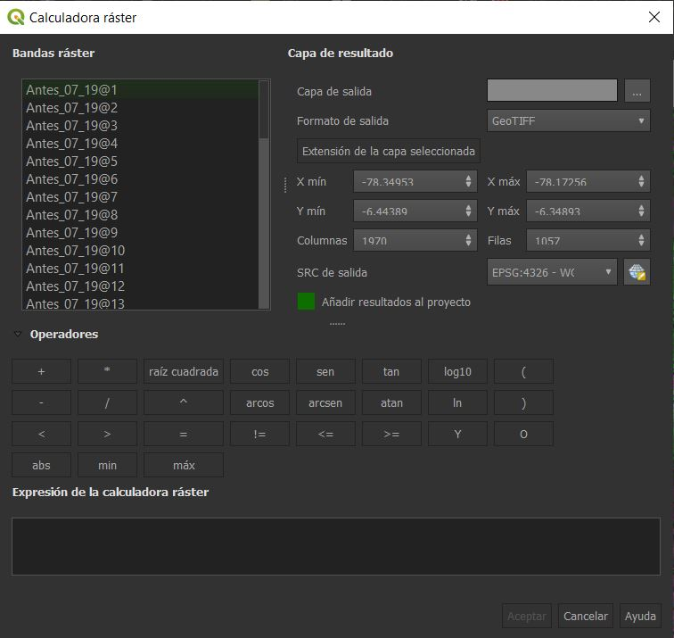

Incendios Forestales
================

# 1. El problema y objetivos

Los incendios son un problema grave y común en los últimos años. Estos
pueden ser causados por fuentes de ignición humanas o naturales y su
interacción con factores climáticos que fomentan la combustión y
propagación.

Los incendios en zonas vegetales producen impactos negativos a la
biomasa en el mundo, afectando pastizales/sabanas (tropicales y
subtropicales), bosques (mediterráneos, templados, boreales y
amazónicos) y campos agrícolas.

Los incendios pueden desencadenar efectos negativos, disminuyendo la
biodiversidad, la estructura de los ecosistemas y su capacidad de
respuesta y adaptación al cambio climático. Uno de los principales
problemas asociados con los incendios forestales es el cambio de
cobertura y uso de la tierra (el cuál veremos en otro capítulo).

La teledetección es una alternativa accesible para realizar el monitoreo
de áreas quemadas. Las imágenes satélitales ofrecen una cobertura
sistemática que permite detectar los cambio en el suelo, entre ellos,
los producidos por incendios. El uso de esta técnica tiene como una de
las principales ventajas la disponibilidad de imágenes libres de costo.

En está práctica se tendrá como objetivo:

1.  Buscar y encontrar un área de estudio donde se haya registrado el
    incremento o extensiones amplias de áreas quemadas por incendios
    forestales

2.  Calculo del indice NBR

3.  Visualizar incendios forestales utilizando imágenes de satélite
    ópticas.

4.  Crearemos un perfil de comparación (antes y después del incendio)

Para dicho análisis, se utilizarán imágenes de Sentinel 2 MSI
(<https://developers.google.com/earth-engine/datasets/catalog/COPERNICUS_S2_SR>)

# 2. Práctica

## 2.1 Buscar y descargar información satelital antes y despues del incendio + Aplicación de mascaras de nubes Filtro por fecha de captura de colección de datos

Antes de comenzar con este paso debemos de tener claro en que zonas
ocurrio el incendio, sea por conocimiento previo (investigaciones,
noticias, reportes, etc.) o hipotesis o sospecha acerca de incendios en
una area (la cual aún no se ha publicado o no se tiene información al
respecto).

Una vez tengamos la zona geografica y el periodo en el que ocurrio en el
incendio, abriremos GEE Code
(<https://developers.google.com/earth-engine/guides/playground> o
<https://code.earthengine.google.com/>). También tener a la mano el
catálogo de la base de datos de GEE
(<https://developers.google.com/earth-engine/datasets>), específicamente
comenzaremos el código de corrección atmosférica de satélites SEN-2
(<https://developers.google.com/earth-engine/datasets/catalog/COPERNICUS_S2_SR>).
En la parte inferior encontraremos el código (en lenguaje de
programación Python), el cual copiaremos y pegaremos en un nuevo
“script” en GEE Code (<https://code.earthengine.google.com/>).

En el ejemplo que trabajaremos en clase, usaremos las siguientes
coordenadas de Perú:

-   Map.setCenter(-78.275073, -6.397314, 12)

Y también utilizaremos las siguientes fechas

-   Antes: Del 2019-07-01 al 2019-07-04

-   Despues: Del 2019-08-15 al 2019-08-20

Una vez dentro de la imagen, seleccione el area de interes con las
herramientas de geometria. Luego descargue la imagen con el siguiente
código:

**//Exportar la imagen, especificando la escala y región.**

**Export.image.toDrive({**

**image:dataset.median(),**

**description: ‘imageToDriveExample\_07\_19’,**

**scale:10,**

**region:geometry**

**});**

Al momento de pegarlo, cambiar el código original de Map.addLayer( X )

Luego de descargar las imágenes en el Drive de gmail, puede descargarlas
a su computador para trabajarlas en QGIS.

**CODIGO DE DESCARGA CON MODIFICACIONES:**

**/\*\***

**\* Function to mask clouds using the Sentinel-2 QA band**

**\* @param {ee.Image} image Sentinel-2 image**

**\* @return {ee.Image} cloud masked Sentinel-2 image**

**\*/**

**function maskS2clouds(image) {**

**var qa = image.select(‘QA60’);**

**// Los bits 10 y 11 son nubes y cirros, respectivamente.**

**var cloudBitMask = 1 &lt;&lt; 10;**

**var cirrusBitMask = 1 &lt;&lt; 11;**

**// Ambas variables deben de estar configurada a cero, indicando
condiciones claras (sin nubes)**

**var mask = qa.bitwiseAnd(cloudBitMask).eq(0)**

**.and(qa.bitwiseAnd(cirrusBitMask).eq(0));**

**return image.updateMask(mask).divide(10000);**

**}**

// Cargamos la imagen

**var dataset = ee.ImageCollection(‘COPERNICUS/S2\_SR’)**

// Aplicamos el filtro por fechas (se descargarán 2 tiempos, repetir el
procedimiento repitiendo el código con la nueva fecha).

**.filterDate(‘2019-07-01’, ‘2019-07-04’)**

**// Se realiza el pre-filtrado y obtenemos granulos con menores
condiciones de nubes.**

**.filter(ee.Filter.lt(‘CLOUDY\_PIXEL\_PERCENTAGE’,20))**

**.map(maskS2clouds);**

// Visualizamos en mosaico a luz natural en RGB

**var visualization = {**

**min: 0.0,**

**max: 0.3,**

**bands: \[‘B4’, ‘B3’, ‘B2’\],**

**};**

// Centramos. Ello evitará que estemos moviendonos y buscando la zona en
el interfaz (el tercer argumento en el zoom).

**Map.setCenter(-78.275073, -6.397314, 12);**

// Añadimos un objeto EE al mapa como una nueva capa

**Map.addLayer(dataset.median(), visualization, ‘RGB’);**

**// Finalmente, esportamos la imagen, especificando la escala y región
de interes que queremos descargar.**

**Export.image.toDrive({**

**image:dataset.median(),**

**description: ‘CIncendio\_antes\_07\_19’,**

**scale:10,**

**region:geometry**

**});**

**IMPORTANTE:** Necesitamos descargar ambas imágenes (el antes y déspues
del incendio).

El código utilizado en el GEE Code, es JavaScript. Las funciones
utilizadas en el GEE, se pueden visualizar en :
<https://developers.google.com/earth-engine/apidocs/map-addlayer>

## 2.2 Calculo del indice NBR para antes y despues en el programa QGIS

Agregaremos la imágenes descargadas al QGIS (ambas). Calcularemos los
indices NDVI (Normalized Difference Vegetation Index para las imágenes
antes y después). Luego, calcularemos el indice NBR (Normalized Burn
Ratio) y compararemos las áreas quemadas por incendios forestales.
Finalmente analizaremos y se establecerán los umbrales de clasificación
de áreas quemadas.

El indice de NDVI se calcula dividiendo la diferencia de las banda del
infrarrojo cercano y la banda roja entre la suma de la banda del
infrarrojo cercano más la banda roja. **Este ejercicio solo lo
realizáremos para familiarizarnos con la herramienta en QGIS.**

El indice NBR se calcula como la división de la diferencia entre la
**banda del infrarrojo cercano** y **la banda del infrarrojo de onda
corta número 2** entre la suma de la **banda del infrarrojo cercano** y
**la banda del infrarrojo de onda corta número 2** . El indice nos
permitirá densidad vegetal.

Ver: <https://www.youtube.com/watch?v=bV1o85dfIuI>

Si se quieren realizar mapas finales de publicación, una clasificación
sugerida para ello, es la que se encuentra en la siguiente página:
<https://un-spider.org/advisory-support/recommended-practices/recommended-practice-burn-severity/in-detail/normalized-burn-ratio>

Antes de calcular los indices, en el QGIS podemos pre-visualizar los
incendios con las bandas B12/B8/B4 en las dos figuras a manera de
exploración.

Ahora si vamos a calcular los indices utilizando la calculadora raster
de QGIS.

-   Vamos a Ráster &gt; Calculadora raster. Abrirá la siguiente ventana:

En esta calculadora raster tendremos que calcular “manualmente” los
indices de acuerdo a la formula teórica que tenemos **(PROBAR CON
NDVI)**. Para ello hay que brindarle las bandas correctas (preferible
tener nuestra tabla de equivalencias de las bandas ya que varia de
satélite a satélite). Hay que tener cuidado de brindarle las bandas del
antes y después con cuidado. Una vez se escriba la formula pueden
guardarlo en una carpeta y luego dar click en Aceptar para obtener la
imagen. Por ejemplo:

En los resultados de NVID, los colores más claros representan vegetación
y los colores mas oscuros la ausencia de los mismos.

El mismo ejercicio realizaríamos para el calculo de BNR en el antes y
después. El infrarrojo de onda corta 2 es la banda B12 y el infrarrojo
cercano nuevamente la banda 8.

## 2.3 Comparación de capas de BNR ante y después y creación de mascara

Para la comparación, vamos a instalar y activar el complemento para
generar perfiles: “Profile Tool”.

Se va a presentar con el siguiente icono en nuestra sección de
herramientas:

Le damos click al icono. Obtendremos hasta el momento algo parecido a la
siguiente imagen:

Con la herramienta iremos probando en diferentes zonas quemadas y
estableciendo los umbrales máximos y mínimos de los indices.
Principalmente trabajaremos con el BNR (antes y después del incendio)
para establecer los valores umbrales del mismo. Una vez tengamos los
umbrales definidos podemos crear nuestra regla con ayuda de la
calculadora raster.

## 2.4 Calculo de los umbrales y obtención de las zonas quemadas

Con la herramienta de perfiles iremos tomando valores de BNR para
establecer los umbrales. Una vez activo el complemento, dibujaremos una
linea en la zonas que hemos observado han sido modificadas. Luego
añadiremos las capas del antes y después y veremos los resultados y
umbrales donde el indice varia (en la imagen del antes y después). Para
añadir simplemente seleccione la capa y luego añada la capa (opción de
añadir capa). Obtendremos algo parecido a la siguiente imagen:

Podemos tomar mayores muestra y establecer los umbrales de BNR.
Supongamos que el valor escogido sea de -0.3. Es este valor el que vamos
a escoger en la calculadora raster, para generar una nueva imagen con
las áreas quemadas. Para ello colocaremos en la calculadora los
siguientes parámetros de la foto del después:

Finalmente, jugando con los colores y estilos, podemos obtener el
siguiente resultado final, donde podremos obtener las zonas quemadas en
relación al BNR.

Referencias:

-   <https://wiki.landscapetoolbox.org/doku.php/remote_sensing_methods:normalized_burn_ratio>

-   <https://www.l3harrisgeospatial.com/docs/BackgroundBurnIndices.html>

Video Complemento:

-   <https://www.youtube.com/watch?v=i0R2FC_iefQ>
-   <https://www.youtube.com/watch?v=vCScHQOEt1Q>
-   <https://www.youtube.com/watch?v=jQWiRXxFKJM>

Más allá de la práctica:

-   <https://www.youtube.com/watch?v=Ph_SdTwZo7g>

-   <https://un-spider.org/advisory-support/recommended-practices/recommended-practice-burn-severity/Step-by-Step/QGIS-sentinel2>

-   <https://www.un-spider.org/advisory-support/recommended-practices/recommended-practice-burn-severity/Step-by-Step/QGIS>
