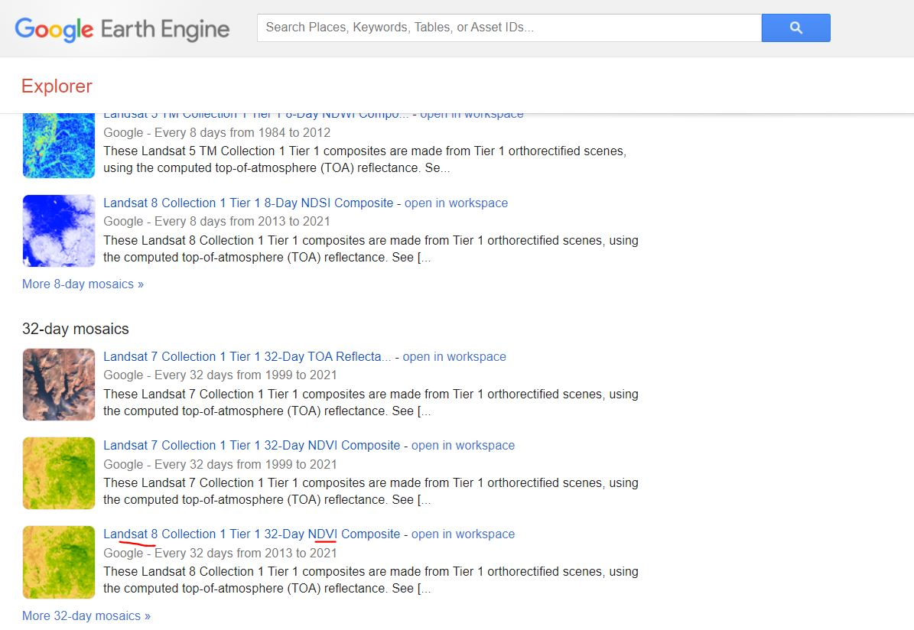
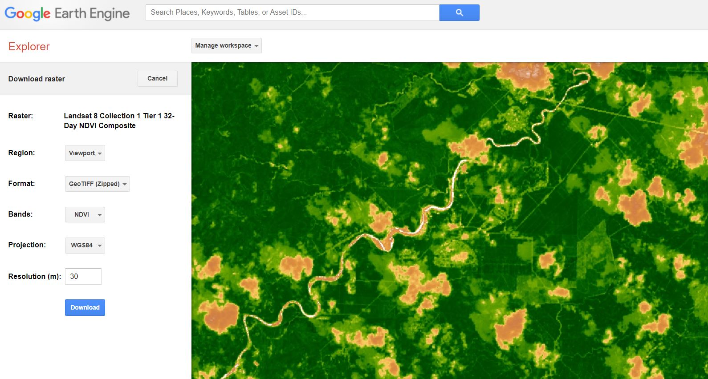
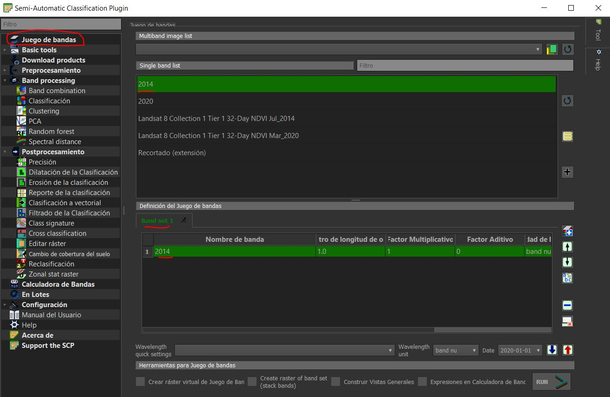
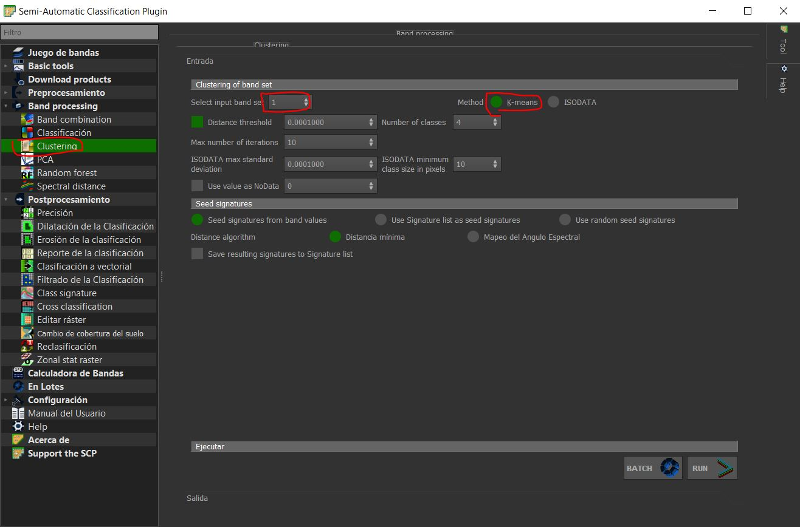
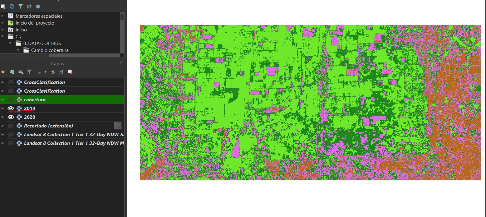
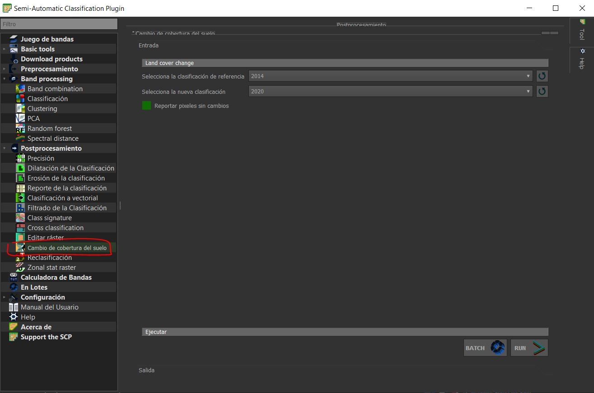
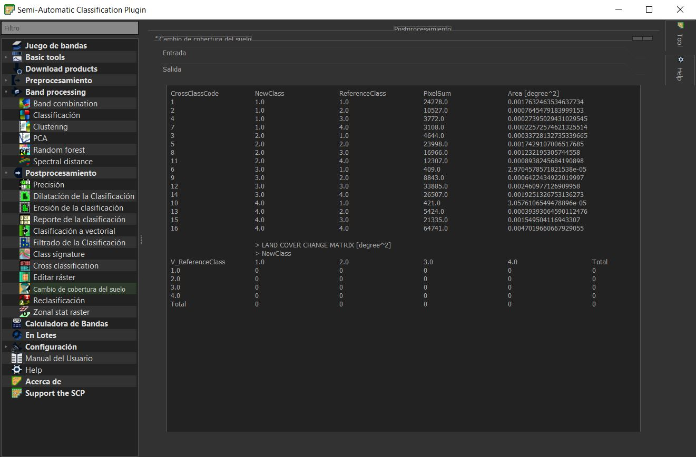
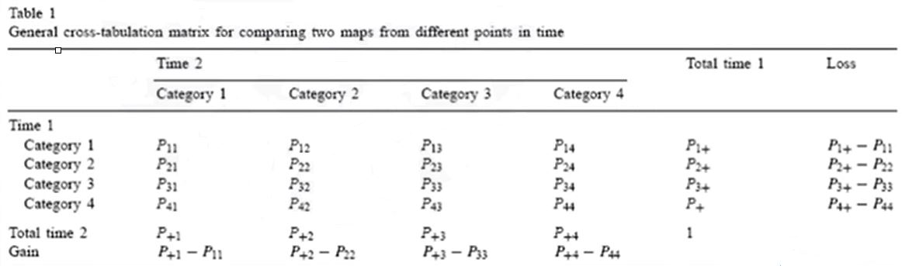

Cambio de cobertura y usos del suelo
================

# 1. El problema y objetivos

El cambio de cobertura es generalmente causado por la actividad
antrópica (generalmente relacionado con actividades agrícolas o
ganaderas). Debido a la diversidad y número de estas actividades humanas
existe la necesidad de cuantificar para así mejorar su gestión y reducir
los impactos en el medio ambiente y sostenibilidad de los ecosistemas.
Algunas de las técnicas que se pueden usar para reducir el cambio de
cobertura son medidas de mitigación y adaptación. Con la ayuda de la
teledetección podemos cuantificar estos cambios y resolver la falta de
información para la optima toma de decisiones.

Mayor información:

En base a los explicado, los objetivos de este capítulo son:

1.  Identificar un lugar y descargar imágnes satelitales LANDASAT 8 del
    periodo 2015 - 2020.

2.  Definir categorías de clases de cobertura y uso de la tierra,

3.  Clasificar y ubicar lo cambios de cobertura y uso de la tierra.

4.  Cuantificar los cambios de cobertura y uso de la tierra

Para ello utilizaremos imágenes del satélite LANDSAT 8 OLI/TIRS con una
cobertura de nubes menor al 20% para optimizar nuestros resultados. La
descarga la realizaremos nuevamente utilizando la plataforma GEE, pero
en este caso utilizaremos el catálogo de GEE (se detalla más abajo). Al
momento de descarga también podemos especificar el sistema de
coordenadas utilizado (el cual debe ser el mismo para todos los datos
que utilizaremos en el sistema).

# 2. Práctica

## 2.1 Obtención de datos

Vamos a utilizar nuevamente el GEE para la búsqueda y descarga de las
imágenes. Luego de ello utilizaremos el programa QGIS y sus herramientas
para el procesamiento y análisis. Por ultimo se calculará y ubicaran los
cambios en QGIS con ayuda del complemento SCP.

Para este ejercicio buscaremos dos años, los cuales serán comparados (se
puede realizar para mayor cantidad de años) en donde sabemos o
sospechamos haya un cambio de cobertura o suelo. Vamos a GEE explorer y
en “**Data Catalog**” podemos ir directamente a la siguiente opción:

Cuando elijamos el lugar de estudio, podemos descargarlo y colocar las
especificaciones en su descarga, como se muestra en la siguiente figura
(se tienen que descargar 2 años diferentes, el antes y después):

## 2.2 Calculo de indice NDVI y clasificación a partir del NDVI

Al utilizar las imágenes directamente de GEE con los parámetros de NDVI
incluidos en la imagen descargada, ya no existe la necesidad de re
calcularlos. A continuación realizamos la técnica de clasificación.

La técnica que se utilizará a continuación se ha adaptado de la
siguiente investigación: <https://ieeexplore.ieee.org/document/7754369>.
Para la clasificación utilizaremos el indice NDVI en una clasificación
no supervisada (agrupamiento no jerárquico kmeans) en el programa SNAP.

Con la sesión de QGIS abierta, procederemos a cargar las imágenes que
hemos obtenido previamente. Una vez cargadas nos dirigimos al
complemento SCP (MANUAL SCP descarga:
<https://www.researchgate.net/publication/265031337_Semi-Automatic_Classification_Plugin_User_Manual>,
en español:
<https://readthedocs.org/projects/semiautomaticclassificationmanual-es/downloads/pdf/latest/>.
Si no funcionan, buscar en:
<https://fromgistors.blogspot.com/p/user-manual.html>) y elegimos las
bandas que trabajaremos en la primera pestaña:

Una vez seleccionada la banda procederemos a realizar la técnica de
agrupamiento o clustering por kmeans. Se realizará un agrupamiento por 4
grupos en este ejemplo:

Este paso lo repetiremos para el segundo año también, obteniendo como
resultado las imágenes clasificadas en 4 grupos (los cuales podremos
editar sus colores en las propiedades de cada raster).

## 2.3 Calculo del cambio de cobertura y uso de tierra en QGIS

Para realizar el calculo de los cambios de cobertura y uso de suelo
utilizaremos una de las herramientas de post-procesamiento del
complemento SCP, la opción de “cambio de cobertura del suelo”.

Elegimos en esta opción las dos capas que estamos evaluando, primero el
año 1 y luego el año 2. Al momento de correr el proceso nos pedirá donde
guardar los resultados, es preferible crear una carpeta nueva para
mantener un orden y ubicarlos fácilmente. Luego de correr nos brindará
el siguiente resultado:

Este resultado también lo podremos obtener en un archivo csv. dentro de
la carpeta donde guardamos los resultados y luego analizarlos. Al
momento de este tutorial, la matriz de cambio de cobertura presenta
valores de 0, lo cual no debería de ocurrir. De todas maneras, con la
información de arriba podemos crear nuestra propia tabla y realizar el
análisis de ganancias y perdidas por tipo de suelo, esta responde a la
siguiente tabla:

# 3. Clasificación supervisada con GEE

Para esta clasificación nos basaremos en:
<https://developers.google.com/earth-engine/guides/classification> en
donde podremos encontrar, el siguiente video:
<https://www.youtube.com/watch?v=NPplRtH2N94&t=2s>

## 3.1 Pasos a seguir:

1.  Contruimos el clasificador:

2.  Entrenamos el clasificador

3.  Aplicamos el clasificador

4.  Evaluamos el resultado final

#### **3.1.1 CODIGO en GEE:**

\`\`\`{//Cargamos nuestra imagen desde la colección LANDSAT 9, añadimos
luego filtros:} var image =
ee.Image(ee.ImageCollection(‘LANDSAT/LC08/C01/T1\_SR’)
.filterBounds(roi) .filterDate(‘2017-05-01’, ‘2017-06-30’)
.sort(‘CLOUD\_COVER’) .first());

// Visualizamos la imagen obtenida: Map.addLayer(image, {bands: \[‘B4’,
‘B3’, ‘B2’\],min:0, max: 3000}, ‘True colour image’);

/// ENTRENAMIENTO:

// Creamos una nueva variable que unirá a la colección los puntos
registrados var clasificadores =
Vegetacion.merge(Pantano).merge(Agua).merge(Ciudad);

// Podemos ver que se ha almacenado en “clasificadores”
print(clasificadores);

// Creamos la base de datos mediante superposición de los puntos de
entrenamiento sobre la imagen. // Básicamente creamos la data de
entrenamiento var bands = \[‘B2’, ‘B3’, ‘B4’, ‘B5’, ‘B6’, ‘B7’\];

var training = image.select(bands).sampleRegions({ collection:
clasificadores, properties: \[‘LUC’\], scale: 30 });

print(training);

// Entrenamos el clasificador

//Classifier.cart -&gt; Classifier.smileCart //Classifier.randomForest
-&gt; Classifier.smileRandomForest //Classifier.naiveBayes -&gt;
Classifier.smileNaiveBayes //Classifier.svm -&gt; Classifier.libsvm

var classifier = ee.Classifier.smileCart().train({ features: training,
classProperty: ‘LUC’, inputProperties: bands });

print(classifier);

// Correr la clasificación var classified =
image.select(bands).classify(classifier);

// Finalmente, mostramos los resultados Map.centerObject(clasificadores,
11); Map.addLayer(classified, {min: 0, max: 3, palette: \[‘green’,
‘black’, ‘blue’,‘yellow’\]}, ‘clasificacion’); \`\`\`

## 3.2 Podemos mejorar la clasificación?

Sí bien la técnica de clasificación utilizando imagenes satelitaes tiene
muchas ventajas, aunque es evidente que algunas regiones no eran super
precisas. ¿Cómo podemos mejorarlo? Hay algunas opciones que podemos
explorar:

1.  Cambie el tamaño de la muestra de entrenamiento. Solo muestreamos X
    píxeles por clase. Esto supuso muchos clics, pero podríamos usar
    **polígonos** en lugar de puntos para muestrear más píxeles para el
    entrenamiento.

2.  Cambie la estrategia de muestreo. Podríamos experimentar con un
    enfoque de muestreo estratificado.

3.  Cambie el clasificador. Usamos un clasificador CART, pudimos probar
    un enfoque diferente, como una máquina de vectores de soporte (SVM)
    o un enfoque randomForest (randomForest).

4.  Cambia las bandas. Podríamos agregar información auxiliar, como
    datos de elevación, o un índice derivado como NDVI para proporcionar
    información para la discriminación de clases.

5.  Cambia la imagen. Podríamos cambiar entre temporadas (p.ej. invierno
    y verano) o cambiar a una imagen a Sentinel-2.

Revisar: <https://www.geospatialecology.com/intro_rs_lab5/>

## 3.3 Midiendo la precisión del modelo de clasificación

-   Opcional para la práctica. Necesario en un análisis real. Pueden
    comenzar viendo el siguiente video para un calculo inicial de la
    precisión en GEE :
    <https://www.youtube.com/watch?v=Yw2Ej11xbdk&t=823s>

Averiguar más sobre el coeficiente de Kappa y profundizar en diferentes
metologías.

# Referencias

-   <https://journals.plos.org/plosone/article?id=10.1371/journal.pone.0200493>

-   <https://www.frontiersin.org/articles/10.3389/fenvs.2020.00021/full>

-   <https://oceanservice.noaa.gov/facts/lclu.html>

-   <https://www.sciencedirect.com/science/article/abs/pii/S2352938520300495>

-   <https://www.sciencedirect.com/science/article/abs/pii/S0143622810001670>

-   <https://www.sciencedirect.com/science/article/pii/S0143622810001670>

-   Para un proceso utilizando una clasificación supervisada en QGIS, el
    siguiente enlace:
    <https://un-spider.org/advisory-support/recommended-practices/recommended-practice-land-cover-change/step-by-step>
