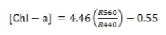
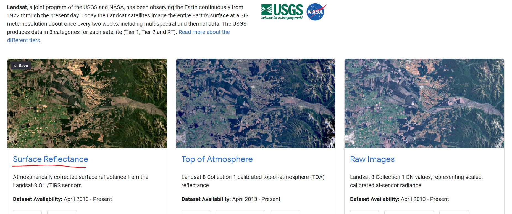
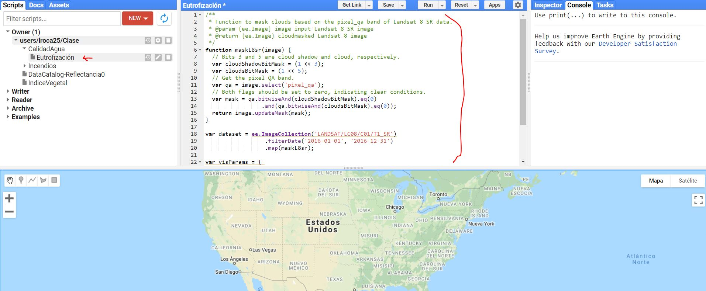
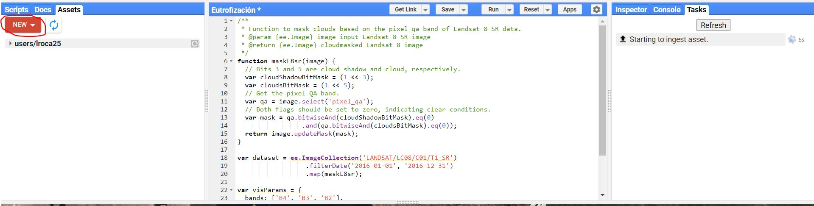
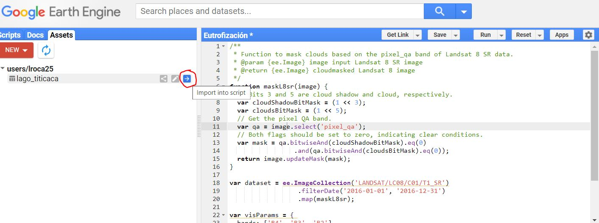
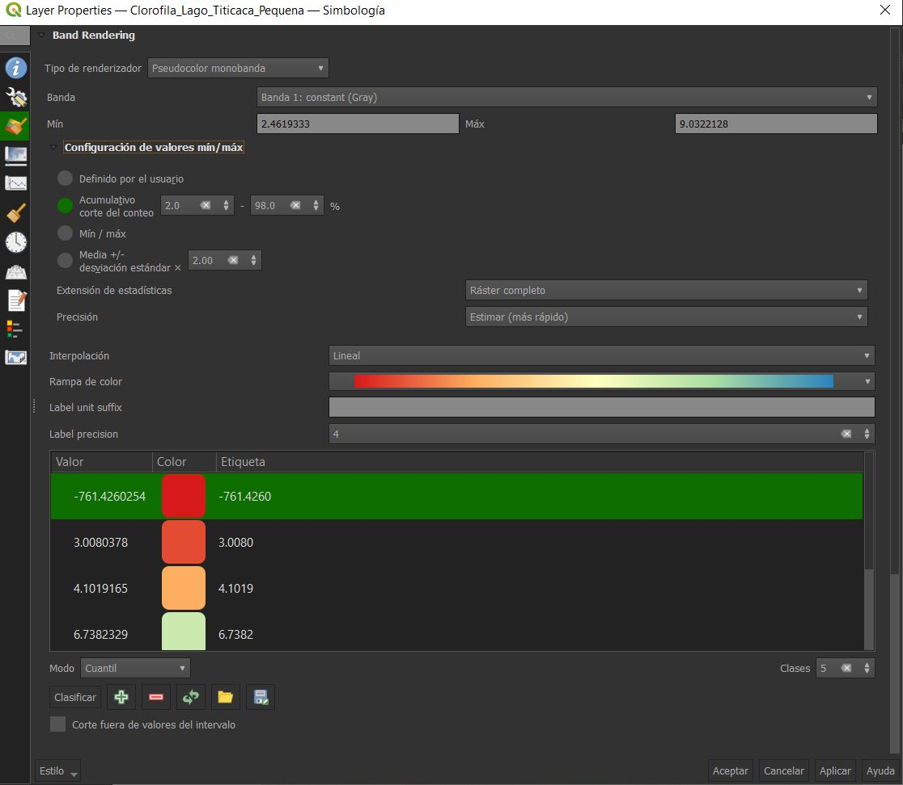
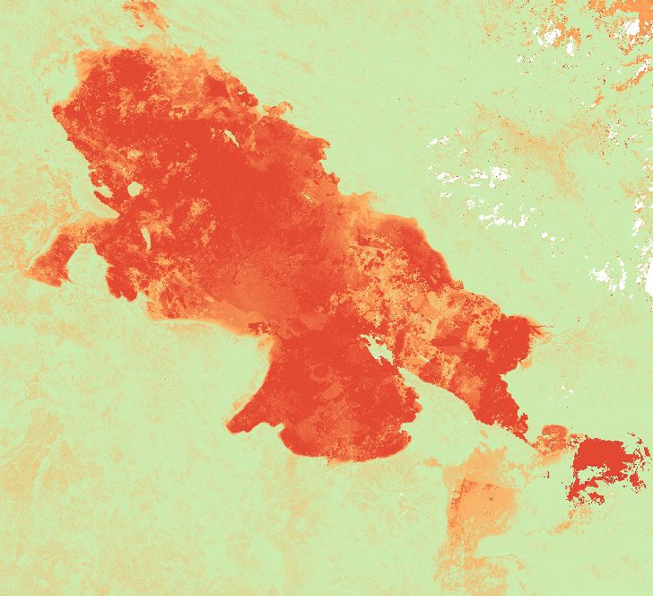
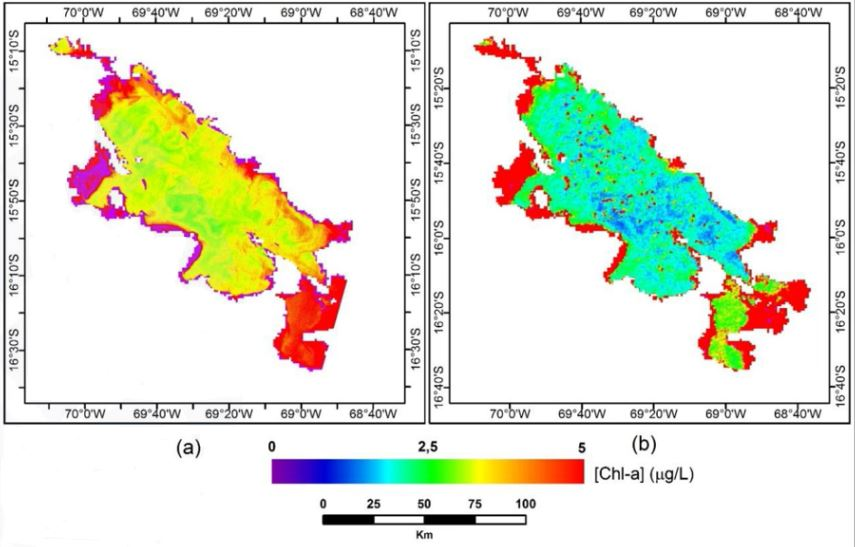

Calidad del agua
================

# 1. Introducción

Tenemos conocimiento que los cuerpos de agua sufren contaminación por
actividades principalmente humanas. En tal sentido es importante obtener
información de la distribución y la calidad de estos cuerpos de agua,
sin embargo el trabajo en campo es oneroso y muchas veces dificil de
llevar a cabo. Las imagenes satélitales son alternativas para generar
información sobre el estado de los cuerpos de agua y facilitan la
gestión e identificación de efectos negativos sobre los ecosistemas y la
salud de comunidades colindantes a aguas contaminadas.

## 1.1 Definición de parametros de calidad ambiental de los cuerpos de agua

Se estudiará la variable “concentración de clorofila-a”, la cual es de
gran importancia en el seguimiento de la calidad de las aguas
continentales. Es un indicador de la biomasa del fitoplacton en cuerpos
de agua, altamente relacionado con los problemas de eutrofización en
lagos.

Este ejemplo esta basado en el trabajo de investigación “Comparison of
MODIS and Landsat-8 retrievals of Chlorophyll-a and water temperature
over Lake Titicaca” (<https://ieeexplore.ieee.org/document/7730993>).
Este analisis utiliza el algoritmo basado en la transferencia radiativa
para el agua “HydroLight”:

En donde \[Chl-a\] se mide en microgramos por Litro y R-lambda (R560 y
R440) es la reflectividad en la banda de longitud de onda lambda (en
nanometros).

# 2. Descarga de datos

Para este ejemplo utilizaremos imagenes satélitales LandSat8 OLI/TIRS
del año 2020 en GGE con cobertura de nubes menor al 20% (sistema WGS 84
y proyección UTM Zona 18 Sur). Las imagenes que descargaremoremos tienen
bandas espectrales y corregidas a reflectancia de la superficie
atmosferica. Para ella iremos al catalogo de GEE de Landsat
(<https://developers.google.com/earth-engine/datasets/catalog/landsat>)
y escogeremos los datos de Landsat 8 - Colección 1, con superficie
atmosferica eliminada:

Nota: Utilizamos las imagenes Landsat 8 de la Tier 1 (Cual es la
diferencia entre Tier 1 y Tier 2? —&gt;
<https://www.usgs.gov/media/videos/landsat-collections-what-are-tiers>).

Copiamos el codigo de la base de datos y lo copiamos en un nuevo archivo
previamente abierto en “GEE Code”
(<https://code.earthengine.google.com/>).

Ahora podremos comenzar a variar el codigo para obtener la imagen
deseada. Antes de ello podemos correr el codigo para evidenciar como
funciona.

Antes de comenzar con el proceso, usaremos una nueva herramieta dentro
del GEE Code, aprenderemos a añadir “Assets” dentro de nuestro editor.
En el menú superior izquierda, daremos click en la pestaña de “Assets” y
le daremos click en “New” para añadir un shapefile del lago titicaca (el
cual se les brindará en clase). Una vez introducido, el GEE tardará en
subirlo, como se visualiza en la siguiente imagen:

Una vez cargado, lo podran visualizar siempre en su servidor personal,
en la pestaña de Assets (a menos que lo eliminen), para importarlo a
nuestro script apretaremos el boton que sale en la siguiente figura:

Se añadira en la parte superior del script la variable “table”
represetando a nuestro shapefile. Podemos cambiarle el nombre de “table”
por “geometria” (le damos click a table y editamos).

## 2.1 Aplicación del algoritmo basado en el modelo de transferencia radiativa para el agua HydroLight

De la linea 1 hasta la 17 no vamos a modificar nada ya que correspone a
la corrección de supertifice atmosferica. A partir de la fila 17
introduciremos codigo que nos permitirá utilizar nuestro shapefile de
lago titicaca en el codigo, el codigo final sera el siguiente (si lo
copian, no olvidar editar las comillas "", en el editor de codigo).

**Comienza el codigo…**

/\*\*

\* Function to mask clouds based on the pixel\_qa band of Landsat 8 SR
data.

\* @param {ee.Image} image input Landsat 8 SR image

\* @return {ee.Image} cloudmasked Landsat 8 image

\*/

function maskL8sr(image) {

// Bits 3 and 5 are cloud shadow and cloud, respectively.

var cloudShadowBitMask = (1 &lt;&lt; 3);

var cloudsBitMask = (1 &lt;&lt; 5);

// Get the pixel QA band.

var qa = image.select(‘pixel\_qa’);

// Both flags should be set to zero, indicating clear conditions.

var mask = qa.bitwiseAnd(cloudShadowBitMask).eq(0)

.and(qa.bitwiseAnd(cloudsBitMask).eq(0));

return image.updateMask(mask);

}

//Insertamos el shapefile

var geometry = ee.FeatureCollection(‘users/lroca25/lago\_titicaca’)

//Definir filtros de imagen

var dataset = ee.ImageCollection(‘LANDSAT/LC08/C01/T1\_SR’)

.filterBounds(geometry)

.filterDate(‘2020-01-01’, ‘2020-04-30’)

.map(maskL8sr);

//Presentar imagenes seleccionadas

print(“Imagenes seleccionadas”, dataset)

//Definir bandas a seleccionar

var bands = \[“B2”, “B3”, “B4”, “B5”, “B6”, “B7”\]

dataset = dataset.select(bands);

//Aplicar reducción de mediana (reduce las 17 imagenes obtenidas a una
sola en función a la mediana)

var mediana = dataset.median();

//Definir parametros de visualización

Map.addLayer(mediana, {bands:\[“B7”, “B5”, “B4”\], min:\[0, 0, 0\],
max:\[3000,3000,3000\], gamma:1.4}, “Landsat 8 OLI/TIRS”);

Map.centerObject(geometry, 8);

**… termina el codigo (podemos jugar con el zoom y bandas (B5-B4-B3).**

Luego de identificar la zona y aplicar los filtros, podemos realizar el
calculo de clorofila-a y visualizarlo en el GEE Code, con el siguiente
codigo:

**Comienza el codigo …**

//Calculo de Clorofila 2(Chl-a)

var Chla = mediana.expression(“float((4.46\*VERDE/AZUL)-0.55)”, {

“VERDE”: mediana.select(“B3”),

“AZUL”: mediana.select(“B2”)

})

//Ver imagen en el mapa

Map.addLayer(Chla, {max:5, min:0, “palette”:\[“FFFFFF”, “CE7E45”,
“DF923D”, “F1B555”, “FCD163”, “99B718”,

“74A901”, “66A000”, “529400”, “3E8601”, “207401”, “056201”, “004C00”,
“023B01”, “012E01”, “011D01”, “011301”\]}, “Chla con Paleta”);

Map.centerObject(geometry, 8)

**… termina el codigo.**

Para evitar que se demore la visualización en cargar, podemos añadir la
simboliga “//” a los codigos de la antigua visualización. Dentro del
visualizador, en Layers podemos ver los detalles de las mascaras
utilizadas.

Luego de esta visualización, podemos exportarla con el siguiente codigo
(como en casos anteriores):

Comienza el codigo …

//Exportar imagen a Google Drive

Export.image.toDrive({

image:Chla,

description:“Clorofila\_Lago\_Titicaca”,

scale:30,

region:geometry

})

… termina el codigo

## 2.2 Analisis de los resultados

Una vez obtenida la imagen, podemos pasarla al QGIS para analizar los
resultado y modificar los colores y establecer categorias de
distribución (que pueden basarse en datos de campo o metodologias
previamente establecidas).

Esta configuración nos puede brindar el siguiente resultado:

Los resultados pueden presentarse en tablas, en la cual se visualicen
los datos de captura de las imagenes de satélites utilizadas. También
podemo utilizar gráficos de alguno de los resultados estadísticos, si el
estudio lo comprendiera (comparar los datos satelitales vs concentración
media de fitoplacton en campo, etc.). Por ultimo podriamos presentar
mapas con la ubicación de la zona de estudio y la distribución de los
parametros estudiados o analizados o incluso series de tiempo que
evidencien el cambio de los mismos.

En el caso de la siguiente figura se utilizo un shapefile del lago
titicaca para solo representar la zona del lago (se hace un corte con
mascara).

