Temperatura Superficial
================

# 1. Introducción

En espacios urbanos y rurales siguen en aumento en relación al
desarrollo economico y incremento de la población mundial. La expansión
de estas zonas generalmente degrada, fracciona los espacios aledaños
naturales generando ciertos desiquilibrios ambientales. La perdida de
cobertura boscosa, esta relacionada con el aumento de temperatura
superficial y emisiones de gases de efecto invernadero. En los espacios
urbanos, las areas destinadas a construcción tienen una reacción
exotermica, es decir que generan calor. Las actividades dentro de la
ciudad, sobretodo en zonas industriales tambien generan lo que
denominamos “islas de calor”, que su suma a la perdida de areas
verdes.Son durantes las noches donde nosotros podemos observar el calor
liberado y durante el dia se van almacenando.

Una de las formas indirectas de medir los cambios sobre un determinado
territorio es la relación que existe en el cambio de cobertura y uso de
la tierra y la temperatura superficial de la tierra.

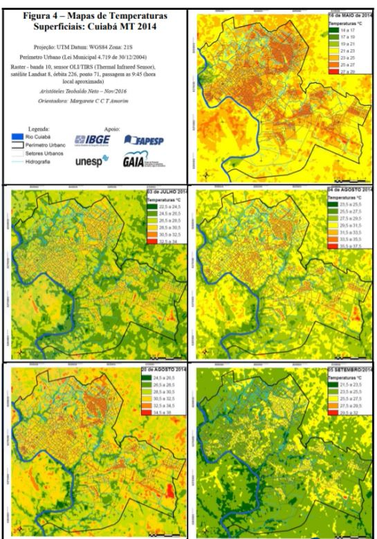

## 1.1 Objetivos de la práctica

Se buscará analizar el cambio de temperatura superficial a partir de
imagenes de satélite. Para ellos primero se recopilara información
satelital, luego se modelará la temperatura superficial y por ultimo se
realizará el calculo de diferencia de temperatura superficial.

# 2. Búsqueda y descarga de datos

Se descargaran imagenes satélitales para el año 1 y 2 en GEE. Para este
ejemplo utilizaremos imagenes satélitales LandSat8 OLI/TIRS (bandas 4,
5, 10 y 11) obtenidas del motor GGE con cobertura de nubes menor al 20%
(sistema WGS 84 y proyección UTM Zona 18 Sur). Iremos al explorador de
GEE (<https://explorer.earthengine.google.com/#workspace>) . En el
catalogo de datos buscaremos la siguiente opción (en mosaicos de 8
dias):

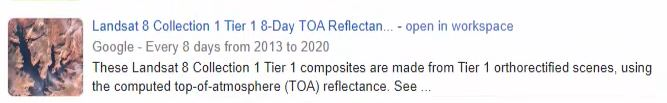

Puede encontrarlo en el siguiente link:
<https://explorer.earthengine.google.com/#detail/LANDSAT%2FLC08%2FC01%2FT1_8DAY_TOA>.
De click en la opción “Open in workspace”. Luego buscaremos las imagenes
de la región objetivo. En este caso utilizaremos en el ejemplo la zona
de la selva del Peru, cercana a la ciudad de Aguaytia. Nos acercamos a
la zona y brindamos la combinación de bandas B8-B5-B4 para las fechas de
Nov1 al Nov9 del 2013:

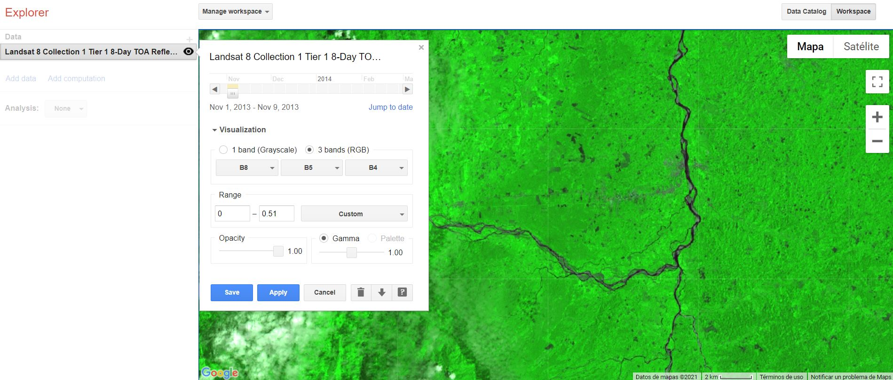

Descargamos la imagen como veces anteriores, con las siguientes
caracteristicas:

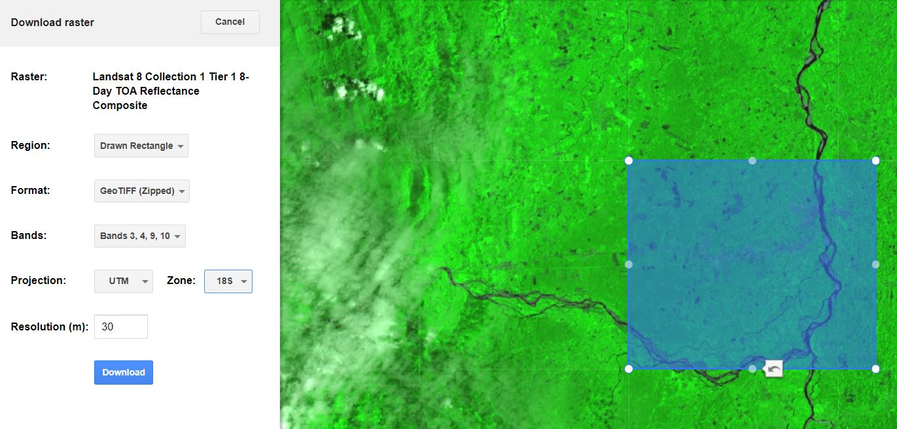

Realizamos el mismo procedimiento para un segundo año, el cual será la
segunda semana de diciembre del año 2016.

# 3. Modelamiento de cambio de la temperatura superficial

## 3.1 Calculo del indice de NDVI para la correción de la temperatura superficial

Para el modelamiento deberemos realizar el calculo de NDVI con las
bandas Rojas (4) e infrarrojas (5). El calculo de NDVI nos permitirá
corregir o determinar el calculo de la temperatura superficial.

Cargamos ambas imagenes descargadas al QGIS en un nuevo proyecto.
Podemos realizar un corte para obtener ambas imagenes del mismo tamaño.
Obtendremos luego dos raster para trabajar:

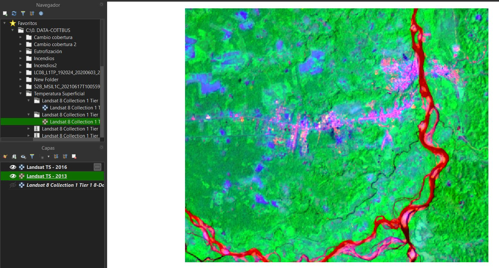

Vamos a calcular ahora el NDVI para los dos años en estudio. Esto lo
podemos realizar aplicando las tecnicas previamente vistas en los
modulos anteriores utilizando la calculadora Raster.

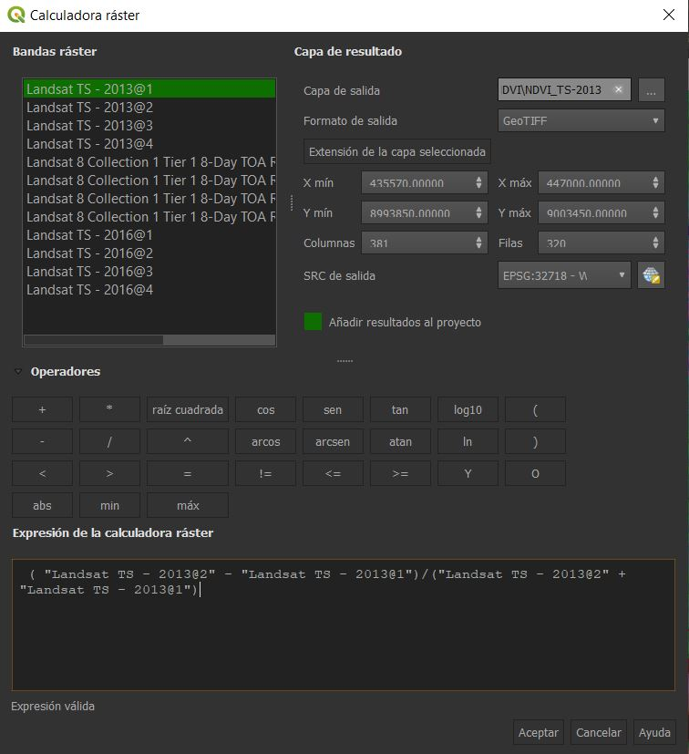

A partir de tener los dos nuevos raster NDVI, procederemos a realizar el
calculo de la emisividad y consiguientemente la temperatura superficial.
Tanto la banda 10 y 11 que nos da la temperatura en grados Kelvin
responden a temperaturas de brillo. Es decir, a temperaturas que han
sido tomadas por el sensor. Esto hay que corregirlo y llevarlo a
temperatura superficial.

## 3.2 Modelamiento de la Temperatura Superficial

Para el modelamiento vamos a realizar el siguiente conjunto de pasos

1.  Realizaremos el calculo de radianza

2.  Realizaremos el calculo de la temperatura de brillo

3.  Realizaremos el calculo de la emisividad de la superficie con el
    NDVI

4.  Realizaremoes el calculo de la temperatura de la superficie de la
    tierra

Los pasos 1 y 2 los hemos realizado automaticamente la momento de
utilizar el catalogo de GEE, procederemos a realizar el paso 3 y 4. Para
el paso 3, nos podemos apoyar en investigaciones como las realizadas por
Griend & Owe
(<https://www.tandfonline.com/doi/abs/10.1080/01431169308904400>).

La formula para el calculo de la temperatura de superficie para este
ejercicio es la siguiente:

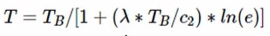

El valor de lambda lo sacaremos de la siguiente banda (dependiendo de
cual banda utilicemos de brillo, cambiara nuestro valor de lambda en la
formula):

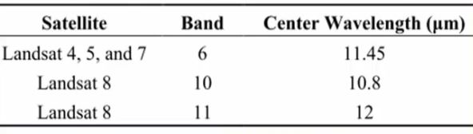

El valor de c2 corresponde a una constante (14388 micrometros por
Kelvin) y equivale a la constante de Planck multiplicada por la
velocidad de la luz y dividida entre la constanten de Boltzmann. TB es
la temperatura de brillo de la banda elegida (B10 o B11). Por ultimo el
valor de e, es el que calcularemos a partir de los valores de NDVI,
mediante la siguiente formula:

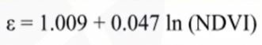

Todos estos valores los calcularemos en la calculadora de QGIS para cada
uno de los años. Calculamos la emisividad primero en base a los valores
de NDVI.

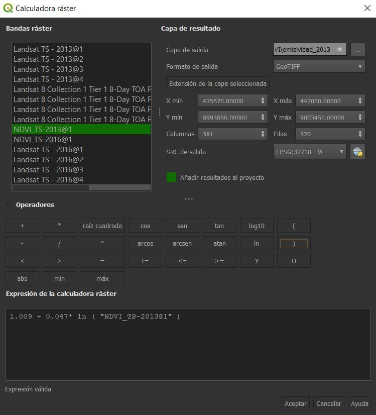

Lo mismo calculariamos para el año 2016.

Luego realizamos el paso 4, el calculo de la temperatura de superficie,
utilizando la formula presentada. Para el calculo utilizaremos la
temperatura de Brillo de la banda 10. La formula aplicada en la
calculadora raster, seria para el año 2013:

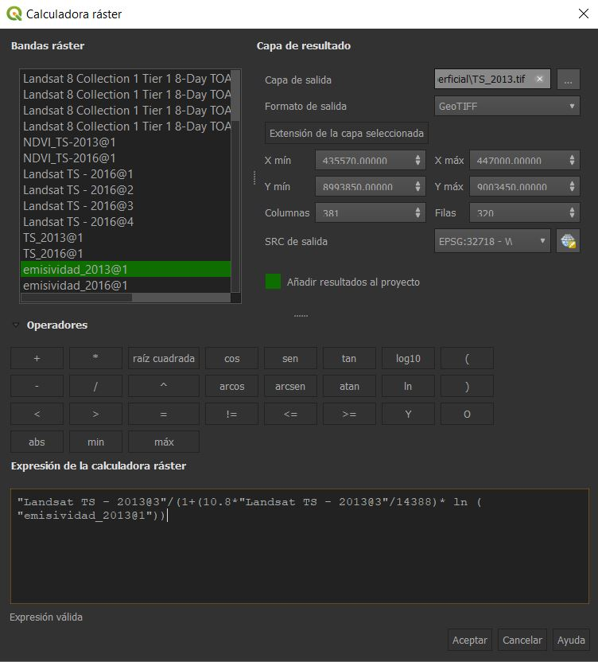

Obtendremos finalmente imagenes parecidas a las siguientes:

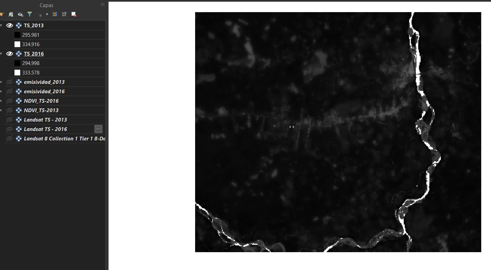

# 4. Análisis del cambio de la temperatura superficial

Lo que pretendemos entender es cual ha sido la dinamica de cambio de la
temperatura superficial (Año 1 vs Año 2). Para ello realizaremos el
calculo de diferencias de temperatura.

Para comenzar el analisis podemos cambiar las propiedades de los raster
de temperatura superficial a un pseudocolor:

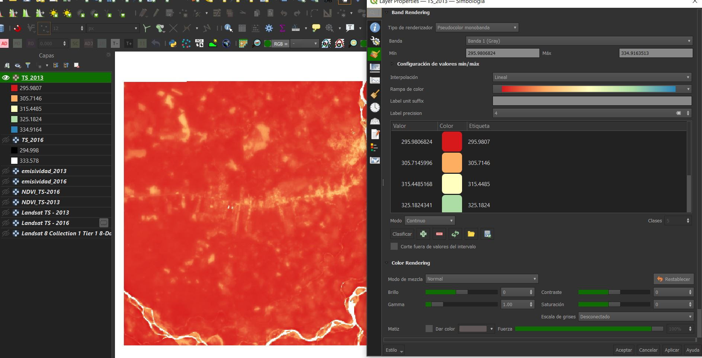

Podemos invertir los colores y encontrar una representación clara de la
distribución de temperatura:

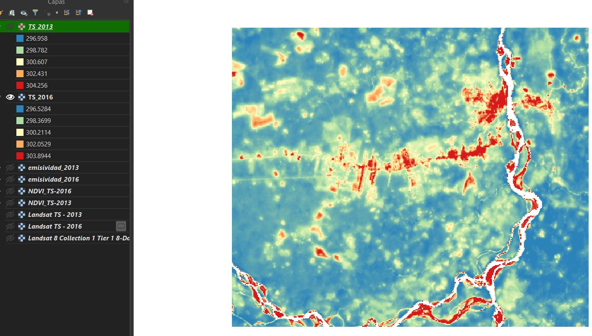

Podemos realizar un perfil del suelo en base a su temperatura con la
herramienta “Terrain Profile” para comparar los años.
