Inundación
================

# 1. Introducción

Los eventos climáticos tienen efectos negativos para los seres humanos y
la biodiversidad en el corto y largo plazo, los cuales aumentan su
intensidad gradualmente en los ultimos años. El problema de producido
por inundaciones, como el aumento del nivel del mar, fuertes tomentas o
incremento de la precipitación son algunos de los problemas con
terribles consecuencias, especialmente en ciudades costeras vulnerables
o cercanas a un río.

La prescencia de un temporal o permanencia de una superficie acuatica
pueden afectar la vegetación, tanto areas de cultivo, como bosques,
generando grandes perdidas economicas, sociales y ambientales. Aunque no
siempre significan perdida, algunos pobladores pueden aprovecha este
tipo de fenomenos para sembrar cultivos como arroz u otros aprovechando
el contexto.

En esta práctica utilizaremos información proveniente de RADAR (Radio
Detection and Ranging). Esta tecnología tiene 3 funciones básicas,
transmite una señal de microondas hacia la escena, recibe la proporción
de la señal transmitida que vuelve de la escena y por ultimo observa la
intensidad (detección) y el tiempo de retardo de la señal que vuelve
(rango).

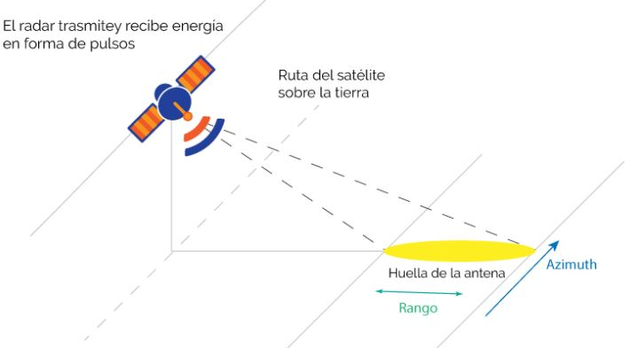

El radar en lugar de medir hacia abajo, toma datos en angulo. Al medir
el tiempo que le toma a la señal ir desde la antena a la superficie y
vuelva a la antena. Es importante que el retardo se mida con alta
precisiíon.

El SAR (Synthetic Aperture Radar), es el radar de apertura sintetica, el
cual usa microondas en un sistema activo con longitud de onda de 3 a 24
cm. Este sistema tiene la capacidad de adquirir datos a través de las
nubes y en la oscuridad. La resolución de las imagenes de satélite ronda
de 10 a 50 metros. A pesar de todo ello, son sensibles a la rugosidad de
la superficie terrestre, la constante dielectrica de la superficie
(medida de permitividad de un material el cual mide la capacidad de un
cuerpo para acumular carga electrica) y las propiedades de la
vegetación.

La señal de radar es polarizada, las cuales se controlan entre H y V:

-   HH: Transmitida Horizontalmente, Recibida Horizontalmente.

-   HV: Transmitida Horizontalmentem, Recibida Verticalmente.

-   VH: Transmitida Verticalmente, Recibida Horizontalmente.

-   VV: Transmitida Verticalmente, Recibida Verticalmente.

    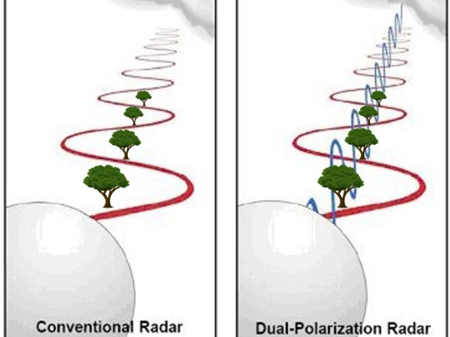

La configuración Quad-Pol es cuando se miden las cuatro polarizaciones.
Diferentes polarizaciones pueden ser utilizadas para determinar las
propiedades fisicas del objeto observado.

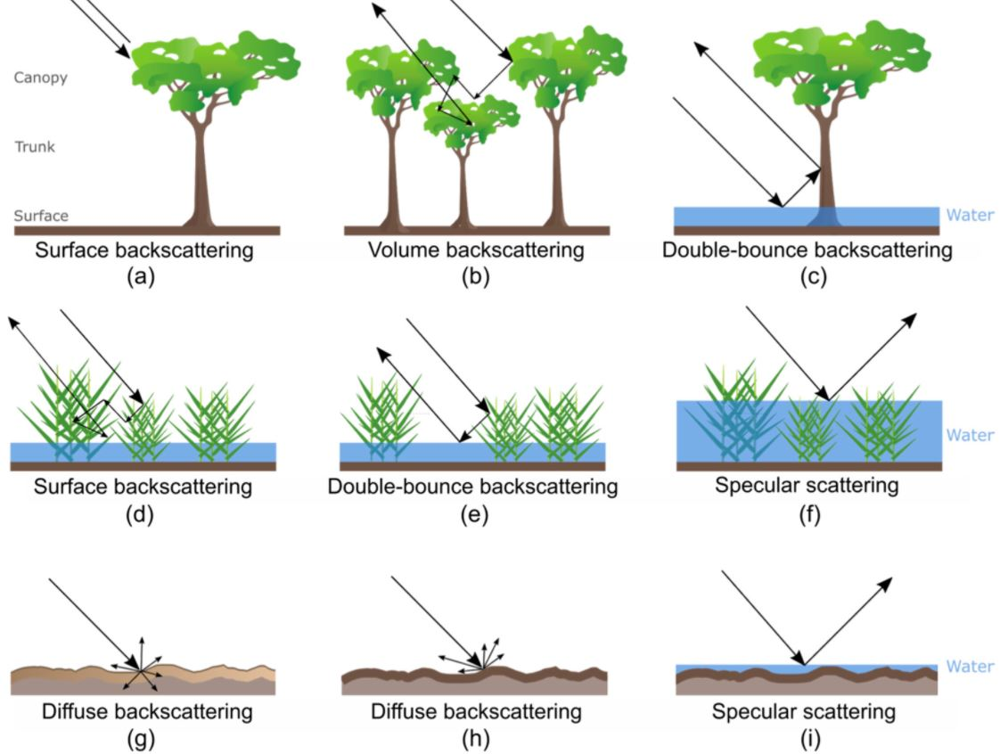

En rios, las aguas principalmente se muestran de color oscuro ya que se
comportan como una superficie liza (i). Por otro lado las areas de
vegetación inundadas se veran con areas brillantes debido a un dobre
rebote (c).

# 2. Obtención de datos

El objetivo general de la práctica sera la de generar un mapa de
inundación utilizando imágenes SAR en la plataforma GEE. Para ello
utilizaremos datos de 2 satélites SENTINEL 1 (el A y el B), usando sus
bandas C. Cada satélite tiene una cobertura de cada 12 días. Al utilizar
ambos, la cobertura global es de 6 días sobre la línea ecuatorial.

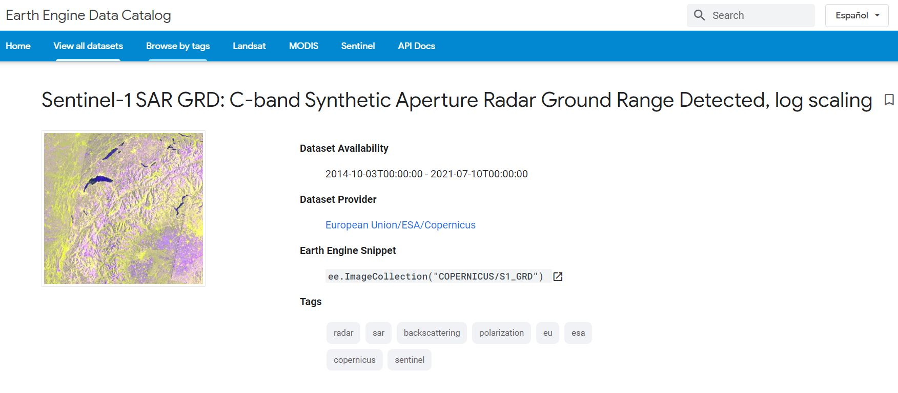

Aqui encontrarán la base de datos a utilizar del GEE
(<https://developers.google.com/earth-engine/datasets/catalog/COPERNICUS_S1_GRD>)

Los parametros de busqueda seran los siguientes para la práctica:

-   Fecha inicial: 2019-11-01, 2019-11-30

-   Fecha final: 2020-02-01, 2020-02-28

-   Polarización: VV + HH

-   Tipo de producto: Ground Range Detected (GRD)

-   Modo de sensor: Interferometric Wide (IW)

La ubicación es el centro poblado de Tamishiyacu, Loreto. El codigo que
utilizaremos es el propuesto por Erika Podest , Sean McCartney y otros
autores de la NASA.

-   <https://www.youtube.com/watch?v=D1Te1A5-a0A>

-   <https://appliedsciences.nasa.gov/sites/default/files/2020-11/SAR_Part1_Spanish.pdf>

Información extra:

-   <https://appliedsciences.nasa.gov/sites/default/files/2020-11/SAR_Part2_Spanish.pdf>

# 3. Metodología

## 3.1 Visualizar los datos de Sentinel 1 en GEE y seleccionar el area de interes.

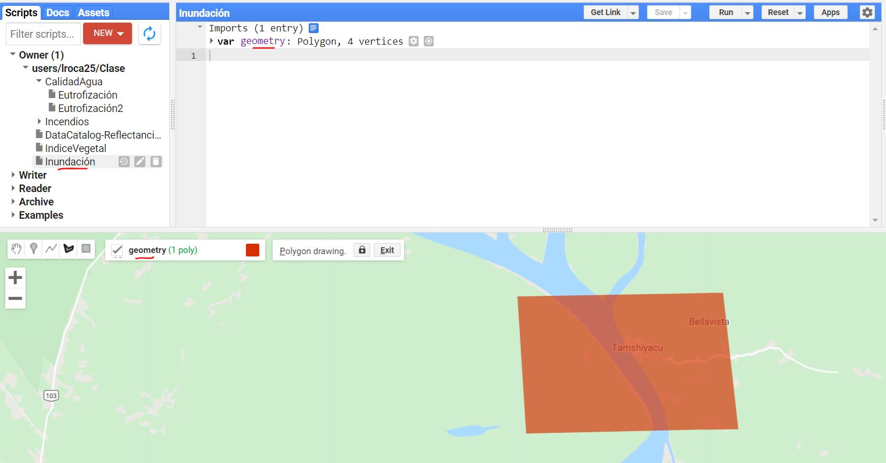

## 3.2 Aplicar el filtro a los datos de Sentinel 1 y definir las fechas de estudio

**Inicio de codigo…**

// Load Sentinel-1 C-band SAR Ground Range collection (log scale, VV,
descending)

var collectionVV = ee.ImageCollection(‘COPERNICUS/S1\_GRD’)

.filter(ee.Filter.eq(‘instrumentMode’, ‘IW’))

.filter(ee.Filter.listContains(‘transmitterReceiverPolarisation’, ‘VV’))

.filter(ee.Filter.eq(‘orbitProperties\_pass’, ‘DESCENDING’))
.filterMetadata(‘resolution\_meters’,

‘equals’ , 10)

.filterBounds(roi)

.select(‘VV’);

print(collectionVV, ‘Collection VV’);

// Load Sentinel-1 C-band SAR Ground Range collection (log scale, VH,
descending)

var collectionVH = ee.ImageCollection(‘COPERNICUS/S1\_GRD’)

.filter(ee.Filter.eq(‘instrumentMode’, ‘IW’))

.filter(ee.Filter.listContains(‘transmitterReceiverPolarisation’, ‘VH’))

.filter(ee.Filter.eq(‘orbitProperties\_pass’, ‘DESCENDING’))

.filterMetadata(‘resolution\_meters’, ‘equals’ , 10)

.filterBounds(roi)

.select(‘VH’);

print(collectionVH, ‘Collection VH’);

**… termina el codigo.**

Este filtro seleccionará las imagenes en las colecciones VV y VH:

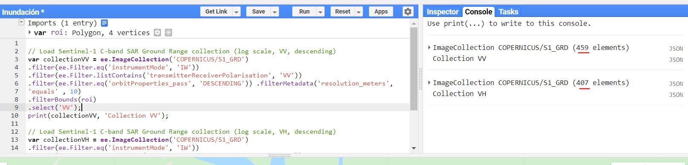

Aplicaremos ahora el siguiente codigo:

//Aplicamos un filtro por fechas

var beforeVV = collectionVV.filterDate(‘2019-11-01’, ‘2019-11-30’);

var afterVV = collectionVV.filterDate(‘2020-02-01’, ‘2020-02-28’);

var beforeVH = collectionVV.filterDate(‘2019-11-01’, ‘2019-11-30’);

var afterVH = collectionVH.filterDate(‘2020-02-01’, ‘2020-02-28’);

print(beforeVV,‘Before VV’);

print(afterVV,‘After VV’);

print(beforeVH,‘Before VH’);

print(afterVH,‘After VH’);

**Al aplicar el codigo obtendremos la colecciones filtradas por
fechas:**

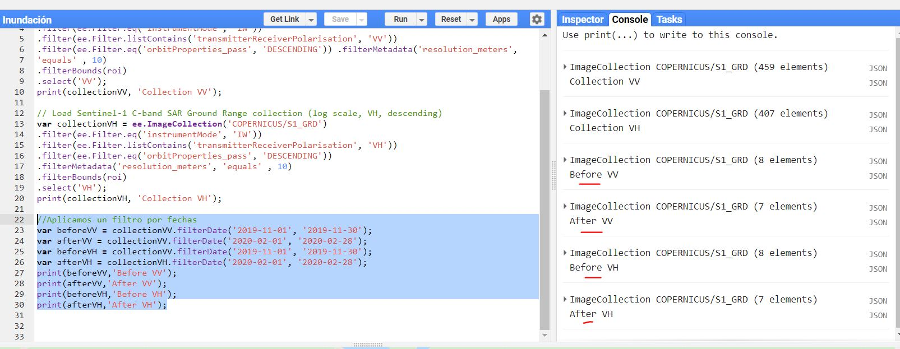

## 3.3 Filtrar los datos Sentinel 1 por fecha y crear un mosaico para un antes y un despues

**Codigo…**

//Mostramos cada una de las imagenes del antes y despues

function addImage(image){//muestra cada imagen en la colección

var id = image.id;

var image = ee.Image(image.id);

Map.addLayer(image);

}

beforeVV.evaluate(function(beforeVV){

beforeVV.features.map(addImage)

})

**… termina codigo**

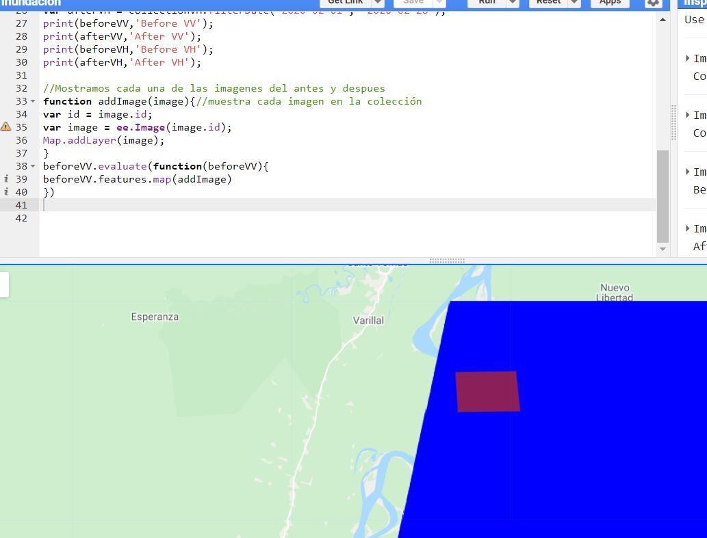

## 3.4 Vamos ahora a filtrar por fecha y crear un mosaico para el antes y despues

Aplicamos:

//Filtramos por fecha y creamos mosaico

var beforeVV = collectionVV.filterDate(‘2019-11-01’,
‘2019-11-30’).mosaic();

var afterVV = collectionVV.filterDate(‘2020-02-01’,
‘2020-02-28’).mosaic();

var beforeVH = collectionVV.filterDate(‘2019-11-01’,
‘2019-11-30’).mosaic();

var afterVH = collectionVH.filterDate(‘2020-02-01’,
‘2020-02-28’).mosaic();

//Mostramos en el mapa

Map.centerObject(roi, 12);

Map.addLayer(beforeVV, {min:-15, max:0},‘Before flood VV’, 0);

Map.addLayer(afterVV, {min:-15, max:0},‘After flood VV’, 0);

Map.addLayer(beforeVH, {min:-25, max:0},‘Before flood VH’, 0);

Map.addLayer(afterVH, {min:-25, max:0},‘After flood VH’, 0);

Obtenemos:

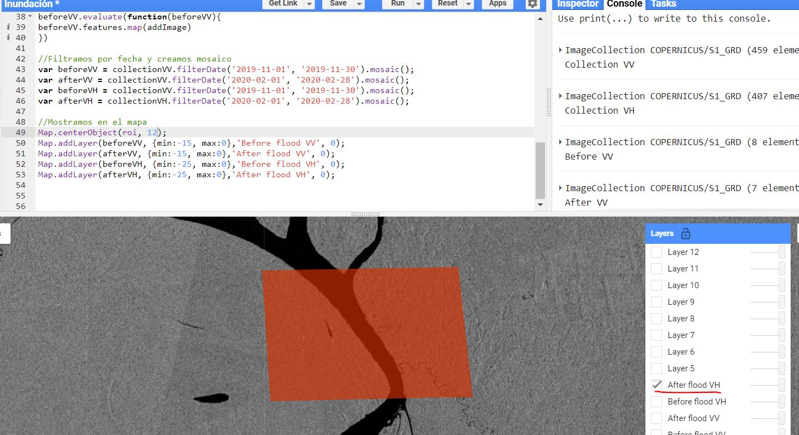

## 3.5 Podemos ahora realizar una composición en RGB (u otra)

Aplicamos el siguiente codigo:

`{//Visualizamos en RGB} Map.addLayer(beforeVH.addBands(afterVH).addBands(beforeVH), {min: -25, max:-8}, 'BVH/AVV/AVH composite', 0);`

No se olviden de deseleccionar todas las capas adicionales y solo
seleccione la que estamos generando: BVH/AVV/AVH. Obtendremos:

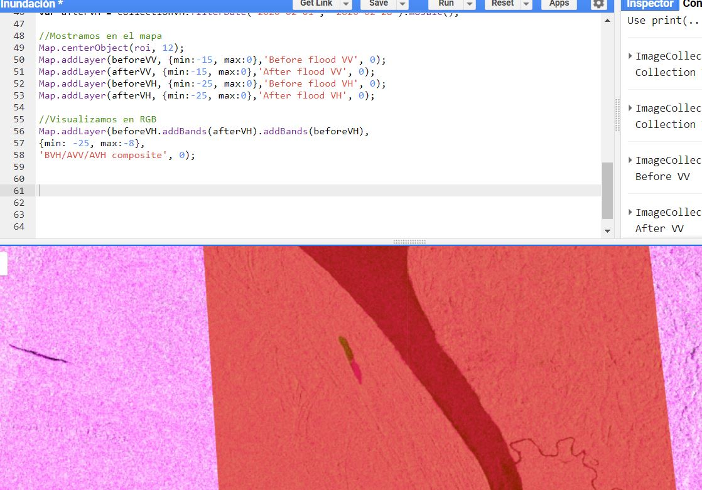

## 3.6 Aplicar un filtro “Speckle”

Lo que realiza este filtro es suavizar la imagenes que quizá tienen
algunos pixeles sueltos o individuales (llamado efecto sal y pimienta).
Este efecto no deseado se controla con el filtro Specke.

**Codigo…**

//Aplicamos el filtro de Speckle

var SMOOTHING\_RADIUS = 50;

var beforeVV\_filtered = beforeVV.focal\_mean(SMOOTHING\_RADIUS,
‘circle’, ‘meters’);

var beforeVH\_filtered = beforeVH.focal\_mean(SMOOTHING\_RADIUS,
‘circle’, ‘meters’);

var afterVV\_filtered = afterVV.focal\_mean(SMOOTHING\_RADIUS, ‘circle’,
‘meters’);

var afterVH\_filtered = afterVH.focal\_mean(SMOOTHING\_RADIUS, ‘circle’,
‘meters’);

//Mostramos las imagenes filtradas

Map.addLayer(beforeVV\_filtered,{min:-15, max:0},‘Before flood VV
Filtered’, 0);

Map.addLayer(beforeVH\_filtered, {min:-25, max:0},‘After flood VH
Filtered’, 0);

Map.addLayer(afterVV\_filtered, {min:-15, max:0},‘After Flood VV
Filtered’, 0);

Map.addLayer(afterVH\_filtered, {min:-25, max:0},‘After Flood VH
Filtered’, 0);

**… termina codigo**

Obtenemos:

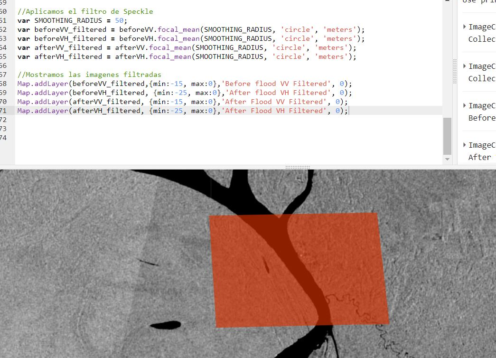

Se puede comparar entre el filtrado y no filtrado para ver las
diferencias.

## 3.7 Calcular la diferencia entre el antes y el despues y aplicar un umbral

En el ultimo paso utilizaremos el siguiente codigo:

**Codigo empieza…**

//Calculamos la diferencia entre el antes y el después

var differenceVH =

afterVH\_filtered.divide(beforeVH\_filtered);

Map.addLayer(differenceVH, {min:O, max:2},

‘difference VH filtered’, 0);

**… codigo termina**

Aplicamos un umbral para tener una mejor visualización del resultado:

//Aplicamos el umbral

var DIFF\_UPPER\_THRESHOLD = 1.25;

var differenceVH\_thresholded = differenceVH.gt(DIFF\_UPPER\_THRESHOLD);

Map.addLayer(differenceVH\_thresholded.updateMask(differenceVH\_thresholded),{pallete:“0000FF”},

‘flooded areas - blue’,1);

Deberia de salirnos algo parecido a la siguiente imagen:

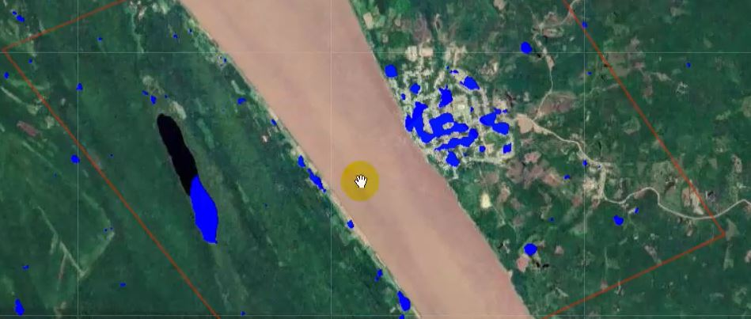
