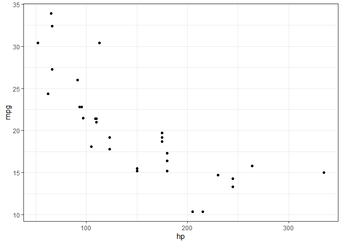
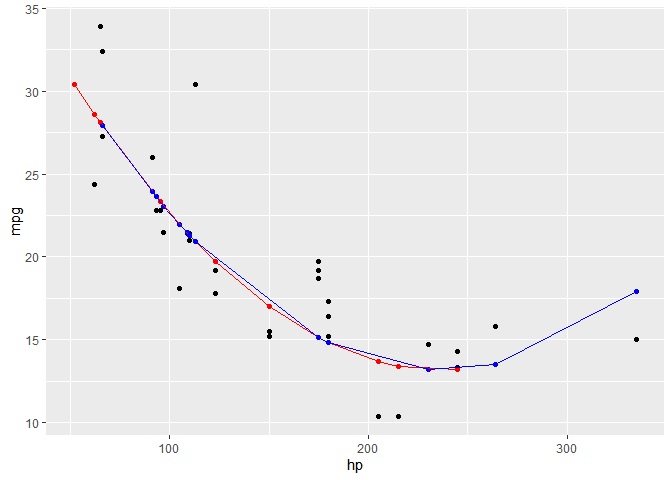

5. Explicativo vs Predictivo + Regresiones No Lineales
================
Luis Roca
9/5/2021

Paquetes que se utilizarán

``` r
library(tidyverse)
```

    ## -- Attaching packages --------------------------------------------- tidyverse 1.3.0 --

    ## v ggplot2 3.3.3     v purrr   0.3.4
    ## v tibble  3.0.0     v dplyr   1.0.5
    ## v tidyr   1.0.2     v stringr 1.4.0
    ## v readr   1.3.1     v forcats 0.5.0

    ## -- Conflicts ------------------------------------------------ tidyverse_conflicts() --
    ## x dplyr::filter() masks stats::filter()
    ## x dplyr::lag()    masks stats::lag()

``` r
library(MuMIn) #Facilita la inferencias de modelos múltiples
library(caret) #Entrenamiento para regresiones y clasificaciones
```

    ## Loading required package: lattice

    ## 
    ## Attaching package: 'caret'

    ## The following object is masked from 'package:purrr':
    ## 
    ##     lift

``` r
library(broom) #La usaremos para ver resúmenes de información acerca de un modelo
```

## A. Poder predictivo y explicativo de un modelo

Es necesario entender que mientras podemos calcular el R2 de un modelo
en su estado básico (su poder explicativo), también debemos de
calcularlo (R2) independientemente para su poder predictivo. Es decir,
obtendremos 2 coeficientes de determinación para cada uno de los
objetivos.

El R2, que vimos en la primera parte, nos brinda el poder explicativo
del modelo analizado, para calcular el poder predictivo, tenemos que
partir nuestra base de datos en 2. Generalmente esta partición se da en
una proporción de 70% (entrenamiento o creación del modelo) y 30%
(testeo del modelo una vez entrenado y creado), aunque también se pueden
manejar otros porcentajes como 50/50. Para evidenciar esto, dividiremos
en dos la base de datos **mtcars** (del paquete datasets). Cargamos la
base de datos y luego continuamos con los pasos.

``` r
data("mtcars")
```

### A.1. Separamos las bases de datos de entrenamiento y de testeo

Primer crearemos un indice en donde seleccionaremos los valores que se
tomarán para entrenar el modelo (en el ejemplo, sera el 50% de los
datos, es decir, 16 valores). Luego de crear este indice, se utilizará
para crear las bases de datos de entrenamiento y testeo:

``` r
set.seed(10)

Indice <- sample(1:nrow(mtcars), size = round(nrow(mtcars)/2)) # Separa posiciones, no valores de la base de datos original. 

Entrenamiento <- mtcars[Indice,]

Testeo <- mtcars[-Indice, ]
```

### A.2. Visualizamos los datos

Para intentar crear el mejor modelo, es recomendable visualizar los
datos en un diagrama de dispersión. Este nos puede ayudar a acercarnos
al mejor modelo que se ajuste a los datos observados. Vamos a estudiar
la relación entre la eficiencia de combustible (mpg) y si tiene alguna
relación con los caballos de fuerza (hp) de un vehículo.

``` r
mtcars %>% 
  ggplot()+
  geom_point(aes(x=hp, y=mpg))+
  theme_bw()
```

<!-- -->

### A.3. Creamos el modelo

Asumiremos que el modelo seria mejor explicado por una ecuación
cuadrática (sin embargo, también podría ser cubica o también
exponencial, etc. El tip esta en ir probando las hipótesis que vayamos
teniendo). Creamos el modelo cuadrático:

``` r
Modelo_Entrenamiento <- lm(data=Entrenamiento, mpg ~ hp + I(hp^2))
```

Podemos observar los resultados con la función **summary()**. Sin
embargo, en esta ocasión, utilizaremos la función **glance()** del
paquete **broom**

``` r
glance(Modelo_Entrenamiento)
```

    ## # A tibble: 1 x 11
    ##   r.squared adj.r.squared sigma statistic p.value    df logLik   AIC   BIC
    ##       <dbl>         <dbl> <dbl>     <dbl>   <dbl> <int>  <dbl> <dbl> <dbl>
    ## 1     0.807         0.778  3.07      27.3 2.23e-5     3  -39.0  86.0  89.1
    ## # ... with 2 more variables: deviance <dbl>, df.residual <int>

Podemos observar que nos brinda varios valores de interés, entre ellos
el R2, el R2-ajustado, el p-valor del modelo, los valores AIC y BIC del
modelo. Por el momento solo nos concentraremos en la evaluación del R2,
el cual representaría el poder explicativo del modelo. A continuación
realizaremos la predicción y calcularemos el R2 con la data de testeo.

### A.4. Predecimos los valores con la data de testeo

Para predecir los valores en cualquier modelo, podemos usar la función
**predict()**. Generaremos una nueva columna con los valores de
predicción tanto para la base de datos de entrenamiento y testeo.
Precisamente, para evaluar el poder predictivo de un modelo es necesario
probarlo con una base de datos que no ha sido utilizada en su
entrenamiento (es decir, data que no necesariamente se ajustará al
modelo)

``` r
Entrenamiento_F <- 
  Entrenamiento %>% 
  select(hp, mpg) %>% 
  mutate(pred = predict(Modelo_Entrenamiento, Entrenamiento),
         resid = pred - mpg)

Testeo_F <- 
  Testeo %>% 
  select(hp, mpg) %>% 
  mutate(pred = predict(Modelo_Entrenamiento, Testeo),
         resid = pred -mpg)
```

Para medir el poder predictivo usaremos la función **postResample()**
del paquete **caret**, usando dos argumentos, pred = y obs =. En el
primer argumento colocaremos los valore predichos con la base de datos
de testeo y en el segundo argumento utilizamos los valores observados de
la base de datos de testeo.

``` r
postResample(pred = Testeo_F$pred, obs = Testeo_F$mpg)
```

    ##      RMSE  Rsquared       MAE 
    ## 3.2350930 0.6671718 2.2832848

De aquí obtenemos varios valores, pero nos interesa solo el R2. Este
valor de R2, nos da a entender que tan bien los datos de la base de
datos de testeo se ajustan al modelo generado con la base de datos de
entrenamiento.

Podemos hacer una comparación entre la tendencia de los puntos predichos
por la base de datos entrenamiento vs testeo:

``` r
ggplot()+
  geom_point(data = mtcars, aes(x=hp, y=mpg))+
  geom_point(data = Entrenamiento_F, aes(x=hp, y=pred), color ="red")+
  geom_point(data = Testeo_F, aes(x=hp, y=pred), color = "blue")+
  geom_line(data = Entrenamiento_F, aes(x= hp, y=pred), color ="red")+
  geom_line(data = Testeo_F, aes(x= hp, y=pred), color ="blue")
```

<!-- -->
