Modelos adicionales
================

# 1. Modelo de regresión de árboles de decisión

Vamos a trabajar con la siguiente base de datos para el ejemplo:

``` r
library(tidyverse)

Salarios <- read.csv("https://raw.githubusercontent.com/joanby/machinelearning-az/master/datasets/Part%202%20-%20Regression/Section%209%20-%20Random%20Forest%20Regression/Position_Salaries.csv")
```

En la base de datos se ve una lista de trabajadores divididos por su
categoria en su trabajo (codificada en la variable “level”). Se tiene
una tercera variable cuantitativa con el salario estimado de cada
categoria.

### 1.1 Seleccionamos antes solo las variables que vamos a trabajar:

``` r
Salarios <- 
  Salarios %>% 
  dplyr::select(Level, Salary)
```

### 1.2 Ajustar el modelo Random Forest con el conjunto de datos

Instalamos el paquete randomForest y luego lo activamos

``` r
library(rpart)
```

Generamos luego el modelo de Random Forest (o bosques aleatorios):

``` r
set.seed(123)
Modelo <- rpart(formula = Salary ~ .,
                data = Salarios)
```

### 1.3 Predicción de nuevos resultados

``` r
y_pred = predict(Modelo, newdata = data.frame(Level = 6.5))
y_pred
```

    ## [1] 249500

### 1.4 Visualización del modelo de Random Forest

Vamos para esta ocasión generar una malla:

``` r
x_grid = seq(min(Salarios$Level), max(Salarios$Salary), 0.5)
#El nivel de detalle de nuestro grid, nos permitira ver las diferencias, sin embargo puede ser que tome mucha memoria de nuestro CPU. El valor de separación se recomienda minimo de 0.1 o 0.01.
```

Ahora utilizamos el paquete ggplot2 para graficar:

``` r
ggplot() +
  geom_point(aes(x = Salarios$Level, 
                 y = Salarios$Salary),
             color = "red") +
  geom_line(aes(x = Salarios$Level, 
                y = predict(Modelo, newdata = data.frame(Level = Salarios$Level))),
            color = "blue") +
  ggtitle("Predicción (Random Forest)") +
  xlab("Nivel del empleado") +
  ylab("Sueldo (en $)")
```

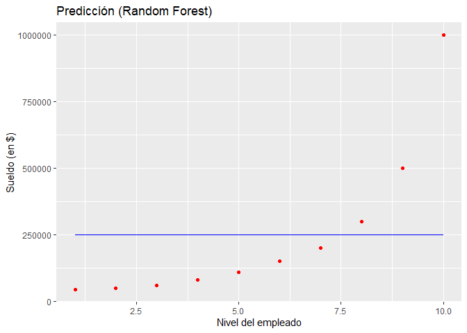<!-- -->

Nos vamos a percatar que nuestro modelo no es muy bueno para predecir o
mejor dicho predice lo mismo para todos los niveles (lo cual no nos
ayuda mucho o pierde utilidad).

### 1.5 ¿Qué hacer? ¿Que parametros deberiamos utilizar para intentar mejorar nuestro modelo?

?rpart

En la documentación buscaremos el argumento **“parms”**. Este parametro
es de control en la generación del árbol. Esto nos permitirá agregar un
tercer argumento (opcional) que permite corregir algunos modelos. Si
bien, muchos modelos en el R ya vienen predefinidos (por defecto), no
siempre esos valores seran los mas indicados para nuestro modelo en
particular (hay que investigar más y modificarlos). Aplicamos el
siguiente cambio en nuestro modelo:

``` r
set.seed(123)
Modelo <- rpart(formula = Salary ~ .,
                data = Salarios,
                control = rpart.control(minsplit = 1))
```

Utilizando la función **“rpart.contro()”**, nos permite definir el
parametro **minsplit**. El parametro minsplit, es el número minimo de
observaciones que tienen que existir en un nudo para proceder a su
división en dos nodos (rama u hoja). Por defecto este valor es de 20, lo
cual no es compatible con el número de datos que tenermos, por ello lo
cambiamos a 1.

A partir de este cambio podemos realizar nuevamente las predicciones y
veremos diferencias, pero las veremos mas claras en el siguiente
gráfico:

``` r
ggplot() +
  geom_point(aes(x = Salarios$Level, 
                 y = Salarios$Salary),
             color = "red") +
  geom_line(aes(x = Salarios$Level, 
                y = predict(Modelo, newdata = data.frame(Level = Salarios$Level))),
            color = "blue") +
  ggtitle("Predicción (Random Forest)") +
  xlab("Nivel del empleado") +
  ylab("Sueldo (en $)")
```

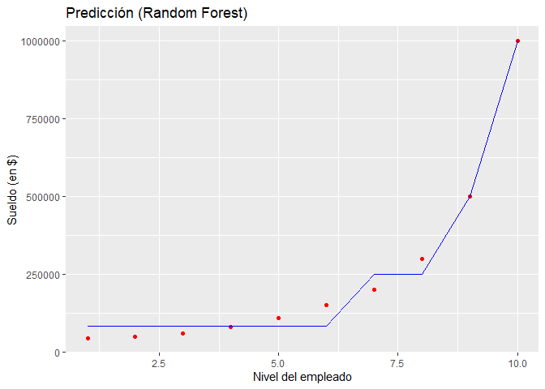<!-- -->

Contra mayor sean los cambios (entropia) entre empleado y empleado
(unidad y unidad), se produciran precisamente las nuevas categorias.

Las lineas **“graduales”** no son precisamente una verdad, por ejemplo
de aproximadamente el nivel 6 al 6.5 parece subir progresivamente, sin
embargo eso es falso. Realmente lo que ocurre es que todo el mundo tiene
el sueldo anterior y luego tiene el sueldo siguiente. Pero como en
nuestro conjunto de datos hemos utilizado el x orginal para hacer el
gráfico, la linea la a trazado de manera continua (es decir, sin
levantar el lapiz, uniendo los puntos correspondientes de cada uno de
los niveles). Esto no deberia ocurrir ya que el proceso es discreto
(categorias).

Para ello podemos crear una parrilla (grid) que genere un conjunto
continuo de valores. Entonces, si en lugar de utilizar los mismos puntos
del conjuto de datos, utilizamos la parrilla x para la linea geometrica,
el comportamiento de la linea sera diferente. Sin embargo, nivel de
detalle de nuestro grid, conforme nosotros queramos mas detalle, puede
que demande mucha memoria de nuestro CPU (incluso se puede colgar). Si
usted tiene un computador potente, el valor de separación de nuestra
gradilla se recomienda de 0.1 o 0.01. En el siguiente ejemplo se probará
con 0.5:

``` r
x_grid = seq(min(Salarios$Level), max(Salarios$Salary), 0.5)
ggplot() +
  geom_point(aes(x = Salarios$Level, 
                 y = Salarios$Salary),
             color = "red") +
  geom_line(aes(x = x_grid, 
                y = predict(Modelo,newdata = data.frame(Level = x_grid))),
            color = "blue") +
  ggtitle("Predicción (Random Forest)") +
  xlab("Nivel del empleado") +
  ylab("Sueldo (en $)")
```

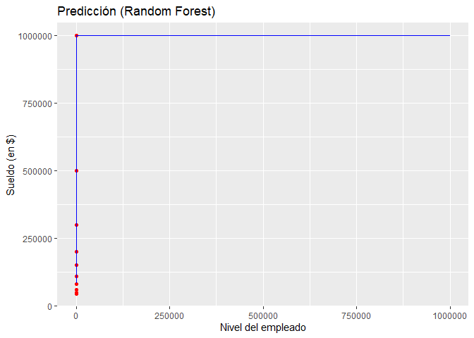<!-- -->

Pueden ver que el resultado no es precisamente el mejor, con un valor de
0.5, la visualización es peor. Colocando de 0.1 mejora notablemente. En
este punto, colocare una figura de como seria, ya que mi maquina en
particular es suceptible a colgarse:

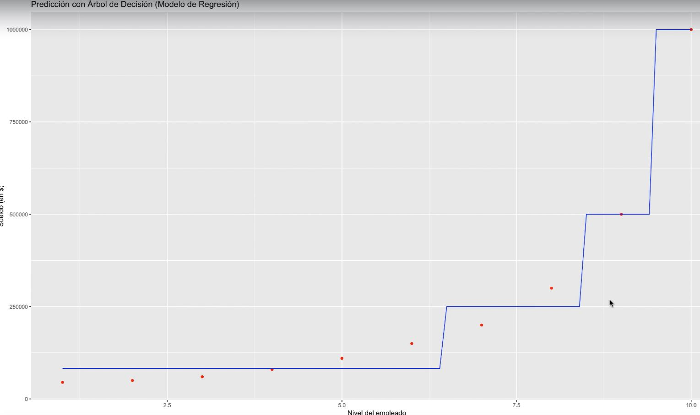

# 2. Modelos clasificador: “Bosques aleatorios” (Random Forest)

Vamos a trabajar con la misma base de datos ya con las variables de
interes seleccionadas.

### 2.1 Ajustar el modelo Random Forest con el conjunto de datos

Instalamos el paquete randomForest y luego lo activamos

``` r
library(randomForest)
```

Generamos luego el modelo de Random Forest (o bosques aleatorios):

``` r
set.seed(123)
Modelo <- randomForest(x= Salarios[1],
                       y= Salarios$Salary,
                       ntree = 10)
#?randomForest
```

-   Nota: Explicar la diferencia entre \[\] y $ (class).

### 2.3 Predicción de nuevos resultados

``` r
y_pred = predict(Modelo, newdata = data.frame(Level = 6.5))
y_pred
```

    ##        1 
    ## 155233.3

### 2.4 Visualización del modelo de Random Forest

Como en el caso de arboles de regresión, deberiamos utilizar el mismo
codigo, pero con el modelo de randomForest. Al igual que el primer caso
el grid en el codigo esta separado por 1, lo cual no nos da el detalle
que deseariamos. En caso de tener un CPU potente, podemos aumentar el
detalle del grid y realizar el grafico. Lo presentaremos en una figura
para evitar problemas durante la clase.

Ahora utilizamos el paquete ggplot2 para graficar:

``` r
x_grid = seq(min(Salarios$Level), max(Salarios$Salary), 1)
ggplot() +
  geom_point(aes(x = Salarios$Level, 
                 y = Salarios$Salary),
             color = "red") +
  geom_line(aes(x = x_grid, 
                y = predict(Modelo,newdata = data.frame(Level = x_grid))),
            color = "blue") +
  ggtitle("Predicción (Random Forest)") +
  xlab("Nivel del empleado") +
  ylab("Sueldo (en $)")
```

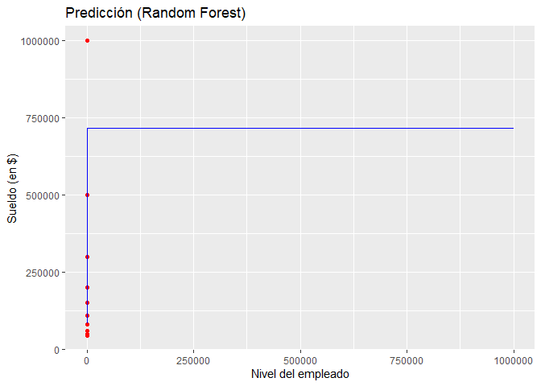<!-- -->

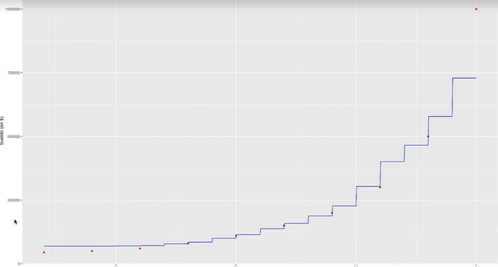

# 3.Ejemplo de Random Forest

Este ejemplo se basa en el blog y video de Julia Silge, el cual se puede
encontrar en el siguiente link
<https://juliasilge.com/blog/water-sources/>

Vamos a cargar la base de datos y vamos a ir cargando los paquetes
necesarios:

``` r
library(tidyverse)
water_raw <- read_csv("https://raw.githubusercontent.com/rfordatascience/tidytuesday/master/data/2021/2021-05-04/water.csv")
```

    ## Parsed with column specification:
    ## cols(
    ##   row_id = col_double(),
    ##   lat_deg = col_double(),
    ##   lon_deg = col_double(),
    ##   report_date = col_character(),
    ##   status_id = col_character(),
    ##   water_source = col_character(),
    ##   water_tech = col_character(),
    ##   facility_type = col_character(),
    ##   country_name = col_character(),
    ##   install_year = col_double(),
    ##   installer = col_character(),
    ##   pay = col_character(),
    ##   status = col_character()
    ## )

Nos familiarizamos con la base de datos. El modelo que se realizará es
para predecir si es que hay o no hay disponibilidad de agua, basado en
caracteristicas de las fuentes de agua observadas durante diferentes
visitas a diferentes zonas.

Podemos observar que son 473 293 observaciones y 13 variables en total.
La base de datos tiene cualquier cantidad de **“NAs”** los cuales seran
eliminados, asi como elegir que variables especificas iran dentro del
modelo. La variable **status\_id** nos brinda si es que hay agua (y:
yes), no hay agua (n: no) o es desconocido.

### 3.1 Exploración y selección de la data para el modelo

Las decisiones y selección que se realizan para la selección de la data
final para el modelo se realizan en base a los criterios utilizados por
el tutorial de Julia Silge. Para tener mayor detalle ver el video.

Vamos a delimitar nuestro estudio a el país de Sierra Leone (debido a
que son demasiados datos, se pudo elegir otro país del Africa de la base
de datos). Se definen filtros para las latitudes y longitudes debido a
que se quiere tener en consideración una zona geográfica específca.
Adicionalmente, se elimina los valores de estatus de agua unknown y nos
quedamos solo con “yes” y “no”. Luego vamos a gráficar estos datos en un
grafico de dispersión:

``` r
water_raw %>%
  filter(
    country_name == "Sierra Leone",
    lat_deg > 0, lat_deg < 15, lon_deg < 0,
    status_id %in% c("y", "n")
  ) %>%
  ggplot(aes(lon_deg, lat_deg, color = status_id)) +
  geom_point(alpha = 0.1) +
  coord_fixed() +
  guides(color = guide_legend(override.aes = list(alpha = 1)))
```

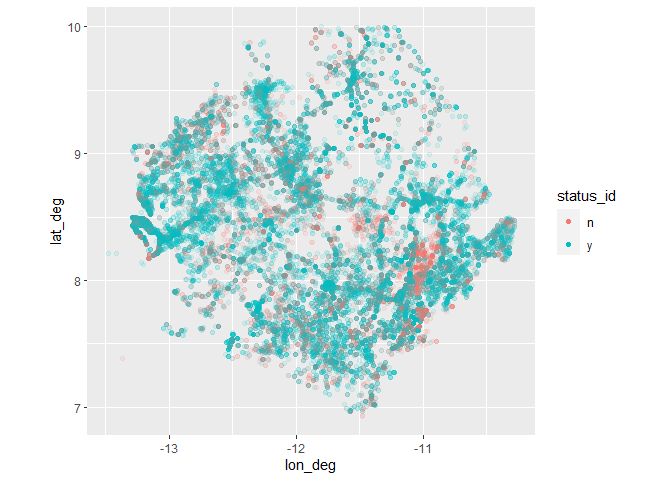<!-- -->

-   Nota: En el video, van a ver que la siguiente combinación es muy
    utilizada para ver rapidamente las categorias y sus frecuencias, lo
    recomiendo para incorporar en su repertorio de codigos. Por ejemplo,
    si quiero saber rapidamente cuales y cuantas son las categorias de
    la variable **water\_source**, podemos hacer lo siguiente (la
    función **count()** es muy interesante):

``` r
water_raw %>% count(water_source, sort = TRUE)
```

    ## # A tibble: 14 x 2
    ##    water_source                                    n
    ##    <chr>                                       <int>
    ##  1 Borehole                                   196727
    ##  2 NA                                          62714
    ##  3 Protected Shallow Well                      60240
    ##  4 Protected Spring                            43129
    ##  5 Undefined Shallow Well                      34225
    ##  6 Surface Water (River/Stream/Lake/Pond/Dam)  20843
    ##  7 Rainwater Harvesting                        18664
    ##  8 Unprotected Shallow Well                    18100
    ##  9 Undefined Spring                             7202
    ## 10 Piped Water                                  5221
    ## 11 Unprotected Spring                           4433
    ## 12 Sand or Sub-surface Dam                      1701
    ## 13 Delivered Water                                92
    ## 14 Packaged water                                  2

Lo mismo podemos hacer para la variable **pay**:

``` r
water_raw %>% count(pay, sort = TRUE)
```

    ## # A tibble: 559 x 2
    ##    pay                                 n
    ##    <chr>                           <int>
    ##  1 NA                             214970
    ##  2 No                              78290
    ##  3 Water Committee Collects Fees   40461
    ##  4 No payment – its free           27378
    ##  5 No- water is free               20020
    ##  6 Never pay                        8839
    ##  7 They do not pay                  8492
    ##  8 Not recorded                     8161
    ##  9 0                                6395
    ## 10 Only when there is a breakdown   5728
    ## # ... with 549 more rows

Vamos a ir probando hasta estar felices con nuestra delimitación. A
partir de alli, comenzamos a seleccionar las variables que entrarán
dentro de nuestro modelo y a definir nuestra base de datos final, la
cual quedará de la siguiente manera:

``` r
water <- water_raw %>%
  filter(
    country_name == "Sierra Leone",
    lat_deg > 0, lat_deg < 15, lon_deg < 0,
    status_id %in% c("y", "n")
  ) %>%
  mutate(pay = case_when(
    str_detect(pay, "^No") ~ "no",
    str_detect(pay, "^Yes") ~ "yes",
    is.na(pay) ~ pay,
    TRUE ~ "it's complicated"
  )) %>%
  select(-country_name, -status, -report_date) %>%
  mutate_if(is.character, as.factor)
```

Se puede seguir a partir de aqui la exploración visual de datos, por
ejemplo:

``` r
water %>%
  ggplot(aes(install_year, y = ..density.., fill = status_id)) +
  geom_histogram(position = "identity", alpha = 0.5) +
  labs(fill = "Water available?")
```

    ## `stat_bin()` using `bins = 30`. Pick better value with `binwidth`.

    ## Warning: Removed 7074 rows containing non-finite values (stat_bin).

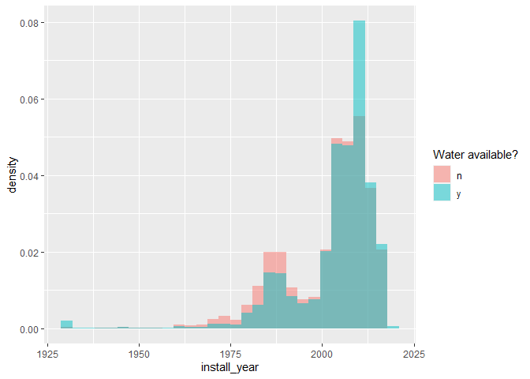<!-- -->

o también:

``` r
water %>%
  ggplot(aes(y = pay, fill = status_id)) +
  geom_bar(position = "fill") +
  labs(fill = "Water available?")
```

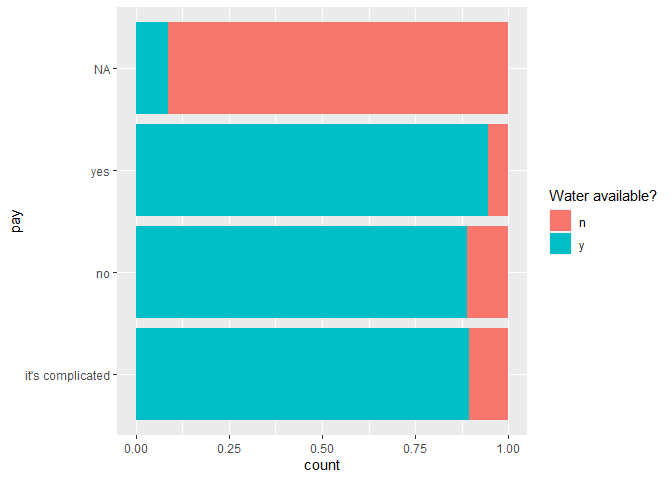<!-- -->

### 3.2 Contruyendo el modelo:

En este tutorial, se utiliza el paquete **tidymodels**, mas información
de este paquete en el enlace <https://www.tidymodels.org/>. Basicamente
es un paquete nuevo (3 a 5 años, verificar) que contiene una colección
de modelos utilizando los principios del mundo de tidyverse. Instalamos
y activamos la libreria:

``` r
library(tidymodels)
# Fue un poco largo y tedioso instalar este paquete, tienen que instalar manualmente todos los requisitos que vayan apareciendo. No necesariamente les tiene que pasas lo que a mi. 
```

Dentro del todos los paquetes que tienen el paquete **tidymodels**, el
paquete **rsample** nos permite hacer la separación de la data de
entrenamiento y testeo mediante las funciones **initial\_split**,
**training** y **testing**. Veamoslo en el siguiente ejemplo para
nuestra base de datos:

``` r
set.seed(123)
water_split <- initial_split(water, strata = status_id)
water_train <- training(water_split)
water_test <- testing(water_split)

#?initial_split, separa por defecto a las base en una proporción de 3/4 (o 75%)
```

Vamos a generar un **resampling** de la data de entrenamiento con la
función **vfold\_cv** del paquete **rsample**:

``` r
#?vfold_cv
water_folds <- vfold_cv(water_train, strata = status_id)
water_folds
```

    ## #  10-fold cross-validation using stratification 
    ## # A tibble: 10 x 2
    ##    splits               id    
    ##    <list>               <chr> 
    ##  1 <split [36984/4110]> Fold01
    ##  2 <split [36984/4110]> Fold02
    ##  3 <split [36984/4110]> Fold03
    ##  4 <split [36984/4110]> Fold04
    ##  5 <split [36984/4110]> Fold05
    ##  6 <split [36985/4109]> Fold06
    ##  7 <split [36985/4109]> Fold07
    ##  8 <split [36985/4109]> Fold08
    ##  9 <split [36985/4109]> Fold09
    ## 10 <split [36986/4108]> Fold10

La siguiente función del paquete **usemodels**, **use\_ranger()** nos
brinda codigo. Sí, codigo que podemos utilizar para construir el modelo.

``` r
library(usemodels)
usemodels::use_ranger(status_id ~ ., data = water_train)
```

    ## ranger_recipe <- 
    ##   recipe(formula = status_id ~ ., data = water_train) 
    ## 
    ## ranger_spec <- 
    ##   rand_forest(mtry = tune(), min_n = tune(), trees = 1000) %>% 
    ##   set_mode("classification") %>% 
    ##   set_engine("ranger") 
    ## 
    ## ranger_workflow <- 
    ##   workflow() %>% 
    ##   add_recipe(ranger_recipe) %>% 
    ##   add_model(ranger_spec) 
    ## 
    ## set.seed(99875)
    ## ranger_tune <-
    ##   tune_grid(ranger_workflow, resamples = stop("add your rsample object"), grid = stop("add number of candidate points"))

``` r
#?use_ranger
```

Lo que resulta de la función use\_ranger() nos sugiere una lista de
codigo que podemos usar precisamente para generar nuestro modelo
(pudiendo ser considerada como la sintaxis minima para lo que estamos
buscando realizar a nuestras data). Copiamos el resultado anterior y lo
modificamos para utilizarlo especificamente en nuestros datos y con los
resultados que queremos (podemos eliminar cosas que no queramos realizar
o obtener, para ello se necesita también más conocimiento y
experiencia):

Instalar el paquete themis y seguir:

``` r
library(themis)
ranger_recipe <-
  recipe(formula = status_id ~ ., data = water_train) %>%
  update_role(row_id, new_role = "id") %>%
  step_unknown(all_nominal_predictors()) %>%
  step_other(all_nominal_predictors(), threshold = 0.03) %>%
  step_impute_linear(install_year) %>%
  step_downsample(status_id)

ranger_spec <-
  rand_forest(trees = 1000) %>%
  set_mode("classification") %>%
  set_engine("ranger")

ranger_workflow <-
  workflow() %>%
  add_recipe(ranger_recipe) %>%
  add_model(ranger_spec)

library(doParallel)
library(ranger)
doParallel::registerDoParallel()
set.seed(74403)
ranger_rs <-
  fit_resamples(ranger_workflow,
    resamples = water_folds,
    control = control_resamples(save_pred = TRUE)
  )
```

-   NOTA: Importante considerar del tutorial, no se realiza el proceso
    de **tuning** porque la autora considera que el modelo de random
    forest tipicamente hace un muy buen trabajo si se le da un número
    suficiente de árboles.

### 3.3 Explorando los resultados:

Aqui es donde observaremos que tan bien le fue a nuestro modelo de
randomForest. Del paquete **workflowsets**, utilizaremos la función
**collect\_metrics()** para obtener algunas metricas del modelo generado
**ranger\_rs**:

``` r
library(workflowsets)
collect_metrics(ranger_rs)
```

    ## # A tibble: 2 x 6
    ##   .metric  .estimator  mean     n std_err .config             
    ##   <chr>    <chr>      <dbl> <int>   <dbl> <chr>               
    ## 1 accuracy binary     0.893    10 0.00122 Preprocessor1_Model1
    ## 2 roc_auc  binary     0.951    10 0.00111 Preprocessor1_Model1

Las curvas ROC son la representación gráfica de la sensibilidad versus
la especificidad para un sistema clasificador binario segun varia el
umbral de discriminación. Es decir, representa la proporción de
verdaderos positivos versus la proporción de falsos positivos (ver
video: <https://www.youtube.com/watch?v=4jRBRDbJemM>).

Vamos a visualizar las curvas ROC de nuestro modelo para el set de
10-fold creados:

``` r
collect_predictions(ranger_rs) %>%
  group_by(id) %>%
  roc_curve(status_id, .pred_n) %>%
  autoplot()
```

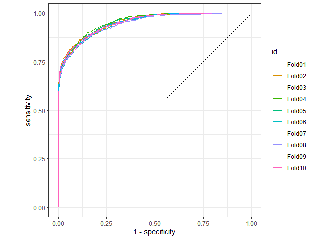<!-- -->

También podemos crear una matriz de confusión usando la función
**conf\_mat\_resampled()** del paquete **tune**

``` r
conf_mat_resampled(ranger_rs, tidy = FALSE) %>%
  autoplot()
```

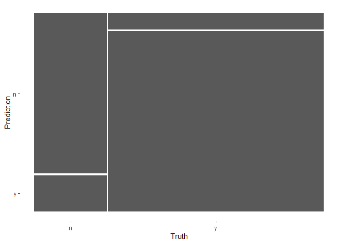<!-- -->

Este gráfico lo hemos visto antes en tablas con números y podemos ver
que el modelo al parecer es bueno prediciendo si hay o no agua
disponible la mayor parte de las veces.

Ajustemos los valores una ultima vez a toda la base de datos de
entrenamiento y evaluemos una sola vez con la base de testeo. Esta será
la primera vez que usamos la base de testeo.

``` r
final_fitted <- last_fit(ranger_workflow, water_split)
collect_metrics(final_fitted) ## metrics on the *testing* set
```

    ## # A tibble: 2 x 4
    ##   .metric  .estimator .estimate .config             
    ##   <chr>    <chr>          <dbl> <chr>               
    ## 1 accuracy binary         0.893 Preprocessor1_Model1
    ## 2 roc_auc  binary         0.952 Preprocessor1_Model1

Podemos crear las curvas ROC o otra vez una matriz de confusión pero con
la base de datos de testeo ajustada:

``` r
collect_predictions(final_fitted) %>%
  conf_mat(status_id, .pred_class) %>%
  autoplot()
```

<!-- -->

¿Y que hay de la importancia de las variables? Se usará el paquete
**vip** para computar que variables tienen mayor importancia en el
modelo de bosques aleatorios. Se tendra que ajustar nuevamente el
modelo, usando el argumento **importance == “permutation”** y la base de
datos **imp\_data** que preprocesamos manualmente:

``` r
library(vip)

imp_data <- ranger_recipe %>%
  prep() %>%
  bake(new_data = NULL) %>%
  select(-row_id)

ranger_spec %>%
  set_engine("ranger", importance = "permutation") %>%
  fit(status_id ~ ., data = imp_data) %>%
  vip(geom = "point")
```

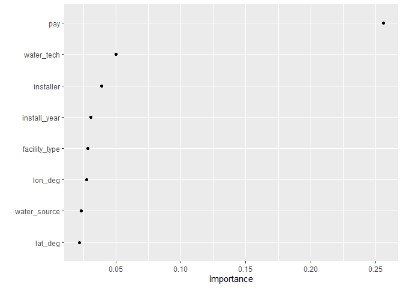<!-- -->

¡La variable **pay** sea lo más importante! Las siguientes variables más
importantes son la tecnología utilizada en la fuente de agua y quién la
instaló. Hagamos un gráfico más con nuestros datos preprocesados para
ver cómo se distribuyen.

``` r
imp_data %>%
  select(status_id, pay, water_tech, installer) %>%
  pivot_longer(pay:installer, names_to = "feature", values_to = "value") %>%
  ggplot(aes(y = value, fill = status_id)) +
  geom_bar(position = "fill") +
  facet_grid(rows = vars(feature), scales = "free_y", space = "free_y") +
  theme(legend.position = "top") +
  scale_fill_brewer(type = "qual", palette = 7) +
  scale_x_continuous(expand = expansion(mult = c(0, .01)), labels = scales::percent) +
  labs(
    x = "% of water sources", y = NULL, fill = "Water available?",
    title = "Water availability by source characteristic in Sierra Leone",
    subtitle = "Water sources with no payment information are likely to have no water available"
  )
```

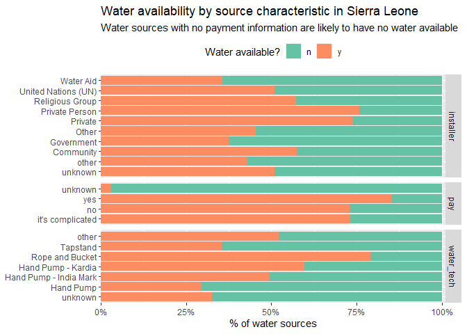<!-- -->
