QGIS 1 Guía Práctica
================

# 1. Comenzando con QGIS

## 1.1 Instalación

Para instalar QGIS, dirigirse al siguiente link y descargar la versión
mas estable para su sistema operativo:
<https://qgis.org/es/site/forusers/download.html>

Cuando instalamos QGIS, estamos instalando 2 aplicaciones, QGIS
Escritorio y WGIS Navegador (este es una especie de aplicación para
previsualizar datos espaciales y metadatos relacionados).

Al abrir el programa, encontraremos un interfaz muy parecido a la
siguiente figura:

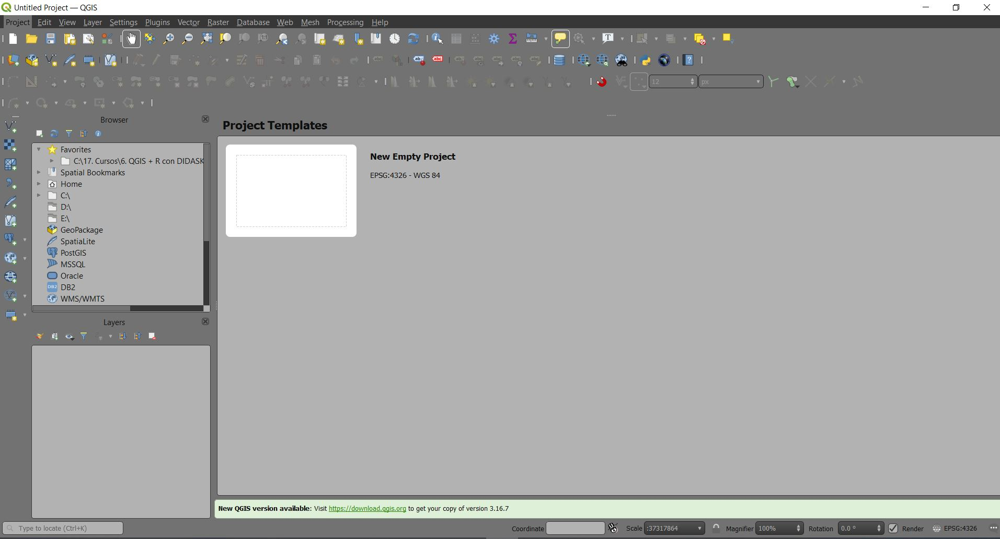

Si le damo click a un nuevo proyecto, nos creara un nuevo Canvas para
comenzar a trabar en nuestro proyecto. Para cambiar el idioma
(recomiendo el idioma ingles) pueden ir a Settings (configuración) y
luego dar click en Options (opciones). Les aparecera una ventana como la
siguiente figura en donde pueden cambiar el idioma (recordar que para
que sea efectivo hay que apagar y llamar nuevamente al programa).

La presente guía no se basa exclusivamente en la guía libre suministrada
por el propio software, sin embargo en el siguiente click pueden
encontrar el Manual detallada del QGIS 3.16 libre de costo:
<https://docs.qgis.org/3.16/en/docs/index.html>.

Un concepto básico que tenemos que manejar en QGIS es el uso de los
complementos o plugins. Podemos activar, instalar y gestionar nuestros
plugins desde el menu de barras, donde encontraremos la opción de
plugins (complementos) y dandole click al la gestión o instalación de
plugins, nos aparecerá una ventana. 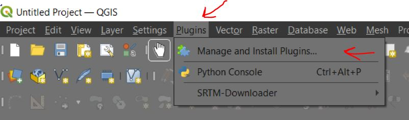

En la siguiente figura, podemos ver en detalle como aparece nuestro
gestor de plugins:

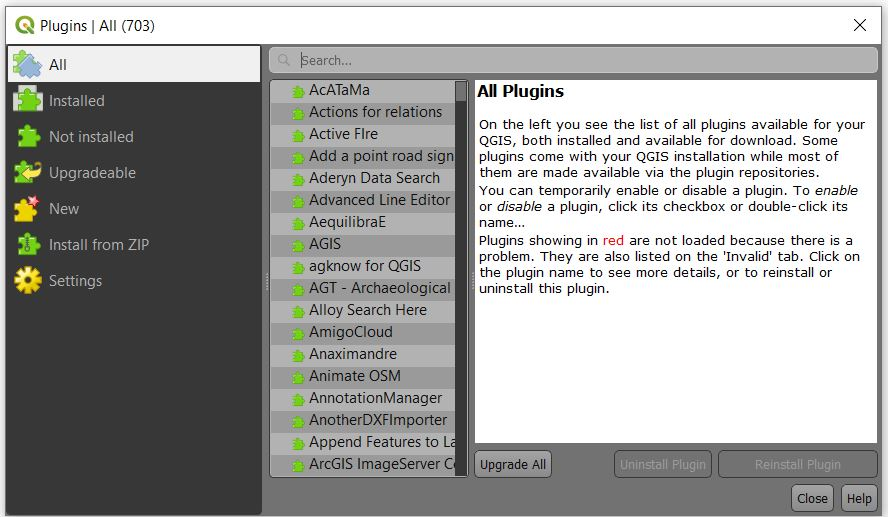

Desde esta ventana, podemos observar todos los plugin (All), aquellos
que estan instalados, no instalados, los que podemos actualizar y
nuevos. Si tenemos el plugin previamente descargado en nuestra
computadora también podemos instalarlo sin conxión a internet.

Para aquellos que han trabajado en R, los complementos en QGIS vienen a
ser como los paquetes o librerias en R. Si bien muchos de ellos son
creados por la misma organización Europea, muchos de ellos también son
creados y/o mejorados por la propia comunidad. Cualquier persona con los
conocimientos y ganas de contribuir a la comunidad puede crear
complementos, en este caso el lenguaje de programación mas común es el
Python.

Un ultimo punto a tomar en cuenta es la estetica de nuestro interfaz,
hay 2 temas que nosotros podemos escoger desde el menu de opciones.
Justo donde cambiamos el idioma (General), podemos cambiar el tema (UI
theme). Tenemos básicamente 3 opciones (blanco, gris y negro) y para que
sean efectivos tenemos que reiniciar el programa.

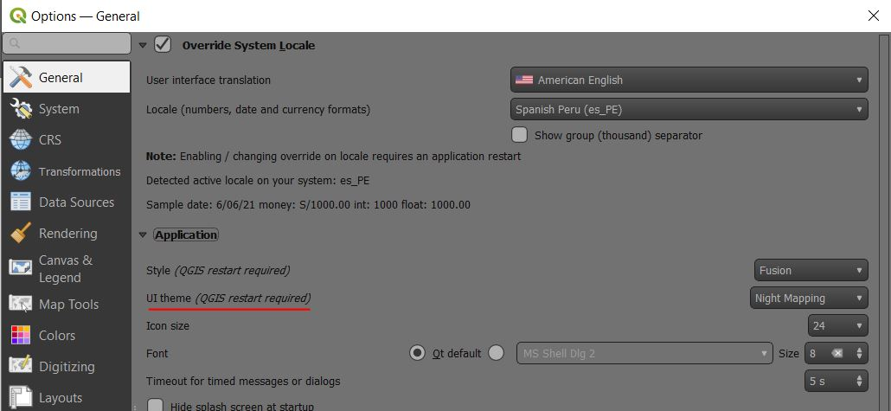

Si desean crear su propios temas, pueden consultar al siguiente link:
<https://github.com/qgis/QGIS/tree/master/resources/themes>

## 1.2 Interfaz

Al abrir el programa podremos ver un interfaz parecido a la siguiente
figura:

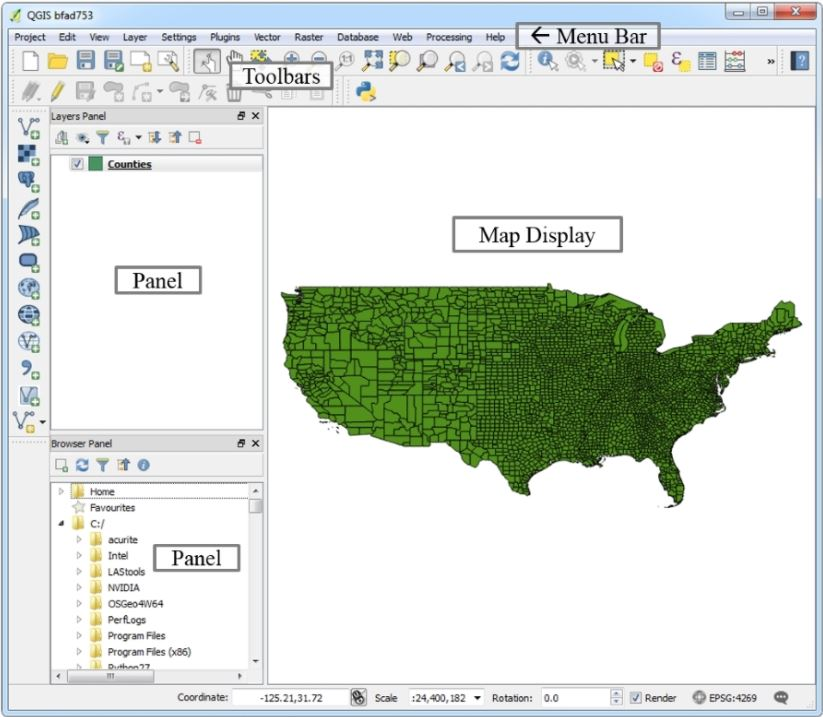

Podemos visualizar que tenemos una barra de Menu (muy parecida a
cualquiero otro programa insespecifico). Abajo de ella y tal como en
cualquier programa de Microsoft Office veremos un area de herramientas
(Toolbars), las cuales seran pocas o muchas dependiendo de como lo
personalicemos. Basicamente en esta zona se encontraran aquellas
herramientas de uso frecuente (muchas de ellas tienen también comandos
rapidos).

En la parte izquierda encontraran un panel en donde se ubicarán las
capas (conforme vayamos trabajando se entendera que es la localización
donde colocamos nuestro trabajo). La ubicación de nuestros archivos que
tenemos previamente cargados en nuestro proyecto o por ser creados se
ubicaran en el “Browser Panel”, pero aqui tambien podremos encontrar
imagenes y datos de la web (la cual tendremos que ir instalando poco a
poco). En la siguiente figura podemos observar la ventana del Browser
actualizada a la versión 3.16:

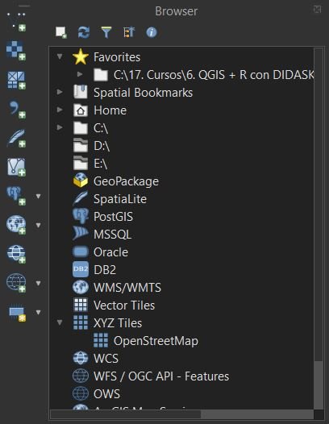

En la parte inferior del interfaz, visualizaremos datos de importancia,
como las coordinadas, al escala del mapa y el sistema de referencia:

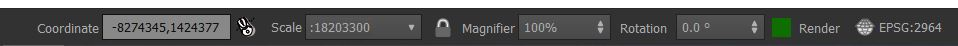

### 1.2.1 Herramientas: Vistazo general

En la siguiente figura vemos algunas de las herramientas principales. El
icono del archivo nos ayuda a abrir un documento o archivo previamente
guardado. Las opciones adicionales nos sirven para manipular data, crear
proyectos y cargar datos (que veremos mas adelante)

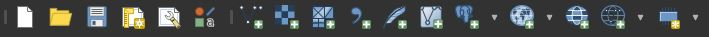

La siguiente ventana, son herramientas que nos ayudaran a navegar en
nuestro proyecto. Podemos utilizar la función “mano” para movernos por
nuestro canvas, las lupas para hacer zoom, entre otros tipos de
navegación mas avanzada (como la 3D).

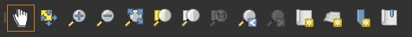

Las siguientes son herramientas de selección, identificación, apertura
de atributos en tablas, opciones de medición, entre otroas.
Adicionalmente vemos algunas herramientas de etiquetas, como para
añadirlas, configurarlas, modificarlas, etc.

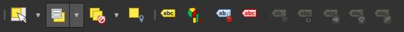

En el siguiente grupo de herramientas, observamos aquellas relacionadas
con la manipulación de raster (histogramas, brillo y contraste),
vectores (captura de coordenadas), plugins (inicialmente vacios, pero
editable) y web (vacio, pero también editable). En la imagen, los iconos
salen sin color porque no se pueden utilizar sin los tipos de elementos
específicos que manipular.

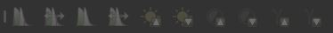

Por último tenemos las opciones de digitilización (permitir editado,
creación de caracteristicas, editado) y digitilización avanzada
(deshacer y rehacer una acción, ediciones avanzadas de edición,
simplificación de geometria y otros). Para activar estas funciones
necesitamos activar el lapicito y tener un vector para trabajar.

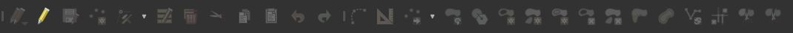

IMPORTANTE: Tanto los menus de herramientas como los paneles se pueden
activar o desactivar (es decir, que aparezcan o no en nuestra interfaz)
desde el menú de “Ver” (View). En la siguiente figura, se puede
visualizar la ruta. A partir tanto de las opciones de paneles o
herramientas podremos activar o desactivar los mismos:

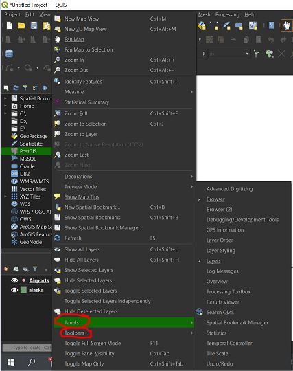

Adicionalmente, QGIS puede optimizarse de manera manual desde el menu de
“Opciones” (Settings) y colocar la opción “personalizar” (custom).

## 1.3 Cargando datos en QGIS

Una de las ventajas del QGIS es su habilidad de cargar diferentes
números de tipos de datos. Utilizando QGIS realizaremos el cargado de
varios de estos. Los datos se pueden cargar de 4 diferentes formas:

1.  Podemos usar la opción “Añadir Capa” (Add Layer) dentro del menú
    Capa (Layer), desde aqui podemos elegir el tipo apropiado de datos
    que queramos cargar al programa.

2.  Podemos realizar la misma acción del paso 1, desde nuestra ventana
    del Browser. Podemos navegar y elegir el archivo dentro de la
    computadora (para abrirlo, solo arrastramos el archivo dentro de
    nuestro proyecto, es decir, nuestro Canvas).

3.  Una tercera manera es cargar la data desde la barra de herramientas,
    usualmente con los mismos simbolos que encontramos en el menú para
    añadir cada tipo de archivo especifico.

4.  Una cuarta forma es la de localizar data en la aplicacion QGIS
    Browser y arrastrarla a nuestro proyecto.

## 1.4 Tipos de datos en el QGIS

Algunos de los tipos más comunes de datos con los que vamos a trabajar,
son:

-   ESRI shapefiles (.shp)

-   GeoJSON (.geojson)

-   Geography Markup Language (.gml)

-   AutoCAD DXF (.dxf)

-   Comma separated values (.csv)

-   GPS eXchange Format (.gpx)

-   Keyhole Markup Language (.kml)

-   SQLite/SpatiaLite (.sqlite/ .db)

## 1.5 Cargando datos de tipo raster

Los tipos de dato raster mas comunes, son:

-   ArcInfo ASCII Grid (.asc)

-   Erdas Imagine (.img)

-   GeoTIFF (.tif/ . tiff)

-   JPEG/JPEG-2000 (.jpg o .jpeg/ .jp2 o .j2k)

-   Portable Networks Graphics (.png)

-   Rasterlite (.sqlite)

-   USGS Optional ASCII DEM (.dem)

## 1.6 Trabajando con el sistema de coordenadas de referencia (SRC)

Cuando trabajamos con data espacial, es importante que utilizar el
sistema de coordenadas de referencia (SRC o CRS en ingles) correctos
asignados a los datos y al proyecto de QGIS. Podemos ver el SRC desde en
Menu Proyecto (Project) y luego dar click en Propiedades del proyecto
(Project Properties), esto activará la siguiente ventana y en la opción
SRC (CRS) veremos el sistema de coordenadas que se esta utilizando:

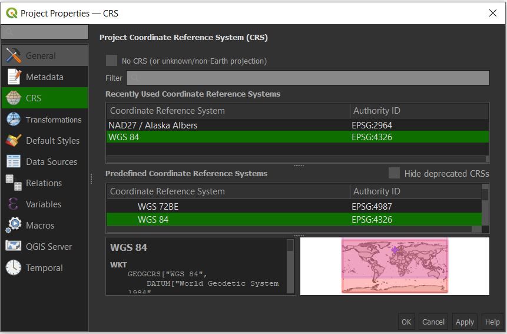

Se recomienda que tanto el SCR del proyecto como los datos que ser
traigan sean los mismos. Sin embargo, si esto no es posible o
conveniente, el QGIS puede proyectar capas sobre la marcha al proyecto.
Para permitir esta opción, puede realizar los siguientes pasos:

1.  Dar click en propiedades de proyecto (en el menu proyecto).

2.  Elegir la opción de SCR y dar click en “permitir” (Enable) sobre la
    marcha (on the fly) SCR transformación (CRS transformation).

3.  Configurar que deseas aplicarlo para todo el proyecto y dar OK.

Pasos parecidos se pueden replicar desde el menú de propiedades de cada
capa.

Para proyectar una capa con un SCR diferente, puede realizar los
siguientes pasos:

1.  Dar click derecho a la capa de su elección y colocar Grabar como
    (Save as) desde el menu Proyecto.

2.  En el editor de guardado grabarlo como dialogo, colocar el nombre y
    el formato, luego seleccione el SCR a “SCR seleccionado” (Selected
    CRS), click en Cambiar (change) para cambiar el SCR. Por ultimo,
    grabe el archivo.

En la siguiente figura, podemos ver los principales SRC del Perú:

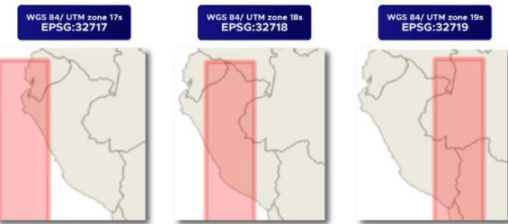

# 2. Viendo data espacial

Para trabajar por primera vez en QGIS nos bajaremos la base de datos de
muestra en los siguientes links:

-   Para Windows:
    <https://github.com/qgis/QGIS-Sample-Data/archive/master.zip>

-   Para GNU/Linux y macOS:
    <https://github.com/qgis/QGIS-Sample-Data/archive/master.zip>

Luego de descargar los archivos Zipiados, muevalos a una carpeta donde
pueda encontrarlos facilmente y se mantengan de manera ordenada
(recomendación).

## 2.1 Cargando vectores (shapefiles)

Utilizaremos cualquier de las tecnicas aprendidas para cargar los datos.
Comenzaremos cargando los siguientes dos shapefiles (en este orden):

-   alaska.shp

-   airports.shp

Una vez abiertos correctamente, tendremos un resultado parecido al
siguiente:

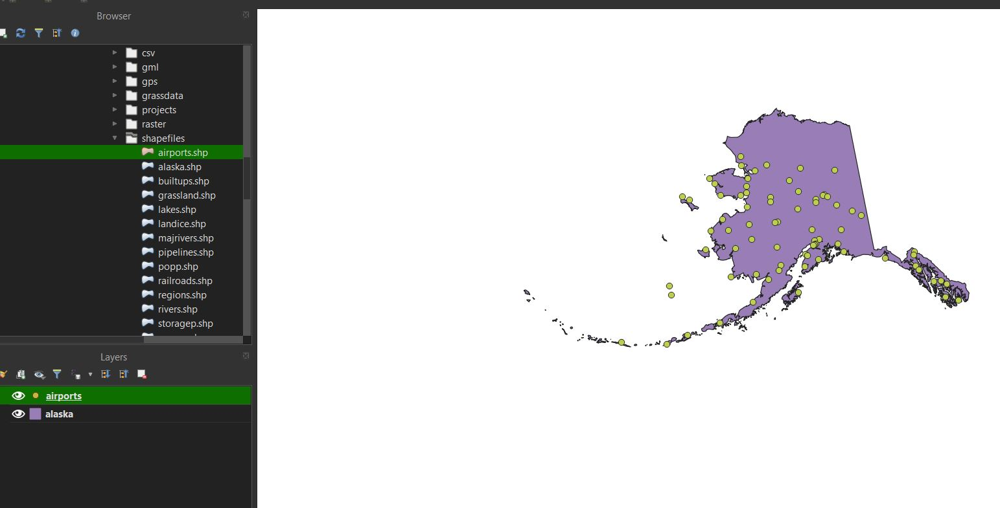

Tip: Pueden usar el browser como metodo rapido, incluso colocar la
carpeta donde han guardado los archivos como su carpeta de favoritos
para un rapido accesos cada vez que entran al programa.

Quizá al cargar los datos con un metodo u otro nos hemos percatado que
QGIS busca el SCR optimo para cargar nuestra información. Recuerde que
esta opción debe de activarse si es que esta desactivada. Si sospecha
que QGIS hizo una mala elección, entonces el SCR se puede siempre
cambiar manualmente dentro de cada una de la configuración de cada capa
(para entrar de click derecho y propiedades o dos click de frente a la
capa).

En QGIS se pueden crear mapas con diferentes SCR y el programa se las
arreglará para buscar las reproyecciones necesarias automaticamente
mediante el sistema de corrección sobre la marcha.

-   Una pagina de interes de SRC: <https://spatialreference.org/>

## 2.2 Cargando archivos csv

Utilizar cualquier de las herramientas aprendidas para añadir una capa
con los datos almacenados en la carpeta suministrada:

-   elevp.csv

Al ser un archivo de datos tabulares, estos se pueden visualizar dandole
click derecho en el archivo (en el panel de capas) y dandole click a
“Abrir tabla de atributos” (Oper Attribute Table).

## 2.3 Cargando Rasters

Vamos a añadir (mediante las formas aprendidas teoricas), los siguientes
archivos raster de la carpeta brindada:

-   landcover.img

Algunos raster, como mapas escaneados, no disponen de un SCR y por tanto
se les tiene que brindar uno. Mas adelante veremos como podemos
brindarles un SCR correcto.

## 2.4 Cargando otro tipo de datos

En el QGIS también podremos cargar bases de datos desde diferentes
fuentes externas como también de servicios Web OGC (WMS, WCS o WFS).

## 2.5 Nuestro primer mapa

Borremos todos los datos cargados con anterioridad (o creen un nuevo
proyecto) y comencemos desde cero cargando los siguientes archivos:

-   landcover.img

-   SR\_50M\_alaska\_nad.tif

Para cada una de las capas, abrimos sus propiedades. Una vez abierta la
ventana, podemos ir modificando los colores, entre otros atributos en el
menú de simbologia (Symbology). Desde aqui puedes cambiar las
propiedades esteticas del raster o cambios mas avanzados. Si los cambios
que realizamos nos gustan, cerramos con Ok o aplicar (Apply) para
confirmar los cambios. Podemos repetir el ejercicio para el otro raster.
Asi mismo, podemos modificar otras propiedades del raster (en los otros
menus, como la transparencia por ejemplo).

El panel de estilo se puede activar en el interfaz principal del QGIS
(Ver &gt; Paneles &gt; Estilos de capas).

En el caso de los vectores (shapefiles) podemos repetir el mismo
procedimiento, aunque las opciones de cambio variaran. Las siguientes
opciones para cambiar el estilo pueden ser el cambio de simbolo,
categoria (puntos por ejemplo), estilos de colores graduados, estilos
basados en reglas, estilos basados es recorrido de puntos, poligonos
invertidos, entre otros.

En QGIS podemos crear todo tipo de vectores (lineas y poligonos) como
también puntos. Un ejemplo de puntos lo veremos guardado en el archivo:

-   airport.shp

A este grupo de puntos, también podemos modificar su estetica mediante
la misma ventana de estilo, la cual variará especificamente para puntos
(o lineas fuera el caso). Lo mismo que hemos experimentado con los
puntos podemos realizarlo con lineas y poligonos. Para ello, cargaremos
en nuetro proyecto los siguientes archivos:

-   majriver.shp (linea)

-   alaska.shp (poligono)

## 2.6 Cargando otros mapas de fondo

Los mapas de fondo son muy utiles para realizar analisis rapidos y
proveer orientación. Una forma de añadir mapas de fondo de manera facil
es utilizar el plugin “QuickMapServices”. Tener en cuenta de que estos
mapas solo ofrecen información en Pseudo Mercartor (EPSG:3857).

# 3. Creación y editado de bases de datos

En este capítulo crearemos nuevas capas shapefiles y aprenderemos como
crear puntos, lineas, poligonos entre otros con las herramientas de
QGIS.

## 3.1 Creando una nueva capa vectorial

Crearemos un vector desde cero. QGIS ofrece un amplio rango de
funcionalidades para crear distintas capas de vectores. Podemos dar
click a Capa (Layer) en el menu principal, luego darle click a crear
capa y dentro de las opciones crear una nueva capa shapefile. A
continuación nos aparecera una ventana como la siguiente:

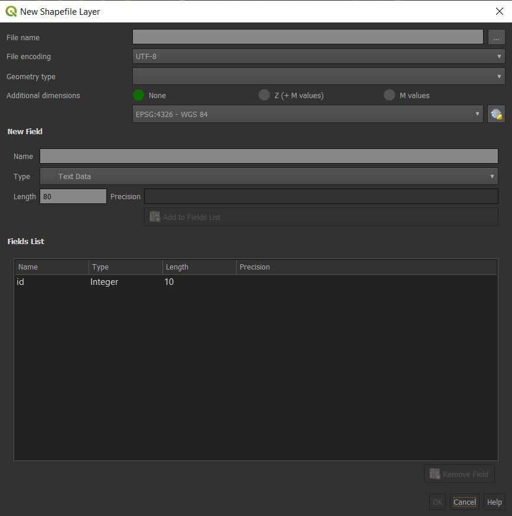

En la ventana podemos elegir el nombre de la nueva capa y lo mas
importante el tipo de shapefile que sera (puntos, multiples puntos,
linea o poligono). También podremos brindarle el SCR. Luego de ello
podemos darle a el boton OK y obtendremos nuestra nueva capa. Hemos
creado de esta manera nuestra primera capa shapefile de puntos:

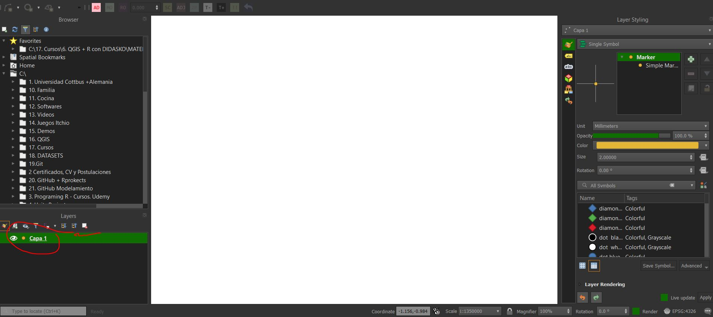

Podemos repetir el mismo ejercicio para crear lineas o poligonos.
Crearlos. Fijese que en la creacion de cualquier shapefile tambien se
pueden adicionar atributos númericos que luego podran visualizarse en la
tabla de atributos de cada capa.

Todas las capas creadas se encuentran vacias, para adicionar puntos,
lineas o poligonos, tenemos que activar la edición en cada una de las
capas. Para activar la edición pueden dar click en la barra de
herramientas al simbolo del lapiz, el cual se muestra a continuación:

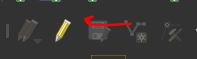

Una vez activado, todas las opciones de editado se activaran (acordarse
de desactivarla para evitar errores en nuestro trabajo una vez
terminado). Darse cuenta también que conforme cambiamos el tipo de capa
(punto, linea o poligono), las opciones activadas variaran ligeramente.
Las opciones son muy intuitivas, la mejor manera de aprender es
precisamente comenzar a jugar con las opciones para cada una de las
capas creadas. Cuando estemos contentos con los cambios realizados, no
olvidar click en guardar los cambio y por regla general desactivar la
opcion de edición.

## 3.2 Trabajando con las herramientas de selección

En este apartado, trabajaremos con las herramientas de selección, las
cuales seran de vital importancia al momento de gestionar nuestros
elementos y sus atributos.

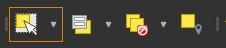

Cuando seleccionemos un poligono por ejemplo, veremos que se activaran
en nuestra barra de herramientas las siguientes caracteristicas (las
cuales nos permitiran, entre otras cosas, cambiar los atributos de
aquello seleccionado).

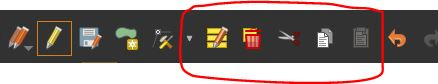

Utilisemos nuestra base de datos muestra de Akaska para realizar un
ejemplo mas real. Vamos a utilizar el archivo:

-   lakes.shp

Podemos darnos una idea de que información nos brinda la base de datos
viendo la lista de atributos que tiene (click derecho en la capa y abrir
tabla de atributos). Ahora que tenemos una idea, concentremosnos en el
area de los lagos y supongamos que queremos seleccionar solo aquellos
lagos con area mayor a 1000 metros cuadrados. Eso lo podemos realizar
con la seleccion por atributos, la segunda de la siguiente figura:

De esta manera y en función de los atributos podemos seleccionar
especificamente aquellos poligonos con un atributo especifico (tener en
consideración que la base de datos de Alaska tiene que unidades en
sistema de pies, no metros, habria que hacer la conversión necesaria).
Podemos probar con mas funciones de selección de esta alternativa. Por
utlimo tenemos la opción de seleccion por localización.

## 3.3 Editando las geometrias de los vectores

Para la edición de los vectores, podemos utilizar las siguientes
herramientas:

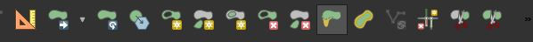

Probemos las herramientas en los poligonos y vectores ya creados.

## 3.4 Utilizando herramientas de medidas

Tambien tenemos herramientas para medir lineas, areas, etc.

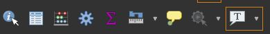

## 3.5 Editando atributos

Tenemos 3 casos en lso cuales podemos editar los atributos:

1.  Primero, podriamos querer editar los atributos de una caracteristica
    en especial, por ejemplo un nombre equivocado.

2.  Segundo, podriamos querer editar los atributos de un grupo de
    caracteristicas.

3.  Tercero, podriamos cambiar los atributos de todas las
    caracteristicas de una capa.

Estos cambios se daran principalmente dentro de la tabla de atributos de
cada capa que estemos trabajando. Dentro de cada lista de atributos,
daremos click al boton de permitir editados (lapiz) para modificar los
valores, como se muestra en la siguiente figura:

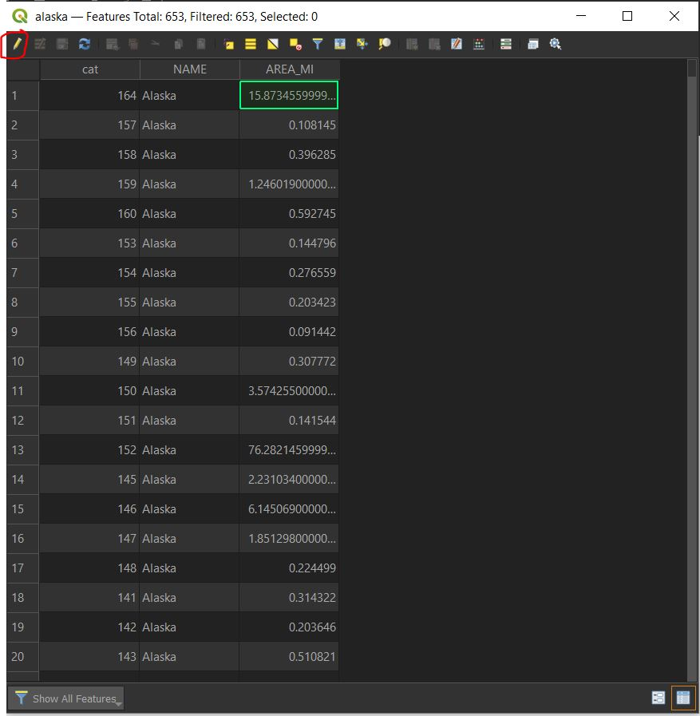

Tambien podemos acceder a el editado de los atributos mediante la
ventana de propiedades de cada capa.

La herramienta Open Field Calculator (figura a continuación) nos
permitira calcular o extender nuestra lista de atributos:

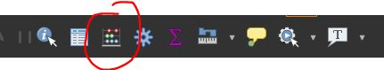

Esta herramienta es muy versatil y tiene multiples formulas y funciones
para aplicar directamente como hayas las coodenas, areas, distancias,
etc., dependiendo de nuestros objetivos. Poco a poco iremos utilizando
algunas de estas funciones en el uso del QGIS.

# 
