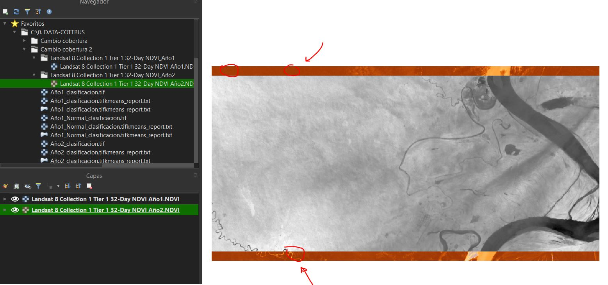
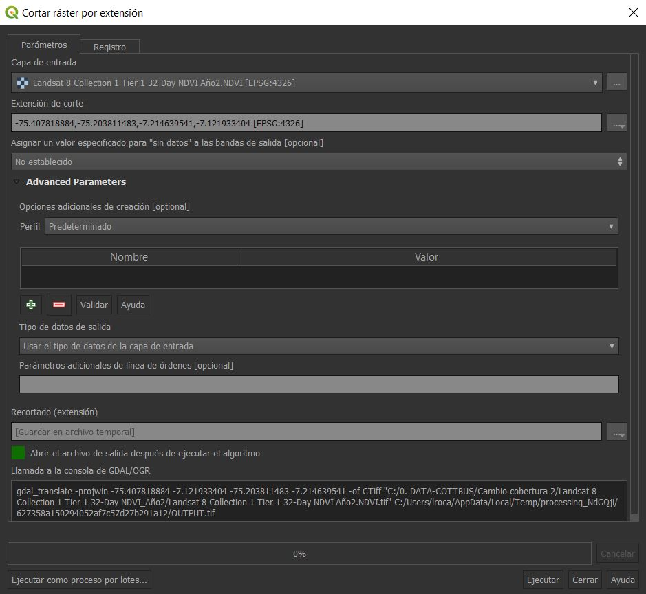

Práctica \#4 - GIS
================

# Preguntas

#### Pregunta 1: Incendios

Repita los pasos realizados en clase para aplicar el indice NBR sobre
areas quemadas. Para ello escoja una región en la cual existan
evidencias de incendios forestales. Escriba una breve introducción de
minimo 2 parrafos en donde explique el contexto y problemática de la
zona escogida, el periodo y periodos de incendios y como ello le ayudo a
seleccionar las imagenes satélitales.

Una vez escoja su zona de estudio, descarguela desde GEE. Coloque el
máximo detalle de su trabajo en su reporte final en documento Word.
Luego de indentificar y analizar las areas del año uno (antes del
incendio) versus el año 2 (despues del incendio), realice una breve
conclusión. Asi mismo, discutia y encuentre las ventajas y desventajas
de aplicar esta tecnica para la gestión de incendios.

**Nota:** Cualquier sospecha de plagio (misma fotografia evaluada) sera
castigada con menor puntaje o puntaje nulo dependiendo del grado. El
trabajo es individual. Las imagenes que analicen (cada una) se
recomiendan que tenga un peso aproximado de 100 Mb (a menos que usted
cuente con una computadora muy potente).

#### Pregunta 2: Cambio de cobertura y uso de suelo

Para esta pregunta, es importante brindar una pequeña introducción
acerca del contexto y region que estan analizando (o en todo caso la que
estan creando para su práctica). Si no es posible encontrar una
referencia, cree una a partir de la región e imagen que encuentre en el
GEE. Debido a las dificultades que pueden ocurrir a partir de realizar
un analisis de clasificación en imagenes pesadas. Como se indico en
clase, trabaje con imagenes pequeñas de pesos no mayores a 1 Mb (para
ello, descarguela con una sola banda de NDVI).

Una vez obtenga las imagenes (año 1 y año 2), realice el flujograma
realizado en clase. Es muy importante tener en cuenta que las dos
imagenes tengan la misma longitud y tamaño. En clase quedo pendiente
realizar el corte de una mascará en razon de otra.

Por ejemplo, puede que las dos imagenes que haya descargado o las que
tenga disponibles presenten el siguiente problema:

Se ve claramente que una de las imagenes es mas grande que la otra (en
este caso el año 2 es mas grande que el año 1). Previamente a la
clasificación de cada uno de los años (en los grupos que haya elegido)
realice un corte de las imagenes, con la siguiente opción:

Para utilizarla correctamente, las imagenes ya deben estar cargadas en
nuestro canvas. Una vez dentro colocaremos la imagen mas grande en la
primera opcion y buscaremos el año uno para que sea la imagen de
referencia, como se muestra a continuación:

Cuando demos click, automaticamente se cargaran las coordenadas limites
y luego de dar ejecutar, obtendremos la imagen del mismo tamaño que la
primera. Se recomienda hacer este ejercicio si tienen imagenes de
diferente tamaño.

Cuando tenga las dos imagenes puede ahora si realizar la clasificación
para cada una de ellas y luego el analisis de cambio de cobertura.
Discuta e interprete sus resultados finales.
