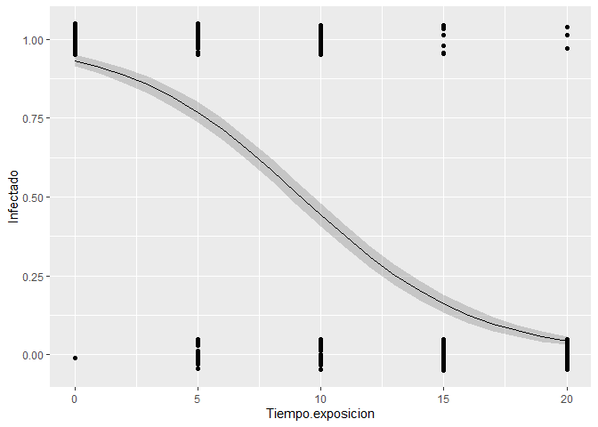
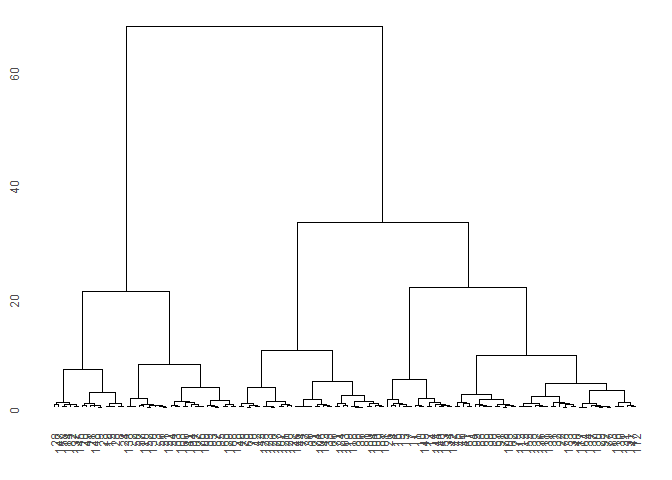
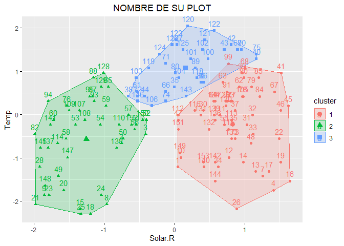
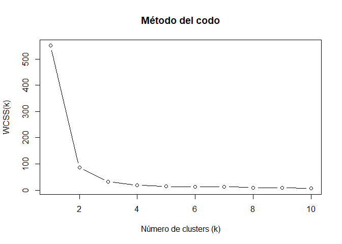
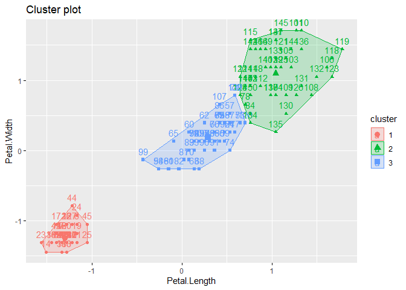
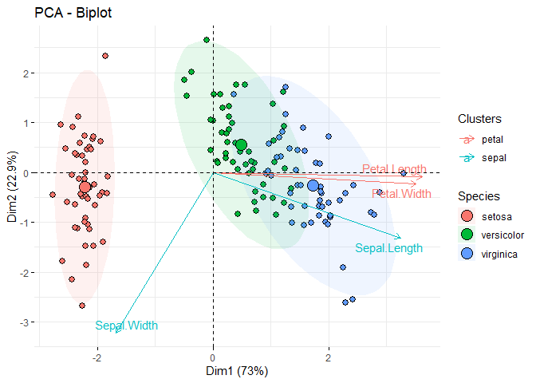

Resolución Práctica \#2
================

Cargando los paquetes:

``` r
library(tidyverse)
```

Pregunta 1: El parasito del genero Cryptosporidium es uno de los
principales contaminantes de enfermedades humanas transmitidas por en
cuerpos de agua. El parasito produce diarrea a los infectados, entre
otros sintomas que pueden llegar a ser mortales. El tratamiento de
desinfección de las aguas con rayos UV ha estudiado como alternativa
para el tratamiento y erradicacion del parasito en el suministro de agua
potable. De esta manera, la efectividad de la radiación UV debe ser
evaluada.

Para dicho objetivo se realiza un modelo de relación de dosis-respuesta
(o exposicion-respuesta). Este experimento consiste en evaluar como un
organismo responde a diferentes dosis (exposición) de un estimulo o
estresor (usualmente quimico) durante un tiempo determinado. En el
contexto explicado, la luz ultravioleta es aplicada como método de
inactivación de los parasitos Cryptosporidium. El termino “inactivación”
se refiere al hecho de que la radiación UV no mata a los parasitos, pero
altera su material genetico, previniendo su replicación e infección. De
lo expuesto, la efectividad de los rayor UV debe ser evaluado usando
ratones.

En un experimento se han evaluado un total de 500 ratones. A cada grupo
de 100 ratones se les inyecto 1 dosis de parasitos previamente tratados
(inactivados) a diferentes tiempos de radiación UV. Se espera encontrar
si la variable independiente tiempo de exposición UV de los parasitos
Cryptosporidium se encuentra relacionado con la infeccion o no de los
ratones. Se tiene la base de datos Crypo para ser evaluada. Realice el
modelo de regresión logístico de clasificación para encontrar la
relación entre variables. Adicionalmente, evalue el poder predictivo del
modelo (para ello necesita si o si, dividir su base de datos original en
dos grupos, de entrenamiento y testeo respectivamente), concluya a que
niveles de exposición se podria asegurar una alta inactivación de
parasitos.

``` r
set.seed(10)
Crypto <- tibble(Infectado = (c(rbinom(n = 100, size=1, prob = 0.9), 
                               rbinom(n = 100, size=1, prob = 0.65),
                               rbinom(n = 100, size=1, prob = 0.5),
                               rbinom(n = 100, size=1, prob = 0.25),
                               rbinom(n = 100, size=1, prob = 0.05))),
                 Tiempo.exposicion = c(rep(0, 100),
                                       rep(5,100),
                                       rep(10,100),
                                       rep(15,100),
                                       rep(20,100)))
```

Utilice la base de datos Crypo, crearla con el codigo que se acaba de
suministrar y luego usarla para el analisis.

Generar las bases de datos de entrenamiento y de testeo:

``` r
set.seed(10)
Indice <- sample(1:nrow(Crypto), size = round(nrow(Crypto)*0.75)) # Separa posiciones, no valores de la base de datos original. 
Entrenamiento <- Crypto[Indice,]
Testeo <- Crypto[-Indice, ]
```

Escalamos:

``` r
Entrenamiento[, 2] <- scale(Entrenamiento[, 2])
Testeo[,2] <- scale(Testeo[,2])
```

El modelo logistico con la base de datos de entrenamiento:

``` r
Modelo_entrenamiento <- glm(data = Entrenamiento, 
                            formula = Infectado ~ ., 
                            family = binomial)
```

Lo evaluamos:

``` r
summary(Modelo_entrenamiento)
```

    ## 
    ## Call:
    ## glm(formula = Infectado ~ ., family = binomial, data = Entrenamiento)
    ## 
    ## Deviance Residuals: 
    ##     Min       1Q   Median       3Q      Max  
    ## -2.3197  -0.6488  -0.3421   0.7057   2.3947  
    ## 
    ## Coefficients:
    ##                   Estimate Std. Error z value Pr(>|z|)    
    ## (Intercept)        -0.1630     0.1404  -1.161    0.246    
    ## Tiempo.exposicion  -1.9425     0.1842 -10.546   <2e-16 ***
    ## ---
    ## Signif. codes:  0 '***' 0.001 '**' 0.01 '*' 0.05 '.' 0.1 ' ' 1
    ## 
    ## (Dispersion parameter for binomial family taken to be 1)
    ## 
    ##     Null deviance: 518.90  on 374  degrees of freedom
    ## Residual deviance: 321.23  on 373  degrees of freedom
    ## AIC: 325.23
    ## 
    ## Number of Fisher Scoring iterations: 5

Predecir los valores con la base de datos de testeo:

``` r
Prediccion_1 <- predict(Modelo_entrenamiento,
                      type = "response",
                      newdata = Testeo[,2])
```

``` r
Valor.y <- ifelse(Prediccion_1 >0.5, 1, 0)
```

# Matriz de confusión:

``` r
Matriz.confusion <- table(Testeo$Infectado, Valor.y)
Matriz.confusion
```

    ##    Valor.y
    ##      0  1
    ##   0 42 14
    ##   1 29 40

``` r
51+38
```

    ## [1] 89

``` r
(89/125)*100
```

    ## [1] 71.2

``` r
library(ggiraphExtra)
```

``` r
Indice <- sample(1:nrow(Crypto), size = round(nrow(Crypto)*0.75)) # Separa posiciones, no valores de la base de datos original. 
Entrenamiento <- Crypto[Indice,]
Testeo <- Crypto[-Indice, ]

Modelo_entrenamiento <- glm(data = Entrenamiento, 
                            formula = Infectado ~ ., 
                            family = binomial)

ggPredict(Modelo_entrenamiento, se=T)
```

<!-- -->

Pregunta 2: Realice un agrupamiento jerarquico con la base de datos dada
e interprete (utilice la función hclust()). Coloque las distancias y
metodos utilizados en clase (o pruebe con otros si asi lo decide).
Interprete los resultados:

Base de datos:

``` r
data(airquality)
```

Un agrupamiento para radiación (Solar.R) versus temperatura (Temp)

``` r
Solar.Temp <- airquality %>% select(Solar.R, Temp) %>% scale() %>% as.data.frame() %>% drop_na(Solar.R)
```

Realizamos el dendograma:

``` r
dendrogram <- hclust(dist(Solar.Temp, method = "euclidean"), 
                    method = "ward.D")
```

``` r
library(ggdendro)
ggdendrogram(dendrogram)
```

<!-- -->

``` r
Corte <- cutree(dendrogram, k=3)
```

Graficando el agrupamiento jeraquico en un eje de coordenadas:

``` r
library(factoextra)
```

    ## Welcome! Want to learn more? See two factoextra-related books at https://goo.gl/ve3WBa

``` r
fviz_cluster(list(data = Solar.Temp, 
                  cluster = Corte))+ 
  ggtitle("NOMBRE DE SU PLOT") + 
  theme(plot.title = element_text(hjust = 0.5))
```

<!-- -->

Quedese con variables de tipo cuantitativo o binarias (eliga solo dos
variables) y luego estándaricelas con la función scale() o normalize()
(paquete BBmisc). Cree el modelo jerarquico Realice un dendrogram para
establecer el número de grupos Corte su modelo jerárquico en k grupos
Visualice o gráfique su modelo Interprete Para gráficar, intente
utilizar el nuevo paquete factoextra, con ayuda de la función
fviz\_cluster(), aqui el modelo de aplicacion (cambie donde encuente las
MAYUSCULAS):

Realice los agrupamientos en base a los siguientes casos:

Un agrupamiento para temperatura (Temp) versus velocidad del aire (Wind)
Un agrupamiento para concentracion de Ozono (Ozone) versus velocidad del
aire (Wind)

Pregunta 3: Utilizando la base de datos iris:

``` r
data("iris")
```

Realizar un agrupamiento de los datos mediante la prueba NO jerárquica
de K-means. Seguir los siguientes pasos:

Un agrupamiento para longitud del petalo (Petal.lenght) versus ancho del
petalo (Petal.Width).

``` r
Petalos <- iris %>% select(Petal.Length, Petal.Width) %>% as.data.frame() 

set.seed(1)
wcss = vector()

for (i in 1:10){
  wcss[i] <- sum(kmeans(Petalos, i)$withinss)
}

plot(1:10, wcss, type = 'b', main = "Método del codo",
     xlab = "Número de clusters (k)", ylab = "WCSS(k)")
```

<!-- -->

Generamos el modelo:

``` r
set.seed(1)
kmeans <- kmeans(Petalos, 3, iter.max = 300, nstart = 10)
kmeans
```

    ## K-means clustering with 3 clusters of sizes 50, 48, 52
    ## 
    ## Cluster means:
    ##   Petal.Length Petal.Width
    ## 1     1.462000    0.246000
    ## 2     5.595833    2.037500
    ## 3     4.269231    1.342308
    ## 
    ## Clustering vector:
    ##   [1] 1 1 1 1 1 1 1 1 1 1 1 1 1 1 1 1 1 1 1 1 1 1 1 1 1 1 1 1 1 1 1 1 1 1 1 1 1
    ##  [38] 1 1 1 1 1 1 1 1 1 1 1 1 1 3 3 3 3 3 3 3 3 3 3 3 3 3 3 3 3 3 3 3 3 3 3 3 3
    ##  [75] 3 3 3 2 3 3 3 3 3 2 3 3 3 3 3 3 3 3 3 3 3 3 3 3 3 3 2 2 2 2 2 2 3 2 2 2 2
    ## [112] 2 2 2 2 2 2 2 2 3 2 2 2 2 2 2 3 2 2 2 2 2 2 2 2 2 2 2 3 2 2 2 2 2 2 2 2 2
    ## [149] 2 2
    ## 
    ## Within cluster sum of squares by cluster:
    ## [1]  2.02200 16.29167 13.05769
    ##  (between_SS / total_SS =  94.3 %)
    ## 
    ## Available components:
    ## 
    ## [1] "cluster"      "centers"      "totss"        "withinss"     "tot.withinss"
    ## [6] "betweenss"    "size"         "iter"         "ifault"

``` r
library(factoextra)

fviz_cluster(kmeans, data = Petalos)
```

<!-- -->

Pregunta 4: De la siguiente base de datos, realice un analisis
multivariado ACP (análisis de componentes principales). La base de datos
con la que trabajaran, se llama “iris”.

``` r
data(iris)
```

``` r
Iris_1 <- iris %>% 
  select(-Species)
```

ACP:

``` r
ACP <- prcomp(Iris_1, center = TRUE, scale = TRUE)
ACP
```

    ## Standard deviations (1, .., p=4):
    ## [1] 1.7083611 0.9560494 0.3830886 0.1439265
    ## 
    ## Rotation (n x k) = (4 x 4):
    ##                     PC1         PC2        PC3        PC4
    ## Sepal.Length  0.5210659 -0.37741762  0.7195664  0.2612863
    ## Sepal.Width  -0.2693474 -0.92329566 -0.2443818 -0.1235096
    ## Petal.Length  0.5804131 -0.02449161 -0.1421264 -0.8014492
    ## Petal.Width   0.5648565 -0.06694199 -0.6342727  0.5235971

``` r
summary(ACP)
```

    ## Importance of components:
    ##                           PC1    PC2     PC3     PC4
    ## Standard deviation     1.7084 0.9560 0.38309 0.14393
    ## Proportion of Variance 0.7296 0.2285 0.03669 0.00518
    ## Cumulative Proportion  0.7296 0.9581 0.99482 1.00000

Graficando

``` r
library(factoextra)

fviz_pca_biplot(ACP, 
                # Fill individuals by groups
                geom.ind = "point",
                pointshape = 21,
                pointsize = 2.5,
                fill.ind = iris$Species,
                col.ind = "black",
                # Color variable by groups
                col.var = factor(c("sepal", "sepal", "petal", "petal")),
                addEllipses = TRUE,
                legend.title = list(fill = "Species", color = "Clusters"),
                repel = TRUE)
```

<!-- -->
